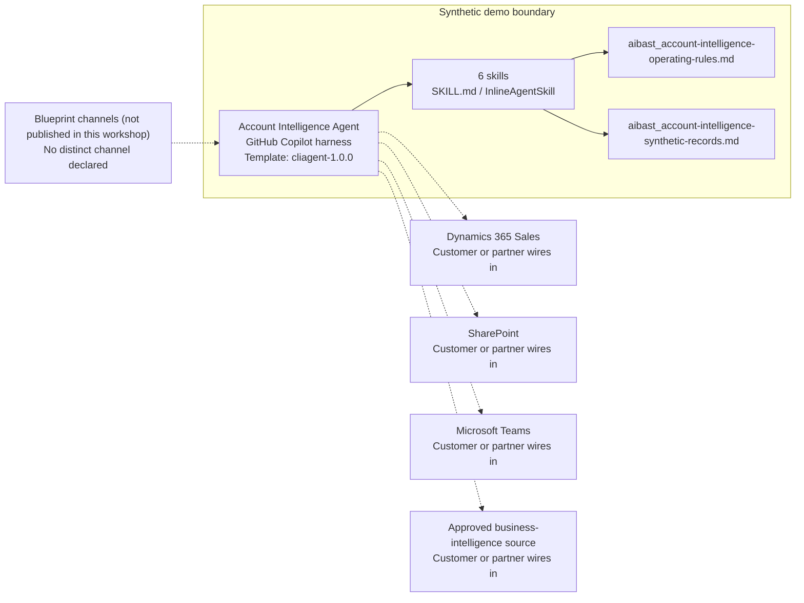

<!-- Generated by tools/build_solution_runbooks.py. Do not edit; change the sources and regenerate. -->

# Account Intelligence Agent — Architecture

## Solution Architecture

### Logical architecture and trust boundary

Solid: synthetic design. Dashed: unwired customer systems; channels unpublished.

## Component Responsibilities

| Operation | Capability | Purpose | Owner |
| --- | --- | --- | --- |
| account_overview | Account Overview | Combines firmographic, adoption, engagement, support, and activity evidence. | Template |
| stakeholder_map | Stakeholder Map | Surfaces buying roles, influence, sentiment, engagement, and relationship gaps. | Template |
| competitive_intel | Competitive Intel | Compares synthetic competitor activity and positioning considerations. | Template |
| value_messaging | Value Messaging | Drafts persona-aligned talking points for human review. | Template |
| risk_assessment | Risk Assessment | Explains deal risks and candidate mitigations without changing a forecast. | Template |
| executive_briefing | Executive Briefing | Compiles a concise pre-meeting view and checklist. | Template |

| Runtime reference | Recorded value |
| --- | --- |
| Portable implementation | [account_intelligence_agent.py](../../agents/@aibast-agents-library/b2b_sales_stacks/account_intelligence_stack/account_intelligence_agent.py) |
| Expected tool | AccountIntelligenceAgent |
| Source SHA-256 (short) | 73401dfb32d1 |

## Data Contract

Approve field meaning, usage and retention before replacing synthetic examples.

| Entity | Fields the template uses | Used by | Customer system of record | Sensitivity |
| --- | --- | --- | --- | --- |
| _ACCOUNTS | id; name; industry; revenue; employees; hq; current_spend; opportunity_value; products_owned; contract_renewal; recent_news | account_overview; value_messaging; risk_assessment; executive_briefing | Dynamics 365 Sales | Customer commercial data; restrict to the account team. |
| Recent activity | Headline; Age | account_overview; executive_briefing | Customer or partner maps | Account signals; the template headlines are fictional, not current news. |
| Acme stakeholder map | Name; Role; Influence; Sentiment; Meetings; Exact synthetic notes | stakeholder_map; account_overview; value_messaging; risk_assessment; executive_briefing | Dynamics 365 Sales | Business-contact personal data and sentiment notes; minimum disclosure to the account team. |
| Competitor records | Competitor; Relationship; Product fit; Pricing; Implementation; Exact synthetic activity | competitive_intel; risk_assessment; executive_briefing | Customer or partner maps | Internal competitive notes; classify with your data owner. |
| _OUR_PROFILE | relationship; product_fit; pricing; impl_weeks; advantages | competitive_intel; value_messaging | Customer or partner maps | Positioning claims; commercial review before customer-facing use. |
| Synthetic deal risks | Risk; Severity; Mitigation label; Owner label | risk_assessment; executive_briefing | Customer or partner maps | Derived deal assessment; draft labels, not assigned tasks. |

## Integration Points

**State: Not connected in the template.**

| System | Purpose | Skills that need it | Access | Template provides | Customer or partner wires in |
| --- | --- | --- | --- | --- | --- |
| Dynamics 365 Sales | Account and relationship context. | account-intelligence-account-overview; account-intelligence-stakeholder-map; account-intelligence-risk-assessment; account-intelligence-executive-briefing | read | Account and stakeholder contracts backed by fixed synthetic Acme records; no live lookup. | [Wiring procedure](3.Runbook.md#step-3-1-integrate-dynamics-365-sales) |
| SharePoint | Approved account plans and references. | account-intelligence-competitive-intel; account-intelligence-value-messaging; account-intelligence-executive-briefing | read | Operating rules and synthetic reference statements that require human validation. | [Wiring procedure](3.Runbook.md#step-3-2-integrate-sharepoint) |
| Microsoft Teams | Seller collaboration and meeting preparation. | account-intelligence-value-messaging; account-intelligence-executive-briefing | read-write | Draft talking points and checklists only; no message, meeting or task tool. | [Wiring procedure](3.Runbook.md#step-3-3-integrate-microsoft-teams) |
| Approved business-intelligence source | Reviewed replacement for bundled synthetic account evidence. | account-intelligence-account-overview; account-intelligence-competitive-intel; account-intelligence-risk-assessment | read | Fixed synthetic evidence with no-browse and no-enrichment rules. | [Wiring procedure](3.Runbook.md#step-3-4-integrate-approved-business-intelligence-source) |

## Identity and Permissions

| Template default | Customer or partner decision |
| --- | --- |
| Authentication: Microsoft Entra ID authentication; the customer configures the supported mode for the intended seller channel. | Confirm tenant, permitted identities and authentication enforcement. |
| Audience: Account Executive; Sales Director; Customer Success Manager | Define authorized users, groups and least-privilege connection identities. |

- Require sign-in before accessing account and contact information.
- Request only the scopes necessary for approved account sources.
- Restrict the seller audience and verify access with authorized and denied identities.

## Copilot Studio Components

Copilot Studio uses the GitHub Copilot harness; skills hold reviewed behavior.

Agent metadata from [settings.mcs.yml](../../solutions/account-intelligence/copilot-studio/settings.mcs.yml):

| Setting | Recorded value |
| --- | --- |
| Template | cliagent-1.0.0 |
| Recognizer | CLICopilotRecognizer |
| Authoring model | CliCopilot |
| Model | Sonnet46 |

### Skill inventory

One skill per row: manual upload and source-controlled form.

| Skill | Manual upload | Source component |
| --- | --- | --- |
| account-intelligence-account-overview | [SKILL.md](../../solutions/account-intelligence/manual/skills/account-overview/SKILL.md) | [InlineAgentSkill](../../solutions/account-intelligence/copilot-studio/behaviors/aibast_account-intelligence-account-overview.mcs.yml) |
| account-intelligence-competitive-intel | [SKILL.md](../../solutions/account-intelligence/manual/skills/competitive-intel/SKILL.md) | [InlineAgentSkill](../../solutions/account-intelligence/copilot-studio/behaviors/aibast_account-intelligence-competitive-intel.mcs.yml) |
| account-intelligence-executive-briefing | [SKILL.md](../../solutions/account-intelligence/manual/skills/executive-briefing/SKILL.md) | [InlineAgentSkill](../../solutions/account-intelligence/copilot-studio/behaviors/aibast_account-intelligence-executive-briefing.mcs.yml) |
| account-intelligence-risk-assessment | [SKILL.md](../../solutions/account-intelligence/manual/skills/risk-assessment/SKILL.md) | [InlineAgentSkill](../../solutions/account-intelligence/copilot-studio/behaviors/aibast_account-intelligence-risk-assessment.mcs.yml) |
| account-intelligence-stakeholder-map | [SKILL.md](../../solutions/account-intelligence/manual/skills/stakeholder-map/SKILL.md) | [InlineAgentSkill](../../solutions/account-intelligence/copilot-studio/behaviors/aibast_account-intelligence-stakeholder-map.mcs.yml) |
| account-intelligence-value-messaging | [SKILL.md](../../solutions/account-intelligence/manual/skills/value-messaging/SKILL.md) | [InlineAgentSkill](../../solutions/account-intelligence/copilot-studio/behaviors/aibast_account-intelligence-value-messaging.mcs.yml) |

### Knowledge inventory

| Knowledge file | Upload | Source / metadata |
| --- | --- | --- |
| aibast_account-intelligence-operating-rules.md | [Content](../../solutions/account-intelligence/manual/knowledge/aibast_account-intelligence-operating-rules.md) | [Source copy](../../solutions/account-intelligence/copilot-studio/capabilities/knowledge/files/aibast_account-intelligence-operating-rules.md) · [Metadata](../../solutions/account-intelligence/copilot-studio/capabilities/knowledge/files/aibast_account-intelligence-operating-rules.md.mcs.yml) |
| aibast_account-intelligence-synthetic-records.md | [Content](../../solutions/account-intelligence/manual/knowledge/aibast_account-intelligence-synthetic-records.md) | [Source copy](../../solutions/account-intelligence/copilot-studio/capabilities/knowledge/files/aibast_account-intelligence-synthetic-records.md) · [Metadata](../../solutions/account-intelligence/copilot-studio/capabilities/knowledge/files/aibast_account-intelligence-synthetic-records.md.mcs.yml) |

## State and Recovery

| Recovery ID | Condition | Required behavior | Owner |
| --- | --- | --- | --- |
| evidence-no-mockups | A required evidence file is missing | Stop. Capture or restore the real file; never substitute a mockup. | Template |
| failed-case-no-cherry-picking | A recorded identifier is absent | Mark the case failed and investigate; do not retry until it happens to pass. | Template |
| draft-publication-stop | Publish is offered | Stop at Draft unless a separate approver explicitly authorizes publication. | Template |
| account-system-unavailable | A wired account system returns no verified result | Report unavailable evidence; never claim a live lookup, CRM change or sent message succeeded. | Customer or partner |
| account-fact-absent | The requested account, person or fact is not in the snapshot | State that it is absent; do not browse, enrich or substitute another account. | Template |
| account-grounding-unavailable | The required skill or its knowledge cannot load | Retry once in the same turn, then say so and stop without an uncited answer. | Template |

Promotion requires separate approval. [Package recovery guide](../../solutions/account-intelligence/FIELD-GUIDE.md#failure-recovery).

## Design Decisions

| Decision | Reason |
| --- | --- |
| Ground every answer in one fixed synthetic Acme snapshot. | Browsing, enrichment or substitution would make account evidence unverifiable. |
| Keep value messaging and the executive briefing separate. | Talking-point and objection requests must return the value-messaging anchors; the operations are not interchangeable. |
| Label computed indicators apart from recorded evidence. | Health and win-probability values are formula outputs over synthetic inputs, not CRM or forecast facts. |
| Keep every next step as a draft for the account owner. | CRM writes, outreach, pricing and forecast changes are prohibited actions. |
| Use exact assertions, not a quality-score substitute. | General quality in Evaluate (preview) does not compare responses to expected answers. |

## Non-Functional Considerations

| Area | Customer or partner confirms |
| --- | --- |
| Licensing and Copilot Credits | Confirm tenant licensing and budget credits for building, Preview, evaluation and production seller use. |
| Capacity | Allocate approved capacity to the seller environment and monitor consumption before widening the audience. |
| Data residency | Approve the environment geography and any cross-region processing of account and contact data before connecting sources. |
| Retention | Decide whether seller transcripts are saved, who can view or download them, and the Dataverse retention policy. |
| Cost drivers | Measure model-token, knowledge/tool and harness usage by workload; do not infer production cost from the synthetic demo. |

## Next

→ [Delivery runbook](3.Runbook.md) | [Solution index](../README.md)

[Sources for this page](0.Resources/README.md#sources-2architecturemd).
