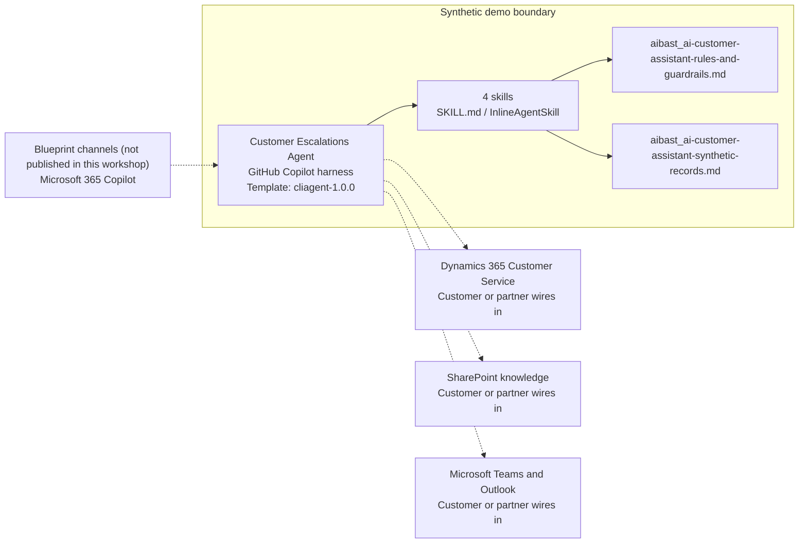

<!-- Generated by tools/build_solution_runbooks.py. Do not edit; change the sources and regenerate. -->

# Customer Escalations Agent — Architecture

## Solution Architecture

### Logical architecture and trust boundary

Solid: synthetic design. Dashed: unwired customer systems; channels unpublished.

## Component Responsibilities

| Operation | Capability | Purpose | Owner |
| --- | --- | --- | --- |
| handle_inquiry | Inquiry triage brief | Use when a back-office agent asks what is happening on a specific case and what should be reviewed next. | Template |
| knowledge_search | Knowledge evidence search | Use when a support agent needs the most relevant approved article and resolution steps for an inquiry. | Template |
| escalation_routing | Escalation routing review | Use when an escalation manager asks which team and SLA rule apply, without executing the route. | Template |
| satisfaction_survey | Quality and satisfaction review | Use when a quality analyst asks for the fictional CSAT distribution and recurring service themes. | Template |

| Runtime reference | Recorded value |
| --- | --- |
| Portable implementation | [ai_customer_assistant_agent.py](../../agents/@aibast-agents-library/general_stacks/ai_customer_assistant_stack/ai_customer_assistant_agent.py) |
| Expected tool | AICustomerAssistantAgent |
| Source SHA-256 (short) | 1495e102d2ca |

## Data Contract

Approve field meaning, usage and retention before replacing synthetic examples.

| Entity | Fields the template uses | Used by | Customer system of record | Sensitivity |
| --- | --- | --- | --- | --- |
| Inquiry records | ID; Customer; Contact; Email; Channel; Subject; Description; Category; Priority; Created at; Status; Account tier; Sentiment | handle_inquiry; knowledge_search; escalation_routing | Dynamics 365 Customer Service | Customer contact personal data; disclose only the fields a question needs. |
| _KB_ARTICLES | id; title; category; relevance_score; summary; resolution_steps; last_updated; views; helpful_votes | knowledge_search; handle_inquiry | SharePoint knowledge | Internal support guidance; the content owner approves currency. |
| Routing matrix | Category; Priority; Recommended team; SLA target; Escalation rule triggered | escalation_routing; handle_inquiry | Customer or partner maps | Internal routing policy; recommendations, not assignments. |
| _SATISFACTION_DATA | overall_csat; nps_score; response_time_avg_minutes; first_contact_resolution_rate; surveys; trend | satisfaction_survey | Customer or partner maps | Aggregate service-quality data; fictional values are not customer results. |
| Recent fictional surveys | Inquiry; Score; Comment; Date | satisfaction_survey | Customer or partner maps | Customer feedback text; no identity or intent inference. |

## Integration Points

**State: Not connected in the template.**

| System | Purpose | Skills that need it | Access | Template provides | Customer or partner wires in |
| --- | --- | --- | --- | --- | --- |
| Dynamics 365 Customer Service | Governed case and customer context. | handle-inquiry; knowledge-search; escalation-routing | read | Inquiry fields and briefing contracts backed by four fictional inquiries; no case mutation. | [Wiring procedure](3.Runbook.md#step-3-1-integrate-dynamics-365-customer-service) |
| SharePoint knowledge | Approved articles, policies, case studies and playbooks. | knowledge-search; handle-inquiry | read | Four synthetic articles and the rule that no other knowledge result may be created. | [Wiring procedure](3.Runbook.md#step-3-2-integrate-sharepoint-knowledge) |
| Microsoft Teams and Outlook | Reviewer collaboration surfaces. | handle-inquiry; escalation-routing | read-write | Recommendations and review gates only; no message, contact or follow-up tool. | [Wiring procedure](3.Runbook.md#step-3-3-integrate-microsoft-teams-and-outlook) |

## Identity and Permissions

| Template default | Customer or partner decision |
| --- | --- |
| Authentication: Microsoft Entra ID authentication; the customer configures the supported mode for the intended service channel. | Confirm tenant, permitted identities and authentication enforcement. |
| Audience: Back-Office Agent; Escalation Manager; Quality Analyst | Define authorized users, groups and least-privilege connection identities. |

- Require sign-in before accessing case, contact or survey information.
- Request only the scopes necessary for approved service sources.
- Restrict the staff audience and verify access with authorized and denied identities.

## Copilot Studio Components

Copilot Studio uses the GitHub Copilot harness; skills hold reviewed behavior.

Agent metadata from [settings.mcs.yml](../../solutions/ai-customer-assistant/copilot-studio/settings.mcs.yml):

| Setting | Recorded value |
| --- | --- |
| Template | cliagent-1.0.0 |
| Recognizer | CLICopilotRecognizer |
| Authoring model | CliCopilot |
| Model | Sonnet46 |

### Skill inventory

One skill per row: manual upload and source-controlled form.

| Skill | Manual upload | Source component |
| --- | --- | --- |
| escalation-routing | [SKILL.md](../../solutions/ai-customer-assistant/manual/skills/aibast_escalation-routing_03/SKILL.md) | [InlineAgentSkill](../../solutions/ai-customer-assistant/copilot-studio/behaviors/aibast_escalation-routing.mcs.yml) |
| handle-inquiry | [SKILL.md](../../solutions/ai-customer-assistant/manual/skills/aibast_handle-inquiry_01/SKILL.md) | [InlineAgentSkill](../../solutions/ai-customer-assistant/copilot-studio/behaviors/aibast_handle-inquiry.mcs.yml) |
| knowledge-search | [SKILL.md](../../solutions/ai-customer-assistant/manual/skills/aibast_knowledge-search_02/SKILL.md) | [InlineAgentSkill](../../solutions/ai-customer-assistant/copilot-studio/behaviors/aibast_knowledge-search.mcs.yml) |
| satisfaction-survey | [SKILL.md](../../solutions/ai-customer-assistant/manual/skills/aibast_satisfaction-survey_04/SKILL.md) | [InlineAgentSkill](../../solutions/ai-customer-assistant/copilot-studio/behaviors/aibast_satisfaction-survey.mcs.yml) |

### Knowledge inventory

| Knowledge file | Upload | Source / metadata |
| --- | --- | --- |
| aibast_ai-customer-assistant-rules-and-guardrails.md | [Content](../../solutions/ai-customer-assistant/manual/knowledge/aibast_ai-customer-assistant-rules-and-guardrails.md) | [Source copy](../../solutions/ai-customer-assistant/copilot-studio/capabilities/knowledge/files/aibast_ai-customer-assistant-rules-and-guardrails.md) · [Metadata](../../solutions/ai-customer-assistant/copilot-studio/capabilities/knowledge/files/aibast_ai-customer-assistant-rules-and-guardrails.md.mcs.yml) |
| aibast_ai-customer-assistant-synthetic-records.md | [Content](../../solutions/ai-customer-assistant/manual/knowledge/aibast_ai-customer-assistant-synthetic-records.md) | [Source copy](../../solutions/ai-customer-assistant/copilot-studio/capabilities/knowledge/files/aibast_ai-customer-assistant-synthetic-records.md) · [Metadata](../../solutions/ai-customer-assistant/copilot-studio/capabilities/knowledge/files/aibast_ai-customer-assistant-synthetic-records.md.mcs.yml) |

## State and Recovery

| Recovery ID | Condition | Required behavior | Owner |
| --- | --- | --- | --- |
| evidence-no-mockups | A required evidence file is missing | Stop. Capture or restore the real file; never substitute a mockup. | Template |
| failed-case-no-cherry-picking | A recorded identifier is absent | Mark the case failed and investigate; do not retry until it happens to pass. | Template |
| draft-publication-stop | Publish is offered | Stop at Draft unless a separate approver explicitly authorizes publication. | Template |
| service-system-unavailable | A wired service system returns no verified result | Report unavailable evidence; never claim a lookup, case change or sent message succeeded. | Customer or partner |
| inquiry-unknown | An explicit inquiry ID is not in the snapshot | State that it is absent and list the known IDs; never substitute a record. | Template |
| escalation-grounding-unavailable | The required skill or its knowledge cannot load | Retry once in the same turn, then say so and stop without an uncited answer. | Template |

Promotion requires separate approval. [Package recovery guide](../../solutions/ai-customer-assistant/FIELD-GUIDE.md#failure-recovery).

## Design Decisions

| Decision | Reason |
| --- | --- |
| Present articles, routes and SLAs as recommendations. | An authorized support reviewer owns the response, route and customer communication. |
| Give routing deterministic inquiry defaults. | Strict isolation showed tool-skipping and a missing urgent inquiry until defaults were documented. |
| Keep sentiment a fictional text label. | Identity, protected traits, intent, loyalty and churn must not be inferred from it. |
| Use only the contact fields a question needs. | Unnecessary profile fields stay undisclosed even in synthetic records. |
| Use exact assertions, not a quality-score substitute. | General quality in Evaluate (preview) does not compare responses to expected answers. |

## Non-Functional Considerations

| Area | Customer or partner confirms |
| --- | --- |
| Licensing and Copilot Credits | Confirm tenant licensing and budget credits for building, Preview, evaluation and production service use. |
| Capacity | Allocate approved capacity to the service environment and monitor consumption before widening the audience. |
| Data residency | Approve the environment geography and any cross-region processing of case and contact data before connecting sources. |
| Retention | Decide whether service transcripts are saved, who can view or download them, and the Dataverse retention policy. |
| Cost drivers | Measure model-token, knowledge/tool and harness usage by workload; do not infer production cost from the synthetic demo. |

## Next

→ [Delivery runbook](3.Runbook.md) | [Solution index](../README.md)

[Sources for this page](0.Resources/README.md#sources-2architecturemd).
