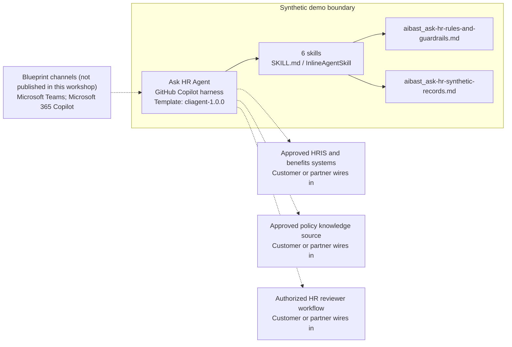

<!-- Generated by tools/build_solution_runbooks.py. Do not edit; change the sources and regenerate. -->

# Ask HR Agent — Architecture

## Solution Architecture

### Logical architecture and trust boundary

Solid paths describe the synthetic design; dashed systems need customer or partner wiring. Channels remain unpublished. [Blueprint source](../../state/architecture_level2_sources/ask-hr.json).

## Component Responsibilities

| Operation | Capability | Purpose | Owner |
| --- | --- | --- | --- |
| leave_balance | Leave-balance explanation | Use when an employee asks for the fictional balance snapshot and published time-off rules. | Template |
| submit_time_off | Time-off draft preview | Use when an employee wants to preview dates and projected balance before using the approved submission workflow. | Template |
| parental_leave | Parental-leave policy guidance | Use for published leave-policy questions without inferring a family or medical circumstance or deciding eligibility. | Template |
| health_insurance | Health-plan policy explanation | Use when an employee asks what the fictional plan snapshot says and what must be verified with benefits staff. | Template |
| remote_work | Remote-work policy guidance | Use when an employee or manager asks for published remote-work rules without inferring a sensitive circumstance. | Template |
| benefits_summary | Benefits snapshot explanation | Use when HR operations needs a concise fictional profile summary without estimating compensation or deciding eligibility. | Template |

| Runtime reference | Recorded value |
| --- | --- |
| Portable implementation | [ask_hr_agent.py](../../agents/@aibast-agents-library/human_resources_stacks/ask_hr_stack/ask_hr_agent.py) |
| Expected tool | AskHRAgent |
| Source SHA-256 (short) | df904e6e967b |

## Data Contract

Synthetic examples define this contract. Customer data owners approve field meaning, permitted use and retention before replacement.

| Entity | Fields the template uses | Used by | Customer system of record | Sensitivity |
| --- | --- | --- | --- | --- |
| _EMPLOYEES (source 1) | id; name; title; department; manager; tenure_years; email; leave_balance; health_plan | leave_balance; submit_time_off; parental_leave; health_insurance; remote_work; benefits_summary | Approved HRIS and benefits systems | HR personal data; identity-scoped access and minimum disclosure. |
| _EMPLOYEES.leave_balance (source 1) | vacation; sick; personal; accrual_rate | leave_balance; submit_time_off; benefits_summary | Approved HRIS and benefits systems | HR personal data; individual balances, not general policy. |
| _EMPLOYEES.health_plan (source 1) | plan; monthly_premium; deductible_individual; deductible_family; oop_max_individual; oop_max_family; dependents | health_insurance; benefits_summary | Approved HRIS and benefits systems | HR personal and dependent data; never infer medical or family circumstances. |
| Company holidays (source 2) | Holiday; Fixed date text | leave_balance | Approved policy knowledge source | Policy reference data; the template dates are fictional. |
| _POLICIES.time_off (source 1) | min_notice_5plus_days; holiday_period; rollover_max | leave_balance | Approved policy knowledge source | Policy reference data; customer HR approves applicability. |
| _POLICIES.parental_leave (source 1) | paternity_weeks; maternity_weeks; min_tenure_years; stipend; backup_childcare_months | parental_leave | Approved policy knowledge source | Policy data; applying it to a person requires authorized HR review. |
| _POLICIES.remote_work (source 1) | standard_days_per_week; new_parent_bonus_days; new_parent_bonus_months; core_hours; equipment_stipend; internet_reimbursement | remote_work; benefits_summary | Approved policy knowledge source | Policy data; no caregiver or other sensitive inference. |
| _POLICIES.health_insurance (source 1) | enrollment_window_days; dependent_premium_increase; well_baby_covered; pediatric_copay; dependent_life_insurance | health_insurance | Approved policy knowledge source | Benefits policy data; individual eligibility remains a human decision. |
| _submit_time_off preview (source 1) | employee; dates; days; status; manager; balance_after | submit_time_off | Customer or partner maps | HR personal data; a derived draft, not a persisted submission. |

Data source 1: [ask_hr_agent.py](../../agents/@aibast-agents-library/human_resources_stacks/ask_hr_stack/ask_hr_agent.py). Data source 2: [aibast_ask-hr-synthetic-records.md](../../solutions/ask-hr/manual/knowledge/aibast_ask-hr-synthetic-records.md).

## Integration Points

**State: Not connected in the template.**

| System | Purpose | Skills that need it | Access | Template provides | Customer or partner wires in |
| --- | --- | --- | --- | --- | --- |
| Approved HRIS and benefits systems | Identity-scoped employee, leave and benefits lookups. (source 1) | leave-balance; submit-time-off; health-insurance; benefits-summary | read | Profile, balance and plan contracts backed by fictional records; no live lookup. | Bind scoped read-only connector or API actions ([Learn](https://learn.microsoft.com/en-us/microsoft-copilot-studio/agents-experience/add-tools-custom-agent)). |
| Approved policy knowledge source | Governed leave, benefits and remote-work policy grounding. (source 1) | leave-balance; submit-time-off; parental-leave; health-insurance; remote-work; benefits-summary | read | Fixed policy records and privacy rules used by the packaged skills. | Add approved policy knowledge and its content owner ([Learn](https://learn.microsoft.com/en-us/microsoft-copilot-studio/agents-experience/knowledge-copilot-studio)). |
| Authorized HR reviewer workflow | Human eligibility, exception and transaction authorization. (source 1) | submit-time-off; parental-leave; health-insurance; remote-work; benefits-summary | write | Reviewable drafts and explicit human handoffs; no submission or notification tool. | Keep drafts read-only; gate an authorized workflow before any write ([Learn, preview](https://learn.microsoft.com/en-us/microsoft-copilot-studio/agents-experience/tools-add-workflow)). |

Integration source 1: [ask-hr.json](../../state/architecture_level2_sources/ask-hr.json).

Implementation sequence: [Wire in your systems](3.Runbook.md#phase-3--wire-in-your-systems).

## Identity and Permissions

| Template default | Customer or partner decision |
| --- | --- |
| Authentication: Microsoft Entra ID authentication; the customer configures the supported mode for the intended channel. | Confirm tenant, permitted identities and authentication enforcement. |
| Audience: Employees; Managers; HR Operations Staff | Define authorized users, groups and least-privilege connection identities. |

- Require sign-in before accessing restricted HR information.
- Request only the scopes necessary for approved HR resources.
- Restrict the allowed audience and verify access with authorized and denied identities.

[Identity basis](https://learn.microsoft.com/en-us/microsoft-copilot-studio/configuration-end-user-authentication) · [Authentication guidance](https://learn.microsoft.com/en-us/microsoft-copilot-studio/configuration-end-user-authentication).

## Copilot Studio Components

These Microsoft-native agents run on the [GitHub Copilot harness](https://learn.microsoft.com/en-us/microsoft-copilot-studio/harnesses-overview); [skills](https://learn.microsoft.com/en-us/microsoft-copilot-studio/agents-experience/skills-overview) package the reviewed instructions and logic.

Agent metadata from [settings.mcs.yml](../../solutions/ask-hr/copilot-studio/settings.mcs.yml):

| Setting | Recorded value |
| --- | --- |
| Template | cliagent-1.0.0 |
| Recognizer | CLICopilotRecognizer |
| Authoring model | CliCopilot |
| Model | Sonnet46 |

### Skill inventory

Each row is one skill: a manual upload and its source-controlled `InlineAgentSkill` form.

| Skill | Manual upload | Source component |
| --- | --- | --- |
| benefits-summary | [SKILL.md](../../solutions/ask-hr/manual/skills/aibast_benefits-summary_06/SKILL.md) | [InlineAgentSkill](../../solutions/ask-hr/copilot-studio/behaviors/aibast_benefits-summary.mcs.yml) |
| health-insurance | [SKILL.md](../../solutions/ask-hr/manual/skills/aibast_health-insurance_04/SKILL.md) | [InlineAgentSkill](../../solutions/ask-hr/copilot-studio/behaviors/aibast_health-insurance.mcs.yml) |
| leave-balance | [SKILL.md](../../solutions/ask-hr/manual/skills/aibast_leave-balance_01/SKILL.md) | [InlineAgentSkill](../../solutions/ask-hr/copilot-studio/behaviors/aibast_leave-balance.mcs.yml) |
| parental-leave | [SKILL.md](../../solutions/ask-hr/manual/skills/aibast_parental-leave_03/SKILL.md) | [InlineAgentSkill](../../solutions/ask-hr/copilot-studio/behaviors/aibast_parental-leave.mcs.yml) |
| remote-work | [SKILL.md](../../solutions/ask-hr/manual/skills/aibast_remote-work_05/SKILL.md) | [InlineAgentSkill](../../solutions/ask-hr/copilot-studio/behaviors/aibast_remote-work.mcs.yml) |
| submit-time-off | [SKILL.md](../../solutions/ask-hr/manual/skills/aibast_submit-time-off_02/SKILL.md) | [InlineAgentSkill](../../solutions/ask-hr/copilot-studio/behaviors/aibast_submit-time-off.mcs.yml) |

### Knowledge inventory

| Knowledge file | Upload | Source / metadata |
| --- | --- | --- |
| aibast_ask-hr-rules-and-guardrails.md | [Content](../../solutions/ask-hr/manual/knowledge/aibast_ask-hr-rules-and-guardrails.md) | [Source copy](../../solutions/ask-hr/copilot-studio/capabilities/knowledge/files/aibast_ask-hr-rules-and-guardrails.md) · [Metadata](../../solutions/ask-hr/copilot-studio/capabilities/knowledge/files/aibast_ask-hr-rules-and-guardrails.md.mcs.yml) |
| aibast_ask-hr-synthetic-records.md | [Content](../../solutions/ask-hr/manual/knowledge/aibast_ask-hr-synthetic-records.md) | [Source copy](../../solutions/ask-hr/copilot-studio/capabilities/knowledge/files/aibast_ask-hr-synthetic-records.md) · [Metadata](../../solutions/ask-hr/copilot-studio/capabilities/knowledge/files/aibast_ask-hr-synthetic-records.md.mcs.yml) |

## State and Recovery

| Recovery ID | Condition | Required behavior | Owner | Source |
| --- | --- | --- | --- | --- |
| evidence-no-mockups | A required evidence file is missing | Stop. Capture or restore the real file; never substitute a mockup. | Template | [FIELD-GUIDE.md](../../solutions/ask-hr/FIELD-GUIDE.md) |
| failed-case-no-cherry-picking | A recorded identifier is absent | Mark the case failed and investigate; do not retry until it happens to pass. | Template | [FIELD-GUIDE.md](../../solutions/ask-hr/FIELD-GUIDE.md) |
| draft-publication-stop | Publish is offered | Stop at Draft unless a separate approver explicitly authorizes publication. | Template | [FIELD-GUIDE.md](../../solutions/ask-hr/FIELD-GUIDE.md) |
| hr-lookup-unavailable | A wired HR system returns no verified result | Report unavailable evidence; never claim a live lookup, submission or notification succeeded. | Customer or partner | [FIELD-GUIDE.md](../../solutions/ask-hr/FIELD-GUIDE.md) |
| hr-profile-access | The requested profile is unclear or outside the caller's approved access | Clarify the profile and enforce record-scoped access; do not disclose another employee's details. | Customer or partner | Source 5 below |
| hr-grounding-unavailable | The required skill or policy knowledge cannot load | Retry once in the same turn, then report failure and stop without an uncited answer. | Template | [GLOBAL-INSTRUCTIONS.md](../../solutions/ask-hr/manual/GLOBAL-INSTRUCTIONS.md) |

State and recovery source 5: [Package source](../../solutions/ask-hr/manual/knowledge/aibast_ask-hr-rules-and-guardrails.md)

Template state stays synthetic and unpublished until the customer authorizes promotion. See [workshop integrity](3.Runbook.md#step-2-3-enforce-workshop-integrity) and the [source recovery rules](../../solutions/ask-hr/FIELD-GUIDE.md#failure-recovery).

## Design Decisions

| Decision | Reason | Source |
| --- | --- | --- |
| Separate policy explanation from personal entitlement. | Fictional profiles cannot establish an employee's eligibility. | [GLOBAL-INSTRUCTIONS.md](../../solutions/ask-hr/manual/GLOBAL-INSTRUCTIONS.md) |
| Preview time off without transacting. | The skill's contract requires draft and no-notification markers, not a completed request. | Source 2 below |
| Route through the six reviewed skill names. | Guessed skills and uncited answers after retrieval failure violate the locked routing contract. | [GLOBAL-INSTRUCTIONS.md](../../solutions/ask-hr/manual/GLOBAL-INSTRUCTIONS.md) |
| Use exact assertions, not a quality-score substitute. | Evaluate (preview) General quality does not compare responses to expected answers. | [Learn](https://learn.microsoft.com/en-us/microsoft-copilot-studio/agents-experience/analytics-agent-evaluation-intro) |

Design decisions source 2: [Package source](../../solutions/ask-hr/manual/skills/aibast_submit-time-off_02/SKILL.md)

## Non-Functional Considerations

| Area | Customer or partner confirms | Source |
| --- | --- | --- |
| Licensing and Copilot Credits | Confirm licensing for the customer's tenant and budget credits for building, Preview, evaluation and production use. | [Learn](https://learn.microsoft.com/en-us/microsoft-copilot-studio/agents-experience/billing-credit-overview) |
| Capacity | Allocate approved capacity to the HR environment and monitor consumption before expanding the audience. | [Learn](https://learn.microsoft.com/en-us/power-platform/admin/manage-copilot-studio-copilot-credits-capacity) |
| Data residency | Approve the environment geography and any cross-region processing or external HR data movement before connecting sources. | [Learn](https://learn.microsoft.com/en-us/microsoft-copilot-studio/geo-data-residency) |
| Retention | Decide whether HR transcripts are saved, who can view or download them, and the required Dataverse retention policy. | [Learn](https://learn.microsoft.com/en-us/microsoft-copilot-studio/admin-transcript-controls) |
| Cost drivers | Measure model-token, knowledge/tool and harness usage by workload; do not infer production cost from the synthetic demo. | [Learn](https://learn.microsoft.com/en-us/microsoft-copilot-studio/agents-experience/billing-credit-overview) |

## Next

→ [Delivery runbook](3.Runbook.md) | [Solution index](../README.md)

[Full source ledger](0.Resources/README.md#sources).
