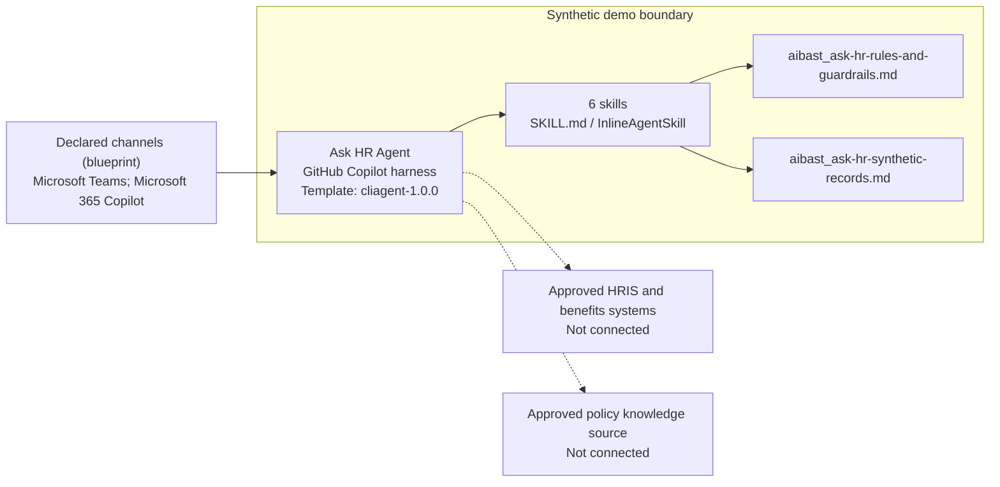
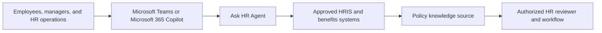

<!-- Generated by tools/build_solution_runbooks.py. Do not edit; change the sources and regenerate. -->

# Ask HR Agent — Architecture

## Solution Architecture

### Logical architecture and trust boundary

The solid paths describe the packaged design, not a live deployment. Dashed seams are not connected; source-system authority remains outside the synthetic demo.

### Catalog scenario flow

Level-1 business flow (catalog architecture.business_flow): the order in which people and systems appear in the scenario, not a component or data-flow topology.

[Package case-flow diagram](../../solutions/ask-hr/FLOW.md).

## Component Responsibilities

| Operation | Capability | Purpose |
| --- | --- | --- |
| leave_balance | Leave-balance explanation | Use when an employee asks for the fictional balance snapshot and published time-off rules. |
| submit_time_off | Time-off draft preview | Use when an employee wants to preview dates and projected balance before using the approved submission workflow. |
| parental_leave | Parental-leave policy guidance | Use for published leave-policy questions without inferring a family or medical circumstance or deciding eligibility. |
| health_insurance | Health-plan policy explanation | Use when an employee asks what the fictional plan snapshot says and what must be verified with benefits staff. |
| remote_work | Remote-work policy guidance | Use when an employee or manager asks for published remote-work rules without inferring a sensitive circumstance. |
| benefits_summary | Benefits snapshot explanation | Use when HR operations needs a concise fictional profile summary without estimating compensation or deciding eligibility. |

| Runtime reference | Recorded value |
| --- | --- |
| Portable implementation | [ask_hr_agent.py](../../agents/@aibast-agents-library/human_resources_stacks/ask_hr_stack/ask_hr_agent.py) |
| Expected tool | AskHRAgent |
| Source SHA-256 (short) | df904e6e967b |

## Required Connections

The synthetic build uses packaged knowledge, not customer-system connections. Qualify live integration targets under [Production replacement seams](#production-replacement-seams).

### Level-2 domains

| Domain | Source inventory |
| --- | --- |
| Clients user interface | 3 source-defined components |
| Intelligence processing | 6 source-defined components |
| Knowledge | 3 source-defined components |
| Management reporting | 3 source-defined components |

Detailed responsibilities, tools and supporting features remain in the [Level-2 architecture source](../../state/architecture_level2_sources/ask-hr.json).

## Copilot Studio Components

These Microsoft-native agents run on the [GitHub Copilot harness](https://learn.microsoft.com/en-us/microsoft-copilot-studio/harnesses-overview); [skills](https://learn.microsoft.com/en-us/microsoft-copilot-studio/agents-experience/skills-overview) package the reviewed instructions and logic.

Agent metadata from [settings.mcs.yml](../../solutions/ask-hr/copilot-studio/settings.mcs.yml):

| Setting | Recorded value |
| --- | --- |
| Template | cliagent-1.0.0 |
| Recognizer | CLICopilotRecognizer |
| Authoring model | CliCopilot |
| Model | Sonnet46 |

### Skill inventory

Each row is one skill: a manual upload and its source-controlled `InlineAgentSkill` form.

| Skill | Manual upload | Source component |
| --- | --- | --- |
| benefits-summary | [SKILL.md](../../solutions/ask-hr/manual/skills/aibast_benefits-summary_06/SKILL.md) | [InlineAgentSkill](../../solutions/ask-hr/copilot-studio/behaviors/aibast_benefits-summary.mcs.yml) |
| health-insurance | [SKILL.md](../../solutions/ask-hr/manual/skills/aibast_health-insurance_04/SKILL.md) | [InlineAgentSkill](../../solutions/ask-hr/copilot-studio/behaviors/aibast_health-insurance.mcs.yml) |
| leave-balance | [SKILL.md](../../solutions/ask-hr/manual/skills/aibast_leave-balance_01/SKILL.md) | [InlineAgentSkill](../../solutions/ask-hr/copilot-studio/behaviors/aibast_leave-balance.mcs.yml) |
| parental-leave | [SKILL.md](../../solutions/ask-hr/manual/skills/aibast_parental-leave_03/SKILL.md) | [InlineAgentSkill](../../solutions/ask-hr/copilot-studio/behaviors/aibast_parental-leave.mcs.yml) |
| remote-work | [SKILL.md](../../solutions/ask-hr/manual/skills/aibast_remote-work_05/SKILL.md) | [InlineAgentSkill](../../solutions/ask-hr/copilot-studio/behaviors/aibast_remote-work.mcs.yml) |
| submit-time-off | [SKILL.md](../../solutions/ask-hr/manual/skills/aibast_submit-time-off_02/SKILL.md) | [InlineAgentSkill](../../solutions/ask-hr/copilot-studio/behaviors/aibast_submit-time-off.mcs.yml) |

### Knowledge inventory

| Knowledge file | Upload | Source / metadata |
| --- | --- | --- |
| aibast_ask-hr-rules-and-guardrails.md | [Content](../../solutions/ask-hr/manual/knowledge/aibast_ask-hr-rules-and-guardrails.md) | [Source copy](../../solutions/ask-hr/copilot-studio/capabilities/knowledge/files/aibast_ask-hr-rules-and-guardrails.md) · [Metadata](../../solutions/ask-hr/copilot-studio/capabilities/knowledge/files/aibast_ask-hr-rules-and-guardrails.md.mcs.yml) |
| aibast_ask-hr-synthetic-records.md | [Content](../../solutions/ask-hr/manual/knowledge/aibast_ask-hr-synthetic-records.md) | [Source copy](../../solutions/ask-hr/copilot-studio/capabilities/knowledge/files/aibast_ask-hr-synthetic-records.md) · [Metadata](../../solutions/ask-hr/copilot-studio/capabilities/knowledge/files/aibast_ask-hr-synthetic-records.md.mcs.yml) |

## Data and Evidence Boundary

From [FIELD-GUIDE.md — Evidence boundary](../../solutions/ask-hr/FIELD-GUIDE.md#evidence-boundary):

- All packaged records and outcomes are synthetic.
- Recorded cases provide qualitative workflow evidence only.
- They are not customer KPIs, measured production results, forecasts,
  commitments, or proof of a live system connection.
- A screenshot proves only the visible state in that frame.
- No image, GIF, transcript, connector result, or publication state is implied
  unless the corresponding file is present in `export-manifest.json`.

The [global policy](../../solutions/ask-hr/manual/GLOBAL-INSTRUCTIONS.md) defines the fixed dataset and permitted reasoning. Operational prohibitions are collected once in [What this agent should never do](4.Sample-prompts.md#what-this-agent-should-never-do).

## Production Replacement Seams

| Blueprint integration target | Qualification state |
| --- | --- |
| Approved HRIS and benefits systems | Not connected in this workshop |
| Approved policy knowledge source | Not connected in this workshop |

See the [package's seam contract](../../solutions/ask-hr/FIELD-GUIDE.md#production-replacement-seams) and the owned [production-hardening steps](3.Runbook.md#phase-5--production-hardening) before changing sources.

## Design Decisions

| Decision | Reason | Source |
| --- | --- | --- |
| Separate policy explanation from personal entitlement. | Fictional profiles cannot establish an employee's eligibility. | [GLOBAL-INSTRUCTIONS.md](../../solutions/ask-hr/manual/GLOBAL-INSTRUCTIONS.md) |
| Preview time off without transacting. | The skill's contract requires draft and no-notification markers, not a completed request. | Source 2 below |
| Route through the six reviewed skill names. | Guessed skills and uncited answers after retrieval failure violate the locked routing contract. | [GLOBAL-INSTRUCTIONS.md](../../solutions/ask-hr/manual/GLOBAL-INSTRUCTIONS.md) |
| Use exact assertions, not a quality-score substitute. | Evaluate (preview) General quality does not compare responses to expected answers. | [Learn](https://learn.microsoft.com/en-us/microsoft-copilot-studio/agents-experience/analytics-agent-evaluation-intro) |

Design decisions source 2: [Package source](../../solutions/ask-hr/manual/skills/aibast_submit-time-off_02/SKILL.md)

## Sources

- [Architecture input — runbook-notes.json](../../solutions/runbook-notes.json)
- [Architecture input — catalog.json](../../solutions/catalog.json)
- [Architecture input — registry.json](../../registry.json)
- [Architecture input — deployment.json](../../solutions/ask-hr/deployment.json)
- [Architecture input — settings.mcs.yml](../../solutions/ask-hr/copilot-studio/settings.mcs.yml)
- [Architecture input — GLOBAL-INSTRUCTIONS.md](../../solutions/ask-hr/manual/GLOBAL-INSTRUCTIONS.md)
- [Architecture input — FIELD-GUIDE.md](../../solutions/ask-hr/FIELD-GUIDE.md)
- [Architecture input — ask-hr.json](../../state/architecture_level2_sources/ask-hr.json)
- [Architecture input — transcripts.json](../../solutions/ask-hr/evals/transcripts.json)
- [Architecture input — Analytics agent evaluation intro](https://learn.microsoft.com/en-us/microsoft-copilot-studio/agents-experience/analytics-agent-evaluation-intro)
- [Architecture input — Skills overview](https://learn.microsoft.com/en-us/microsoft-copilot-studio/agents-experience/skills-overview)
- [Architecture input — Harnesses overview](https://learn.microsoft.com/en-us/microsoft-copilot-studio/harnesses-overview)

Full source list: [Resources](0.Resources/README.md#sources).

## Next

→ [Delivery runbook](3.Runbook.md) | [Solution index](../README.md)
