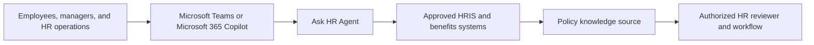

<!-- Generated by tools/build_solution_runbooks.py. Do not edit; change the sources and regenerate. -->

# Ask HR Agent — Architecture

## Solution Architecture

[Package case-flow diagram](../../solutions/ask-hr/FLOW.md)

This catalog flow includes production integration targets; it is not proof of live connectivity. Use the data and evidence boundary below when demonstrating the package.

## Component Responsibilities

| Operation | Capability | Purpose |
| --- | --- | --- |
| leave_balance | Leave-balance explanation | Use when an employee asks for the fictional balance snapshot and published time-off rules. |
| submit_time_off | Time-off draft preview | Use when an employee wants to preview dates and projected balance before using the approved submission workflow. |
| parental_leave | Parental-leave policy guidance | Use for published leave-policy questions without inferring a family or medical circumstance or deciding eligibility. |
| health_insurance | Health-plan policy explanation | Use when an employee asks what the fictional plan snapshot says and what must be verified with benefits staff. |
| remote_work | Remote-work policy guidance | Use when an employee or manager asks for published remote-work rules without inferring a sensitive circumstance. |
| benefits_summary | Benefits snapshot explanation | Use when HR operations needs a concise fictional profile summary without estimating compensation or deciding eligibility. |

| Runtime reference | Recorded value |
| --- | --- |
| Agent file | [agents/@aibast-agents-library/human_resources_stacks/ask_hr_stack/ask_hr_agent.py](../../agents/@aibast-agents-library/human_resources_stacks/ask_hr_stack/ask_hr_agent.py) |
| Expected tool | AskHRAgent |
| Source SHA-256 (short) | df904e6e967b |

## Required Connections

### Connection requirements from the blueprint

- Use only approved, least-privilege production connections; the packaged demonstration uses synthetic knowledge files.

These are integration requirements, not evidence that a connection is configured; apply the package's production replacement and approval gates.

### Level-2 domains

| Domain | Component | Responsibility |
| --- | --- | --- |
| Clients user interface | Microsoft Copilot Studio conversation | Hosts the validated Draft agent with six skills and two synthetic knowledge files; web search is removed and publish is gated. |
| Clients user interface | Teams and Microsoft 365 Copilot access | Provides the cited employee, manager, and HR operations conversational entry points when approved production controls are configured. |
| Clients user interface | Portable Brainstem chat experience | Runs the single-file AskHRAgent through local chat and UI endpoints with deterministic, synthetic-only operation routing. |
| Intelligence processing | Leave-balance explanation | Returns the selected fictional profile's leave balances, accrual, holidays, notice rule, blackout period, and rollover limit. |
| Intelligence processing | Time-off draft projection | Echoes supplied dates and calculates projected vacation balance while keeping the request Not Submitted and notification-free. |
| Intelligence processing | Parental-leave policy explanation | Explains the published example without requesting family or medical details and routes eligibility confirmation to authorized HR. |
| Intelligence processing | Health-plan policy explanation | Summarizes fictional coverage and enrollment rules without recommending a plan or deciding benefits eligibility. |
| Intelligence processing | Remote-work policy guidance | Presents the published allowance and support terms without inferring caregiver, disability, medical, or family status. |
| Intelligence processing | Benefits snapshot synthesis | Combines leave, health, remote-work, and equipment facts without estimating salary, compensation, medical value, or eligibility. |
| Knowledge | Fixed synthetic employee records | Fictional profiles provide roles, managers, tenure, leave balances, health plans, dependents, and benefits values for safe demos. |
| Knowledge | Published synthetic policy snapshot | Bundled time-off, parental-leave, remote-work, health-plan, holiday, enrollment, and allowance rules ground each response. |
| Knowledge | Privacy and authorization guidance | Packaged rules define minimum disclosure, prohibited sensitive inference, human verification duties, and no-action boundaries. |
| Management reporting | Leave and time-off review | Shows balances, notice rules, requested dates, projected balance, manager reference, and explicit draft-only status for review. |
| Management reporting | Policy and benefits verification view | Summarizes policy evidence and clearly identifies what authorized HR, benefits staff, or managers must verify. |
| Management reporting | Acceptance and publication evidence | Records six passing persona cases, package integrity, Draft status, unpublished state, and the separate publication approval gate. |

### Level-2 tools

| Tool | Responsibility |
| --- | --- |
| Portable AskHRAgent RAPP tool | Single-file Python BasicAgent implements six deterministic, read-only operations over bundled synthetic HR evidence. |
| Brainstem runtime | Local-first RAPP server discovers AskHRAgent and exposes conversational chat, streaming, health, and tool-routing endpoints. |
| Microsoft Copilot Studio | Hosts the six-skill conversational package in Draft; explicit authorized approval is required before publication. |
| Microsoft Teams and Microsoft 365 Copilot | Cited user experience surfaces for approved deployments; the synthetic package sends no messages or notifications. |
| Approved HRIS and benefits systems | Cited production seams for identity-scoped employee and benefits data; no live connection exists in the packaged demonstration. |
| Approved policy knowledge source | Cited production seam for governed HR policy content; the current package uses two fixed synthetic knowledge files instead. |
| Authorized HR reviewer workflow | Cited human workflow for eligibility, exceptions, approvals, and transactions; the agent only explains or prepares drafts. |

### Supporting features

| Feature | Responsibility |
| --- | --- |
| Fixed synthetic evidence boundary | Uses only bundled fictional records and policies and forbids browsing, live HR claims, substitution, enrichment, or invention. |
| Employee privacy and data minimization | Limits profile details to the question and never exposes another profile or matches fictional records to real employees. |
| Sensitive-inference prohibition | Prevents inference of pregnancy, caregiver status, disability, medical condition, family status, leave reason, or health risk. |
| Authorized human decision gates | Keeps eligibility, plan selection, exceptions, approvals, employment decisions, and individualized determinations with authorized staff. |
| No external side effects | Prevents submissions, notifications, HR-record changes, live form population, manager contact, enrollment, and approvals. |
| Deterministic routing and validation | Six natural-language cases verify one bounded operation each, exact evidence anchors, safety wording, and strict tool isolation. |
| Draft and publication control | Manual and synchronized Copilot Studio packages remain Draft and unpublished until an explicit authorized publish decision. |

## Copilot Studio Components

### Source-controlled behaviors

| File | Role |
| --- | --- |
| [copilot-studio/behaviors/aibast_benefits-summary.mcs.yml](../../solutions/ask-hr/copilot-studio/behaviors/aibast_benefits-summary.mcs.yml) | Copilot Studio behavior definition |
| [copilot-studio/behaviors/aibast_health-insurance.mcs.yml](../../solutions/ask-hr/copilot-studio/behaviors/aibast_health-insurance.mcs.yml) | Copilot Studio behavior definition |
| [copilot-studio/behaviors/aibast_leave-balance.mcs.yml](../../solutions/ask-hr/copilot-studio/behaviors/aibast_leave-balance.mcs.yml) | Copilot Studio behavior definition |
| [copilot-studio/behaviors/aibast_parental-leave.mcs.yml](../../solutions/ask-hr/copilot-studio/behaviors/aibast_parental-leave.mcs.yml) | Copilot Studio behavior definition |
| [copilot-studio/behaviors/aibast_remote-work.mcs.yml](../../solutions/ask-hr/copilot-studio/behaviors/aibast_remote-work.mcs.yml) | Copilot Studio behavior definition |
| [copilot-studio/behaviors/aibast_submit-time-off.mcs.yml](../../solutions/ask-hr/copilot-studio/behaviors/aibast_submit-time-off.mcs.yml) | Copilot Studio behavior definition |

### Source-controlled knowledge

| File | Role |
| --- | --- |
| [copilot-studio/capabilities/knowledge/files/aibast_ask-hr-rules-and-guardrails.md](../../solutions/ask-hr/copilot-studio/capabilities/knowledge/files/aibast_ask-hr-rules-and-guardrails.md) | Knowledge content or its component metadata |
| [copilot-studio/capabilities/knowledge/files/aibast_ask-hr-rules-and-guardrails.md.mcs.yml](../../solutions/ask-hr/copilot-studio/capabilities/knowledge/files/aibast_ask-hr-rules-and-guardrails.md.mcs.yml) | Knowledge content or its component metadata |
| [copilot-studio/capabilities/knowledge/files/aibast_ask-hr-synthetic-records.md](../../solutions/ask-hr/copilot-studio/capabilities/knowledge/files/aibast_ask-hr-synthetic-records.md) | Knowledge content or its component metadata |
| [copilot-studio/capabilities/knowledge/files/aibast_ask-hr-synthetic-records.md.mcs.yml](../../solutions/ask-hr/copilot-studio/capabilities/knowledge/files/aibast_ask-hr-synthetic-records.md.mcs.yml) | Knowledge content or its component metadata |

### Manual upload skills

| File | Role |
| --- | --- |
| [manual/skills/aibast_benefits-summary_06/SKILL.md](../../solutions/ask-hr/manual/skills/aibast_benefits-summary_06/SKILL.md) | Reviewed skill for the literal browser build |
| [manual/skills/aibast_health-insurance_04/SKILL.md](../../solutions/ask-hr/manual/skills/aibast_health-insurance_04/SKILL.md) | Reviewed skill for the literal browser build |
| [manual/skills/aibast_leave-balance_01/SKILL.md](../../solutions/ask-hr/manual/skills/aibast_leave-balance_01/SKILL.md) | Reviewed skill for the literal browser build |
| [manual/skills/aibast_parental-leave_03/SKILL.md](../../solutions/ask-hr/manual/skills/aibast_parental-leave_03/SKILL.md) | Reviewed skill for the literal browser build |
| [manual/skills/aibast_remote-work_05/SKILL.md](../../solutions/ask-hr/manual/skills/aibast_remote-work_05/SKILL.md) | Reviewed skill for the literal browser build |
| [manual/skills/aibast_submit-time-off_02/SKILL.md](../../solutions/ask-hr/manual/skills/aibast_submit-time-off_02/SKILL.md) | Reviewed skill for the literal browser build |

## Data and Evidence Boundary

From [GLOBAL-INSTRUCTIONS.md — Fixed synthetic snapshot](../../solutions/ask-hr/manual/GLOBAL-INSTRUCTIONS.md#fixed-synthetic-snapshot):

- Use only the uploaded Ask HR synthetic records, privacy rules, and six
  packaged skills.
- Jordan Chen, Michael Torres, and Sarah Williams are fictional profiles used
  only for response formatting. All balances, plans, dependents, roles,
  managers, tenure, holidays, allowances, and policy values are invented.
- Do not browse, consult external policy, or add legal, medical, benefits,
  payroll, location, employment, or current-date facts. Never invent a profile,
  balance, plan, deadline, eligibility result, exception, or transaction.
- Never match a fictional profile to a real employee or claim access to a live
  HRIS, benefits carrier, Outlook, Teams, or manager workflow.

From [FIELD-GUIDE.md — Evidence boundary](../../solutions/ask-hr/FIELD-GUIDE.md#evidence-boundary):

- All packaged records and outcomes are synthetic.
- Recorded cases provide qualitative workflow evidence only.
- They are not customer KPIs, measured production results, forecasts,
  commitments, or proof of a live system connection.
- A screenshot proves only the visible state in that frame.
- No image, GIF, transcript, connector result, or publication state is implied
  unless the corresponding file is present in `export-manifest.json`.

## Production Replacement Seams

From [FIELD-GUIDE.md — Production replacement seams](../../solutions/ask-hr/FIELD-GUIDE.md#production-replacement-seams):

- Replace packaged synthetic inputs with an approved Bind only customer-approved systems after security, privacy, and business-owner review connection; preserve the reviewed input and output contract.

The pilot must never claim a side effect, live lookup, or system update unless
an approved production tool returns evidence that it succeeded.

## Design Decisions

| Decision | Reason / boundary | Source |
| --- | --- | --- |
| Keep demo evidence separate from production results | The field guide limits packaged records and outcomes to synthetic workflow evidence. | [Evidence boundary](../../solutions/ask-hr/FIELD-GUIDE.md#evidence-boundary) |
| Preserve the package's instruction boundary | Use the reviewed global instructions rather than treating a blueprint platform as a live tool. | [Global instructions](../../solutions/ask-hr/manual/GLOBAL-INSTRUCTIONS.md) |
| Keep Easy and Manual construction distinct | The manual lane uses the browser and reviewed uploads, not CLI or YAML import. | [Manual mode](../../solutions/ask-hr/FIELD-GUIDE.md#manual-mode--literal-browser-construction) |
| Replay the recorded corpus before release | Compare exact case prompts and expected entities; file presence alone is not a new runtime pass. | [Canonical transcripts](../../solutions/ask-hr/evals/transcripts.json) |
| Stop the workshop at Draft | Publication is a separate approval gate, not a generated-runbook deliverable. | [Evidence gates](../../solutions/ask-hr/FIELD-GUIDE.md#evidence-gates) |

## Sources

- [registry.json](../../registry.json)
- [solutions/ask-hr/FIELD-GUIDE.md](../../solutions/ask-hr/FIELD-GUIDE.md)
- [solutions/ask-hr/FLOW.md](../../solutions/ask-hr/FLOW.md)
- [solutions/ask-hr/deployment.json](../../solutions/ask-hr/deployment.json)
- [solutions/ask-hr/evals/transcripts.json](../../solutions/ask-hr/evals/transcripts.json)
- [solutions/ask-hr/manual/GLOBAL-INSTRUCTIONS.md](../../solutions/ask-hr/manual/GLOBAL-INSTRUCTIONS.md)
- [solutions/catalog.json](../../solutions/catalog.json)
- [state/architecture_level2_sources/ask-hr.json](../../state/architecture_level2_sources/ask-hr.json)

## Next

→ [Delivery runbook](3.Runbook.md) | [Solution index](../README.md)
