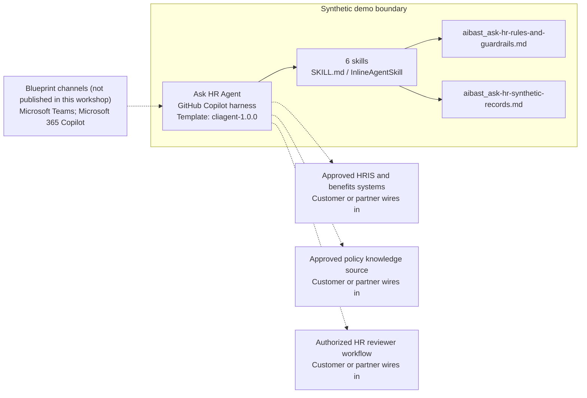

<!-- Generated by tools/build_solution_runbooks.py. Do not edit; change the sources and regenerate. -->

# Ask HR Agent — Architecture

## Solution Architecture

### Logical architecture and trust boundary

Solid: synthetic design. Dashed: unwired customer systems; channels unpublished.

## Component Responsibilities

| Operation | Capability | Purpose | Owner |
| --- | --- | --- | --- |
| leave_balance | Leave-balance explanation | Use when an employee asks for the fictional balance snapshot and published time-off rules. | Template |
| submit_time_off | Time-off draft preview | Use when an employee wants to preview dates and projected balance before using the approved submission workflow. | Template |
| parental_leave | Parental-leave policy guidance | Use for published leave-policy questions without inferring a family or medical circumstance or deciding eligibility. | Template |
| health_insurance | Health-plan policy explanation | Use when an employee asks what the fictional plan snapshot says and what must be verified with benefits staff. | Template |
| remote_work | Remote-work policy guidance | Use when an employee or manager asks for published remote-work rules without inferring a sensitive circumstance. | Template |
| benefits_summary | Benefits snapshot explanation | Use when HR operations needs a concise fictional profile summary without estimating compensation or deciding eligibility. | Template |

| Runtime reference | Recorded value |
| --- | --- |
| Portable implementation | [ask_hr_agent.py](../../agents/@aibast-agents-library/human_resources_stacks/ask_hr_stack/ask_hr_agent.py) |
| Expected tool | AskHRAgent |
| Source SHA-256 (short) | df904e6e967b |

## Data Contract

Approve field meaning, usage and retention before replacing synthetic examples.

| Entity | Fields the template uses | Used by | Customer system of record | Sensitivity |
| --- | --- | --- | --- | --- |
| _EMPLOYEES | id; name; title; department; manager; tenure_years; email; leave_balance; health_plan | leave_balance; submit_time_off; parental_leave; health_insurance; remote_work; benefits_summary | Approved HRIS and benefits systems | HR personal data; identity-scoped access and minimum disclosure. |
| _EMPLOYEES.leave_balance | vacation; sick; personal; accrual_rate | leave_balance; submit_time_off; benefits_summary | Approved HRIS and benefits systems | HR personal data; individual balances, not general policy. |
| _EMPLOYEES.health_plan | plan; monthly_premium; deductible_individual; deductible_family; oop_max_individual; oop_max_family; dependents | health_insurance; benefits_summary | Approved HRIS and benefits systems | HR personal and dependent data; never infer medical or family circumstances. |
| Company holidays | Holiday; Fixed date text | leave_balance | Approved policy knowledge source | Policy reference data; the template dates are fictional. |
| _POLICIES.time_off | min_notice_5plus_days; holiday_period; rollover_max | leave_balance | Approved policy knowledge source | Policy reference data; customer HR approves applicability. |
| _POLICIES.parental_leave | paternity_weeks; maternity_weeks; min_tenure_years; stipend; backup_childcare_months | parental_leave | Approved policy knowledge source | Policy data; applying it to a person requires authorized HR review. |
| _POLICIES.remote_work | standard_days_per_week; new_parent_bonus_days; new_parent_bonus_months; core_hours; equipment_stipend; internet_reimbursement | remote_work; benefits_summary | Approved policy knowledge source | Policy data; no caregiver or other sensitive inference. |
| _POLICIES.health_insurance | enrollment_window_days; dependent_premium_increase; well_baby_covered; pediatric_copay; dependent_life_insurance | health_insurance | Approved policy knowledge source | Benefits policy data; individual eligibility remains a human decision. |
| _submit_time_off preview | employee; dates; days; status; manager; balance_after | submit_time_off | Customer or partner maps | HR personal data; a derived draft, not a persisted submission. |

## Integration Points

**State: Not connected in the template.**

| System | Purpose | Skills that need it | Access | Template provides | Customer or partner wires in |
| --- | --- | --- | --- | --- | --- |
| Approved HRIS and benefits systems | Identity-scoped employee, leave and benefits lookups. | leave-balance; submit-time-off; health-insurance; benefits-summary | read | Profile, balance and plan contracts backed by fictional records; no live lookup. | [Wiring procedure](3.Runbook.md#step-3-1-integrate-approved-hris-and-benefits-systems) |
| Approved policy knowledge source | Governed leave, benefits and remote-work policy grounding. | leave-balance; submit-time-off; parental-leave; health-insurance; remote-work; benefits-summary | read | Fixed policy records and privacy rules used by the packaged skills. | [Wiring procedure](3.Runbook.md#step-3-2-integrate-approved-policy-knowledge-source) |
| Authorized HR reviewer workflow | Human eligibility, exception and transaction authorization. | submit-time-off; parental-leave; health-insurance; remote-work; benefits-summary | write | Reviewable drafts and explicit human handoffs; no submission or notification tool. | [Wiring procedure](3.Runbook.md#step-3-3-integrate-authorized-hr-reviewer-workflow) |

## Identity and Permissions

| Template default | Customer or partner decision |
| --- | --- |
| Authentication: Microsoft Entra ID authentication; the customer configures the supported mode for the intended channel. | Confirm tenant, permitted identities and authentication enforcement. |
| Audience: Employees; Managers; HR Operations Staff | Define authorized users, groups and least-privilege connection identities. |

- Require sign-in before accessing restricted HR information.
- Request only the scopes necessary for approved HR resources.
- Restrict the allowed audience and verify access with authorized and denied identities.

## Copilot Studio Components

Copilot Studio uses the GitHub Copilot harness; skills hold reviewed behavior.

Agent metadata from [settings.mcs.yml](../../solutions/ask-hr/copilot-studio/settings.mcs.yml):

| Setting | Recorded value |
| --- | --- |
| Template | cliagent-1.0.0 |
| Recognizer | CLICopilotRecognizer |
| Authoring model | CliCopilot |
| Model | Sonnet46 |

### Skill inventory

One skill per row: manual upload and source-controlled form.

| Skill | Manual upload | Source component |
| --- | --- | --- |
| benefits-summary | [SKILL.md](../../solutions/ask-hr/manual/skills/aibast_benefits-summary_06/SKILL.md) | [InlineAgentSkill](../../solutions/ask-hr/copilot-studio/behaviors/aibast_benefits-summary.mcs.yml) |
| health-insurance | [SKILL.md](../../solutions/ask-hr/manual/skills/aibast_health-insurance_04/SKILL.md) | [InlineAgentSkill](../../solutions/ask-hr/copilot-studio/behaviors/aibast_health-insurance.mcs.yml) |
| leave-balance | [SKILL.md](../../solutions/ask-hr/manual/skills/aibast_leave-balance_01/SKILL.md) | [InlineAgentSkill](../../solutions/ask-hr/copilot-studio/behaviors/aibast_leave-balance.mcs.yml) |
| parental-leave | [SKILL.md](../../solutions/ask-hr/manual/skills/aibast_parental-leave_03/SKILL.md) | [InlineAgentSkill](../../solutions/ask-hr/copilot-studio/behaviors/aibast_parental-leave.mcs.yml) |
| remote-work | [SKILL.md](../../solutions/ask-hr/manual/skills/aibast_remote-work_05/SKILL.md) | [InlineAgentSkill](../../solutions/ask-hr/copilot-studio/behaviors/aibast_remote-work.mcs.yml) |
| submit-time-off | [SKILL.md](../../solutions/ask-hr/manual/skills/aibast_submit-time-off_02/SKILL.md) | [InlineAgentSkill](../../solutions/ask-hr/copilot-studio/behaviors/aibast_submit-time-off.mcs.yml) |

### Knowledge inventory

| Knowledge file | Upload | Source / metadata |
| --- | --- | --- |
| aibast_ask-hr-rules-and-guardrails.md | [Content](../../solutions/ask-hr/manual/knowledge/aibast_ask-hr-rules-and-guardrails.md) | [Source copy](../../solutions/ask-hr/copilot-studio/capabilities/knowledge/files/aibast_ask-hr-rules-and-guardrails.md) · [Metadata](../../solutions/ask-hr/copilot-studio/capabilities/knowledge/files/aibast_ask-hr-rules-and-guardrails.md.mcs.yml) |
| aibast_ask-hr-synthetic-records.md | [Content](../../solutions/ask-hr/manual/knowledge/aibast_ask-hr-synthetic-records.md) | [Source copy](../../solutions/ask-hr/copilot-studio/capabilities/knowledge/files/aibast_ask-hr-synthetic-records.md) · [Metadata](../../solutions/ask-hr/copilot-studio/capabilities/knowledge/files/aibast_ask-hr-synthetic-records.md.mcs.yml) |

## State and Recovery

| Recovery ID | Condition | Required behavior | Owner |
| --- | --- | --- | --- |
| evidence-no-mockups | A required evidence file is missing | Stop. Capture or restore the real file; never substitute a mockup. | Template |
| failed-case-no-cherry-picking | A recorded identifier is absent | Mark the case failed and investigate; do not retry until it happens to pass. | Template |
| draft-publication-stop | Publish is offered | Stop at Draft unless a separate approver explicitly authorizes publication. | Template |
| hr-lookup-unavailable | A wired HR system returns no verified result | Report unavailable evidence; never claim a live lookup, submission or notification succeeded. | Customer or partner |
| hr-profile-access | The requested profile is unclear or outside the caller's approved access | Clarify the profile and enforce record-scoped access; do not disclose another employee's details. | Customer or partner |
| hr-grounding-unavailable | The required skill or policy knowledge cannot load | Retry once in the same turn, then report failure and stop without an uncited answer. | Template |

Promotion requires separate approval. [Package recovery guide](../../solutions/ask-hr/FIELD-GUIDE.md#failure-recovery).

## Design Decisions

| Decision | Reason |
| --- | --- |
| Separate policy explanation from personal entitlement. | Fictional profiles cannot establish an employee's eligibility. |
| Preview time off without transacting. | The skill's contract requires draft and no-notification markers, not a completed request. |
| Route through the six reviewed skill names. | Guessed skills and uncited answers after retrieval failure violate the locked routing contract. |
| Use exact assertions, not a quality-score substitute. | Evaluate (preview) General quality does not compare responses to expected answers. |

## Non-Functional Considerations

| Area | Customer or partner confirms |
| --- | --- |
| Licensing and Copilot Credits | Confirm licensing for the customer's tenant and budget credits for building, Preview, evaluation and production use. |
| Capacity | Allocate approved capacity to the HR environment and monitor consumption before expanding the audience. |
| Data residency | HR and privacy owners approve where employee and benefits data is stored and processed, including cross-region model processing and external HR-system transfers. |
| Retention | HR approves transcript recording, viewing, download access and Dataverse retention for employee and benefits conversations; assess service storage separately. |
| Cost drivers | Measure model-token, knowledge/tool and harness usage by workload; do not infer production cost from the synthetic demo. |

## Next

→ [Delivery runbook](3.Runbook.md) | [Solution index](../README.md)

[Sources for this page](0.Resources/README.md#sources-2architecturemd).
