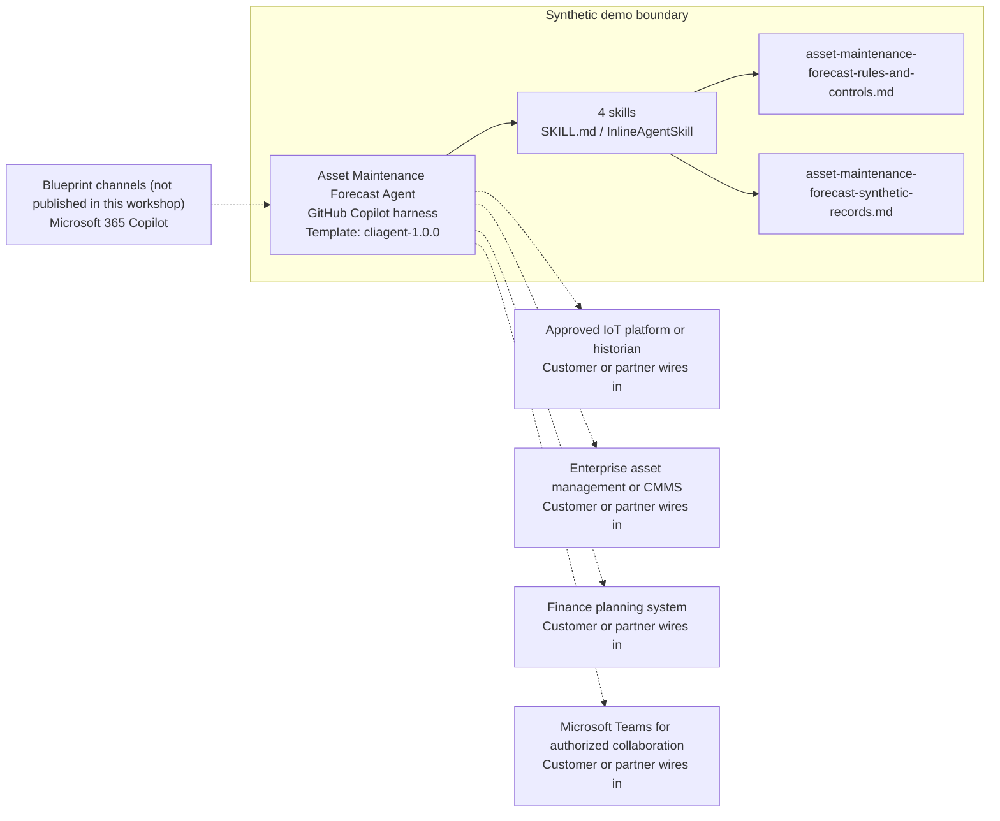

<!-- Generated by tools/build_solution_runbooks.py. Do not edit; change the sources and regenerate. -->

# Asset Maintenance Forecast Agent — Architecture

## Solution Architecture

### Logical architecture and trust boundary

Solid: synthetic design. Dashed: unwired customer systems; channels unpublished.

## Component Responsibilities

| Operation | Capability | Purpose | Owner |
| --- | --- | --- | --- |
| maintenance_forecast | Modeled failure-window review | Ranks synthetic assets by predicted failure window and condition evidence for engineering attention. | Template |
| asset_health | Asset condition triage | Explains condition scores and operating context without making a safety or authorization determination. | Template |
| budget_projection | Maintenance budget planning | Prepares non-binding synthetic maintenance and replacement estimates for finance review. | Template |
| work_order_plan | Draft work-order queue | Frames a prioritized maintenance queue without creating, scheduling, assigning, or dispatching work. | Template |

| Runtime reference | Recorded value |
| --- | --- |
| Portable implementation | [asset_maintenance_forecast_agent.py](../../agents/@aibast-agents-library/energy_stacks/asset_maintenance_forecast_stack/asset_maintenance_forecast_agent.py) |
| Expected tool | AssetMaintenanceForecastAgent |
| Source SHA-256 (short) | 6e0e25ffee2c |

## Data Contract

Approve field meaning, usage and retention before replacing synthetic examples.

| Entity | Fields the template uses | Used by | Customer system of record | Sensitivity |
| --- | --- | --- | --- | --- |
| ASSETS | name; type; location; installed_year; age_years; capacity_mw; last_major_service; replacement_cost | maintenance_forecast; asset_health; budget_projection; work_order_plan | Enterprise asset management or CMMS | Operational asset data; restrict location detail to approved staff. |
| ASSETS.maintenance_history | date; type; cost; description | maintenance_forecast | Enterprise asset management or CMMS | Maintenance and cost history; classify with your data owner. |
| ASSETS condition evidence | condition_score; operating_hours | maintenance_forecast; asset_health; budget_projection; work_order_plan | Approved IoT platform or historian | Operational telemetry; screening only, never a safety determination. |
| ASSETS modeled risk | failure_rate_annual_pct; predicted_next_failure | maintenance_forecast | Customer or partner maps | Modeled planning evidence; engineering review confirms it. |
| BUDGET_RATES | major; minor; inspection | budget_projection; work_order_plan | Finance planning system | Budget reference data; estimates authorize no commitment. |
| Draft work-order queue | priority; asset_id; asset_name; work_type; description; estimated_cost; target_date | work_order_plan | Enterprise asset management or CMMS | A derived draft queue, not a created work order. |

## Integration Points

**State: Not connected in the template.**

| System | Purpose | Skills that need it | Access | Template provides | Customer or partner wires in |
| --- | --- | --- | --- | --- | --- |
| Approved IoT platform or historian | Live telemetry and condition evidence. | asset-maintenance-forecast-maintenance-forecast; asset-maintenance-forecast-asset-health | read | Condition and modeled-risk contracts backed by fixed synthetic records; no live telemetry. | [Wiring procedure](3.Runbook.md#step-3-1-integrate-approved-iot-platform-or-historian) |
| Enterprise asset management or CMMS | Asset and maintenance records. | asset-maintenance-forecast-maintenance-forecast; asset-maintenance-forecast-asset-health; asset-maintenance-forecast-budget-projection; asset-maintenance-forecast-work-order-plan | read-write | Asset, history and draft-queue contracts; the agent cannot create, schedule or update work. | [Wiring procedure](3.Runbook.md#step-3-2-integrate-enterprise-asset-management-or-cmms) |
| Finance planning system | Budget context and review. | asset-maintenance-forecast-budget-projection; asset-maintenance-forecast-work-order-plan | read | Synthetic budget rates and the non-binding estimate rule. | [Wiring procedure](3.Runbook.md#step-3-3-integrate-finance-planning-system) |
| Microsoft Teams for authorized collaboration | Authorized review collaboration. | asset-maintenance-forecast-budget-projection; asset-maintenance-forecast-work-order-plan | read-write | Review boundaries only; no message or approval is sent. | [Wiring procedure](3.Runbook.md#step-3-4-integrate-microsoft-teams-for-authorized-collaboration) |

## Identity and Permissions

| Template default | Customer or partner decision |
| --- | --- |
| Authentication: Microsoft Entra ID authentication; the customer configures the supported mode for the intended operations channel. | Confirm tenant, permitted identities and authentication enforcement. |
| Audience: Plant Manager; Reliability Engineer; Finance Business Partner; Maintenance Planner | Define authorized users, groups and least-privilege connection identities. |

- Require sign-in before accessing asset, maintenance or budget information.
- Request only the scopes necessary for approved read sources.
- Restrict the operations audience and verify access with authorized and denied identities.

## Copilot Studio Components

Copilot Studio uses the GitHub Copilot harness; skills hold reviewed behavior.

Agent metadata from [settings.mcs.yml](../../solutions/asset-maintenance-forecast/copilot-studio/settings.mcs.yml):

| Setting | Recorded value |
| --- | --- |
| Template | cliagent-1.0.0 |
| Recognizer | CLICopilotRecognizer |
| Authoring model | CliCopilot |
| Model | Sonnet46 |

### Skill inventory

One skill per row: manual upload and source-controlled form.

| Skill | Manual upload | Source component |
| --- | --- | --- |
| asset-maintenance-forecast-asset-health | [SKILL.md](../../solutions/asset-maintenance-forecast/manual/skills/aibast_asset-health/SKILL.md) | [InlineAgentSkill](../../solutions/asset-maintenance-forecast/copilot-studio/behaviors/aibast_asset-maintenance-forecast-asset-health.mcs.yml) |
| asset-maintenance-forecast-budget-projection | [SKILL.md](../../solutions/asset-maintenance-forecast/manual/skills/aibast_budget-projection/SKILL.md) | [InlineAgentSkill](../../solutions/asset-maintenance-forecast/copilot-studio/behaviors/aibast_asset-maintenance-forecast-budget-projection.mcs.yml) |
| asset-maintenance-forecast-maintenance-forecast | [SKILL.md](../../solutions/asset-maintenance-forecast/manual/skills/aibast_maintenance-forecast/SKILL.md) | [InlineAgentSkill](../../solutions/asset-maintenance-forecast/copilot-studio/behaviors/aibast_asset-maintenance-forecast-maintenance-forecast.mcs.yml) |
| asset-maintenance-forecast-work-order-plan | [SKILL.md](../../solutions/asset-maintenance-forecast/manual/skills/aibast_work-order-plan/SKILL.md) | [InlineAgentSkill](../../solutions/asset-maintenance-forecast/copilot-studio/behaviors/aibast_asset-maintenance-forecast-work-order-plan.mcs.yml) |

### Knowledge inventory

| Knowledge file | Upload | Source / metadata |
| --- | --- | --- |
| asset-maintenance-forecast-rules-and-controls.md | [Content](../../solutions/asset-maintenance-forecast/manual/knowledge/asset-maintenance-forecast-rules-and-controls.md) | [Source copy](../../solutions/asset-maintenance-forecast/copilot-studio/capabilities/knowledge/files/asset-maintenance-forecast-rules-and-controls.md) · [Metadata](../../solutions/asset-maintenance-forecast/copilot-studio/capabilities/knowledge/files/asset-maintenance-forecast-rules-and-controls.md.mcs.yml) |
| asset-maintenance-forecast-synthetic-records.md | [Content](../../solutions/asset-maintenance-forecast/manual/knowledge/asset-maintenance-forecast-synthetic-records.md) | [Source copy](../../solutions/asset-maintenance-forecast/copilot-studio/capabilities/knowledge/files/asset-maintenance-forecast-synthetic-records.md) · [Metadata](../../solutions/asset-maintenance-forecast/copilot-studio/capabilities/knowledge/files/asset-maintenance-forecast-synthetic-records.md.mcs.yml) |

## State and Recovery

| Recovery ID | Condition | Required behavior | Owner |
| --- | --- | --- | --- |
| evidence-no-mockups | A required evidence file is missing | Stop. Capture or restore the real file; never substitute a mockup. | Template |
| failed-case-no-cherry-picking | A recorded identifier is absent | Mark the case failed and investigate; do not retry until it happens to pass. | Template |
| draft-publication-stop | Publish is offered | Stop at Draft unless a separate approver explicitly authorizes publication. | Template |
| asset-system-unavailable | A wired telemetry, asset or finance system returns no verified result | Report unavailable evidence; never claim a lookup, work order or approval succeeded. | Customer or partner |
| asset-id-absent | A requested asset identifier is not in the snapshot | Say it is absent; never substitute another asset's record. | Template |
| asset-grounding-unavailable | The required skill or its knowledge cannot load | Retry once in the same turn, then say so and stop without an uncited answer. | Template |

Promotion requires separate approval. [Package recovery guide](../../solutions/asset-maintenance-forecast/FIELD-GUIDE.md#failure-recovery).

## Design Decisions

| Decision | Reason |
| --- | --- |
| Screen condition without determining safety. | Statuses are advisory; engineering, asset-owner, finance and dispatcher approval remain mandatory. |
| Keep the four operations independently routable. | Forecasting, health triage, budgeting and draft planning each stay separately callable and reviewable. |
| Replace synthetic records with read connectors first. | A later write tool must be separate, authorized, state-validated, confirmed and audited. |
| Use exact assertions, not a quality-score substitute. | General quality in Evaluate (preview) does not compare responses to expected answers. |

## Non-Functional Considerations

| Area | Customer or partner confirms |
| --- | --- |
| Licensing and Copilot Credits | Confirm tenant licensing and budget credits for building, Preview, evaluation and production operations use. |
| Capacity | Allocate approved capacity to the operations environment and monitor consumption before widening the audience. |
| Data residency | Approve the environment geography and any cross-region processing of telemetry, asset and budget data before connecting sources. |
| Retention | Decide whether maintenance transcripts are saved, who can view or download them, and the Dataverse retention policy. |
| Cost drivers | Measure model-token, knowledge/tool and harness usage by workload; do not infer production cost from the synthetic demo. |

## Next

→ [Delivery runbook](3.Runbook.md) | [Solution index](../README.md)

[Sources for this page](0.Resources/README.md#sources-2architecturemd).
