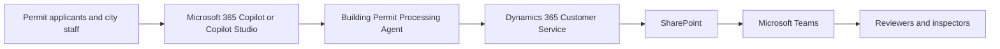

<!-- Generated by tools/build_solution_runbooks.py. Do not edit; change the sources and regenerate. -->

# Building Permit Processing Agent — Architecture

## Solution Architecture

Level-1 business flow (catalog architecture.business_flow): the order in which people and systems appear in the scenario, not a component or data-flow topology.

[Package case-flow diagram](../../solutions/building-permit-processing/FLOW.md)

This catalog flow includes production integration targets; it is not proof of live connectivity. Use the data and evidence boundary below when demonstrating the package.

## Component Responsibilities

| Operation | Capability | Purpose |
| --- | --- | --- |
| permit_backlog | Backlog and complaint-risk view | Ranks open applications against review clocks and correction cycles so managers know where intervention matters. |
| intake_triage | Intake validation and routing | Detects duplicates and missing documents, classifies the permit, and identifies the review desks and due date. |
| applicant_updates | Proactive applicant communication | Drafts clear status updates from the current permit state so front-desk teams can reduce avoidable status calls. |
| inspector_assignment | Inspection coordination | Surfaces scheduled inspections, inspector specialties, availability, and the job context needed for assignment. |

| Runtime reference | Recorded value |
| --- | --- |
| Agent file | [agents/@aibast-agents-library/slg_government_stacks/building_permit_processing_stack/building_permit_processing_agent.py](../../agents/@aibast-agents-library/slg_government_stacks/building_permit_processing_stack/building_permit_processing_agent.py) |
| Expected tool | BuildingPermitProcessingAgent |
| Source SHA-256 (short) | 9f674001f6b1 |

## Required Connections

### Connection requirements from the blueprint

- Dynamics 365 Customer Service
- SharePoint
- Microsoft Teams

These are integration requirements, not evidence that a connection is configured; apply the package's production replacement and approval gates.

### Level-2 domains

| Domain | Component | Responsibility |
| --- | --- | --- |
| Clients user interface | Portable Brainstem chat and API | The single-file RAPP agent exposes seven natural-language permit workflows through local chat, streaming, and tool routing. |
| Clients user interface | Copilot Studio Draft experience | Seven skills and two synthetic knowledge files reproduce five validated cases while the downloadable agent remains unpublished. |
| Clients user interface | Evidence-first staff responses | Permit technicians, reviewers, customer-service staff, managers, and inspectors receive concise facts, drafts, and next steps. |
| Intelligence processing | Backlog and complaint-risk ranking | Compares open permits with statutory clocks and correction cycles to rank overdue work and recommend reviewer intervention. |
| Intelligence processing | Intake completeness and duplicate triage | Checks required documents and matching applicant-parcel records, then recommends accept, reject, or redirect without mutating a case. |
| Intelligence processing | Review routing and due-date preparation | Classifies permit type, returns ordered review desks, and calculates the synthetic target date for technician and reviewer approval. |
| Intelligence processing | Applicant update drafting | Turns current permit evidence into prioritized draft status updates; staff review and send them through separately approved channels. |
| Intelligence processing | Permit review decision support | Returns status, reviewer, zoning references, checklist scope, and fee estimates without approval, compliance, invoice, or payment claims. |
| Intelligence processing | Inspection coverage coordination | Surfaces the inspection board and specialty-matched coverage for inspector review without booking, reassigning, or notifying anyone. |
| Knowledge | Synthetic permit application snapshot | Six fictional permits capture applicant, parcel, project, valuation, zoning, status, reviewer, review cycle, and submitted documents. |
| Knowledge | Permit rules and statutory schedules | Packaged targets, ordered review desks, intake-document rules, duplicate criteria, and zoning references drive fixed decisions. |
| Knowledge | Review checklist and fee references | Synthetic checklist templates and valuation-based fee schedules support review scope and estimates, never compliance or billing actions. |
| Knowledge | Inspector board and coverage records | Fixed inspections, specialties, zones, dates, statuses, and available slots support coverage review without changing assignments. |
| Management reporting | Backlog escalation brief | Ranks overdue permits, complaint risk, review cycles, and assigned reviewers so managers can authorize intervention priorities. |
| Management reporting | Front-counter intake queue | Shows duplicate and incomplete submissions, required documents, review desks, and target dates for technician approval. |
| Management reporting | Applicant communication queue | Prioritizes permit-specific draft updates for customer-service review; the agent never sends a message or changes a permit case. |
| Management reporting | Inspection coverage board | Lists scheduled and pending inspections with inspector specialties and coverage for human assignment and field approval. |

### Level-2 tools

| Tool | Responsibility |
| --- | --- |
| BuildingPermitProcessingAgent portable tool | Single-file Python BasicAgent implements seven deterministic workflows over packaged synthetic permit and inspection records. |
| Brainstem runtime | Local-first RAPP server discovers the portable agent and exposes conversational chat, streaming, health, and tool-routing endpoints. |
| Microsoft Copilot Studio | Hosts the validated skills-and-knowledge experience; the downloadable manual build is Draft and requires explicit publication approval. |
| Dynamics 365 Customer Service | Cited future read-only seam for permit cases; no live connector exists and the agent never creates, updates, closes, or approves a case. |
| SharePoint | Cited future read-only seam for plans and policy documents; the package currently uses two synthetic knowledge files. |
| Microsoft Teams | Cited future seam for reviewer and inspector coordination; the package sends no messages, assignments, or approval requests. |
| Deployment-selected foundation model | The host model routes natural-language requests and composes responses from deterministic agent or packaged skill evidence. |

### Supporting features

| Feature | Responsibility |
| --- | --- |
| Fixed synthetic evidence boundary | Every permit, applicant, address, reviewer, inspector, date, standard, fee, status, and recommendation is fictional pilot evidence. |
| Seven preserved permit workflows | Backlog, intake, applicant updates, status, checklist, inspector assignment, and fee estimation remain independently routable. |
| Reviewer and inspector approval gates | Human reviewers approve permit decisions and handoffs; inspectors approve coverage and field action before any operational change. |
| No permit-case mutation | The agent never approves, denies, issues, reopens, edits, closes, routes, or otherwise changes a permit or service case. |
| No autonomous communications or assignments | Applicant updates stay drafts; reviewer and inspector assignment, booking, cancellation, and notification remain human-controlled. |
| Fail-closed and non-legal handling | Unknown records are not substituted; zoning and checklist outputs are references, not legal advice or code-compliance findings. |
| Draft publication and future-write controls | The release build is unpublished; production starts read-only and any future write needs governance review and explicit human approval. |

## Copilot Studio Components

These Microsoft-native agents run on the [GitHub Copilot harness](https://learn.microsoft.com/en-us/microsoft-copilot-studio/harnesses-overview); [skills](https://learn.microsoft.com/en-us/microsoft-copilot-studio/agents-experience/skills-overview) package the reviewed instructions and logic.

Agent metadata from [settings.mcs.yml](../../solutions/building-permit-processing/copilot-studio/settings.mcs.yml):

| Setting | Recorded value |
| --- | --- |
| Template | cliagent-1.0.0 |
| Recognizer | CLICopilotRecognizer |
| Authoring model | CliCopilot |
| Model | Sonnet46 |

### Skills (source-controlled `InlineAgentSkill` components)

Each component is the source form of the matching `manual/skills/*/SKILL.md`; these are the same skills, not separate items to count.

| File | Role |
| --- | --- |
| [copilot-studio/behaviors/aibast_applicant-updates_bp03.mcs.yml](../../solutions/building-permit-processing/copilot-studio/behaviors/aibast_applicant-updates_bp03.mcs.yml) | Source form of the matching manual SKILL.md |
| [copilot-studio/behaviors/aibast_fee-calculation_bp07.mcs.yml](../../solutions/building-permit-processing/copilot-studio/behaviors/aibast_fee-calculation_bp07.mcs.yml) | Source form of the matching manual SKILL.md |
| [copilot-studio/behaviors/aibast_inspector-assignment_bp06.mcs.yml](../../solutions/building-permit-processing/copilot-studio/behaviors/aibast_inspector-assignment_bp06.mcs.yml) | Source form of the matching manual SKILL.md |
| [copilot-studio/behaviors/aibast_intake-triage_bp02.mcs.yml](../../solutions/building-permit-processing/copilot-studio/behaviors/aibast_intake-triage_bp02.mcs.yml) | Source form of the matching manual SKILL.md |
| [copilot-studio/behaviors/aibast_permit-backlog_bp01.mcs.yml](../../solutions/building-permit-processing/copilot-studio/behaviors/aibast_permit-backlog_bp01.mcs.yml) | Source form of the matching manual SKILL.md |
| [copilot-studio/behaviors/aibast_permit-status_bp04.mcs.yml](../../solutions/building-permit-processing/copilot-studio/behaviors/aibast_permit-status_bp04.mcs.yml) | Source form of the matching manual SKILL.md |
| [copilot-studio/behaviors/aibast_review-checklist_bp05.mcs.yml](../../solutions/building-permit-processing/copilot-studio/behaviors/aibast_review-checklist_bp05.mcs.yml) | Source form of the matching manual SKILL.md |

### Source-controlled knowledge

| File | Role |
| --- | --- |
| [copilot-studio/capabilities/knowledge/files/aibast_building-permit-synthetic-records.md](../../solutions/building-permit-processing/copilot-studio/capabilities/knowledge/files/aibast_building-permit-synthetic-records.md) | Knowledge content or its component metadata |
| [copilot-studio/capabilities/knowledge/files/aibast_building-permit-synthetic-records.md.mcs.yml](../../solutions/building-permit-processing/copilot-studio/capabilities/knowledge/files/aibast_building-permit-synthetic-records.md.mcs.yml) | Knowledge content or its component metadata |
| [copilot-studio/capabilities/knowledge/files/aibast_permit-rules-and-schedules.md](../../solutions/building-permit-processing/copilot-studio/capabilities/knowledge/files/aibast_permit-rules-and-schedules.md) | Knowledge content or its component metadata |
| [copilot-studio/capabilities/knowledge/files/aibast_permit-rules-and-schedules.md.mcs.yml](../../solutions/building-permit-processing/copilot-studio/capabilities/knowledge/files/aibast_permit-rules-and-schedules.md.mcs.yml) | Knowledge content or its component metadata |

### Manual upload skills

| File | Role |
| --- | --- |
| [manual/skills/aibast_applicant-updates_bp03/SKILL.md](../../solutions/building-permit-processing/manual/skills/aibast_applicant-updates_bp03/SKILL.md) | Reviewed skill for the literal browser build |
| [manual/skills/aibast_fee-calculation_bp07/SKILL.md](../../solutions/building-permit-processing/manual/skills/aibast_fee-calculation_bp07/SKILL.md) | Reviewed skill for the literal browser build |
| [manual/skills/aibast_inspector-assignment_bp06/SKILL.md](../../solutions/building-permit-processing/manual/skills/aibast_inspector-assignment_bp06/SKILL.md) | Reviewed skill for the literal browser build |
| [manual/skills/aibast_intake-triage_bp02/SKILL.md](../../solutions/building-permit-processing/manual/skills/aibast_intake-triage_bp02/SKILL.md) | Reviewed skill for the literal browser build |
| [manual/skills/aibast_permit-backlog_bp01/SKILL.md](../../solutions/building-permit-processing/manual/skills/aibast_permit-backlog_bp01/SKILL.md) | Reviewed skill for the literal browser build |
| [manual/skills/aibast_permit-status_bp04/SKILL.md](../../solutions/building-permit-processing/manual/skills/aibast_permit-status_bp04/SKILL.md) | Reviewed skill for the literal browser build |
| [manual/skills/aibast_review-checklist_bp05/SKILL.md](../../solutions/building-permit-processing/manual/skills/aibast_review-checklist_bp05/SKILL.md) | Reviewed skill for the literal browser build |

## Data and Evidence Boundary

From [GLOBAL-INSTRUCTIONS.md — Pilot data boundary](../../solutions/building-permit-processing/manual/GLOBAL-INSTRUCTIONS.md#pilot-data-boundary):

- Use only the synthetic records, schedules, standards, and procedures
  packaged with this project.
- Treat 2026-08-07 as the fixed snapshot date. Do not recalculate ages,
  overdue days, complaint-risk rankings, inspection dates, or intake due dates
  from the current date.
- Every applicant, address, parcel, permit, reviewer, inspector, fee, zoning
  standard, and date is fictional.
- Never claim access to Dynamics 365, SharePoint, Teams, an MCP server, or any
  other live municipal or customer system.
- End every substantive answer with:
  `> Synthetic pilot data as of 2026-08-07; no live municipal system was accessed or changed.`

From [FIELD-GUIDE.md — Evidence boundary](../../solutions/building-permit-processing/FIELD-GUIDE.md#evidence-boundary):

- All packaged records and outcomes are synthetic.
- Recorded cases provide qualitative workflow evidence only.
- They are not customer KPIs, measured production results, forecasts,
  commitments, or proof of a live system connection.
- A screenshot proves only the visible state in that frame.
- No image, GIF, transcript, connector result, or publication state is implied
  unless the corresponding file is present in `export-manifest.json`.

## Production Replacement Seams

From [FIELD-GUIDE.md — Production replacement seams](../../solutions/building-permit-processing/FIELD-GUIDE.md#production-replacement-seams):

- Replace packaged synthetic inputs with an approved Dynamics 365 Customer Service connection; preserve the reviewed input and output contract.
- Replace packaged synthetic inputs with an approved SharePoint connection; preserve the reviewed input and output contract.
- Replace packaged synthetic inputs with an approved Microsoft Teams connection; preserve the reviewed input and output contract.

The pilot must never claim a side effect, live lookup, or system update unless
an approved production tool returns evidence that it succeeded.

## Design Decisions

| Decision | Reason | Source |
| --- | --- | --- |
| Freeze the permit snapshot at 2026-08-07. | Backlog ages, review clocks, complaint risk and inspection dates are reviewed synthetic evidence; recalculating them from today changes the locked cases. | [Sourced delivery notes](../../solutions/runbook-notes.json) |
| Preserve all seven workflows as GitHub Copilot harness skills. | Permit status, review checklists and fee estimates are required by the global policy alongside backlog, intake, updates and inspection coverage. | [Sourced delivery notes](../../solutions/runbook-notes.json) |
| Keep recommendations separate from municipal writes. | Applicant updates are drafts and coverage is advice. Production starts with approved read-only sources; sending, assigning or changing records needs separate human authorization. | [Sourced delivery notes](../../solutions/runbook-notes.json) |
| Resolve permits from context without inventing a substitute. | Staff ask by street or job nickname. Ambiguous or unknown records need a concise clarification or known-match list, not a confident answer about another application. | [Sourced delivery notes](../../solutions/runbook-notes.json) |
| Keep checklist findings and fee transactions out of the skills. | Checklists contain ordered unchecked items, not compliance findings; fees are estimates from declared valuation, not invoices, waivers or payment records. | [Sourced delivery notes](../../solutions/runbook-notes.json) |
| Use deterministic permit assertions instead of a quality-score release threshold. | GitHub Copilot harness Evaluate (preview) General quality does not compare expected answers. It cannot prove BPP-01's exact response or replace the five-case and visual gates. | [Sourced delivery notes](../../solutions/runbook-notes.json) |
| Accept the actual inspector-skill validation outcome. | The current reviewed skill has valid frontmatter. The old failure/retry sequence is historical, so forcing an error would fabricate evidence rather than validate the build. | [Sourced delivery notes](../../solutions/runbook-notes.json) |

### Delivery principles (all packages)

| Principle | Reason / boundary | Source |
| --- | --- | --- |
| Keep demo evidence separate from production results | The field guide limits packaged records and outcomes to synthetic workflow evidence. | [Evidence boundary](../../solutions/building-permit-processing/FIELD-GUIDE.md#evidence-boundary) |
| Preserve the package's instruction boundary | Use the reviewed global instructions rather than treating a blueprint platform as a live tool. | [Global instructions](../../solutions/building-permit-processing/manual/GLOBAL-INSTRUCTIONS.md) |
| Keep Easy and Manual construction distinct | The manual lane uses the browser and reviewed uploads, not CLI or YAML import. | [Manual mode](../../solutions/building-permit-processing/FIELD-GUIDE.md#manual-mode--literal-browser-construction) |
| Replay the recorded corpus before release | Compare exact case prompts and expected entities; file presence alone is not a new runtime pass. | [Canonical transcripts](../../solutions/building-permit-processing/evals/transcripts.json) |
| Stop the workshop at Draft | Publication is a separate approval gate, not a generated-runbook deliverable. | [Evidence gates](../../solutions/building-permit-processing/FIELD-GUIDE.md#evidence-gates) |

## Sources

- [02-patterns/patterns.json](../../02-patterns/patterns.json)
- [Microsoft Learn — Admin data loss prevention](https://learn.microsoft.com/en-us/microsoft-copilot-studio/admin-data-loss-prevention)
- [Microsoft Learn — Analytics agent evaluation intro](https://learn.microsoft.com/en-us/microsoft-copilot-studio/agents-experience/analytics-agent-evaluation-intro)
- [Microsoft Learn — Analytics overview](https://learn.microsoft.com/en-us/microsoft-copilot-studio/agents-experience/analytics-overview)
- [Microsoft Learn — Authoring share agent](https://learn.microsoft.com/en-us/microsoft-copilot-studio/agents-experience/authoring-share-agent)
- [Microsoft Learn — Authoring test bot](https://learn.microsoft.com/en-us/microsoft-copilot-studio/agents-experience/authoring-test-bot)
- [Microsoft Learn — Billing credit overview](https://learn.microsoft.com/en-us/microsoft-copilot-studio/agents-experience/billing-credit-overview)
- [Microsoft Learn — Skills overview](https://learn.microsoft.com/en-us/microsoft-copilot-studio/agents-experience/skills-overview)
- [Microsoft Learn — Harnesses overview](https://learn.microsoft.com/en-us/microsoft-copilot-studio/harnesses-overview)
- [Microsoft Learn — Copilot](https://learn.microsoft.com/en-us/power-platform/developer/cli/reference/copilot)
- [registry.json](../../registry.json)
- [solutions/README.md](../../solutions/README.md)
- [solutions/building-permit-processing/FIELD-GUIDE.md](../../solutions/building-permit-processing/FIELD-GUIDE.md)
- [solutions/building-permit-processing/FLOW.md](../../solutions/building-permit-processing/FLOW.md)
- [solutions/building-permit-processing/README.md](../../solutions/building-permit-processing/README.md)
- [solutions/building-permit-processing/copilot-studio/behaviors/aibast_permit-status_bp04.mcs.yml](../../solutions/building-permit-processing/copilot-studio/behaviors/aibast_permit-status_bp04.mcs.yml)
- [solutions/building-permit-processing/copilot-studio/behaviors/aibast_review-checklist_bp05.mcs.yml](../../solutions/building-permit-processing/copilot-studio/behaviors/aibast_review-checklist_bp05.mcs.yml)
- [solutions/building-permit-processing/copilot-studio/settings.mcs.yml](../../solutions/building-permit-processing/copilot-studio/settings.mcs.yml)
- [solutions/building-permit-processing/deployment.json](../../solutions/building-permit-processing/deployment.json)
- [solutions/building-permit-processing/evals/copilot-studio-preview-evidence.json](../../solutions/building-permit-processing/evals/copilot-studio-preview-evidence.json)
- [solutions/building-permit-processing/evals/manual-build-evidence.json](../../solutions/building-permit-processing/evals/manual-build-evidence.json)
- [solutions/building-permit-processing/evals/transcripts.json](../../solutions/building-permit-processing/evals/transcripts.json)
- [solutions/building-permit-processing/evals/visual-checkpoints.json](../../solutions/building-permit-processing/evals/visual-checkpoints.json)
- [solutions/building-permit-processing/manual/GLOBAL-INSTRUCTIONS.md](../../solutions/building-permit-processing/manual/GLOBAL-INSTRUCTIONS.md)
- [solutions/building-permit-processing/manual/skills/aibast_fee-calculation_bp07/SKILL.md](../../solutions/building-permit-processing/manual/skills/aibast_fee-calculation_bp07/SKILL.md)
- [solutions/building-permit-processing/manual/skills/aibast_inspector-assignment_bp06/SKILL.md](../../solutions/building-permit-processing/manual/skills/aibast_inspector-assignment_bp06/SKILL.md)
- [solutions/catalog.json](../../solutions/catalog.json)
- [solutions/runbook-notes.json](../../solutions/runbook-notes.json)
- [state/architecture_level2_sources/building-permit-processing.json](../../state/architecture_level2_sources/building-permit-processing.json)
- [tests/demo_cases/building-permit-processing.json](../../tests/demo_cases/building-permit-processing.json)

## Next

→ [Delivery runbook](3.Runbook.md) | [Solution index](../README.md)
