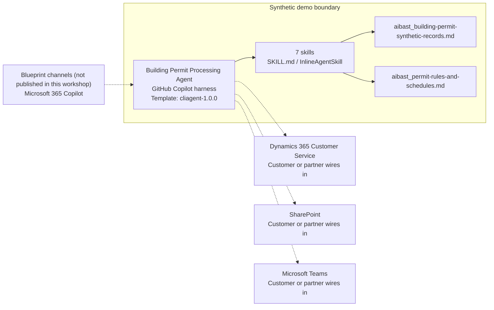

<!-- Generated by tools/build_solution_runbooks.py. Do not edit; change the sources and regenerate. -->

# Building Permit Processing Agent — Architecture

## Solution Architecture

### Logical architecture and trust boundary

Solid paths describe the synthetic design; dashed systems need customer or partner wiring. Channels remain unpublished. [Blueprint source](../../state/architecture_level2_sources/building-permit-processing.json).

## Component Responsibilities

| Operation | Capability | Purpose | Owner |
| --- | --- | --- | --- |
| permit_backlog | Backlog and complaint-risk view | Ranks open applications against review clocks and correction cycles so managers know where intervention matters. | Template |
| intake_triage | Intake validation and routing | Detects duplicates and missing documents, classifies the permit, and identifies the review desks and due date. | Template |
| applicant_updates | Proactive applicant communication | Drafts clear status updates from the current permit state so front-desk teams can reduce avoidable status calls. | Template |
| inspector_assignment | Inspection coordination | Surfaces scheduled inspections, inspector specialties, availability, and the job context needed for assignment. | Template |

| Runtime reference | Recorded value |
| --- | --- |
| Portable implementation | [building_permit_processing_agent.py](../../agents/@aibast-agents-library/slg_government_stacks/building_permit_processing_stack/building_permit_processing_agent.py) |
| Expected tool | BuildingPermitProcessingAgent |
| Source SHA-256 (short) | 9f674001f6b1 |

## Data Contract

Synthetic examples define this contract. Customer data owners approve field meaning, permitted use and retention before replacement.

| Entity | Fields the template uses | Used by | Customer system of record | Sensitivity |
| --- | --- | --- | --- | --- |
| PERMIT_APPLICATIONS (source 1) | applicant; property_address; parcel_id; permit_type; description; submitted; valuation; zoning_district; status; assigned_reviewer; review_cycle; documents | permit_backlog; intake_triage; applicant_updates; permit_status; review_checklist; inspector_assignment; fee_calculation | Dynamics 365 Customer Service | Permit applicant data; restrict applicant, address and parcel exposure. |
| Fixed review-clock state (source 2) | Permit; Target; Snapshot state; Days over; Complaint risk | permit_backlog; applicant_updates | Customer or partner maps | Derived permit-applicant work status; not a prediction about a real person. |
| Statutory review targets (source 3) | Permit type; Target | permit_backlog; intake_triage; applicant_updates | SharePoint | Policy reference data; customer approval replaces fictional targets. |
| Review routing (source 3) | Permit type; Desks in order | intake_triage | SharePoint | Internal review-routing policy. |
| Required intake documents (source 3) | Permit type; Required documents | intake_triage | SharePoint | Policy data; attached applicant documents need separate classification. |
| Zoning reference standards (source 3) | District; Maximum height; Front; Side; Rear; Lot coverage; Parking | permit_status | SharePoint | Reference policy, not a compliance determination. |
| Synthetic fee schedule (source 3) | Category; Base; Rate per $1,000 | fee_calculation | Customer or partner maps | Fee-policy data; no applicant invoice or payment record. |
| Inspector roster (source 2) | Inspector; Specialty; Available slots; Service zone | inspector_assignment | Customer or partner maps | Staff identity and availability; restrict operational access. |
| Inspection board (source 2) | Inspection; Inspector; Date; Status | inspector_assignment; applicant_updates | Customer or partner maps | Permit-linked staff schedule; not an authorization to book or notify. |
| _review_checklist.type_specific (source 1) | new_construction; residential_addition; commercial_alteration; institutional | review_checklist | SharePoint | Review-policy templates; unchecked items are not compliance findings. |

Data source 1: [building_permit_processing_agent.py](../../agents/@aibast-agents-library/slg_government_stacks/building_permit_processing_stack/building_permit_processing_agent.py). Data source 2: [aibast_building-permit-synthetic-records.md](../../solutions/building-permit-processing/copilot-studio/capabilities/knowledge/files/aibast_building-permit-synthetic-records.md). Data source 3: [aibast_permit-rules-and-schedules.md](../../solutions/building-permit-processing/copilot-studio/capabilities/knowledge/files/aibast_permit-rules-and-schedules.md).

## Integration Points

**State: Not connected in the template.**

| System | Purpose | Skills that need it | Access | Template provides | Customer or partner wires in |
| --- | --- | --- | --- | --- | --- |
| Dynamics 365 Customer Service | Permit-case, applicant and review-state lookup. (source 1) | permit-backlog-and-complaint-risk; intake-triage-and-review-routing; proactive-applicant-updates; permit-status-and-zoning-detail; permit-review-checklist; synthetic-permit-fee-estimate | read | Permit-record fields and skill contracts backed by synthetic applications, not a live case connector. | Bind approved read-only permit actions ([Learn](https://learn.microsoft.com/en-us/microsoft-copilot-studio/agents-experience/add-tools-custom-agent)). |
| SharePoint | Plans and approved intake, routing and review-policy knowledge. (source 1) | permit-backlog-and-complaint-risk; intake-triage-and-review-routing; permit-status-and-zoning-detail; permit-review-checklist; synthetic-permit-fee-estimate | read | Synthetic rule, checklist and schedule references used alongside the permit snapshot. | Add approved plan and policy knowledge with a content owner ([Learn](https://learn.microsoft.com/en-us/microsoft-copilot-studio/agents-experience/knowledge-copilot-studio)). |
| Microsoft Teams | Governed reviewer and inspector coordination. (source 1) | proactive-applicant-updates; inspector-board-and-coverage | read-write | Unsent update drafts and synthetic coverage recommendations; no notification or assignment tool. | Start read-only; gate sending or assignment workflows behind approval ([Learn, preview](https://learn.microsoft.com/en-us/microsoft-copilot-studio/agents-experience/tools-add-workflow)). |

Integration source 1: [building-permit-processing.json](../../state/architecture_level2_sources/building-permit-processing.json).

Implementation sequence: [Wire in your systems](3.Runbook.md#phase-3--wire-in-your-systems).

## Identity and Permissions

| Template default | Customer or partner decision |
| --- | --- |
| Authentication: Microsoft Entra ID authentication; the customer selects the supported mode for the intended staff channel. | Confirm tenant, permitted identities and authentication enforcement. |
| Audience: Permit Technicians; Plan Reviewers; Inspectors | Define authorized users, groups and least-privilege connection identities. |

- Require sign-in for restricted permit information.
- Request only scopes needed for approved records and actions.
- Restrict the staff audience and test authorized and denied access.

[Identity basis](https://learn.microsoft.com/en-us/microsoft-copilot-studio/configuration-end-user-authentication) · [Authentication guidance](https://learn.microsoft.com/en-us/microsoft-copilot-studio/configuration-end-user-authentication).

## Copilot Studio Components

These Microsoft-native agents run on the [GitHub Copilot harness](https://learn.microsoft.com/en-us/microsoft-copilot-studio/harnesses-overview); [skills](https://learn.microsoft.com/en-us/microsoft-copilot-studio/agents-experience/skills-overview) package the reviewed instructions and logic.

Agent metadata from [settings.mcs.yml](../../solutions/building-permit-processing/copilot-studio/settings.mcs.yml):

| Setting | Recorded value |
| --- | --- |
| Template | cliagent-1.0.0 |
| Recognizer | CLICopilotRecognizer |
| Authoring model | CliCopilot |
| Model | Sonnet46 |

### Skill inventory

Each row is one skill: a manual upload and its source-controlled `InlineAgentSkill` form.

| Skill | Manual upload | Source component |
| --- | --- | --- |
| inspector-board-and-coverage | [SKILL.md](../../solutions/building-permit-processing/manual/skills/aibast_inspector-assignment_bp06/SKILL.md) | [InlineAgentSkill](../../solutions/building-permit-processing/copilot-studio/behaviors/aibast_inspector-assignment_bp06.mcs.yml) |
| intake-triage-and-review-routing | [SKILL.md](../../solutions/building-permit-processing/manual/skills/aibast_intake-triage_bp02/SKILL.md) | [InlineAgentSkill](../../solutions/building-permit-processing/copilot-studio/behaviors/aibast_intake-triage_bp02.mcs.yml) |
| permit-backlog-and-complaint-risk | [SKILL.md](../../solutions/building-permit-processing/manual/skills/aibast_permit-backlog_bp01/SKILL.md) | [InlineAgentSkill](../../solutions/building-permit-processing/copilot-studio/behaviors/aibast_permit-backlog_bp01.mcs.yml) |
| permit-review-checklist | [SKILL.md](../../solutions/building-permit-processing/manual/skills/aibast_review-checklist_bp05/SKILL.md) | [InlineAgentSkill](../../solutions/building-permit-processing/copilot-studio/behaviors/aibast_review-checklist_bp05.mcs.yml) |
| permit-status-and-zoning-detail | [SKILL.md](../../solutions/building-permit-processing/manual/skills/aibast_permit-status_bp04/SKILL.md) | [InlineAgentSkill](../../solutions/building-permit-processing/copilot-studio/behaviors/aibast_permit-status_bp04.mcs.yml) |
| proactive-applicant-updates | [SKILL.md](../../solutions/building-permit-processing/manual/skills/aibast_applicant-updates_bp03/SKILL.md) | [InlineAgentSkill](../../solutions/building-permit-processing/copilot-studio/behaviors/aibast_applicant-updates_bp03.mcs.yml) |
| synthetic-permit-fee-estimate | [SKILL.md](../../solutions/building-permit-processing/manual/skills/aibast_fee-calculation_bp07/SKILL.md) | [InlineAgentSkill](../../solutions/building-permit-processing/copilot-studio/behaviors/aibast_fee-calculation_bp07.mcs.yml) |

### Knowledge inventory

| Knowledge file | Upload | Source / metadata |
| --- | --- | --- |
| aibast_building-permit-synthetic-records.md | [Content](../../solutions/building-permit-processing/copilot-studio/capabilities/knowledge/files/aibast_building-permit-synthetic-records.md) | [Metadata](../../solutions/building-permit-processing/copilot-studio/capabilities/knowledge/files/aibast_building-permit-synthetic-records.md.mcs.yml) |
| aibast_permit-rules-and-schedules.md | [Content](../../solutions/building-permit-processing/copilot-studio/capabilities/knowledge/files/aibast_permit-rules-and-schedules.md) | [Metadata](../../solutions/building-permit-processing/copilot-studio/capabilities/knowledge/files/aibast_permit-rules-and-schedules.md.mcs.yml) |

## State and Recovery

| Recovery ID | Condition | Required behavior | Owner | Source |
| --- | --- | --- | --- | --- |
| evidence-no-mockups | A required evidence file is missing | Stop. Capture or restore the real file; never substitute a mockup. | Template | [FIELD-GUIDE.md](../../solutions/building-permit-processing/FIELD-GUIDE.md) |
| failed-case-no-cherry-picking | A recorded identifier is absent | Mark the case failed and investigate; do not retry until it happens to pass. | Template | [FIELD-GUIDE.md](../../solutions/building-permit-processing/FIELD-GUIDE.md) |
| draft-publication-stop | Publish is offered | Stop at Draft unless a separate approver explicitly authorizes publication. | Template | [FIELD-GUIDE.md](../../solutions/building-permit-processing/FIELD-GUIDE.md) |
| permit-system-unavailable | A wired municipal system returns no verified result | Report unavailable evidence; never claim that a lookup, permit change or message succeeded. | Customer or partner | [FIELD-GUIDE.md](../../solutions/building-permit-processing/FIELD-GUIDE.md) |
| permit-record-unclear | The permit is unknown or the project description is ambiguous | State what is missing, list known matches or clarify; never default to another permit. | Template | [GLOBAL-INSTRUCTIONS.md](../../solutions/building-permit-processing/manual/GLOBAL-INSTRUCTIONS.md) |
| permit-action-requested | A request would change a permit, send an update, assign an inspection or transact a fee | Return a recommendation or draft; any future write requires separate governance and human approval. | Template | [GLOBAL-INSTRUCTIONS.md](../../solutions/building-permit-processing/manual/GLOBAL-INSTRUCTIONS.md) |

Template state stays synthetic and unpublished until the customer authorizes promotion. See [workshop integrity](3.Runbook.md#step-2-3-enforce-workshop-integrity) and the [source recovery rules](../../solutions/building-permit-processing/FIELD-GUIDE.md#failure-recovery).

## Design Decisions

| Decision | Reason | Source |
| --- | --- | --- |
| Freeze the permit snapshot at 2026-08-07. | Today's date must not alter synthetic backlog rankings, review clocks or inspection dates. | [GLOBAL-INSTRUCTIONS.md](../../solutions/building-permit-processing/manual/GLOBAL-INSTRUCTIONS.md) |
| Preserve all seven workflows. | Status, checklists and fees are required alongside backlog, intake, applicant updates and inspection coverage. | [GLOBAL-INSTRUCTIONS.md](../../solutions/building-permit-processing/manual/GLOBAL-INSTRUCTIONS.md) |
| Keep recommendations separate from municipal writes. | Future connections start read-only; writes require separate governance and human authorization. | [GLOBAL-INSTRUCTIONS.md](../../solutions/building-permit-processing/manual/GLOBAL-INSTRUCTIONS.md) |
| Resolve context, but never substitute an unknown permit. | Street and job aliases can be ambiguous; missing IDs require the known-record list. | Source 4 below |
| Do not replace exact assertions with a quality score. | General quality in Evaluate (preview) does not compare expected answers. | [Learn](https://learn.microsoft.com/en-us/microsoft-copilot-studio/agents-experience/analytics-agent-evaluation-intro) |

Design decisions source 4: [Package source](../../solutions/building-permit-processing/manual/skills/aibast_permit-status_bp04/SKILL.md)

## Non-Functional Considerations

| Area | Customer or partner confirms | Source |
| --- | --- | --- |
| Licensing and Copilot Credits | Confirm tenant licensing and budget credits for building, Preview, evaluation and production permit use. | [Learn](https://learn.microsoft.com/en-us/microsoft-copilot-studio/agents-experience/billing-credit-overview) |
| Capacity | Allocate approved capacity to the permit environment and monitor workload consumption before widening access. | [Learn](https://learn.microsoft.com/en-us/power-platform/admin/manage-copilot-studio-copilot-credits-capacity) |
| Data residency | Confirm the permitted geography for applicant records, plan documents and processing, including external-system data movement. | [Learn](https://learn.microsoft.com/en-us/microsoft-copilot-studio/geo-data-residency) |
| Retention | Approve transcript recording, viewing, downloading and Dataverse retention with the municipal data owner. | [Learn](https://learn.microsoft.com/en-us/microsoft-copilot-studio/admin-transcript-controls) |
| Cost drivers | Measure model-token, knowledge/tool and harness usage by permit workload; synthetic evidence is not a production-cost estimate. | [Learn](https://learn.microsoft.com/en-us/microsoft-copilot-studio/agents-experience/billing-credit-overview) |

## Next

→ [Delivery runbook](3.Runbook.md) | [Solution index](../README.md)

[Full source ledger](0.Resources/README.md#sources).
