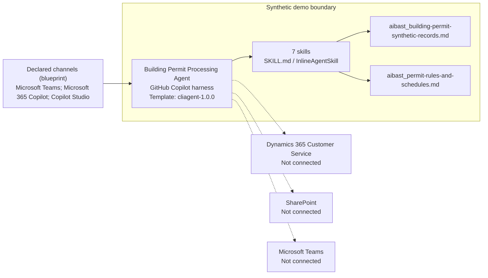
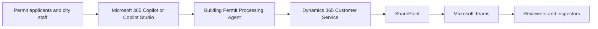

<!-- Generated by tools/build_solution_runbooks.py. Do not edit; change the sources and regenerate. -->

# Building Permit Processing Agent — Architecture

## Solution Architecture

### Logical architecture and trust boundary

The solid paths describe the packaged design, not a live deployment. Dashed seams are not connected; source-system authority remains outside the synthetic demo.

### Catalog scenario flow

Level-1 business flow (catalog architecture.business_flow): the order in which people and systems appear in the scenario, not a component or data-flow topology.

[Package case-flow diagram](../../solutions/building-permit-processing/FLOW.md).

## Component Responsibilities

| Operation | Capability | Purpose |
| --- | --- | --- |
| permit_backlog | Backlog and complaint-risk view | Ranks open applications against review clocks and correction cycles so managers know where intervention matters. |
| intake_triage | Intake validation and routing | Detects duplicates and missing documents, classifies the permit, and identifies the review desks and due date. |
| applicant_updates | Proactive applicant communication | Drafts clear status updates from the current permit state so front-desk teams can reduce avoidable status calls. |
| inspector_assignment | Inspection coordination | Surfaces scheduled inspections, inspector specialties, availability, and the job context needed for assignment. |

| Runtime reference | Recorded value |
| --- | --- |
| Portable implementation | [building_permit_processing_agent.py](../../agents/@aibast-agents-library/slg_government_stacks/building_permit_processing_stack/building_permit_processing_agent.py) |
| Expected tool | BuildingPermitProcessingAgent |
| Source SHA-256 (short) | 9f674001f6b1 |

## Required Connections

The synthetic build uses packaged knowledge, not customer-system connections. Qualify live integration targets under [Production replacement seams](#production-replacement-seams).

### Level-2 domains

| Domain | Source inventory |
| --- | --- |
| Clients user interface | 3 source-defined components |
| Intelligence processing | 6 source-defined components |
| Knowledge | 4 source-defined components |
| Management reporting | 4 source-defined components |

Detailed responsibilities, tools and supporting features remain in the [Level-2 architecture source](../../state/architecture_level2_sources/building-permit-processing.json).

## Copilot Studio Components

These Microsoft-native agents run on the [GitHub Copilot harness](https://learn.microsoft.com/en-us/microsoft-copilot-studio/harnesses-overview); [skills](https://learn.microsoft.com/en-us/microsoft-copilot-studio/agents-experience/skills-overview) package the reviewed instructions and logic.

Agent metadata from [settings.mcs.yml](../../solutions/building-permit-processing/copilot-studio/settings.mcs.yml):

| Setting | Recorded value |
| --- | --- |
| Template | cliagent-1.0.0 |
| Recognizer | CLICopilotRecognizer |
| Authoring model | CliCopilot |
| Model | Sonnet46 |

### Skill inventory

Each row is one skill: a manual upload and its source-controlled `InlineAgentSkill` form.

| Skill | Manual upload | Source component |
| --- | --- | --- |
| inspector-board-and-coverage | [SKILL.md](../../solutions/building-permit-processing/manual/skills/aibast_inspector-assignment_bp06/SKILL.md) | [InlineAgentSkill](../../solutions/building-permit-processing/copilot-studio/behaviors/aibast_inspector-assignment_bp06.mcs.yml) |
| intake-triage-and-review-routing | [SKILL.md](../../solutions/building-permit-processing/manual/skills/aibast_intake-triage_bp02/SKILL.md) | [InlineAgentSkill](../../solutions/building-permit-processing/copilot-studio/behaviors/aibast_intake-triage_bp02.mcs.yml) |
| permit-backlog-and-complaint-risk | [SKILL.md](../../solutions/building-permit-processing/manual/skills/aibast_permit-backlog_bp01/SKILL.md) | [InlineAgentSkill](../../solutions/building-permit-processing/copilot-studio/behaviors/aibast_permit-backlog_bp01.mcs.yml) |
| permit-review-checklist | [SKILL.md](../../solutions/building-permit-processing/manual/skills/aibast_review-checklist_bp05/SKILL.md) | [InlineAgentSkill](../../solutions/building-permit-processing/copilot-studio/behaviors/aibast_review-checklist_bp05.mcs.yml) |
| permit-status-and-zoning-detail | [SKILL.md](../../solutions/building-permit-processing/manual/skills/aibast_permit-status_bp04/SKILL.md) | [InlineAgentSkill](../../solutions/building-permit-processing/copilot-studio/behaviors/aibast_permit-status_bp04.mcs.yml) |
| proactive-applicant-updates | [SKILL.md](../../solutions/building-permit-processing/manual/skills/aibast_applicant-updates_bp03/SKILL.md) | [InlineAgentSkill](../../solutions/building-permit-processing/copilot-studio/behaviors/aibast_applicant-updates_bp03.mcs.yml) |
| synthetic-permit-fee-estimate | [SKILL.md](../../solutions/building-permit-processing/manual/skills/aibast_fee-calculation_bp07/SKILL.md) | [InlineAgentSkill](../../solutions/building-permit-processing/copilot-studio/behaviors/aibast_fee-calculation_bp07.mcs.yml) |

### Knowledge inventory

| Knowledge file | Upload | Source / metadata |
| --- | --- | --- |
| aibast_building-permit-synthetic-records.md | [Content](../../solutions/building-permit-processing/copilot-studio/capabilities/knowledge/files/aibast_building-permit-synthetic-records.md) | [Metadata](../../solutions/building-permit-processing/copilot-studio/capabilities/knowledge/files/aibast_building-permit-synthetic-records.md.mcs.yml) |
| aibast_permit-rules-and-schedules.md | [Content](../../solutions/building-permit-processing/copilot-studio/capabilities/knowledge/files/aibast_permit-rules-and-schedules.md) | [Metadata](../../solutions/building-permit-processing/copilot-studio/capabilities/knowledge/files/aibast_permit-rules-and-schedules.md.mcs.yml) |

## Data and Evidence Boundary

From [FIELD-GUIDE.md — Evidence boundary](../../solutions/building-permit-processing/FIELD-GUIDE.md#evidence-boundary):

- All packaged records and outcomes are synthetic.
- Recorded cases provide qualitative workflow evidence only.
- They are not customer KPIs, measured production results, forecasts,
  commitments, or proof of a live system connection.
- A screenshot proves only the visible state in that frame.
- No image, GIF, transcript, connector result, or publication state is implied
  unless the corresponding file is present in `export-manifest.json`.

The [global policy](../../solutions/building-permit-processing/manual/GLOBAL-INSTRUCTIONS.md) defines the fixed dataset and permitted reasoning. Operational prohibitions are collected once in [What this agent should never do](4.Sample-prompts.md#what-this-agent-should-never-do).

## Production Replacement Seams

| Blueprint integration target | Qualification state |
| --- | --- |
| Dynamics 365 Customer Service | Not connected in this workshop |
| SharePoint | Not connected in this workshop |
| Microsoft Teams | Not connected in this workshop |

From [GLOBAL-INSTRUCTIONS.md — Production seams](../../solutions/building-permit-processing/manual/GLOBAL-INSTRUCTIONS.md#production-seams):

A production implementation can replace the packaged permit records with
Dynamics 365 Customer Service, plan and policy documents with SharePoint, and
notifications or field coordination with Microsoft Teams-backed tools. These
are future integration seams only; no live connector is configured. Start any
approved production connection in read-only mode. Keep external writes disabled
until they pass separate governance review and require explicit human approval.

See the [package's seam contract](../../solutions/building-permit-processing/FIELD-GUIDE.md#production-replacement-seams) and the owned [production-hardening steps](3.Runbook.md#phase-5--production-hardening) before changing sources.

## Design Decisions

| Decision | Reason | Source |
| --- | --- | --- |
| Freeze the permit snapshot at 2026-08-07. | Today's date must not alter synthetic backlog rankings, review clocks or inspection dates. | [GLOBAL-INSTRUCTIONS.md](../../solutions/building-permit-processing/manual/GLOBAL-INSTRUCTIONS.md) |
| Preserve all seven workflows. | Status, checklists and fees are required alongside backlog, intake, applicant updates and inspection coverage. | [GLOBAL-INSTRUCTIONS.md](../../solutions/building-permit-processing/manual/GLOBAL-INSTRUCTIONS.md) |
| Keep recommendations separate from municipal writes. | Future connections start read-only; writes require separate governance and human authorization. | [GLOBAL-INSTRUCTIONS.md](../../solutions/building-permit-processing/manual/GLOBAL-INSTRUCTIONS.md) |
| Resolve context, but never substitute an unknown permit. | Street and job aliases can be ambiguous; missing IDs require the known-record list. | Source 4 below |
| Do not replace exact assertions with a quality score. | General quality in Evaluate (preview) does not compare expected answers. | [Learn](https://learn.microsoft.com/en-us/microsoft-copilot-studio/agents-experience/analytics-agent-evaluation-intro) |

Design decisions source 4: [Package source](../../solutions/building-permit-processing/manual/skills/aibast_permit-status_bp04/SKILL.md)

## Sources

- [Architecture input — runbook-notes.json](../../solutions/runbook-notes.json)
- [Architecture input — catalog.json](../../solutions/catalog.json)
- [Architecture input — registry.json](../../registry.json)
- [Architecture input — deployment.json](../../solutions/building-permit-processing/deployment.json)
- [Architecture input — settings.mcs.yml](../../solutions/building-permit-processing/copilot-studio/settings.mcs.yml)
- [Architecture input — GLOBAL-INSTRUCTIONS.md](../../solutions/building-permit-processing/manual/GLOBAL-INSTRUCTIONS.md)
- [Architecture input — FIELD-GUIDE.md](../../solutions/building-permit-processing/FIELD-GUIDE.md)
- [Architecture input — building-permit-processing.json](../../state/architecture_level2_sources/building-permit-processing.json)
- [Architecture input — transcripts.json](../../solutions/building-permit-processing/evals/transcripts.json)
- [Architecture input — Analytics agent evaluation intro](https://learn.microsoft.com/en-us/microsoft-copilot-studio/agents-experience/analytics-agent-evaluation-intro)
- [Architecture input — Skills overview](https://learn.microsoft.com/en-us/microsoft-copilot-studio/agents-experience/skills-overview)
- [Architecture input — Harnesses overview](https://learn.microsoft.com/en-us/microsoft-copilot-studio/harnesses-overview)

Full source list: [Resources](0.Resources/README.md#sources).

## Next

→ [Delivery runbook](3.Runbook.md) | [Solution index](../README.md)
