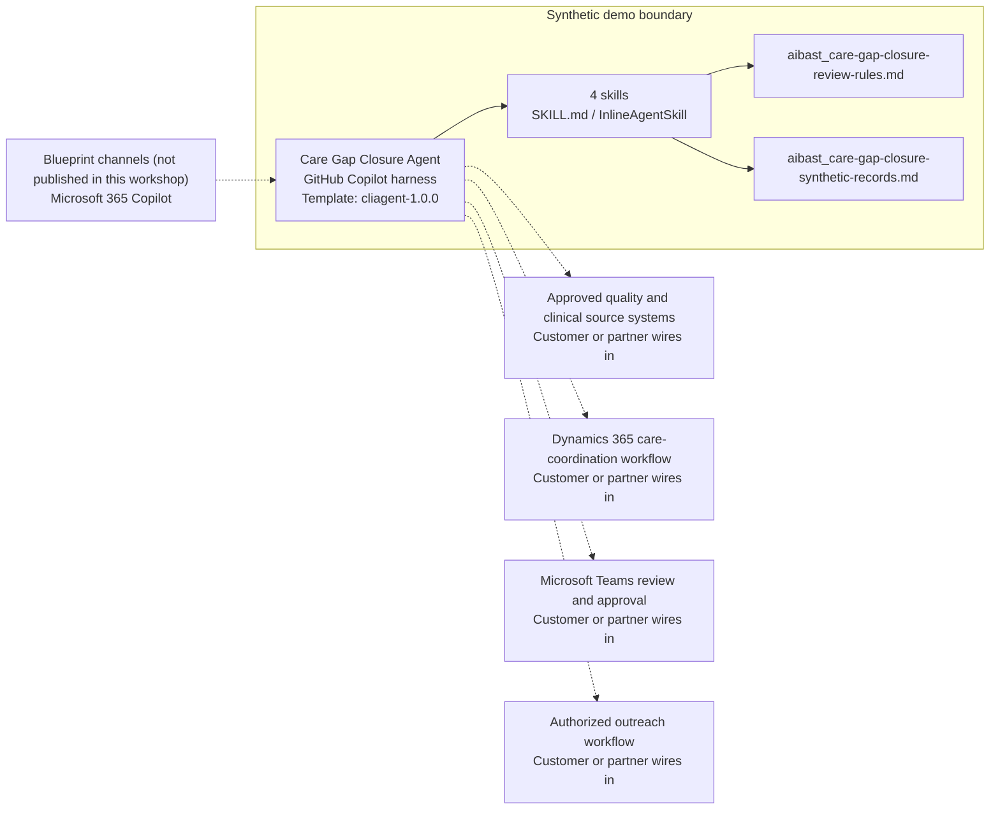

<!-- Generated by tools/build_solution_runbooks.py. Do not edit; change the sources and regenerate. -->

# Care Gap Closure Agent — Architecture

## Solution Architecture

### Logical architecture and trust boundary

Solid: synthetic design. Dashed: unwired customer systems; channels unpublished.

## Component Responsibilities

| Operation | Capability | Purpose | Owner |
| --- | --- | --- | --- |
| gap_analysis | Source-evidence gap analysis | Summarizes aggregate synthetic source counts and limitations without deciding measure eligibility. | Template |
| cohort_review | Aggregate cohort review | Organizes operational evidence-review cohorts without clinical risk scoring. | Template |
| outreach_draft | Unsent outreach draft | Drafts privacy-aware language but does not contact anyone. | Template |
| quality_dashboard | Qualitative quality dashboard | Shows source-completeness signals for quality and clinical validation. | Template |

| Runtime reference | Recorded value |
| --- | --- |
| Portable implementation | [care_gap_closure_agent.py](../../agents/@aibast-agents-library/healthcare_stacks/care_gap_closure_stack/care_gap_closure_agent.py) |
| Expected tool | CareGapClosureAgent |
| Source SHA-256 (short) | c47d4fd5aba1 |

## Data Contract

Approve field meaning, usage and retention before replacing synthetic examples.

| Entity | Fields the template uses | Used by | Customer system of record | Sensitivity |
| --- | --- | --- | --- | --- |
| Synthetic quality measures | ID; Name; Source population; Source-recorded closed; Records requiring evidence review; Source-recorded closed rate; Evidence as of; Exact limitation | gap_analysis; quality_dashboard; outreach_draft | Approved quality and clinical source systems | Aggregate health-quality data; never identify an individual. |
| Synthetic operational cohorts | Source key; Display heading; Synthetic count; Exact evidence barrier; Exact draft handling route | cohort_review | Dynamics 365 care-coordination workflow | Aggregate operational triage, not clinical risk scoring. |

## Integration Points

**State: Not connected in the template.**

| System | Purpose | Skills that need it | Access | Template provides | Customer or partner wires in |
| --- | --- | --- | --- | --- | --- |
| Approved quality and clinical source systems | Validated measure definitions, exclusions, claims, labs, attribution and evidence. | care-gap-closure-gap-analysis; care-gap-closure-quality-dashboard | read | Aggregate synthetic measures with exact limitations; no patient-level data. | [Wiring procedure](3.Runbook.md#step-3-1-integrate-approved-quality-and-clinical-source-systems) |
| Dynamics 365 care-coordination workflow | Governed care-coordination context. | care-gap-closure-cohort-review; care-gap-closure-outreach-draft | read | Cohort and draft-route contracts backed by synthetic aggregates; no live connection or write permission. | [Wiring procedure](3.Runbook.md#step-3-2-integrate-dynamics-365-care-coordination-workflow) |
| Microsoft Teams review and approval | Clinician and care-team review collaboration. | care-gap-closure-cohort-review; care-gap-closure-outreach-draft | read | Review gates only; no message or approval request is sent. | [Wiring procedure](3.Runbook.md#step-3-3-integrate-microsoft-teams-review-and-approval) |
| Authorized outreach workflow | Operator outreach after consent, preference, accessibility, privacy and clinical review. | care-gap-closure-outreach-draft | write | An unsent draft, eligibility prohibition and approval route; no outreach tool. | [Wiring procedure](3.Runbook.md#step-3-4-integrate-authorized-outreach-workflow) |

## Identity and Permissions

| Template default | Customer or partner decision |
| --- | --- |
| Authentication: Microsoft Entra ID authentication; the customer configures the supported mode for the intended care-team channel. | Confirm tenant, permitted identities and authentication enforcement. |
| Audience: Quality Manager; Care Coordinator; Clinical Operations Lead | Define authorized users, groups and least-privilege connection identities. |

- Require sign-in before accessing any health-quality information.
- Request only the read scopes necessary for approved quality and care-coordination sources.
- Restrict the care-team audience and verify access with authorized and denied identities.

## Copilot Studio Components

Copilot Studio uses the GitHub Copilot harness; skills hold reviewed behavior.

Agent metadata from [settings.mcs.yml](../../solutions/care-gap-closure/copilot-studio/settings.mcs.yml):

| Setting | Recorded value |
| --- | --- |
| Template | cliagent-1.0.0 |
| Recognizer | CLICopilotRecognizer |
| Authoring model | CliCopilot |
| Model | Sonnet46 |

### Skill inventory

One skill per row: manual upload and source-controlled form.

| Skill | Manual upload | Source component |
| --- | --- | --- |
| care-gap-closure-cohort-review | [SKILL.md](../../solutions/care-gap-closure/manual/skills/cohort-review/SKILL.md) | [InlineAgentSkill](../../solutions/care-gap-closure/copilot-studio/behaviors/aibast_care-gap-closure-cohort-review.mcs.yml) |
| care-gap-closure-gap-analysis | [SKILL.md](../../solutions/care-gap-closure/manual/skills/gap-analysis/SKILL.md) | [InlineAgentSkill](../../solutions/care-gap-closure/copilot-studio/behaviors/aibast_care-gap-closure-gap-analysis.mcs.yml) |
| care-gap-closure-outreach-draft | [SKILL.md](../../solutions/care-gap-closure/manual/skills/outreach-draft/SKILL.md) | [InlineAgentSkill](../../solutions/care-gap-closure/copilot-studio/behaviors/aibast_care-gap-closure-outreach-draft.mcs.yml) |
| care-gap-closure-quality-dashboard | [SKILL.md](../../solutions/care-gap-closure/manual/skills/quality-dashboard/SKILL.md) | [InlineAgentSkill](../../solutions/care-gap-closure/copilot-studio/behaviors/aibast_care-gap-closure-quality-dashboard.mcs.yml) |

### Knowledge inventory

| Knowledge file | Upload | Source / metadata |
| --- | --- | --- |
| aibast_care-gap-closure-review-rules.md | [Content](../../solutions/care-gap-closure/manual/knowledge/aibast_care-gap-closure-review-rules.md) | [Source copy](../../solutions/care-gap-closure/copilot-studio/capabilities/knowledge/files/aibast_care-gap-closure-review-rules.md) · [Metadata](../../solutions/care-gap-closure/copilot-studio/capabilities/knowledge/files/aibast_care-gap-closure-review-rules.md.mcs.yml) |
| aibast_care-gap-closure-synthetic-records.md | [Content](../../solutions/care-gap-closure/manual/knowledge/aibast_care-gap-closure-synthetic-records.md) | [Source copy](../../solutions/care-gap-closure/copilot-studio/capabilities/knowledge/files/aibast_care-gap-closure-synthetic-records.md) · [Metadata](../../solutions/care-gap-closure/copilot-studio/capabilities/knowledge/files/aibast_care-gap-closure-synthetic-records.md.mcs.yml) |

## State and Recovery

| Recovery ID | Condition | Required behavior | Owner |
| --- | --- | --- | --- |
| evidence-no-mockups | A required evidence file is missing | Stop. Capture or restore the real file; never substitute a mockup. | Template |
| failed-case-no-cherry-picking | A recorded identifier is absent | Mark the case failed and investigate; do not retry until it happens to pass. | Template |
| draft-publication-stop | Publish is offered | Stop at Draft unless a separate approver explicitly authorizes publication. | Template |
| care-system-unavailable | A wired quality or care-coordination system returns no verified result | Report unavailable evidence; never claim a lookup, contact or record change succeeded. | Customer or partner |
| measure-unknown | A requested measure identifier is not in the snapshot | State that no synthetic measure matched; never substitute another record. | Template |
| clinical-request-stop | Live patient data, eligibility, clinical judgment, contact, scheduling, submission or a record change is requested | Stop and route the request to quality or clinical review. | Template |

Promotion requires separate approval. [Package recovery guide](../../solutions/care-gap-closure/FIELD-GUIDE.md#failure-recovery).

## Design Decisions

| Decision | Reason |
| --- | --- |
| Report source-evidence queues, not eligible populations. | Quality reviewers validate measure eligibility and exclusions in approved systems. |
| Bound advertised claims to evidence the package implements. | Risk stratification became operational cohorts, and outreach launch was excluded. |
| Draft outreach but never send it. | Consent, preference, accessibility, privacy and clinical review precede any operator action. |
| Fail closed on unknown measures. | No match is returned rather than substituting, browsing, enriching or inventing evidence. |
| Use exact assertions, not a quality-score substitute. | General quality in Evaluate (preview) does not compare responses to expected answers. |

## Non-Functional Considerations

| Area | Customer or partner confirms |
| --- | --- |
| Licensing and Copilot Credits | Confirm tenant licensing and budget credits for building, Preview, evaluation and production quality-review use. |
| Capacity | Allocate approved capacity to the care-gap environment and monitor consumption before widening the audience. |
| Data residency | Approve the environment geography and any cross-region processing of health-quality data before connecting sources. |
| Retention | Decide whether care-team transcripts are saved, who can view or download them, and the Dataverse retention policy. |
| Cost drivers | Measure model-token, knowledge/tool and harness usage by workload; do not infer production cost from the synthetic demo. |

## Next

→ [Delivery runbook](3.Runbook.md) | [Solution index](../README.md)

[Sources for this page](0.Resources/README.md#sources-2architecturemd).
