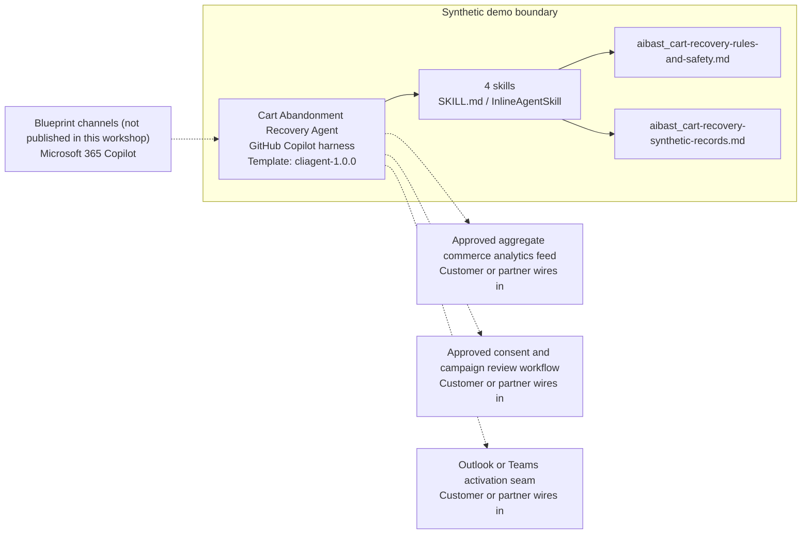

<!-- Generated by tools/build_solution_runbooks.py. Do not edit; change the sources and regenerate. -->

# Cart Abandonment Recovery Agent — Architecture

## Solution Architecture

### Logical architecture and trust boundary

Solid: synthetic design. Dashed: unwired customer systems; channels unpublished.

## Component Responsibilities

| Operation | Capability | Purpose | Owner |
| --- | --- | --- | --- |
| abandonment_analysis | Anonymous abandonment analysis | Finds aggregate exit and value patterns without identifying or contacting a shopper. | Template |
| recovery_campaign | Consent-aware campaign draft | Outlines review-only channel timing and neutral content concepts. | Template |
| incentive_optimization | Margin-aware incentive scenarios | Compares optional value concepts without issuing an offer. | Template |
| conversion_tracking | Synthetic conversion review | Summarizes fixed recovery metrics and planning assumptions. | Template |

| Runtime reference | Recorded value |
| --- | --- |
| Portable implementation | [cart_abandonment_recovery_agent.py](../../agents/@aibast-agents-library/b2c_sales_stacks/cart_abandonment_recovery_stack/cart_abandonment_recovery_agent.py) |
| Expected tool | CartAbandonmentRecoveryAgent |
| Source SHA-256 (short) | b7e795aa8817 |

## Data Contract

Approve field meaning, usage and retention before replacing synthetic examples.

| Entity | Fields the template uses | Used by | Customer system of record | Sensitivity |
| --- | --- | --- | --- | --- |
| ABANDONED_CARTS | shopper_label; contactable; segment; items; cart_value; abandoned_at; page_exit; device; prior_purchases; recovery_status | abandonment_analysis; recovery_campaign; incentive_optimization; conversion_tracking | Approved aggregate commerce analytics feed | Shopper behavior; keep anonymous and never identify or contact a shopper. |
| RECOVERY_CAMPAIGNS | name; delay_hours; subject; incentive; avg_open_rate; avg_conversion | recovery_campaign; conversion_tracking | Approved consent and campaign review workflow | Draft campaign concepts and benchmarks, not live performance. |
| INCENTIVE_OPTIONS | description; cost_margin_impact; conversion_lift | incentive_optimization | Customer or partner maps | Commercial margin data; options for approval, never issued offers. |
| CONVERSION_METRICS | overall_abandonment_rate; recovery_rate; avg_recovered_value; total_abandoned_30d; total_recovered_30d; total_recovered_revenue_30d | abandonment_analysis; conversion_tracking | Approved aggregate commerce analytics feed | Aggregate commercial metrics; synthetic values are not results. |

## Integration Points

**State: Not connected in the template.**

| System | Purpose | Skills that need it | Access | Template provides | Customer or partner wires in |
| --- | --- | --- | --- | --- | --- |
| Approved aggregate commerce analytics feed | Aggregate cart and conversion inputs. | anonymous-cart-abandonment-analysis; margin-aware-incentive-scenarios; synthetic-recovery-conversion-tracking | read | Anonymous cart and metric contracts backed by fixed synthetic records; no live feed. | [Wiring procedure](3.Runbook.md#step-3-1-integrate-approved-aggregate-commerce-analytics-feed) |
| Approved consent and campaign review workflow | Consent and approval before any campaign or incentive leaves planning. | consent-aware-recovery-campaign-draft; margin-aware-incentive-scenarios | read-write | Draft sequences and incentive scenarios marked for approval; no activation tool. | [Wiring procedure](3.Runbook.md#step-3-2-integrate-approved-consent-and-campaign-review-workflow) |
| Outlook or Teams activation seam | Activation only after separate approval and implementation. | consent-aware-recovery-campaign-draft | write | Draft subject concepts and channel sequence only; nothing is sent or scheduled. | [Wiring procedure](3.Runbook.md#step-3-3-integrate-outlook-or-teams-activation-seam) |

## Identity and Permissions

| Template default | Customer or partner decision |
| --- | --- |
| Authentication: Microsoft Entra ID authentication; the customer configures the supported mode for the intended marketing channel. | Confirm tenant, permitted identities and authentication enforcement. |
| Audience: Marketing Manager; Digital Marketing Lead; Growth Manager | Define authorized users, groups and least-privilege connection identities. |

- Require sign-in before accessing commerce analytics.
- Request only aggregate read scopes for approved sources.
- Restrict the marketing audience and verify access with authorized and denied identities.

## Copilot Studio Components

Copilot Studio uses the GitHub Copilot harness; skills hold reviewed behavior.

Agent metadata from [settings.mcs.yml](../../solutions/cart-abandonment-recovery/copilot-studio/settings.mcs.yml):

| Setting | Recorded value |
| --- | --- |
| Template | cliagent-1.0.0 |
| Recognizer | CLICopilotRecognizer |
| Authoring model | CliCopilot |
| Model | Sonnet46 |

### Skill inventory

One skill per row: manual upload and source-controlled form.

| Skill | Manual upload | Source component |
| --- | --- | --- |
| anonymous-cart-abandonment-analysis | [SKILL.md](../../solutions/cart-abandonment-recovery/manual/skills/abandonment-analysis/SKILL.md) | [InlineAgentSkill](../../solutions/cart-abandonment-recovery/copilot-studio/behaviors/aibast_anonymous-cart-abandonment-analysis.mcs.yml) |
| consent-aware-recovery-campaign-draft | [SKILL.md](../../solutions/cart-abandonment-recovery/manual/skills/recovery-campaign/SKILL.md) | [InlineAgentSkill](../../solutions/cart-abandonment-recovery/copilot-studio/behaviors/aibast_consent-aware-recovery-campaign-draft.mcs.yml) |
| margin-aware-incentive-scenarios | [SKILL.md](../../solutions/cart-abandonment-recovery/manual/skills/incentive-optimization/SKILL.md) | [InlineAgentSkill](../../solutions/cart-abandonment-recovery/copilot-studio/behaviors/aibast_margin-aware-incentive-scenarios.mcs.yml) |
| synthetic-recovery-conversion-tracking | [SKILL.md](../../solutions/cart-abandonment-recovery/manual/skills/conversion-tracking/SKILL.md) | [InlineAgentSkill](../../solutions/cart-abandonment-recovery/copilot-studio/behaviors/aibast_synthetic-recovery-conversion-tracking.mcs.yml) |

### Knowledge inventory

| Knowledge file | Upload | Source / metadata |
| --- | --- | --- |
| aibast_cart-recovery-rules-and-safety.md | [Content](../../solutions/cart-abandonment-recovery/manual/knowledge/aibast_cart-recovery-rules-and-safety.md) | [Source copy](../../solutions/cart-abandonment-recovery/copilot-studio/capabilities/knowledge/files/aibast_cart-recovery-rules-and-safety.md) · [Metadata](../../solutions/cart-abandonment-recovery/copilot-studio/capabilities/knowledge/files/aibast_cart-recovery-rules-and-safety.md.mcs.yml) |
| aibast_cart-recovery-synthetic-records.md | [Content](../../solutions/cart-abandonment-recovery/manual/knowledge/aibast_cart-recovery-synthetic-records.md) | [Source copy](../../solutions/cart-abandonment-recovery/copilot-studio/capabilities/knowledge/files/aibast_cart-recovery-synthetic-records.md) · [Metadata](../../solutions/cart-abandonment-recovery/copilot-studio/capabilities/knowledge/files/aibast_cart-recovery-synthetic-records.md.mcs.yml) |

## State and Recovery

| Recovery ID | Condition | Required behavior | Owner |
| --- | --- | --- | --- |
| evidence-no-mockups | A required evidence file is missing | Stop. Capture or restore the real file; never substitute a mockup. | Template |
| failed-case-no-cherry-picking | A recorded identifier is absent | Mark the case failed and investigate; do not retry until it happens to pass. | Template |
| draft-publication-stop | Publish is offered | Stop at Draft unless a separate approver explicitly authorizes publication. | Template |
| commerce-source-unavailable | A wired analytics feed or review workflow returns no verified result | Report unavailable evidence; never claim a lookup, send or approval succeeded. | Customer or partner |
| cart-id-unknown | An unknown cart identifier is supplied | Stop and request a valid synthetic identifier; do not approximate. | Template |
| cart-grounding-unavailable | The required skill or its knowledge cannot load | Retry once in the same turn, then say so and stop without an uncited answer. | Template |

Promotion requires separate approval. [Package recovery guide](../../solutions/cart-abandonment-recovery/FIELD-GUIDE.md#failure-recovery).

## Design Decisions

| Decision | Reason |
| --- | --- |
| Work only from anonymous carts and aggregate metrics. | Shopper identification, live lookups and identity stitching are excluded. |
| Present incentives as scenarios for approval. | No coupon, discount, gift, shipping benefit or reward is created. |
| Keep write actions out of the agent. | Future writes require authenticated tools, authorization checks, explicit human approval and an audit log. |
| Use exact assertions, not a quality-score substitute. | General quality in Evaluate (preview) does not compare responses to expected answers. |

## Non-Functional Considerations

| Area | Customer or partner confirms |
| --- | --- |
| Licensing and Copilot Credits | Confirm tenant licensing and budget credits for building, Preview, evaluation and production marketing use. |
| Capacity | Allocate approved capacity to the marketing environment and monitor consumption before widening the audience. |
| Data residency | Approve the environment geography and any cross-region processing of commerce data before connecting sources. |
| Retention | Decide whether marketing transcripts are saved, who can view or download them, and the Dataverse retention policy. |
| Cost drivers | Measure model-token, knowledge/tool and harness usage by workload; do not infer production cost from the synthetic demo. |

## Next

→ [Delivery runbook](3.Runbook.md) | [Solution index](../README.md)

[Sources for this page](0.Resources/README.md#sources-2architecturemd).
