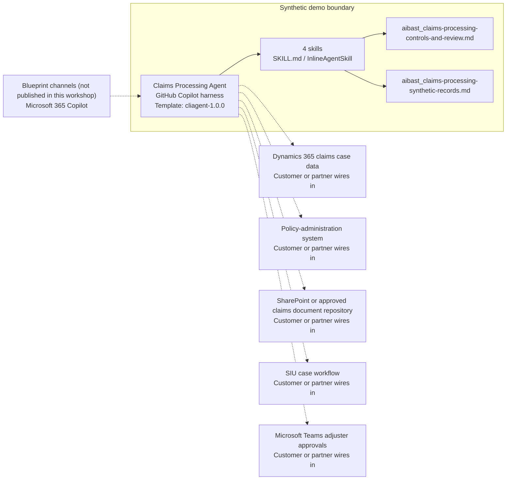

<!-- Generated by tools/build_solution_runbooks.py. Do not edit; change the sources and regenerate. -->

# Claims Processing Agent — Architecture

## Solution Architecture

### Logical architecture and trust boundary

Solid: synthetic design. Dashed: unwired customer systems; channels unpublished.

## Component Responsibilities

| Operation | Capability | Purpose | Owner |
| --- | --- | --- | --- |
| claim_intake | Claims intake triage | Summarizes fictional claims by loss, amount, status, and fraud-review score. | Template |
| adjudication_review | Claim-file readiness | Combines policy terms, loss evidence, documents, and adjuster notes for human review. | Template |
| fraud_flag | SIU indicator review | Surfaces explainable fraud indicators without declaring fraud or changing coverage. | Template |
| settlement_recommendation | Policy-term settlement estimate | Calculates a nonbinding coverage-limit and deductible estimate without approving, denying, reserving, settling, or paying. | Template |

| Runtime reference | Recorded value |
| --- | --- |
| Portable implementation | [claims_processing_agent.py](../../agents/@aibast-agents-library/financial_services_stacks/claims_processing_stack/claims_processing_agent.py) |
| Expected tool | ClaimsProcessingAgent |
| Source SHA-256 (short) | 1239dd5f2cbf |

## Data Contract

Approve field meaning, usage and retention before replacing synthetic examples.

| Entity | Fields the template uses | Used by | Customer system of record | Sensitivity |
| --- | --- | --- | --- | --- |
| CLAIMS | claimant; policy_number; policy_type; loss_type; date_of_loss; date_filed; claimed_amount; description; status; fraud_score; adjuster; supporting_docs | claim_intake; adjudication_review; fraud_flag; settlement_recommendation | Dynamics 365 claims case data | Claimant personal and loss data; restrict to authorized claims staff. |
| POLICY_DETAILS | coverage_limit; deductible; effective; expiry; premium_annual | adjudication_review; settlement_recommendation | Policy-administration system | Policyholder contract terms; coverage decisions stay with coverage authority. |
| FRAUD_INDICATORS | description; weight | fraud_flag | Customer or partner maps | Heuristic weights; a score is never proof of fraud. |

## Integration Points

**State: Not connected in the template.**

| System | Purpose | Skills that need it | Access | Template provides | Customer or partner wires in |
| --- | --- | --- | --- | --- | --- |
| Dynamics 365 claims case data | Claim case context. | claim-intake; adjudication-review; fraud-flag; settlement-recommendation | read | Claim fields and routing contracts backed by four fictional claims; no case mutation. | [Wiring procedure](3.Runbook.md#step-3-1-integrate-dynamics-365-claims-case-data) |
| Policy-administration system | Policy terms and coverage evidence. | adjudication-review; settlement-recommendation | read | Coverage limit, deductible and term fields from fictional policies; estimates only. | [Wiring procedure](3.Runbook.md#step-3-2-integrate-policy-administration-system) |
| SharePoint or approved claims document repository | Supporting documents and file evidence. | adjudication-review; fraud-flag | read | Synthetic document lists and adjuster notes; missing documents are reported, never requested. | [Wiring procedure](3.Runbook.md#step-3-3-integrate-sharepoint-or-approved-claims-document-repository) |
| SIU case workflow | Investigator review and referral handling. | fraud-flag | read | SIU review candidates and indicator explanations; no case is opened or closed. | [Wiring procedure](3.Runbook.md#step-3-4-integrate-siu-case-workflow) |
| Microsoft Teams adjuster approvals | Collaboration for human claim decisions. | adjudication-review; settlement-recommendation | read-write | Review steps only; no message, approval request or claim action. | [Wiring procedure](3.Runbook.md#step-3-5-integrate-microsoft-teams-adjuster-approvals) |

## Identity and Permissions

| Template default | Customer or partner decision |
| --- | --- |
| Authentication: Microsoft Entra ID authentication; the customer configures the supported mode for the intended claims channel. | Confirm tenant, permitted identities and authentication enforcement. |
| Audience: Claims Adjusters / Managers; SIU Teams; Operations Leaders | Define authorized users, groups and least-privilege connection identities. |

- Require sign-in before accessing claimant, policy or SIU information.
- Request only the scopes necessary for approved claims sources.
- Restrict the claims audience and verify access with authorized and denied identities.

## Copilot Studio Components

Copilot Studio uses the GitHub Copilot harness; skills hold reviewed behavior.

Agent metadata from [settings.mcs.yml](../../solutions/claims-processing/copilot-studio/settings.mcs.yml):

| Setting | Recorded value |
| --- | --- |
| Template | cliagent-1.0.0 |
| Recognizer | CLICopilotRecognizer |
| Authoring model | CliCopilot |
| Model | Sonnet46 |

### Skill inventory

One skill per row: manual upload and source-controlled form.

| Skill | Manual upload | Source component |
| --- | --- | --- |
| adjudication-review | [SKILL.md](../../solutions/claims-processing/manual/skills/aibast_adjudication-review_02/SKILL.md) | [InlineAgentSkill](../../solutions/claims-processing/copilot-studio/behaviors/aibast_adjudication-review.mcs.yml) |
| claim-intake | [SKILL.md](../../solutions/claims-processing/manual/skills/aibast_claim-intake_01/SKILL.md) | [InlineAgentSkill](../../solutions/claims-processing/copilot-studio/behaviors/aibast_claim-intake.mcs.yml) |
| fraud-flag | [SKILL.md](../../solutions/claims-processing/manual/skills/aibast_fraud-flag_03/SKILL.md) | [InlineAgentSkill](../../solutions/claims-processing/copilot-studio/behaviors/aibast_fraud-flag.mcs.yml) |
| settlement-recommendation | [SKILL.md](../../solutions/claims-processing/manual/skills/aibast_settlement-recommendation_04/SKILL.md) | [InlineAgentSkill](../../solutions/claims-processing/copilot-studio/behaviors/aibast_settlement-recommendation.mcs.yml) |

### Knowledge inventory

| Knowledge file | Upload | Source / metadata |
| --- | --- | --- |
| aibast_claims-processing-controls-and-review.md | [Content](../../solutions/claims-processing/manual/knowledge/aibast_claims-processing-controls-and-review.md) | [Source copy](../../solutions/claims-processing/copilot-studio/capabilities/knowledge/files/aibast_claims-processing-controls-and-review.md) · [Metadata](../../solutions/claims-processing/copilot-studio/capabilities/knowledge/files/aibast_claims-processing-controls-and-review.md.mcs.yml) |
| aibast_claims-processing-synthetic-records.md | [Content](../../solutions/claims-processing/manual/knowledge/aibast_claims-processing-synthetic-records.md) | [Source copy](../../solutions/claims-processing/copilot-studio/capabilities/knowledge/files/aibast_claims-processing-synthetic-records.md) · [Metadata](../../solutions/claims-processing/copilot-studio/capabilities/knowledge/files/aibast_claims-processing-synthetic-records.md.mcs.yml) |

## State and Recovery

| Recovery ID | Condition | Required behavior | Owner |
| --- | --- | --- | --- |
| evidence-no-mockups | A required evidence file is missing | Stop. Capture or restore the real file; never substitute a mockup. | Template |
| failed-case-no-cherry-picking | A recorded identifier is absent | Mark the case failed and investigate; do not retry until it happens to pass. | Template |
| draft-publication-stop | Publish is offered | Stop at Draft unless a separate approver explicitly authorizes publication. | Template |
| claims-system-unavailable | A wired claims, policy or document system returns no verified result | Report unavailable evidence; never claim a lookup, referral or claim change succeeded. | Customer or partner |
| claim-id-unknown | An unknown claim identifier is supplied | Reject it; never substitute another record or fabricate evidence. | Template |
| claims-evidence-absent | A document, coverage term or causation fact is missing | Report it as absent; never fill the gap from general knowledge. | Template |

Promotion requires separate approval. [Package recovery guide](../../solutions/claims-processing/FIELD-GUIDE.md#failure-recovery).

## Design Decisions

| Decision | Reason |
| --- | --- |
| Separate facts, calculations, indicators and proposed steps. | Adjusters must see recorded evidence apart from heuristics before any regulated decision. |
| Treat fraud scores as review indicators only. | SIU keeps the authority to investigate and determine findings. |
| Keep settlement output a nonbinding estimate. | Approval, denial, reserving, settlement and payment stay with authorized claims professionals. |
| Fail closed on unknown claim identifiers. | Substituting another record or fabricating evidence would misstate a claim file. |
| Use exact assertions, not a quality-score substitute. | General quality in Evaluate (preview) does not compare responses to expected answers. |

## Non-Functional Considerations

| Area | Customer or partner confirms |
| --- | --- |
| Licensing and Copilot Credits | Confirm tenant licensing and budget credits for building, Preview, evaluation and production claims use. |
| Capacity | Allocate approved capacity to the claims environment and monitor consumption before widening the audience. |
| Data residency | Approve the environment geography and any cross-region processing of claimant and policy data before connecting sources. |
| Retention | Decide whether claims transcripts are saved, who can view or download them, and the Dataverse retention policy. |
| Cost drivers | Measure model-token, knowledge/tool and harness usage by workload; do not infer production cost from the synthetic demo. |

## Next

→ [Delivery runbook](3.Runbook.md) | [Solution index](../README.md)

[Sources for this page](0.Resources/README.md#sources-2architecturemd).
