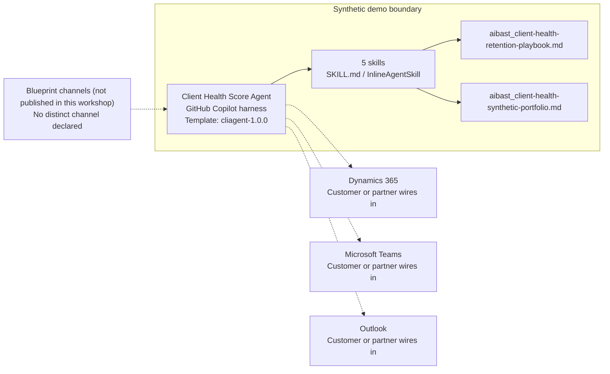

<!-- Generated by tools/build_solution_runbooks.py. Do not edit; change the sources and regenerate. -->

# Client Health Score Agent — Architecture

## Solution Architecture

### Logical architecture and trust boundary

Solid: synthetic design. Dashed: unwired customer systems; channels unpublished.

## Component Responsibilities

| Operation | Capability | Purpose | Owner |
| --- | --- | --- | --- |
| health_dashboard | Portfolio health segmentation | Ranks relationship health and clearly labels scenario churn indicators. | Template |
| engagement_analysis | Engagement signal analysis | Connects executive contact, escalations, billing direction, and utilization. | Template |
| satisfaction_trend | Satisfaction trend review | Shows which relationships are improving, stable, or declining. | Template |
| at_risk_clients | At-risk account prioritization | Explains the drivers and first recovery actions for accounts needing intervention. | Template |
| retention_plan | Stakeholder-led retention planning | Creates account-specific ownership, preparation, engagement, and approval gates. | Template |

| Runtime reference | Recorded value |
| --- | --- |
| Portable implementation | [client_health_score_agent.py](../../agents/@aibast-agents-library/professional_services_stacks/client_health_score_stack/client_health_score_agent.py) |
| Expected tool | ClientHealthScoreAgent |
| Source SHA-256 (short) | e124cf169075 |

## Data Contract

Approve field meaning, usage and retention before replacing synthetic examples.

| Entity | Fields the template uses | Used by | Customer system of record | Sensitivity |
| --- | --- | --- | --- | --- |
| Complete client records | ID; Client; Annual value; Health; NPS; Margin; Utilization; Billing; Escalations 90d; Exec meetings 90d; Q1; Q2; Q3; Q4; Segment | health_dashboard; engagement_analysis; satisfaction_trend; at_risk_clients | Dynamics 365 | Client commercial and satisfaction data; restrict to the account team. |
| Churn Indicator rule | Health score; Synthetic indicator | health_dashboard; at_risk_clients | Customer or partner maps | Scenario indicator bands, not validated predictions. |
| At-Risk Client Report | Client; ID; Health; Segment; Annual value; Churn probability; NPS; Trend; Escalations 90d; Exec meetings 90d | at_risk_clients | Customer or partner maps | Derived report; the churn column is a scenario indicator, not a prediction. |
| Complete stakeholder records | Client; ID; Executive sponsor; Account owner; Delivery lead; Next engagement | retention_plan | Dynamics 365 | Client-contact and staff names; minimum disclosure to the account team. |

## Integration Points

**State: Not connected in the template.**

| System | Purpose | Skills that need it | Access | Template provides | Customer or partner wires in |
| --- | --- | --- | --- | --- | --- |
| Dynamics 365 | Governed account context. | client-portfolio-health-dashboard; client-engagement-analysis; client-satisfaction-trend; at-risk-client-prioritization; client-retention-playbook | read | Client, signal and stakeholder contracts backed by a frozen synthetic portfolio; no CRM mutation. | [Wiring procedure](3.Runbook.md#step-3-1-integrate-dynamics-365) |
| Microsoft Teams | Internal account-team coordination. | at-risk-client-prioritization; client-retention-playbook | read-write | Proposals and approval gates only; no message, task or client outreach. | [Wiring procedure](3.Runbook.md#step-3-2-integrate-microsoft-teams) |
| Outlook | Reviewed executive engagement. | client-retention-playbook | write | Proposed engagements only; no email, calendar event or invitation is created. | [Wiring procedure](3.Runbook.md#step-3-3-integrate-outlook) |

## Identity and Permissions

| Template default | Customer or partner decision |
| --- | --- |
| Authentication: Microsoft Entra ID authentication; the customer configures the supported mode for the intended account-team channel. | Confirm tenant, permitted identities and authentication enforcement. |
| Audience: Client Success Leader; Account Manager; Client Experience Director | Define authorized users, groups and least-privilege connection identities. |

- Require sign-in before accessing client, contact or satisfaction information.
- Request only the scopes necessary for approved account sources.
- Restrict the account-team audience and verify access with authorized and denied identities.

## Copilot Studio Components

Copilot Studio uses the GitHub Copilot harness; skills hold reviewed behavior.

Agent metadata from [settings.mcs.yml](../../solutions/client-health-score/copilot-studio/settings.mcs.yml):

| Setting | Recorded value |
| --- | --- |
| Template | cliagent-1.0.0 |
| Recognizer | CLICopilotRecognizer |
| Authoring model | CliCopilot |
| Model | Sonnet46 |

### Skill inventory

One skill per row: manual upload and source-controlled form.

| Skill | Manual upload | Source component |
| --- | --- | --- |
| at-risk-client-prioritization | [SKILL.md](../../solutions/client-health-score/manual/skills/at-risk-clients/SKILL.md) | [InlineAgentSkill](../../solutions/client-health-score/copilot-studio/behaviors/aibast_at-risk-client-prioritization.mcs.yml) |
| client-engagement-analysis | [SKILL.md](../../solutions/client-health-score/manual/skills/engagement-analysis/SKILL.md) | [InlineAgentSkill](../../solutions/client-health-score/copilot-studio/behaviors/aibast_client-engagement-analysis.mcs.yml) |
| client-portfolio-health-dashboard | [SKILL.md](../../solutions/client-health-score/manual/skills/health-dashboard/SKILL.md) | [InlineAgentSkill](../../solutions/client-health-score/copilot-studio/behaviors/aibast_client-portfolio-health-dashboard.mcs.yml) |
| client-retention-playbook | [SKILL.md](../../solutions/client-health-score/manual/skills/retention-plan/SKILL.md) | [InlineAgentSkill](../../solutions/client-health-score/copilot-studio/behaviors/aibast_client-retention-playbook.mcs.yml) |
| client-satisfaction-trend | [SKILL.md](../../solutions/client-health-score/manual/skills/satisfaction-trend/SKILL.md) | [InlineAgentSkill](../../solutions/client-health-score/copilot-studio/behaviors/aibast_client-satisfaction-trend.mcs.yml) |

### Knowledge inventory

| Knowledge file | Upload | Source / metadata |
| --- | --- | --- |
| aibast_client-health-retention-playbook.md | [Content](../../solutions/client-health-score/manual/knowledge/aibast_client-health-retention-playbook.md) | [Source copy](../../solutions/client-health-score/copilot-studio/capabilities/knowledge/files/aibast_client-health-retention-playbook.md) · [Metadata](../../solutions/client-health-score/copilot-studio/capabilities/knowledge/files/aibast_client-health-retention-playbook.md.mcs.yml) |
| aibast_client-health-synthetic-portfolio.md | [Content](../../solutions/client-health-score/manual/knowledge/aibast_client-health-synthetic-portfolio.md) | [Source copy](../../solutions/client-health-score/copilot-studio/capabilities/knowledge/files/aibast_client-health-synthetic-portfolio.md) · [Metadata](../../solutions/client-health-score/copilot-studio/capabilities/knowledge/files/aibast_client-health-synthetic-portfolio.md.mcs.yml) |

## State and Recovery

| Recovery ID | Condition | Required behavior | Owner |
| --- | --- | --- | --- |
| evidence-no-mockups | A required evidence file is missing | Stop. Capture or restore the real file; never substitute a mockup. | Template |
| failed-case-no-cherry-picking | A recorded identifier is absent | Mark the case failed and investigate; do not retry until it happens to pass. | Template |
| draft-publication-stop | Publish is offered | Stop at Draft unless a separate approver explicitly authorizes publication. | Template |
| client-system-unavailable | A wired CRM, Teams or Outlook system returns no verified result | Report unavailable evidence; never claim a lookup, message or record change succeeded. | Customer or partner |
| client-value-missing | A requested value is not in either packaged file | Omit it and state the narrow limitation; do not infer, browse or substitute. | Template |
| client-grounding-unavailable | The required skill or its knowledge cannot load | Retry once in the same turn, then say so and stop without an uncited answer. | Template |

Promotion requires separate approval. [Package recovery guide](../../solutions/client-health-score/FIELD-GUIDE.md#failure-recovery).

## Design Decisions

| Decision | Reason |
| --- | --- |
| Label health and churn values as scenario indicators. | They are deterministic pilot rules, not validated predictions or statements of certainty. |
| Reproduce the locked engagement and playbook responses verbatim. | Added dates, metrics, rankings or causal links would exceed the packaged evidence. |
| Gate every plan behind the account owner. | The account owner reviews each plan before any client outreach. |
| Use the matching skill before any generic helper. | A generic helper may support, but never replace, the uploaded engagement or playbook skill. |
| Use exact assertions, not a quality-score substitute. | General quality in Evaluate (preview) does not compare responses to expected answers. |

## Non-Functional Considerations

| Area | Customer or partner confirms |
| --- | --- |
| Licensing and Copilot Credits | Confirm tenant licensing and budget credits for building, Preview, evaluation and production account-team use. |
| Capacity | Allocate approved capacity to the client-health environment and monitor consumption before widening the audience. |
| Data residency | Approve the environment geography and any cross-region processing of client and contact data before connecting sources. |
| Retention | Decide whether account-team transcripts are saved, who can view or download them, and the Dataverse retention policy. |
| Cost drivers | Measure model-token, knowledge/tool and harness usage by workload; do not infer production cost from the synthetic demo. |

## Next

→ [Delivery runbook](3.Runbook.md) | [Solution index](../README.md)

[Sources for this page](0.Resources/README.md#sources-2architecturemd).
