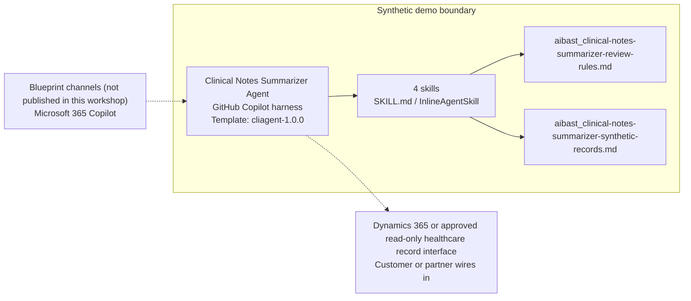

<!-- Generated by tools/build_solution_runbooks.py. Do not edit; change the sources and regenerate. -->

# Clinical Notes Summarizer Agent — Architecture

## Solution Architecture

### Logical architecture and trust boundary

Solid: synthetic design. Dashed: unwired customer systems; channels unpublished.

## Component Responsibilities

| Operation | Capability | Purpose | Owner |
| --- | --- | --- | --- |
| encounter_summary | Source-grounded encounter summary | Extracts synthetic encounter facts without clinical inference. | Template |
| medication_inventory | Medication source inventory | Lists source-recorded synthetic medications for clinician or pharmacist reconciliation. | Template |
| problem_list_extract | Problem-list source extract | Extracts source-coded problems without confirming or changing a diagnosis. | Template |
| referral_context | Referral context extract | Summarizes source-recorded referral context without placing or scheduling it. | Template |

| Runtime reference | Recorded value |
| --- | --- |
| Portable implementation | [clinical_notes_summarizer_agent.py](../../agents/@aibast-agents-library/healthcare_stacks/clinical_notes_summarizer_stack/clinical_notes_summarizer_agent.py) |
| Expected tool | ClinicalNotesSummarizerAgent |
| Source SHA-256 (short) | cdc8c9be6ff8 |

## Data Contract

Approve field meaning, usage and retention before replacing synthetic examples.

| Entity | Fields the template uses | Used by | Customer system of record | Sensitivity |
| --- | --- | --- | --- | --- |
| ENCOUNTERS — encounter facts | encounter_id; patient_label; date; source_note; source_observations | encounter_summary | Dynamics 365 or approved read-only healthcare record interface | Patient health information in production; minimum-necessary, identity-scoped access. |
| ENCOUNTERS — medications | encounter_id; patient_label; medications | medication_inventory | Dynamics 365 or approved read-only healthcare record interface | Patient medication data; reconciliation stays with clinicians or pharmacists. |
| ENCOUNTERS — problems | encounter_id; patient_label; source_problems | problem_list_extract | Dynamics 365 or approved read-only healthcare record interface | Coded diagnoses; read-only, never added, confirmed or changed. |
| ENCOUNTERS — referral | encounter_id; patient_label; referral | referral_context | Dynamics 365 or approved read-only healthcare record interface | Care-coordination data; context only, not a referral order. |

## Integration Points

**State: Not connected in the template.**

| System | Purpose | Skills that need it | Access | Template provides | Customer or partner wires in |
| --- | --- | --- | --- | --- | --- |
| Dynamics 365 or approved read-only healthcare record interface | Read-only encounter, medication, problem-list and referral context for the four extraction skills. | clinical-notes-summarizer-encounter-summary; clinical-notes-summarizer-medication-inventory; clinical-notes-summarizer-problem-list-extract; clinical-notes-summarizer-referral-context | read | Four extraction contracts over two fictional encounters; no live lookup or write path. | [Wiring procedure](3.Runbook.md#step-3-1-integrate-dynamics-365-or-approved-read-only-healthcare-record-interface) |

## Identity and Permissions

| Template default | Customer or partner decision |
| --- | --- |
| Authentication: Microsoft Entra ID authentication; the customer configures the supported mode for the intended clinical channel. | Confirm tenant, permitted identities and authentication enforcement. |
| Audience: Primary care physicians; Surgeons; Anesthesia teams | Define authorized users, groups and least-privilege connection identities. |

- Require sign-in before any patient information is reachable.
- Request only the read scopes the four extraction skills need.
- Restrict the clinical audience and test authorized and denied identities.

## Copilot Studio Components

Copilot Studio uses the GitHub Copilot harness; skills hold reviewed behavior.

Agent metadata from [settings.mcs.yml](../../solutions/clinical-notes-summarizer/copilot-studio/settings.mcs.yml):

| Setting | Recorded value |
| --- | --- |
| Template | cliagent-1.0.0 |
| Recognizer | CLICopilotRecognizer |
| Authoring model | CliCopilot |
| Model | Sonnet46 |

### Skill inventory

One skill per row: manual upload and source-controlled form.

| Skill | Manual upload | Source component |
| --- | --- | --- |
| clinical-notes-summarizer-encounter-summary | [SKILL.md](../../solutions/clinical-notes-summarizer/manual/skills/encounter-summary/SKILL.md) | [InlineAgentSkill](../../solutions/clinical-notes-summarizer/copilot-studio/behaviors/aibast_clinical-notes-summarizer-encounter-summary.mcs.yml) |
| clinical-notes-summarizer-medication-inventory | [SKILL.md](../../solutions/clinical-notes-summarizer/manual/skills/medication-inventory/SKILL.md) | [InlineAgentSkill](../../solutions/clinical-notes-summarizer/copilot-studio/behaviors/aibast_clinical-notes-summarizer-medication-inventory.mcs.yml) |
| clinical-notes-summarizer-problem-list-extract | [SKILL.md](../../solutions/clinical-notes-summarizer/manual/skills/problem-list-extract/SKILL.md) | [InlineAgentSkill](../../solutions/clinical-notes-summarizer/copilot-studio/behaviors/aibast_clinical-notes-summarizer-problem-list-extract.mcs.yml) |
| clinical-notes-summarizer-referral-context | [SKILL.md](../../solutions/clinical-notes-summarizer/manual/skills/referral-context/SKILL.md) | [InlineAgentSkill](../../solutions/clinical-notes-summarizer/copilot-studio/behaviors/aibast_clinical-notes-summarizer-referral-context.mcs.yml) |

### Knowledge inventory

| Knowledge file | Upload | Source / metadata |
| --- | --- | --- |
| aibast_clinical-notes-summarizer-review-rules.md | [Content](../../solutions/clinical-notes-summarizer/manual/knowledge/aibast_clinical-notes-summarizer-review-rules.md) | [Source copy](../../solutions/clinical-notes-summarizer/copilot-studio/capabilities/knowledge/files/aibast_clinical-notes-summarizer-review-rules.md) · [Metadata](../../solutions/clinical-notes-summarizer/copilot-studio/capabilities/knowledge/files/aibast_clinical-notes-summarizer-review-rules.md.mcs.yml) |
| aibast_clinical-notes-summarizer-synthetic-records.md | [Content](../../solutions/clinical-notes-summarizer/manual/knowledge/aibast_clinical-notes-summarizer-synthetic-records.md) | [Source copy](../../solutions/clinical-notes-summarizer/copilot-studio/capabilities/knowledge/files/aibast_clinical-notes-summarizer-synthetic-records.md) · [Metadata](../../solutions/clinical-notes-summarizer/copilot-studio/capabilities/knowledge/files/aibast_clinical-notes-summarizer-synthetic-records.md.mcs.yml) |

## State and Recovery

| Recovery ID | Condition | Required behavior | Owner |
| --- | --- | --- | --- |
| evidence-no-mockups | A required evidence file is missing | Stop. Capture or restore the real file; never substitute a mockup. | Template |
| failed-case-no-cherry-picking | A recorded identifier is absent | Mark the case failed and investigate; do not retry until it happens to pass. | Template |
| draft-publication-stop | Publish is offered | Stop at Draft unless a separate approver explicitly authorizes publication. | Template |
| record-interface-unavailable | The wired record interface returns no verified result | Report the missing evidence; never claim a lookup, referral or record change succeeded. | Customer or partner |
| encounter-unmatched | The requested encounter identifier is unknown | State that no synthetic encounter matched and list known identifiers; do not substitute. | Template |
| clinical-decision-requested | A request needs diagnosis, urgency, clearance, medication interpretation or referral action | Stop and route the request to a qualified clinician. | Template |
| clinical-grounding-unavailable | The routed skill or its knowledge cannot load | Retry once in the same turn, then say so and stop without an uncited answer. | Template |

Promotion requires separate approval. [Package recovery guide](../../solutions/clinical-notes-summarizer/FIELD-GUIDE.md#failure-recovery).

## Design Decisions

| Decision | Reason |
| --- | --- |
| Extract source facts; never interpret them. | Diagnosis, treatment, urgency and clearance stay with qualified clinicians. |
| List medications without reconciling them. | Interactions, appropriateness and changes require clinician or pharmacist review. |
| Exclude transmission rather than simulate it. | The EHR and secure-messaging promise is excluded; no send, schedule or write path exists. |
| Fail closed on unknown encounter identifiers. | Substituting another encounter would misattribute clinical facts. |
| Use exact assertions, not a quality-score substitute. | Evaluate (preview) General quality does not compare responses with expected answers. |

## Non-Functional Considerations

| Area | Customer or partner confirms |
| --- | --- |
| Licensing and Copilot Credits | Confirm tenant licensing and budget credits for building, Preview, evaluation and production use. |
| Capacity | Allocate approved capacity to the clinical environment and monitor consumption before widening the audience. |
| Data residency | Approve the environment geography and any cross-region processing before patient data is connected. |
| Retention | Decide whether clinical transcripts are saved, who can view or download them, and the Dataverse retention policy. |
| Cost drivers | Measure model, knowledge, tool and harness usage by workload; the synthetic demo is not a production-cost estimate. |

## Next

→ [Delivery runbook](3.Runbook.md) | [Solution index](../README.md)

[Sources for this page](0.Resources/README.md#sources-2architecturemd).
