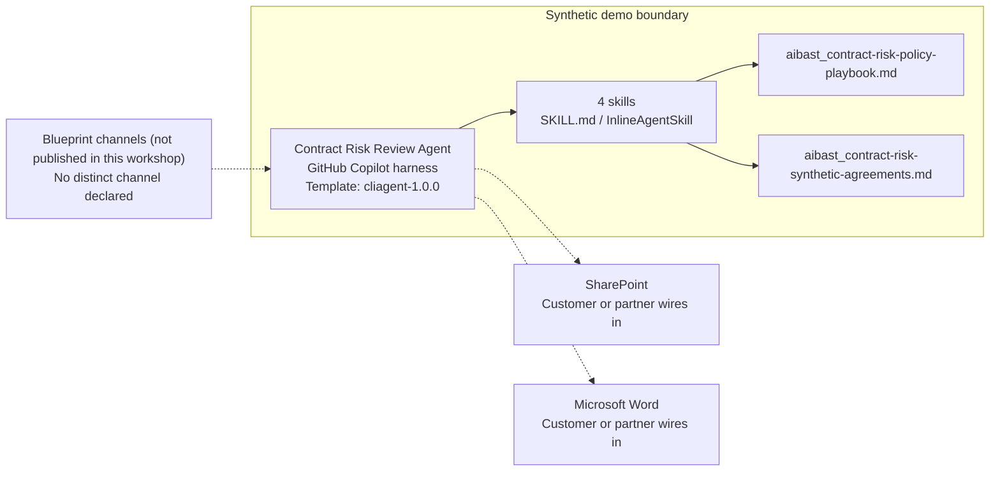

<!-- Generated by tools/build_solution_runbooks.py. Do not edit; change the sources and regenerate. -->

# Contract Risk Review Agent — Architecture

## Solution Architecture

### Logical architecture and trust boundary

Solid: synthetic design. Dashed: unwired customer systems; channels unpublished.

## Component Responsibilities

| Operation | Capability | Purpose | Owner |
| --- | --- | --- | --- |
| risk_scan | Portfolio risk triage | Ranks the agreement queue and renewal context for counsel attention. | Template |
| clause_analysis | Clause-level issue analysis | Explains documented liability, intellectual-property, payment, and operational term findings. | Template |
| compliance_check | Internal-policy screen | Compares available evidence with policy and preserves a review-required state when evidence is absent. | Template |
| renegotiation_brief | Negotiation brief preparation | Separates priority amendments, fallback positions, and counsel escalation points. | Template |

| Runtime reference | Recorded value |
| --- | --- |
| Portable implementation | [contract_risk_review_agent.py](../../agents/@aibast-agents-library/professional_services_stacks/contract_risk_review_stack/contract_risk_review_agent.py) |
| Expected tool | ContractRiskReviewAgent |
| Source SHA-256 (short) | 4562889c83a4 |

## Data Contract

Approve field meaning, usage and retention before replacing synthetic examples.

| Entity | Fields the template uses | Used by | Customer system of record | Sensitivity |
| --- | --- | --- | --- | --- |
| Portfolio summary | Contract; Client; Type; Value; Term; Governing law; Renewal; Risk; Pages; Status; HIGH issues | risk_scan; compliance_check; renegotiation_brief | SharePoint | Confidential client agreement data; restrict to authorized legal staff. |
| Documented clause evidence | Section; Clause; Risk; Exact issue; Exact recommended review position | clause_analysis; compliance_check; renegotiation_brief | SharePoint | Legal review content; counsel controls access and use. |
| Upcoming Renewals | Contract; Client; Renewal Date; Days Out; Exact action | risk_scan | Customer or partner maps | Commercial schedule data; the template values are fixed to the snapshot. |
| Internal Policy Requirements | Requirement key; Display name; Exact synthetic standard | compliance_check | Customer or partner maps | Internal policy; the legal owner approves replacement standards. |

## Integration Points

**State: Not connected in the template.**

| System | Purpose | Skills that need it | Access | Template provides | Customer or partner wires in |
| --- | --- | --- | --- | --- | --- |
| SharePoint | Governed agreement and clause evidence in place of the synthetic portfolio. | contract-portfolio-risk-scan; contract-clause-analysis; contract-policy-screen; contract-renegotiation-brief | read | Portfolio, clause, policy and renewal contracts backed by four fictional agreements; no live repository. | [Wiring procedure](3.Runbook.md#step-3-1-integrate-sharepoint) |
| Microsoft Word | Counsel-controlled review and redline workflow after approval. | contract-clause-analysis; contract-renegotiation-brief | write | Draft positions for counsel review; no document edit, amendment or delivery tool. | [Wiring procedure](3.Runbook.md#step-3-2-integrate-microsoft-word) |

## Identity and Permissions

| Template default | Customer or partner decision |
| --- | --- |
| Authentication: Microsoft Entra ID authentication; the customer configures the supported mode for the intended legal channel. | Confirm tenant, permitted identities and authentication enforcement. |
| Audience: Legal Operations; Attorneys; Executives | Define authorized users, groups and least-privilege connection identities. |

- Require sign-in before agreement content is reachable.
- Request only the read scopes the four review skills need.
- Restrict the legal audience and test authorized and denied identities.

## Copilot Studio Components

Copilot Studio uses the GitHub Copilot harness; skills hold reviewed behavior.

Agent metadata from [settings.mcs.yml](../../solutions/contract-risk-review/copilot-studio/settings.mcs.yml):

| Setting | Recorded value |
| --- | --- |
| Template | cliagent-1.0.0 |
| Recognizer | CLICopilotRecognizer |
| Authoring model | CliCopilot |
| Model | Sonnet46 |

### Skill inventory

One skill per row: manual upload and source-controlled form.

| Skill | Manual upload | Source component |
| --- | --- | --- |
| contract-clause-analysis | [SKILL.md](../../solutions/contract-risk-review/manual/skills/clause-analysis/SKILL.md) | [InlineAgentSkill](../../solutions/contract-risk-review/copilot-studio/behaviors/aibast_contract-clause-analysis.mcs.yml) |
| contract-policy-screen | [SKILL.md](../../solutions/contract-risk-review/manual/skills/compliance-check/SKILL.md) | [InlineAgentSkill](../../solutions/contract-risk-review/copilot-studio/behaviors/aibast_contract-policy-screen.mcs.yml) |
| contract-portfolio-risk-scan | [SKILL.md](../../solutions/contract-risk-review/manual/skills/risk-scan/SKILL.md) | [InlineAgentSkill](../../solutions/contract-risk-review/copilot-studio/behaviors/aibast_contract-portfolio-risk-scan.mcs.yml) |
| contract-renegotiation-brief | [SKILL.md](../../solutions/contract-risk-review/manual/skills/renegotiation-brief/SKILL.md) | [InlineAgentSkill](../../solutions/contract-risk-review/copilot-studio/behaviors/aibast_contract-renegotiation-brief.mcs.yml) |

### Knowledge inventory

| Knowledge file | Upload | Source / metadata |
| --- | --- | --- |
| aibast_contract-risk-policy-playbook.md | [Content](../../solutions/contract-risk-review/manual/knowledge/aibast_contract-risk-policy-playbook.md) | [Source copy](../../solutions/contract-risk-review/copilot-studio/capabilities/knowledge/files/aibast_contract-risk-policy-playbook.md) · [Metadata](../../solutions/contract-risk-review/copilot-studio/capabilities/knowledge/files/aibast_contract-risk-policy-playbook.md.mcs.yml) |
| aibast_contract-risk-synthetic-agreements.md | [Content](../../solutions/contract-risk-review/manual/knowledge/aibast_contract-risk-synthetic-agreements.md) | [Source copy](../../solutions/contract-risk-review/copilot-studio/capabilities/knowledge/files/aibast_contract-risk-synthetic-agreements.md) · [Metadata](../../solutions/contract-risk-review/copilot-studio/capabilities/knowledge/files/aibast_contract-risk-synthetic-agreements.md.mcs.yml) |

## State and Recovery

| Recovery ID | Condition | Required behavior | Owner |
| --- | --- | --- | --- |
| evidence-no-mockups | A required evidence file is missing | Stop. Capture or restore the real file; never substitute a mockup. | Template |
| failed-case-no-cherry-picking | A recorded identifier is absent | Mark the case failed and investigate; do not retry until it happens to pass. | Template |
| draft-publication-stop | Publish is offered | Stop at Draft unless a separate approver explicitly authorizes publication. | Template |
| agreement-source-unavailable | A wired SharePoint source returns no verified agreement evidence | Report the missing evidence; never claim a lookup, edit or transmission succeeded. | Customer or partner |
| clause-evidence-absent | An agreement has no packaged or connected clause evidence | Return `REVIEW REQUIRED` and state that no compliance conclusion can be made. | Template |
| legal-action-requested | A request would approve, edit, sign or send an agreement | Decline the action, return review support and route the decision to authorized counsel. | Template |
| contract-grounding-unavailable | The routed skill or its knowledge cannot load | Retry once in the same turn, then say so and stop without an uncited answer. | Template |

Promotion requires separate approval. [Package recovery guide](../../solutions/contract-risk-review/FIELD-GUIDE.md#failure-recovery).

## Design Decisions

| Decision | Reason |
| --- | --- |
| Fail closed on missing clause evidence. | Absent evidence must return `REVIEW REQUIRED`, never PASS. |
| Offer review support, not legal advice. | Authorized counsel owns every conclusion and negotiation position. |
| Freeze the evidence snapshot at 2026-03-17. | Renewal timing and priorities must not drift with the current date. |
| Label negotiation output as draft positions. | Nothing is sent or accepted, and liability-cap impasses escalate to General Counsel. |
| Use exact assertions, not a quality-score substitute. | Evaluate (preview) General quality does not compare responses with expected answers. |

## Non-Functional Considerations

| Area | Customer or partner confirms |
| --- | --- |
| Licensing and Copilot Credits | Confirm tenant licensing and budget credits for building, Preview, evaluation and production use. |
| Capacity | Allocate approved capacity to the legal environment and monitor consumption before widening the audience. |
| Data residency | Approve the environment geography and any cross-region processing before agreement content is connected. |
| Retention | Decide whether legal-review transcripts are saved, who can view or download them, and the Dataverse retention policy. |
| Cost drivers | Measure model, knowledge, tool and harness usage by workload; the synthetic demo is not a production-cost estimate. |

## Next

→ [Delivery runbook](3.Runbook.md) | [Solution index](../README.md)

[Sources for this page](0.Resources/README.md#sources-2architecturemd).
