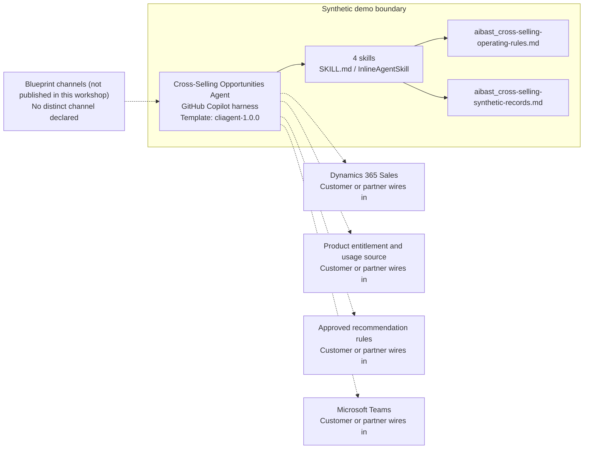

<!-- Generated by tools/build_solution_runbooks.py. Do not edit; change the sources and regenerate. -->

# Cross-Selling Opportunities Agent — Architecture

## Solution Architecture

### Logical architecture and trust boundary

Solid: synthetic design. Dashed: unwired customer systems; channels unpublished.

## Component Responsibilities

| Operation | Capability | Purpose | Owner |
| --- | --- | --- | --- |
| opportunity_scan | Opportunity Scan | Compares current product ownership with synthetic product-gap rules. | Template |
| product_affinity | Product Affinity | Shows the assumptions behind product relationships and benchmark scenarios. | Template |
| recommendation_engine | Recommendation Engine | Drafts prioritized product recommendations for review. | Template |
| revenue_impact | Revenue Impact | Summarizes labeled portfolio value scenarios without revenue claims. | Template |

| Runtime reference | Recorded value |
| --- | --- |
| Portable implementation | [cross_selling_agent.py](../../agents/@aibast-agents-library/general_stacks/cross_selling_opportunities_stack/cross_selling_agent.py) |
| Expected tool | CrossSellingAgent |
| Source SHA-256 (short) | f0bd1003f572 |

## Data Contract

Approve field meaning, usage and retention before replacing synthetic examples.

| Entity | Fields the template uses | Used by | Customer system of record | Sensitivity |
| --- | --- | --- | --- | --- |
| _CUSTOMER_OWNERSHIP — account context | name; segment; arr; health_score; tenure_months; contact; buying_signals; budget_window | opportunity_scan; recommendation_engine; revenue_impact | Dynamics 365 Sales | Customer account and contact data; confirm consent before any outreach. |
| _CUSTOMER_OWNERSHIP — ownership and usage | products; usage_signals | opportunity_scan; recommendation_engine; revenue_impact | Product entitlement and usage source | Customer entitlement and usage data; restrict to approved sellers. |
| _PRODUCT_CATALOG | name; category; annual_price; margin_pct | product_affinity; opportunity_scan; recommendation_engine; revenue_impact | Customer or partner maps | Internal pricing and margin data; never quoted to customers by the agent. |
| _AFFINITY_RULES | if_owns; recommend; affinity_score; success_rate; avg_time_to_close_days | product_affinity; opportunity_scan; recommendation_engine; revenue_impact | Approved recommendation rules | Modeled assumptions, not observed conversion. |
| _CROSS_SELL_SUCCESS_RATES | avg_success_rate; avg_deal_cycle_days; avg_expansion_pct | product_affinity | Approved recommendation rules | Segment benchmark assumptions; label as scenarios. |

## Integration Points

**State: Not connected in the template.**

| System | Purpose | Skills that need it | Access | Template provides | Customer or partner wires in |
| --- | --- | --- | --- | --- | --- |
| Dynamics 365 Sales | Account context: segment, ARR, health, contact, buying signals and budget timing. | cross-selling-opportunity-scan; cross-selling-recommendation-engine; cross-selling-revenue-impact | read | Account fields for fictional customers; no CRM read or write. | [Wiring procedure](3.Runbook.md#step-3-1-integrate-dynamics-365-sales) |
| Product entitlement and usage source | Owned products and usage signals for gap detection. | cross-selling-opportunity-scan; cross-selling-recommendation-engine | read | Fixed ownership and usage records behind the opportunity scan. | [Wiring procedure](3.Runbook.md#step-3-2-integrate-product-entitlement-and-usage-source) |
| Approved recommendation rules | Governed affinity logic and segment benchmarks. | cross-selling-product-affinity; cross-selling-opportunity-scan; cross-selling-recommendation-engine; cross-selling-revenue-impact | read | Labeled affinity rules and segment benchmarks as scenario assumptions. | [Wiring procedure](3.Runbook.md#step-3-3-integrate-approved-recommendation-rules) |
| Microsoft Teams | Seller and enablement review of drafts before engagement. | cross-selling-recommendation-engine | write | Draft engagement plans marked not sent; no messaging tool. | [Wiring procedure](3.Runbook.md#step-3-4-integrate-microsoft-teams) |

## Identity and Permissions

| Template default | Customer or partner decision |
| --- | --- |
| Authentication: Microsoft Entra ID authentication; the customer configures the supported mode for the intended seller channel. | Confirm tenant, permitted identities and authentication enforcement. |
| Audience: Sales Leader; Sales Operations Manager; Enablement Manager | Define authorized users, groups and least-privilege connection identities. |

- Require sign-in before account or usage data is reachable.
- Request only read scopes for the four review skills.
- Restrict the seller audience and test authorized and denied identities.

## Copilot Studio Components

Copilot Studio uses the GitHub Copilot harness; skills hold reviewed behavior.

Agent metadata from [settings.mcs.yml](../../solutions/cross-selling/copilot-studio/settings.mcs.yml):

| Setting | Recorded value |
| --- | --- |
| Template | cliagent-1.0.0 |
| Recognizer | CLICopilotRecognizer |
| Authoring model | CliCopilot |
| Model | Sonnet46 |

### Skill inventory

One skill per row: manual upload and source-controlled form.

| Skill | Manual upload | Source component |
| --- | --- | --- |
| cross-selling-opportunity-scan | [SKILL.md](../../solutions/cross-selling/manual/skills/opportunity-scan/SKILL.md) | [InlineAgentSkill](../../solutions/cross-selling/copilot-studio/behaviors/aibast_cross-selling-opportunity-scan.mcs.yml) |
| cross-selling-product-affinity | [SKILL.md](../../solutions/cross-selling/manual/skills/product-affinity/SKILL.md) | [InlineAgentSkill](../../solutions/cross-selling/copilot-studio/behaviors/aibast_cross-selling-product-affinity.mcs.yml) |
| cross-selling-recommendation-engine | [SKILL.md](../../solutions/cross-selling/manual/skills/recommendation-engine/SKILL.md) | [InlineAgentSkill](../../solutions/cross-selling/copilot-studio/behaviors/aibast_cross-selling-recommendation-engine.mcs.yml) |
| cross-selling-revenue-impact | [SKILL.md](../../solutions/cross-selling/manual/skills/revenue-impact/SKILL.md) | [InlineAgentSkill](../../solutions/cross-selling/copilot-studio/behaviors/aibast_cross-selling-revenue-impact.mcs.yml) |

### Knowledge inventory

| Knowledge file | Upload | Source / metadata |
| --- | --- | --- |
| aibast_cross-selling-operating-rules.md | [Content](../../solutions/cross-selling/manual/knowledge/aibast_cross-selling-operating-rules.md) | [Source copy](../../solutions/cross-selling/copilot-studio/capabilities/knowledge/files/aibast_cross-selling-operating-rules.md) · [Metadata](../../solutions/cross-selling/copilot-studio/capabilities/knowledge/files/aibast_cross-selling-operating-rules.md.mcs.yml) |
| aibast_cross-selling-synthetic-records.md | [Content](../../solutions/cross-selling/manual/knowledge/aibast_cross-selling-synthetic-records.md) | [Source copy](../../solutions/cross-selling/copilot-studio/capabilities/knowledge/files/aibast_cross-selling-synthetic-records.md) · [Metadata](../../solutions/cross-selling/copilot-studio/capabilities/knowledge/files/aibast_cross-selling-synthetic-records.md.mcs.yml) |

## State and Recovery

| Recovery ID | Condition | Required behavior | Owner |
| --- | --- | --- | --- |
| evidence-no-mockups | A required evidence file is missing | Stop. Capture or restore the real file; never substitute a mockup. | Template |
| failed-case-no-cherry-picking | A recorded identifier is absent | Mark the case failed and investigate; do not retry until it happens to pass. | Template |
| draft-publication-stop | Publish is offered | Stop at Draft unless a separate approver explicitly authorizes publication. | Template |
| sales-source-unavailable | A wired CRM or usage source returns no verified result | Report the missing evidence; never claim a lookup, outreach or CRM change succeeded. | Customer or partner |
| customer-unmatched | The customer identifier is absent from the snapshot | State that it is absent and list valid identifiers; do not substitute another customer. | Template |
| commercial-action-requested | A request would send outreach, change CRM, set a price or issue a quote | Return a draft or option for authorized review and take no action. | Template |
| sales-grounding-unavailable | The routed skill or its knowledge cannot load | Retry once in the same turn, then say so and stop without an uncited answer. | Template |

Promotion requires separate approval. [Package recovery guide](../../solutions/cross-selling/FIELD-GUIDE.md#failure-recovery).

## Design Decisions

| Decision | Reason |
| --- | --- |
| Label every figure as a synthetic assumption. | Affinity, response and weighted values are not observed conversion or revenue. |
| Draft engagement plans; never send them. | Outreach, CRM changes and pricing require authorized human approval. |
| Fail closed on sources, operations and identifiers. | Unknown inputs must not be browsed, enriched or invented. |
| Keep deterministic calculations authoritative. | The host model presents results; the packaged formulas compute them. |
| Use exact assertions, not a quality-score substitute. | Evaluate (preview) General quality does not compare responses with expected answers. |

## Non-Functional Considerations

| Area | Customer or partner confirms |
| --- | --- |
| Licensing and Copilot Credits | Confirm tenant licensing and budget credits for building, Preview, evaluation and production use. |
| Capacity | Allocate approved capacity to the sales environment and monitor consumption before widening the audience. |
| Data residency | Approve the environment geography and any cross-region processing before customer data is connected. |
| Retention | Decide whether seller transcripts are saved, who can view or download them, and the Dataverse retention policy. |
| Cost drivers | Measure model, knowledge, tool and harness usage by workload; the synthetic demo is not a production-cost estimate. |

## Next

→ [Delivery runbook](3.Runbook.md) | [Solution index](../README.md)

[Sources for this page](0.Resources/README.md#sources-2architecturemd).
