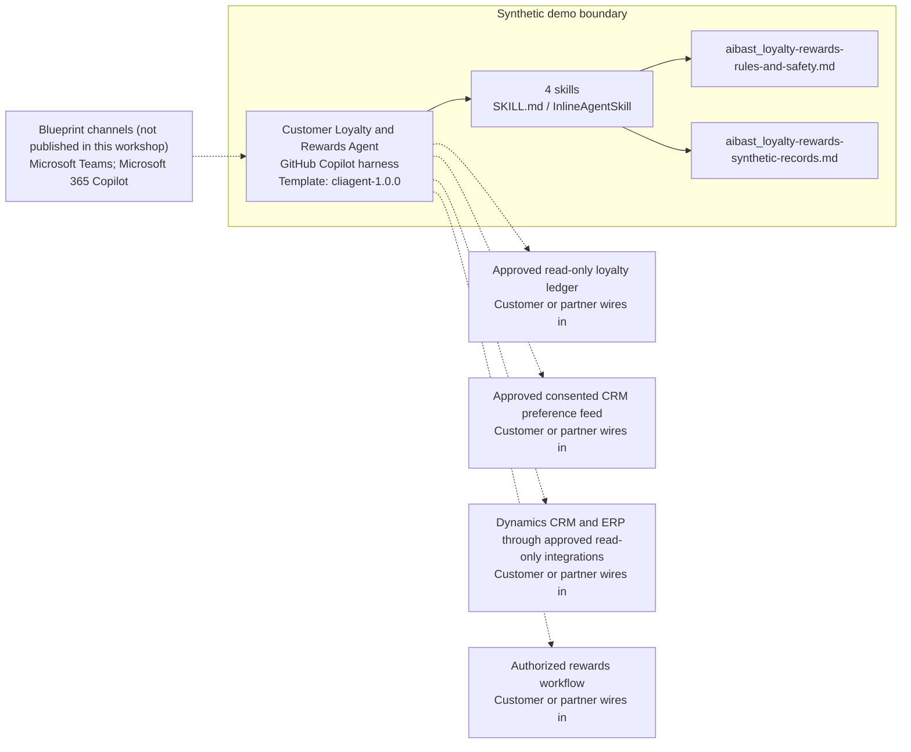

<!-- Generated by tools/build_solution_runbooks.py. Do not edit; change the sources and regenerate. -->

# Customer Loyalty and Rewards Agent — Architecture

## Solution Architecture

### Logical architecture and trust boundary

Solid: synthetic design. Dashed: unwired customer systems; channels unpublished.

## Component Responsibilities

| Operation | Capability | Purpose | Owner |
| --- | --- | --- | --- |
| loyalty_dashboard | Synthetic program health | Summarizes aggregate loyalty evidence without changing the program. | Template |
| points_summary | Informational points summary | Explains a synthetic balance without changing a ledger. | Template |
| reward_recommendations | Review-only reward options | Compares preference-matched concepts without creating an offer or issuing a benefit. | Template |
| tier_analysis | Tier structure analysis | Reviews thresholds and progress without changing member status. | Template |

| Runtime reference | Recorded value |
| --- | --- |
| Portable implementation | [customer_loyalty_rewards_agent.py](../../agents/@aibast-agents-library/b2c_sales_stacks/customer_loyalty_rewards_stack/customer_loyalty_rewards_agent.py) |
| Expected tool | CustomerLoyaltyRewardsAgent |
| Source SHA-256 (short) | c01685387fb4 |

## Data Contract

Approve field meaning, usage and retention before replacing synthetic examples.

| Entity | Fields the template uses | Used by | Customer system of record | Sensitivity |
| --- | --- | --- | --- | --- |
| LOYALTY_MEMBERS — ledger | tier; points_balance; points_earned_ytd; points_redeemed_ytd | loyalty_dashboard; points_summary; reward_recommendations; tier_analysis | Approved read-only loyalty ledger | Member account value; read-only, never adjusted by the agent. |
| LOYALTY_MEMBERS — profile and spend | name; member_since; total_spend_ytd; engagement_score | loyalty_dashboard; points_summary; reward_recommendations; tier_analysis | Dynamics CRM and ERP through approved read-only integrations | Member personal data; minimum-necessary and never identifying. |
| LOYALTY_MEMBERS — preferences | preferred_rewards | reward_recommendations | Approved consented CRM preference feed | Consent-bound preference data. |
| TIER_STRUCTURE | min_spend; points_multiplier; perks; next_tier; spend_to_next | tier_analysis; points_summary | Customer or partner maps | Program policy; the program owner approves changes. |
| REDEMPTION_CATALOG | name; points_cost; category; value | reward_recommendations | Customer or partner maps | Commercial catalog; options are not issued offers. |
| ENGAGEMENT_ACTIVITIES | activity; points; frequency | points_summary | Customer or partner maps | Program earning rules; illustrative examples. |

## Integration Points

**State: Not connected in the template.**

| System | Purpose | Skills that need it | Access | Template provides | Customer or partner wires in |
| --- | --- | --- | --- | --- | --- |
| Approved read-only loyalty ledger | Authorized balance, earned, redeemed and tier context. | synthetic-loyalty-program-health; informational-points-summary; review-only-reward-options; loyalty-tier-structure-analysis | read | Balance and tier contracts over anonymous synthetic members; no ledger connection. | [Wiring procedure](3.Runbook.md#step-3-1-integrate-approved-read-only-loyalty-ledger) |
| Approved consented CRM preference feed | Consented reward preferences for option matching. | review-only-reward-options | read | Broad synthetic preference categories; no CRM connection. | [Wiring procedure](3.Runbook.md#step-3-2-integrate-approved-consented-crm-preference-feed) |
| Dynamics CRM and ERP through approved read-only integrations | Member tenure, spend and engagement context. | synthetic-loyalty-program-health; loyalty-tier-structure-analysis | read | Spend, tenure and engagement fields in the synthetic records. | [Wiring procedure](3.Runbook.md#step-3-3-integrate-dynamics-crm-and-erp-through-approved-read-only-integrations) |
| Authorized rewards workflow | Any points, tier, offer, reward or redemption action after approval. | informational-points-summary; review-only-reward-options; loyalty-tier-structure-analysis | write | Review-only options and a no-side-effect notice; no action tool. | [Wiring procedure](3.Runbook.md#step-3-4-integrate-authorized-rewards-workflow) |

## Identity and Permissions

| Template default | Customer or partner decision |
| --- | --- |
| Authentication: Microsoft Entra ID authentication; the customer configures the supported mode for the intended program channel. | Confirm tenant, permitted identities and authentication enforcement. |
| Audience: Loyalty Program Director; CRM Manager; Marketing Leader | Define authorized users, groups and least-privilege connection identities. |

- Require sign-in before member data is reachable.
- Request only read scopes for the four informational skills.
- Restrict the program audience and test authorized and denied identities.

## Copilot Studio Components

Copilot Studio uses the GitHub Copilot harness; skills hold reviewed behavior.

Agent metadata from [settings.mcs.yml](../../solutions/customer-loyalty-rewards/copilot-studio/settings.mcs.yml):

| Setting | Recorded value |
| --- | --- |
| Template | cliagent-1.0.0 |
| Recognizer | CLICopilotRecognizer |
| Authoring model | CliCopilot |
| Model | Sonnet46 |

### Skill inventory

One skill per row: manual upload and source-controlled form.

| Skill | Manual upload | Source component |
| --- | --- | --- |
| informational-points-summary | [SKILL.md](../../solutions/customer-loyalty-rewards/manual/skills/points-summary/SKILL.md) | [InlineAgentSkill](../../solutions/customer-loyalty-rewards/copilot-studio/behaviors/aibast_informational-points-summary.mcs.yml) |
| loyalty-tier-structure-analysis | [SKILL.md](../../solutions/customer-loyalty-rewards/manual/skills/tier-analysis/SKILL.md) | [InlineAgentSkill](../../solutions/customer-loyalty-rewards/copilot-studio/behaviors/aibast_loyalty-tier-structure-analysis.mcs.yml) |
| review-only-reward-options | [SKILL.md](../../solutions/customer-loyalty-rewards/manual/skills/reward-recommendations/SKILL.md) | [InlineAgentSkill](../../solutions/customer-loyalty-rewards/copilot-studio/behaviors/aibast_review-only-reward-options.mcs.yml) |
| synthetic-loyalty-program-health | [SKILL.md](../../solutions/customer-loyalty-rewards/manual/skills/loyalty-dashboard/SKILL.md) | [InlineAgentSkill](../../solutions/customer-loyalty-rewards/copilot-studio/behaviors/aibast_synthetic-loyalty-program-health.mcs.yml) |

### Knowledge inventory

| Knowledge file | Upload | Source / metadata |
| --- | --- | --- |
| aibast_loyalty-rewards-rules-and-safety.md | [Content](../../solutions/customer-loyalty-rewards/manual/knowledge/aibast_loyalty-rewards-rules-and-safety.md) | [Source copy](../../solutions/customer-loyalty-rewards/copilot-studio/capabilities/knowledge/files/aibast_loyalty-rewards-rules-and-safety.md) · [Metadata](../../solutions/customer-loyalty-rewards/copilot-studio/capabilities/knowledge/files/aibast_loyalty-rewards-rules-and-safety.md.mcs.yml) |
| aibast_loyalty-rewards-synthetic-records.md | [Content](../../solutions/customer-loyalty-rewards/manual/knowledge/aibast_loyalty-rewards-synthetic-records.md) | [Source copy](../../solutions/customer-loyalty-rewards/copilot-studio/capabilities/knowledge/files/aibast_loyalty-rewards-synthetic-records.md) · [Metadata](../../solutions/customer-loyalty-rewards/copilot-studio/capabilities/knowledge/files/aibast_loyalty-rewards-synthetic-records.md.mcs.yml) |

## State and Recovery

| Recovery ID | Condition | Required behavior | Owner |
| --- | --- | --- | --- |
| evidence-no-mockups | A required evidence file is missing | Stop. Capture or restore the real file; never substitute a mockup. | Template |
| failed-case-no-cherry-picking | A recorded identifier is absent | Mark the case failed and investigate; do not retry until it happens to pass. | Template |
| draft-publication-stop | Publish is offered | Stop at Draft unless a separate approver explicitly authorizes publication. | Template |
| loyalty-source-unavailable | A wired ledger or CRM source returns no verified result | Report the missing evidence; never claim a balance change, redemption or contact succeeded. | Customer or partner |
| member-unmatched | The member identifier is unknown | Stop and request a valid synthetic identifier; do not approximate. | Template |
| member-action-requested | A request would contact a member or change points, tier, offers or rewards | Name the authorized workflow, take no action and state that no side effect occurred. | Template |
| loyalty-grounding-unavailable | The routed skill or its knowledge cannot load | Retry once in the same turn, then say so and stop without an uncited answer. | Template |

Promotion requires separate approval. [Package recovery guide](../../solutions/customer-loyalty-rewards/FIELD-GUIDE.md#failure-recovery).

## Design Decisions

| Decision | Reason |
| --- | --- |
| Stay informational and name the authorized workflow. | Balances, tiers and catalog items do not establish eligibility or authority to act. |
| Keep member records anonymous. | Named members and birthday fields were removed from the source. |
| Stop on unknown member identifiers. | Approximating a member would misattribute balances. |
| Gate future writes behind audited approval. | Writes require authenticated tools, authorization checks, explicit approval and audit logs. |
| Use exact assertions, not a quality-score substitute. | Evaluate (preview) General quality does not compare responses with expected answers. |

## Non-Functional Considerations

| Area | Customer or partner confirms |
| --- | --- |
| Licensing and Copilot Credits | Confirm tenant licensing and budget credits for building, Preview, evaluation and production use. |
| Capacity | Allocate approved capacity to the program environment and monitor consumption before widening the audience. |
| Data residency | Approve the environment geography and any cross-region processing before member data is connected. |
| Retention | Decide whether program transcripts are saved, who can view or download them, and the Dataverse retention policy. |
| Cost drivers | Measure model, knowledge, tool and harness usage by workload; the synthetic demo is not a production-cost estimate. |

## Next

→ [Delivery runbook](3.Runbook.md) | [Solution index](../README.md)

[Sources for this page](0.Resources/README.md#sources-2architecturemd).
