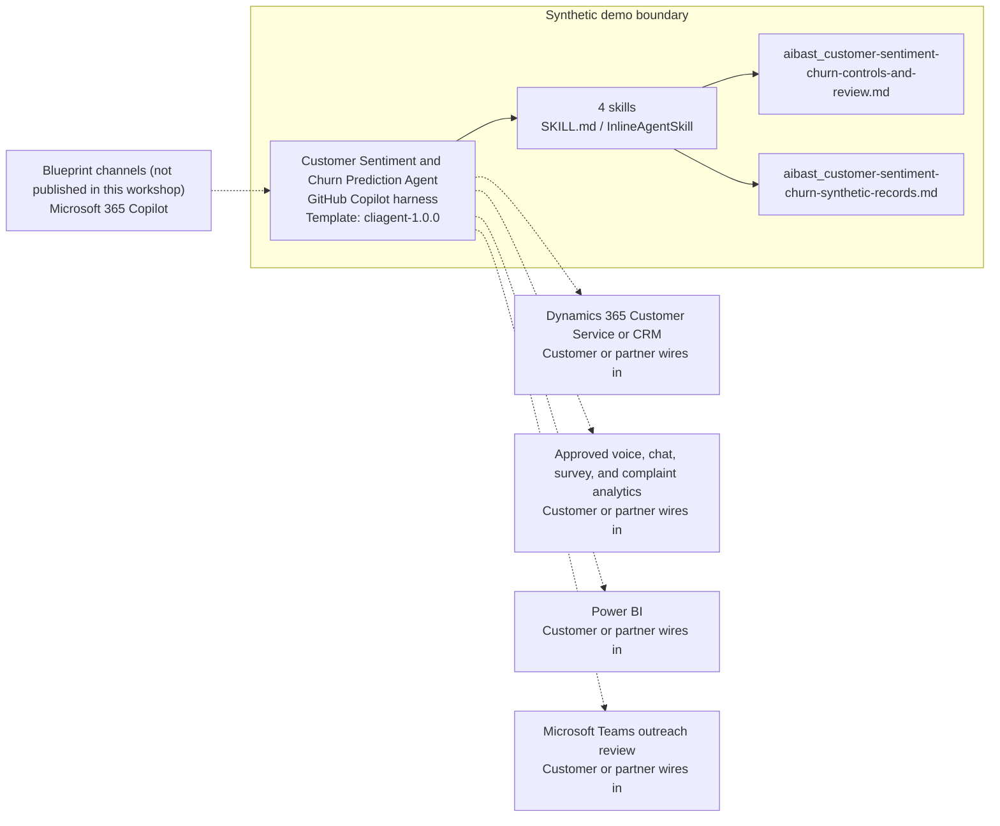

<!-- Generated by tools/build_solution_runbooks.py. Do not edit; change the sources and regenerate. -->

# Customer Sentiment and Churn Prediction Agent — Architecture

## Solution Architecture

### Logical architecture and trust boundary

Solid: synthetic design. Dashed: unwired customer systems; channels unpublished.

## Component Responsibilities

| Operation | Capability | Purpose | Owner |
| --- | --- | --- | --- |
| sentiment_dashboard | Cross-channel sentiment view | Aggregates fictional interaction sentiment and NPS evidence across touchpoints. | Template |
| churn_prediction | Churn-review prioritization | Applies a transparent heuristic to prioritize human review without predicting an individual outcome. | Template |
| retention_actions | Retention option preparation | Prepares reviewable service-recovery and outreach options without contacting customers or making offers. | Template |
| segment_analysis | Segment context | Compares synthetic segment aggregates with fixed benchmarks. | Template |

| Runtime reference | Recorded value |
| --- | --- |
| Portable implementation | [customer_sentiment_churn_agent.py](../../agents/@aibast-agents-library/financial_services_stacks/customer_sentiment_churn_stack/customer_sentiment_churn_agent.py) |
| Expected tool | CustomerSentimentChurnAgent |
| Source SHA-256 (short) | c6c5c2c62e31 |

## Data Contract

Approve field meaning, usage and retention before replacing synthetic examples.

| Entity | Fields the template uses | Used by | Customer system of record | Sensitivity |
| --- | --- | --- | --- | --- |
| CUSTOMER_INTERACTIONS — relationship profile | name; segment; tenure_years; products; monthly_transactions | sentiment_dashboard; churn_prediction; retention_actions; segment_analysis | Dynamics 365 Customer Service or CRM | Customer personal and banking-relationship data; minimum-necessary access. |
| CUSTOMER_INTERACTIONS — experience signals | nps_score; last_survey; complaint_count_12m; digital_engagement_score | sentiment_dashboard; churn_prediction; retention_actions; segment_analysis | Approved voice, chat, survey, and complaint analytics | Customer feedback data; no sensitive-circumstance inference. |
| CUSTOMER_INTERACTIONS.recent_interactions | date; channel; type; sentiment | sentiment_dashboard; churn_prediction | Approved voice, chat, survey, and complaint analytics | Interaction records; confirm ordering and retention. |
| CHURN_INDICATORS | threshold; weight; description | churn_prediction; retention_actions | Customer or partner maps | Prioritization policy; the customer validates fairness and weights. |
| RETENTION_ACTIONS | description; cost; success_rate | retention_actions | Customer or partner maps | Illustrative economics; options, not offers. |
| SEGMENT_BENCHMARKS | avg_nps; avg_products; avg_tenure; avg_transactions | segment_analysis | Customer or partner maps | Aggregate reference data; no individual attribution. |

## Integration Points

**State: Not connected in the template.**

| System | Purpose | Skills that need it | Access | Template provides | Customer or partner wires in |
| --- | --- | --- | --- | --- | --- |
| Dynamics 365 Customer Service or CRM | Customer-service context: segment, tenure, products and transactions. | sentiment-dashboard; churn-prediction; retention-actions; segment-analysis | read | Relationship fields for fictional customers; no CRM read or write. | [Wiring procedure](3.Runbook.md#step-3-1-integrate-dynamics-365-customer-service-or-crm) |
| Approved voice, chat, survey, and complaint analytics | Interaction sentiment, NPS, complaint and engagement signals. | sentiment-dashboard; churn-prediction; retention-actions | read | Fixed interaction and survey signals behind the dashboard and heuristic. | [Wiring procedure](3.Runbook.md#step-3-2-integrate-approved-voice-chat-survey-and-complaint-analytics) |
| Power BI | Segment trend reporting for the benchmark comparison. | segment-analysis | read | Fixed segment benchmarks and synthetic averages; no dataset connection. | [Wiring procedure](3.Runbook.md#step-3-3-integrate-power-bi) |
| Microsoft Teams outreach review | Human review of retention options before any outreach. | retention-actions; churn-prediction | write | Reviewable options with a no-contact notice; no messaging or task tool. | [Wiring procedure](3.Runbook.md#step-3-4-integrate-microsoft-teams-outreach-review) |

## Identity and Permissions

| Template default | Customer or partner decision |
| --- | --- |
| Authentication: Microsoft Entra ID authentication; the customer configures the supported mode for the intended reviewer channel. | Confirm tenant, permitted identities and authentication enforcement. |
| Audience: Relationship Managers; Retention Specialists; Customer Success Teams | Define authorized users, groups and least-privilege connection identities. |

- Require sign-in before customer data is reachable.
- Request only read scopes for the four review skills.
- Restrict the reviewer audience and test authorized and denied identities.

## Copilot Studio Components

Copilot Studio uses the GitHub Copilot harness; skills hold reviewed behavior.

Agent metadata from [settings.mcs.yml](../../solutions/customer-sentiment-churn/copilot-studio/settings.mcs.yml):

| Setting | Recorded value |
| --- | --- |
| Template | cliagent-1.0.0 |
| Recognizer | CLICopilotRecognizer |
| Authoring model | CliCopilot |
| Model | Sonnet46 |

### Skill inventory

One skill per row: manual upload and source-controlled form.

| Skill | Manual upload | Source component |
| --- | --- | --- |
| churn-prediction | [SKILL.md](../../solutions/customer-sentiment-churn/manual/skills/aibast_churn-prediction_02/SKILL.md) | [InlineAgentSkill](../../solutions/customer-sentiment-churn/copilot-studio/behaviors/aibast_churn-prediction.mcs.yml) |
| retention-actions | [SKILL.md](../../solutions/customer-sentiment-churn/manual/skills/aibast_retention-actions_03/SKILL.md) | [InlineAgentSkill](../../solutions/customer-sentiment-churn/copilot-studio/behaviors/aibast_retention-actions.mcs.yml) |
| segment-analysis | [SKILL.md](../../solutions/customer-sentiment-churn/manual/skills/aibast_segment-analysis_04/SKILL.md) | [InlineAgentSkill](../../solutions/customer-sentiment-churn/copilot-studio/behaviors/aibast_segment-analysis.mcs.yml) |
| sentiment-dashboard | [SKILL.md](../../solutions/customer-sentiment-churn/manual/skills/aibast_sentiment-dashboard_01/SKILL.md) | [InlineAgentSkill](../../solutions/customer-sentiment-churn/copilot-studio/behaviors/aibast_sentiment-dashboard.mcs.yml) |

### Knowledge inventory

| Knowledge file | Upload | Source / metadata |
| --- | --- | --- |
| aibast_customer-sentiment-churn-controls-and-review.md | [Content](../../solutions/customer-sentiment-churn/manual/knowledge/aibast_customer-sentiment-churn-controls-and-review.md) | [Source copy](../../solutions/customer-sentiment-churn/copilot-studio/capabilities/knowledge/files/aibast_customer-sentiment-churn-controls-and-review.md) · [Metadata](../../solutions/customer-sentiment-churn/copilot-studio/capabilities/knowledge/files/aibast_customer-sentiment-churn-controls-and-review.md.mcs.yml) |
| aibast_customer-sentiment-churn-synthetic-records.md | [Content](../../solutions/customer-sentiment-churn/manual/knowledge/aibast_customer-sentiment-churn-synthetic-records.md) | [Source copy](../../solutions/customer-sentiment-churn/copilot-studio/capabilities/knowledge/files/aibast_customer-sentiment-churn-synthetic-records.md) · [Metadata](../../solutions/customer-sentiment-churn/copilot-studio/capabilities/knowledge/files/aibast_customer-sentiment-churn-synthetic-records.md.mcs.yml) |

## State and Recovery

| Recovery ID | Condition | Required behavior | Owner |
| --- | --- | --- | --- |
| evidence-no-mockups | A required evidence file is missing | Stop. Capture or restore the real file; never substitute a mockup. | Template |
| failed-case-no-cherry-picking | A recorded identifier is absent | Mark the case failed and investigate; do not retry until it happens to pass. | Template |
| draft-publication-stop | Publish is offered | Stop at Draft unless a separate approver explicitly authorizes publication. | Template |
| signal-source-unavailable | A wired CRM or analytics source returns no verified result | Report the missing evidence; never claim a lookup, contact or account change succeeded. | Customer or partner |
| customer-record-absent | The requested customer record is not in the snapshot | Say it is not present in the fixed snapshot; never substitute another record. | Template |
| customer-action-requested | A request would contact a customer, change a fee or account, or make an offer | Return reviewable options, name the authorized reviewer and take no action. | Template |
| relationship-grounding-unavailable | The routed skill or its knowledge cannot load | Retry once in the same turn, then say so and stop without an uncited answer. | Template |

Promotion requires separate approval. [Package recovery guide](../../solutions/customer-sentiment-churn/FIELD-GUIDE.md#failure-recovery).

## Design Decisions

| Decision | Reason |
| --- | --- |
| Prioritize review; never predict individual churn. | Scores are disclosed heuristics, not facts about a person. |
| Prepare retention options without executing them. | Contact, fee changes, offers and account actions stay with authorized reviewers. |
| Report missing records as absent. | Silently substituting another fictional record was a fixed source defect. |
| Disclose indicator weights with every priority. | Explainable prioritization replaces a hidden prediction presented as fact. |
| Use exact assertions, not a quality-score substitute. | Evaluate (preview) General quality does not compare responses with expected answers. |

## Non-Functional Considerations

| Area | Customer or partner confirms |
| --- | --- |
| Licensing and Copilot Credits | Confirm tenant licensing and budget credits for building, Preview, evaluation and production use. |
| Capacity | Allocate approved capacity to the customer-experience environment and monitor consumption before widening the audience. |
| Data residency | Approve the environment geography and any cross-region processing before customer data is connected. |
| Retention | Decide whether reviewer transcripts are saved, who can view or download them, and the Dataverse retention policy. |
| Cost drivers | Measure model, knowledge, tool and harness usage by workload; the synthetic demo is not a production-cost estimate. |

## Next

→ [Delivery runbook](3.Runbook.md) | [Solution index](../README.md)

[Sources for this page](0.Resources/README.md#sources-2architecturemd).
