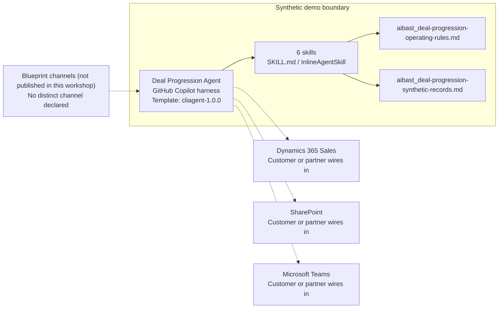

<!-- Generated by tools/build_solution_runbooks.py. Do not edit; change the sources and regenerate. -->

# Deal Progression Agent — Architecture

## Solution Architecture

### Logical architecture and trust boundary

Solid: synthetic design. Dashed: unwired customer systems; channels unpublished.

## Component Responsibilities

| Operation | Capability | Purpose | Owner |
| --- | --- | --- | --- |
| pipeline_health | Pipeline Health | Classifies active opportunities and surfaces the pipeline areas that need review. | Template |
| stalled_deals | Stalled Deals | Explains stalled opportunities using stage age, engagement, champion, and blocker evidence. | Template |
| action_plans | Action Plans | Drafts candidate interventions, owners, and timing for human review. | Template |
| acceleration | Acceleration | Compares timing options without turning scenario value into a forecast commitment. | Template |
| assign_tasks | Assign Tasks | Maps candidate tasks to rep capacity without creating assignments or alerts. | Template |
| executive_summary | Executive Summary | Condenses findings and draft next steps for leadership review. | Template |

| Runtime reference | Recorded value |
| --- | --- |
| Portable implementation | [deal_progression_agent.py](../../agents/@aibast-agents-library/b2b_sales_stacks/deal_progression_stack/deal_progression_agent.py) |
| Expected tool | DealProgressionAgent |
| Source SHA-256 (short) | 0434e017ac54 |

## Data Contract

Approve field meaning, usage and retention before replacing synthetic examples.

| Entity | Fields the template uses | Used by | Customer system of record | Sensitivity |
| --- | --- | --- | --- | --- |
| _PIPELINE | id; name; account; value; stage; days_in_stage; owner; last_contact_days; champion_name; champion_status; blocker | pipeline_health; stalled_deals; action_plans; acceleration; assign_tasks; executive_summary | Dynamics 365 Sales | Opportunity and stakeholder contact data; restrict to the deal team. |
| _STAGE_BENCHMARKS | Qualification; Discovery; Proposal; Negotiation; Contract | pipeline_health; stalled_deals; action_plans; acceleration; assign_tasks; executive_summary | Customer or partner maps | Sales-process policy; leadership sets the benchmarks. |
| _REPS | name; title; active_deals; capacity; specialty | acceleration; assign_tasks | Customer or partner maps | Employee workload data; visible to sales managers only. |
| _BLOCKER_PLAYBOOK | diagnosis; week1; week2; resource | stalled_deals; action_plans; assign_tasks; executive_summary | SharePoint | Internal sales playbook content. |

## Integration Points

**State: Not connected in the template.**

| System | Purpose | Skills that need it | Access | Template provides | Customer or partner wires in |
| --- | --- | --- | --- | --- | --- |
| Dynamics 365 Sales | Opportunity, stage, activity and stakeholder context. | deal-progression-pipeline-health; deal-progression-stalled-deals; deal-progression-action-plans; deal-progression-acceleration; deal-progression-assign-tasks; deal-progression-executive-summary | read | Opportunity and engagement fields for a fictional pipeline; no CRM read or write. | [Wiring procedure](3.Runbook.md#step-3-1-integrate-dynamics-365-sales) |
| SharePoint | Approved sales playbooks and stage guidance. | deal-progression-stalled-deals; deal-progression-action-plans; deal-progression-assign-tasks | read | Synthetic blocker playbooks and stage benchmarks in uploaded knowledge. | [Wiring procedure](3.Runbook.md#step-3-2-integrate-sharepoint) |
| Microsoft Teams | Manager-led follow-up after review. | deal-progression-action-plans; deal-progression-assign-tasks; deal-progression-executive-summary | write | Draft plans and candidate task maps; no message, alert or assignment tool. | [Wiring procedure](3.Runbook.md#step-3-3-integrate-microsoft-teams) |

## Identity and Permissions

| Template default | Customer or partner decision |
| --- | --- |
| Authentication: Microsoft Entra ID authentication; the customer configures the supported mode for the intended seller channel. | Confirm tenant, permitted identities and authentication enforcement. |
| Audience: Account Executive; Sales Director | Define authorized users, groups and least-privilege connection identities. |

- Require sign-in before opportunity data is reachable.
- Request only read scopes for the six review skills.
- Restrict the seller audience and test authorized and denied identities.

## Copilot Studio Components

Copilot Studio uses the GitHub Copilot harness; skills hold reviewed behavior.

Agent metadata from [settings.mcs.yml](../../solutions/deal-progression/copilot-studio/settings.mcs.yml):

| Setting | Recorded value |
| --- | --- |
| Template | cliagent-1.0.0 |
| Recognizer | CLICopilotRecognizer |
| Authoring model | CliCopilot |
| Model | Sonnet46 |

### Skill inventory

One skill per row: manual upload and source-controlled form.

| Skill | Manual upload | Source component |
| --- | --- | --- |
| deal-progression-acceleration | [SKILL.md](../../solutions/deal-progression/manual/skills/acceleration/SKILL.md) | [InlineAgentSkill](../../solutions/deal-progression/copilot-studio/behaviors/aibast_deal-progression-acceleration.mcs.yml) |
| deal-progression-action-plans | [SKILL.md](../../solutions/deal-progression/manual/skills/action-plans/SKILL.md) | [InlineAgentSkill](../../solutions/deal-progression/copilot-studio/behaviors/aibast_deal-progression-action-plans.mcs.yml) |
| deal-progression-assign-tasks | [SKILL.md](../../solutions/deal-progression/manual/skills/assign-tasks/SKILL.md) | [InlineAgentSkill](../../solutions/deal-progression/copilot-studio/behaviors/aibast_deal-progression-assign-tasks.mcs.yml) |
| deal-progression-executive-summary | [SKILL.md](../../solutions/deal-progression/manual/skills/executive-summary/SKILL.md) | [InlineAgentSkill](../../solutions/deal-progression/copilot-studio/behaviors/aibast_deal-progression-executive-summary.mcs.yml) |
| deal-progression-pipeline-health | [SKILL.md](../../solutions/deal-progression/manual/skills/pipeline-health/SKILL.md) | [InlineAgentSkill](../../solutions/deal-progression/copilot-studio/behaviors/aibast_deal-progression-pipeline-health.mcs.yml) |
| deal-progression-stalled-deals | [SKILL.md](../../solutions/deal-progression/manual/skills/stalled-deals/SKILL.md) | [InlineAgentSkill](../../solutions/deal-progression/copilot-studio/behaviors/aibast_deal-progression-stalled-deals.mcs.yml) |

### Knowledge inventory

| Knowledge file | Upload | Source / metadata |
| --- | --- | --- |
| aibast_deal-progression-operating-rules.md | [Content](../../solutions/deal-progression/manual/knowledge/aibast_deal-progression-operating-rules.md) | [Source copy](../../solutions/deal-progression/copilot-studio/capabilities/knowledge/files/aibast_deal-progression-operating-rules.md) · [Metadata](../../solutions/deal-progression/copilot-studio/capabilities/knowledge/files/aibast_deal-progression-operating-rules.md.mcs.yml) |
| aibast_deal-progression-synthetic-records.md | [Content](../../solutions/deal-progression/manual/knowledge/aibast_deal-progression-synthetic-records.md) | [Source copy](../../solutions/deal-progression/copilot-studio/capabilities/knowledge/files/aibast_deal-progression-synthetic-records.md) · [Metadata](../../solutions/deal-progression/copilot-studio/capabilities/knowledge/files/aibast_deal-progression-synthetic-records.md.mcs.yml) |

## State and Recovery

| Recovery ID | Condition | Required behavior | Owner |
| --- | --- | --- | --- |
| evidence-no-mockups | A required evidence file is missing | Stop. Capture or restore the real file; never substitute a mockup. | Template |
| failed-case-no-cherry-picking | A recorded identifier is absent | Mark the case failed and investigate; do not retry until it happens to pass. | Template |
| draft-publication-stop | Publish is offered | Stop at Draft unless a separate approver explicitly authorizes publication. | Template |
| pipeline-source-unavailable | A wired CRM source returns no verified result | Report the missing evidence; never claim a CRM write, task or alert succeeded. | Customer or partner |
| deal-evidence-absent | A requested deal, owner or field is not in the snapshot | Say it is not present in the fixed snapshot; never invent or substitute. | Template |
| sales-action-requested | A request would change CRM data, assign work, raise an alert or contact a customer | Return a draft option, name the required reviewer and take no action. | Template |
| pipeline-grounding-unavailable | The routed skill or its knowledge cannot load | Retry once in the same turn, then say so and stop without an uncited answer. | Template |

Promotion requires separate approval. [Package recovery guide](../../solutions/deal-progression/FIELD-GUIDE.md#failure-recovery).

## Design Decisions

| Decision | Reason |
| --- | --- |
| Classify deals against disclosed stage benchmarks. | Stage age against a benchmark explains why a deal counts as stalled. |
| Draft interventions; never execute them. | Owners, deadlines, forecasts and communications need human approval. |
| Label scenario value as synthetic planning evidence. | Acceleration value is not a forecast commitment. |
| Report absent evidence as not present. | Invented deals, owners or outcomes would mislead pipeline review. |
| Use exact assertions, not a quality-score substitute. | Evaluate (preview) General quality does not compare responses with expected answers. |

## Non-Functional Considerations

| Area | Customer or partner confirms |
| --- | --- |
| Licensing and Copilot Credits | Confirm tenant licensing and budget credits for building, Preview, evaluation and production use. |
| Capacity | Allocate approved capacity to the sales environment and monitor consumption before widening the audience. |
| Data residency | Approve the environment geography and any cross-region processing before opportunity data is connected. |
| Retention | Decide whether seller transcripts are saved, who can view or download them, and the Dataverse retention policy. |
| Cost drivers | Measure model, knowledge, tool and harness usage by workload; the synthetic demo is not a production-cost estimate. |

## Next

→ [Delivery runbook](3.Runbook.md) | [Solution index](../README.md)

[Sources for this page](0.Resources/README.md#sources-2architecturemd).
