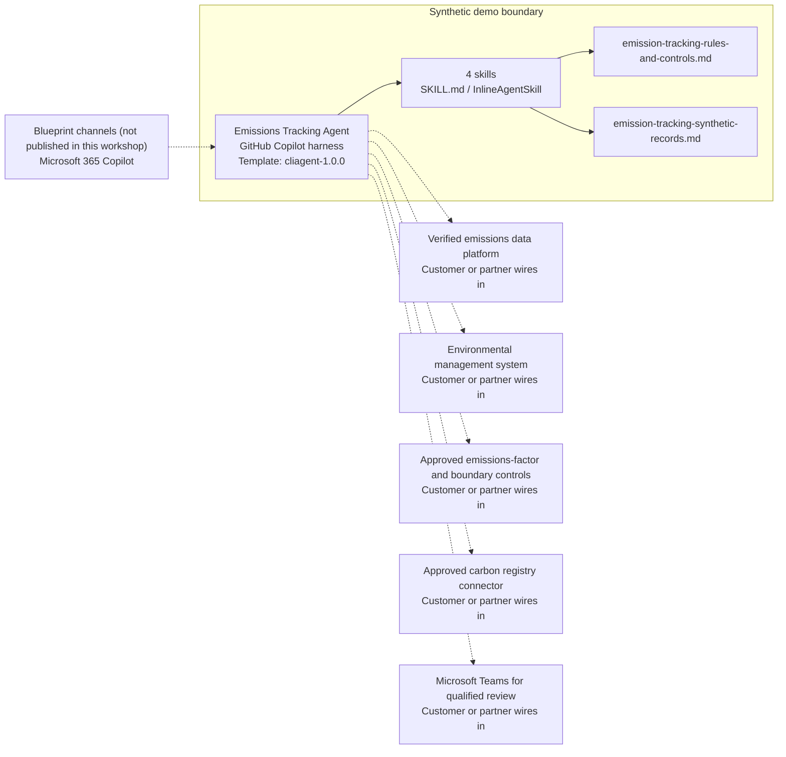

<!-- Generated by tools/build_solution_runbooks.py. Do not edit; change the sources and regenerate. -->

# Emissions Tracking Agent — Architecture

## Solution Architecture

### Logical architecture and trust boundary

Solid: synthetic design. Dashed: unwired customer systems; channels unpublished.

## Component Responsibilities

| Operation | Capability | Purpose | Owner |
| --- | --- | --- | --- |
| emissions_dashboard | Portfolio emissions evidence | Aggregates synthetic facility and scope totals while labeling the inventory as unverified. | Template |
| compliance_status | Threshold screening | Compares synthetic figures with configured thresholds without declaring legal compliance. | Template |
| reduction_plan | Reduction scenario planning | Frames engineering and investment options for multidisciplinary review. | Template |
| carbon_offset_analysis | Offset due-diligence shortlist | Compares synthetic credit candidates without purchasing, retiring, disclosing, or claiming an offset. | Template |

| Runtime reference | Recorded value |
| --- | --- |
| Portable implementation | [emission_tracking_agent.py](../../agents/@aibast-agents-library/energy_stacks/emission_tracking_stack/emission_tracking_agent.py) |
| Expected tool | EmissionTrackingAgent |
| Source SHA-256 (short) | 995b5f93335d |

## Data Contract

Approve field meaning, usage and retention before replacing synthetic examples.

| Entity | Fields the template uses | Used by | Customer system of record | Sensitivity |
| --- | --- | --- | --- | --- |
| FACILITIES — profile and targets | name; location; type; capacity_mw; regulatory_threshold_co2; reduction_target_pct; baseline_year; baseline_co2 | emissions_dashboard; compliance_status; reduction_plan; carbon_offset_analysis | Environmental management system | Operational facility data; thresholds and targets need compliance-owner approval. |
| FACILITIES.emissions | scope_1; scope_2; scope_3; co2_tonnes; ch4_tonnes; n2o_tonnes | emissions_dashboard; compliance_status; reduction_plan; carbon_offset_analysis | Verified emissions data platform | Unverified inventory until factors and boundaries are approved. |
| _reduction_plan actions | action; reduction_tonnes; cost_mm | reduction_plan | Customer or partner maps | Scenario estimates; engineering and finance review required. |
| CARBON_OFFSETS | project; type; credits_available; price_per_tonne; vintage; verified_by | carbon_offset_analysis | Approved carbon registry connector | Registry evidence; not a purchase, retirement or claim. |

## Integration Points

**State: Not connected in the template.**

| System | Purpose | Skills that need it | Access | Template provides | Customer or partner wires in |
| --- | --- | --- | --- | --- | --- |
| Verified emissions data platform | Source-backed scope inventory by facility and gas. | emission-tracking-emissions-dashboard; emission-tracking-compliance-status; emission-tracking-reduction-plan; emission-tracking-carbon-offset-analysis | read | Scope inventory for fictional facilities, labeled unverified; no live data. | [Wiring procedure](3.Runbook.md#step-3-1-integrate-verified-emissions-data-platform) |
| Environmental management system | Governed facility records, thresholds and reduction targets. | emission-tracking-compliance-status; emission-tracking-reduction-plan | read | Facility thresholds, baselines and targets as fixed synthetic values. | [Wiring procedure](3.Runbook.md#step-3-2-integrate-environmental-management-system) |
| Approved emissions-factor and boundary controls | Approved factors, boundaries and units behind every total. | emission-tracking-emissions-dashboard; emission-tracking-compliance-status | read | A validation reminder only; the synthetic totals apply no factors. | [Wiring procedure](3.Runbook.md#step-3-3-integrate-approved-emissions-factor-and-boundary-controls) |
| Approved carbon registry connector | Registry evidence for offset candidates. | emission-tracking-carbon-offset-analysis | read | Fictional registry-labeled candidates; no purchase, retirement or claim tool. | [Wiring procedure](3.Runbook.md#step-3-4-integrate-approved-carbon-registry-connector) |
| Microsoft Teams for qualified review | Qualified sustainability and regulatory review of drafts. | emission-tracking-compliance-status; emission-tracking-reduction-plan; emission-tracking-carbon-offset-analysis | write | Screening results and drafts naming the reviewer; no messaging tool. | [Wiring procedure](3.Runbook.md#step-3-5-integrate-microsoft-teams-for-qualified-review) |

## Identity and Permissions

| Template default | Customer or partner decision |
| --- | --- |
| Authentication: Microsoft Entra ID authentication; the customer configures the supported mode for the intended reviewer channel. | Confirm tenant, permitted identities and authentication enforcement. |
| Audience: Sustainability Lead; Environmental Compliance Manager; Emissions Data Analyst; Decarbonization Program Lead | Define authorized users, groups and least-privilege connection identities. |

- Require sign-in before emissions or registry data is reachable.
- Request only read scopes for the four review skills.
- Restrict the reviewer audience and test authorized and denied identities.

## Copilot Studio Components

Copilot Studio uses the GitHub Copilot harness; skills hold reviewed behavior.

Agent metadata from [settings.mcs.yml](../../solutions/emission-tracking/copilot-studio/settings.mcs.yml):

| Setting | Recorded value |
| --- | --- |
| Template | cliagent-1.0.0 |
| Recognizer | CLICopilotRecognizer |
| Authoring model | CliCopilot |
| Model | Sonnet46 |

### Skill inventory

One skill per row: manual upload and source-controlled form.

| Skill | Manual upload | Source component |
| --- | --- | --- |
| emission-tracking-carbon-offset-analysis | [SKILL.md](../../solutions/emission-tracking/manual/skills/aibast_carbon-offset-analysis/SKILL.md) | [InlineAgentSkill](../../solutions/emission-tracking/copilot-studio/behaviors/aibast_emission-tracking-carbon-offset-analysis.mcs.yml) |
| emission-tracking-compliance-status | [SKILL.md](../../solutions/emission-tracking/manual/skills/aibast_compliance-status/SKILL.md) | [InlineAgentSkill](../../solutions/emission-tracking/copilot-studio/behaviors/aibast_emission-tracking-compliance-status.mcs.yml) |
| emission-tracking-emissions-dashboard | [SKILL.md](../../solutions/emission-tracking/manual/skills/aibast_emissions-dashboard/SKILL.md) | [InlineAgentSkill](../../solutions/emission-tracking/copilot-studio/behaviors/aibast_emission-tracking-emissions-dashboard.mcs.yml) |
| emission-tracking-reduction-plan | [SKILL.md](../../solutions/emission-tracking/manual/skills/aibast_reduction-plan/SKILL.md) | [InlineAgentSkill](../../solutions/emission-tracking/copilot-studio/behaviors/aibast_emission-tracking-reduction-plan.mcs.yml) |

### Knowledge inventory

| Knowledge file | Upload | Source / metadata |
| --- | --- | --- |
| emission-tracking-rules-and-controls.md | [Content](../../solutions/emission-tracking/manual/knowledge/emission-tracking-rules-and-controls.md) | [Source copy](../../solutions/emission-tracking/copilot-studio/capabilities/knowledge/files/emission-tracking-rules-and-controls.md) · [Metadata](../../solutions/emission-tracking/copilot-studio/capabilities/knowledge/files/emission-tracking-rules-and-controls.md.mcs.yml) |
| emission-tracking-synthetic-records.md | [Content](../../solutions/emission-tracking/manual/knowledge/emission-tracking-synthetic-records.md) | [Source copy](../../solutions/emission-tracking/copilot-studio/capabilities/knowledge/files/emission-tracking-synthetic-records.md) · [Metadata](../../solutions/emission-tracking/copilot-studio/capabilities/knowledge/files/emission-tracking-synthetic-records.md.mcs.yml) |

## State and Recovery

| Recovery ID | Condition | Required behavior | Owner |
| --- | --- | --- | --- |
| evidence-no-mockups | A required evidence file is missing | Stop. Capture or restore the real file; never substitute a mockup. | Template |
| failed-case-no-cherry-picking | A recorded identifier is absent | Mark the case failed and investigate; do not retry until it happens to pass. | Template |
| draft-publication-stop | Publish is offered | Stop at Draft unless a separate approver explicitly authorizes publication. | Template |
| emissions-source-unavailable | A wired emissions or registry source returns no verified result | Report the missing evidence; never claim a filing, purchase or claim succeeded. | Customer or partner |
| facility-absent | A requested facility identifier is absent | Say so; never substitute another record. | Template |
| external-action-requested | A request would verify a claim, declare compliance, trade credits or file | Decline; name the qualified reviewer and the approved production connection needed next. | Template |
| emissions-grounding-unavailable | The routed skill or its knowledge cannot load | Retry once in the same turn, then say so and stop without an uncited answer. | Template |

Promotion requires separate approval. [Package recovery guide](../../solutions/emission-tracking/FIELD-GUIDE.md#failure-recovery).

## Design Decisions

| Decision | Reason |
| --- | --- |
| Label every total as unverified evidence. | Boundaries, factors, units and source records must be validated before a claim. |
| Screen against thresholds; never determine compliance. | Legal compliance and attestations belong to qualified reviewers. |
| Treat offsets as due diligence only. | Purchases, retirements, disclosures and claims stay outside the agent. |
| Read first; isolate any future write. | Writes need role authorization, current-state validation, confirmation and an immutable audit event. |
| Use exact assertions, not a quality-score substitute. | Evaluate (preview) General quality does not compare responses with expected answers. |

## Non-Functional Considerations

| Area | Customer or partner confirms |
| --- | --- |
| Licensing and Copilot Credits | Confirm tenant licensing and budget credits for building, Preview, evaluation and production use. |
| Capacity | Allocate approved capacity to the sustainability environment and monitor consumption before widening the audience. |
| Data residency | Approve the environment geography and any cross-region processing before emissions data is connected. |
| Retention | Decide whether review transcripts are saved, who can view or download them, and the Dataverse retention policy. |
| Cost drivers | Measure model, knowledge, tool and harness usage by workload; the synthetic demo is not a production-cost estimate. |

## Next

→ [Delivery runbook](3.Runbook.md) | [Solution index](../README.md)

[Sources for this page](0.Resources/README.md#sources-2architecturemd).
