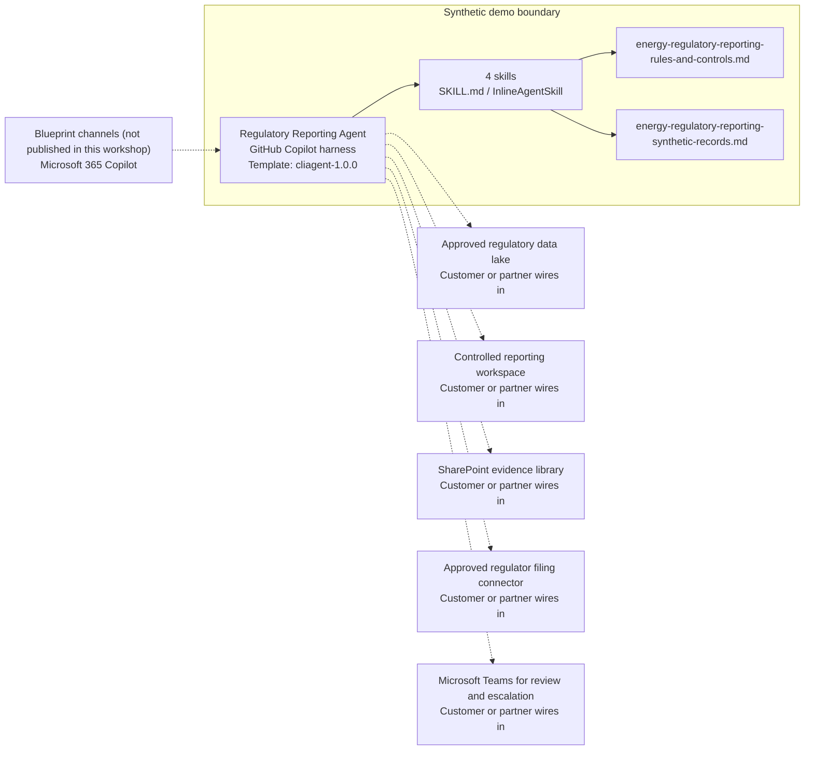

<!-- Generated by tools/build_solution_runbooks.py. Do not edit; change the sources and regenerate. -->

# Regulatory Reporting Agent — Architecture

## Solution Architecture

### Logical architecture and trust boundary

Solid: synthetic design. Dashed: unwired customer systems; channels unpublished.

## Component Responsibilities

| Operation | Capability | Purpose | Owner |
| --- | --- | --- | --- |
| report_status | Reporting portfolio status | Summarizes synthetic deadlines, completion, quality, filing state, and ownership. | Template |
| data_validation | Source-data validation screening | Identifies incomplete or below-threshold synthetic source evidence before certification. | Template |
| submission_tracker | Read-only filing-state tracker | Shows recorded submission state without signing, certifying, or transmitting a filing. | Template |
| audit_readiness | Audit evidence triage | Organizes open findings and severity without predicting an audit outcome or providing legal advice. | Template |

| Runtime reference | Recorded value |
| --- | --- |
| Portable implementation | [regulatory_reporting_agent.py](../../agents/@aibast-agents-library/energy_stacks/regulatory_reporting_stack/regulatory_reporting_agent.py) |
| Expected tool | RegulatoryReportingAgent |
| Source SHA-256 (short) | bf1440fe023f |

## Data Contract

Approve field meaning, usage and retention before replacing synthetic examples.

| Entity | Fields the template uses | Used by | Customer system of record | Sensitivity |
| --- | --- | --- | --- | --- |
| REGULATORY_REPORTS | name; authority; facility; reporting_period; deadline; status; data_quality_score; completeness_pct; assignee; last_updated | report_status; data_validation; submission_tracker; audit_readiness | Approved regulatory data lake | Regulatory compliance records; restrict to authorized reporting staff. |
| DATA_VALIDATION_RULES | rules; source_systems | data_validation (reference only; no operation computes from it) | Customer or partner maps | Internal control policy; the listed source systems are fictional. |
| AUDIT_FINDINGS | report; finding; severity; status; due_date | audit_readiness | Customer or partner maps | Audit evidence; restrict to reporting owners and auditors. |

## Integration Points

**State: Not connected in the template.**

| System | Purpose | Skills that need it | Access | Template provides | Customer or partner wires in |
| --- | --- | --- | --- | --- | --- |
| Approved regulatory data lake | Governed report status, quality and completeness data in place of the synthetic portfolio. | energy-regulatory-reporting-report-status; energy-regulatory-reporting-data-validation; energy-regulatory-reporting-submission-tracker | read | Report-portfolio fields and read-only skill contracts backed by fictional records; no live query. | [Wiring procedure](3.Runbook.md#step-3-1-integrate-approved-regulatory-data-lake) |
| Controlled reporting workspace | Governed report preparation that owners review before certification. | energy-regulatory-reporting-report-status; energy-regulatory-reporting-submission-tracker | read | Status and submission-state contracts; no package assembly, certification or filing. | [Wiring procedure](3.Runbook.md#step-3-2-integrate-controlled-reporting-workspace) |
| SharePoint evidence library | Approved validation and audit evidence documents for readiness review. | energy-regulatory-reporting-data-validation; energy-regulatory-reporting-audit-readiness | read | Synthetic findings, validation rules and controls knowledge; no evidence documents. | [Wiring procedure](3.Runbook.md#step-3-3-integrate-sharepoint-evidence-library) |
| Approved regulator filing connector | Regulator transmission that only authorized owners perform. | energy-regulatory-reporting-submission-tracker | write | Read-only filing-state tracking; no filing, signature or transmission tool. | [Wiring procedure](3.Runbook.md#step-3-4-integrate-approved-regulator-filing-connector) |
| Microsoft Teams for review and escalation | Owner and reviewer escalation of validation exceptions and open findings. | energy-regulatory-reporting-data-validation; energy-regulatory-reporting-audit-readiness | write | Named owners and reviewers in each response; no message or escalation tool. | [Wiring procedure](3.Runbook.md#step-3-5-integrate-microsoft-teams-for-review-and-escalation) |

## Identity and Permissions

| Template default | Customer or partner decision |
| --- | --- |
| Authentication: Microsoft Entra ID authentication; the customer selects the supported mode for the intended reporting channel. | Confirm tenant, permitted identities and authentication enforcement. |
| Audience: Regulatory Reporting Lead; Data Analyst; Compliance Manager; Internal Auditor | Define authorized users, groups and least-privilege connection identities. |

- Require sign-in before any restricted reporting information is shown.
- Request only the scopes that approved report, workspace and evidence sources need.
- Restrict the audience and verify access with authorized and denied identities.

## Copilot Studio Components

Copilot Studio uses the GitHub Copilot harness; skills hold reviewed behavior.

Agent metadata from [settings.mcs.yml](../../solutions/energy-regulatory-reporting/copilot-studio/settings.mcs.yml):

| Setting | Recorded value |
| --- | --- |
| Template | cliagent-1.0.0 |
| Recognizer | CLICopilotRecognizer |
| Authoring model | CliCopilot |
| Model | Sonnet46 |

### Skill inventory

One skill per row: manual upload and source-controlled form.

| Skill | Manual upload | Source component |
| --- | --- | --- |
| energy-regulatory-reporting-audit-readiness | [SKILL.md](../../solutions/energy-regulatory-reporting/manual/skills/aibast_audit-readiness/SKILL.md) | [InlineAgentSkill](../../solutions/energy-regulatory-reporting/copilot-studio/behaviors/aibast_energy-regulatory-reporting-audit-readiness.mcs.yml) |
| energy-regulatory-reporting-data-validation | [SKILL.md](../../solutions/energy-regulatory-reporting/manual/skills/aibast_data-validation/SKILL.md) | [InlineAgentSkill](../../solutions/energy-regulatory-reporting/copilot-studio/behaviors/aibast_energy-regulatory-reporting-data-validation.mcs.yml) |
| energy-regulatory-reporting-report-status | [SKILL.md](../../solutions/energy-regulatory-reporting/manual/skills/aibast_report-status/SKILL.md) | [InlineAgentSkill](../../solutions/energy-regulatory-reporting/copilot-studio/behaviors/aibast_energy-regulatory-reporting-report-status.mcs.yml) |
| energy-regulatory-reporting-submission-tracker | [SKILL.md](../../solutions/energy-regulatory-reporting/manual/skills/aibast_submission-tracker/SKILL.md) | [InlineAgentSkill](../../solutions/energy-regulatory-reporting/copilot-studio/behaviors/aibast_energy-regulatory-reporting-submission-tracker.mcs.yml) |

### Knowledge inventory

| Knowledge file | Upload | Source / metadata |
| --- | --- | --- |
| energy-regulatory-reporting-rules-and-controls.md | [Content](../../solutions/energy-regulatory-reporting/manual/knowledge/energy-regulatory-reporting-rules-and-controls.md) | [Source copy](../../solutions/energy-regulatory-reporting/copilot-studio/capabilities/knowledge/files/energy-regulatory-reporting-rules-and-controls.md) · [Metadata](../../solutions/energy-regulatory-reporting/copilot-studio/capabilities/knowledge/files/energy-regulatory-reporting-rules-and-controls.md.mcs.yml) |
| energy-regulatory-reporting-synthetic-records.md | [Content](../../solutions/energy-regulatory-reporting/manual/knowledge/energy-regulatory-reporting-synthetic-records.md) | [Source copy](../../solutions/energy-regulatory-reporting/copilot-studio/capabilities/knowledge/files/energy-regulatory-reporting-synthetic-records.md) · [Metadata](../../solutions/energy-regulatory-reporting/copilot-studio/capabilities/knowledge/files/energy-regulatory-reporting-synthetic-records.md.mcs.yml) |

## State and Recovery

| Recovery ID | Condition | Required behavior | Owner |
| --- | --- | --- | --- |
| evidence-no-mockups | A required evidence file is missing | Stop. Capture or restore the real file; never substitute a mockup. | Template |
| failed-case-no-cherry-picking | A recorded identifier is absent | Mark the case failed and investigate; do not retry until it happens to pass. | Template |
| draft-publication-stop | Publish is offered | Stop at Draft unless a separate approver explicitly authorizes publication. | Template |
| reporting-source-unavailable | A wired reporting system returns no verified result | Report unavailable evidence; never claim that a lookup, filing or update succeeded. | Customer or partner |
| report-id-absent | A requested report ID is not in the records | Say that it is absent and return no substituted report. | Template |
| reporting-grounding-unavailable | The routed skill or its knowledge cannot load | Retry once in the same turn, then report the failure and stop without an uncited answer. | Template |

Promotion requires separate approval. [Package recovery guide](../../solutions/energy-regulatory-reporting/FIELD-GUIDE.md#failure-recovery).

## Design Decisions

| Decision | Reason |
| --- | --- |
| Keep four independently routable read-only operations. | Status, validation, tracking and readiness each need their own evidence and no-write boundary. |
| Separate screening from attestation and filing. | Authorized regulatory owners approve source evidence and every filing action. |
| Fail closed on unknown report IDs. | A substituted report would put the wrong evidence in front of a reviewer. |
| Connect read-only first; isolate any later write. | A write tool needs authorized confirmation, current-state validation and an immutable audit event. |
| Keep exact assertions instead of a quality score. | General quality in Evaluate does not compare responses with expected answers. |

## Non-Functional Considerations

| Area | Customer or partner confirms |
| --- | --- |
| Licensing and Copilot Credits | Confirm tenant licensing and budget credits for building, Preview, evaluation and production reporting use. |
| Capacity | Allocate approved capacity to the reporting environment and monitor consumption before widening the audience. |
| Data residency | Approve the environment geography and any cross-region processing of regulatory data before connecting sources. |
| Retention | Decide with the records owner whether transcripts are saved, who may view or download them, and the Dataverse retention policy. |
| Cost drivers | Measure model, knowledge, tool and harness usage by reporting workload; synthetic runs do not estimate production cost. |

## Next

→ [Delivery runbook](3.Runbook.md) | [Solution index](../README.md)

[Sources for this page](0.Resources/README.md#sources-2architecturemd).
