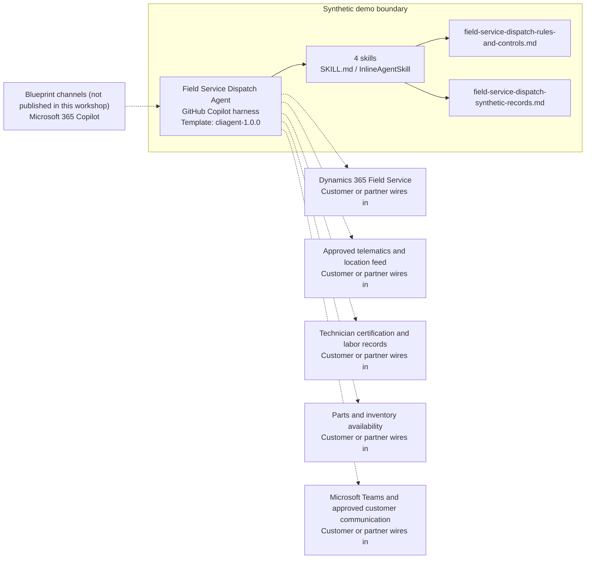

<!-- Generated by tools/build_solution_runbooks.py. Do not edit; change the sources and regenerate. -->

# Field Service Dispatch Agent — Architecture

## Solution Architecture

### Logical architecture and trust boundary

Solid: synthetic design. Dashed: unwired customer systems; channels unpublished.

## Component Responsibilities

| Operation | Capability | Purpose | Owner |
| --- | --- | --- | --- |
| dispatch_dashboard | Priority request dashboard | Ranks synthetic service requests and capacity without changing a job or sending a message. | Template |
| route_optimization | Zone capacity comparison | Compares workload and capacity without rerouting a technician. | Template |
| technician_assignment | Skill-match recommendation | Identifies a qualified candidate for dispatcher review without assigning or notifying them. | Template |
| emergency_response | Emergency response draft | Prepares responder evidence behind established emergency procedures and dispatcher approval. | Template |

| Runtime reference | Recorded value |
| --- | --- |
| Portable implementation | [field_service_dispatch_agent.py](../../agents/@aibast-agents-library/energy_stacks/field_service_dispatch_stack/field_service_dispatch_agent.py) |
| Expected tool | FieldServiceDispatchAgent |
| Source SHA-256 (short) | f6006d1be6da |

## Data Contract

Approve field meaning, usage and retention before replacing synthetic examples.

| Entity | Fields the template uses | Used by | Customer system of record | Sensitivity |
| --- | --- | --- | --- | --- |
| SERVICE_REQUESTS | title; priority; type; required_certs; zone; location; equipment; estimated_hours; status | dispatch_dashboard; route_optimization; technician_assignment; emergency_response | Dynamics 365 Field Service | Operational and customer-site data; restrict to field-service staff. |
| TECHNICIANS | name; certifications; zone; status; current_location; jobs_today; max_jobs; efficiency_rating; years_experience | dispatch_dashboard; route_optimization; technician_assignment; emergency_response | Customer or partner maps | Workforce personal data, including location and performance ratings; restrict to dispatch staff. |
| GEOGRAPHIC_ZONES | states; technicians; open_requests | route_optimization | Customer or partner maps | Operational reference data; the template recomputes counts from the records. |

## Integration Points

**State: Not connected in the template.**

| System | Purpose | Skills that need it | Access | Template provides | Customer or partner wires in |
| --- | --- | --- | --- | --- | --- |
| Dynamics 365 Field Service | Service requests, status and workload in place of the synthetic snapshot. | field-service-dispatch-dispatch-dashboard; field-service-dispatch-route-optimization; field-service-dispatch-technician-assignment; field-service-dispatch-emergency-response | read-write | Request and technician contracts backed by fictional records; no job, assignment or dispatch tool. | [Wiring procedure](3.Runbook.md#step-3-1-integrate-dynamics-365-field-service) |
| Approved telematics and location feed | Current technician location for proximity and travel checks. | field-service-dispatch-route-optimization; field-service-dispatch-emergency-response | read | Fixed current_location and zone values; no live telemetry. | [Wiring procedure](3.Runbook.md#step-3-2-integrate-approved-telematics-and-location-feed) |
| Technician certification and labor records | Certifications, job limits and labor rules for candidate checks. | field-service-dispatch-technician-assignment; field-service-dispatch-emergency-response; field-service-dispatch-route-optimization | read | Certification and job-cap fields backed by fictional technicians. | [Wiring procedure](3.Runbook.md#step-3-3-integrate-technician-certification-and-labor-records) |
| Parts and inventory availability | Parts context before a human schedules or stages work. | No packaged skill; the blueprint declares this seam only | read | No inventory data or skill; the agent must never stage inventory. | [Wiring procedure](3.Runbook.md#step-3-4-integrate-parts-and-inventory-availability) |
| Microsoft Teams and approved customer communication | Dispatcher coordination and customer messages after human approval. | field-service-dispatch-emergency-response; field-service-dispatch-technician-assignment | write | Draft views with no-write footers; no notification or customer-message tool. | [Wiring procedure](3.Runbook.md#step-3-5-integrate-microsoft-teams-and-approved-customer-communication) |

## Identity and Permissions

| Template default | Customer or partner decision |
| --- | --- |
| Authentication: Microsoft Entra ID authentication; the customer selects the supported mode for the intended dispatch channel. | Confirm tenant, permitted identities and authentication enforcement. |
| Audience: Field Operations Manager; Service Director; Dispatch Coordinator; Emergency Duty Manager | Define authorized users, groups and least-privilege connection identities. |

- Require sign-in before technician location or customer-site details are shown.
- Request only the scopes that approved request, workforce and telematics sources need.
- Restrict the audience and verify access with authorized and denied identities.

## Copilot Studio Components

Copilot Studio uses the GitHub Copilot harness; skills hold reviewed behavior.

Agent metadata from [settings.mcs.yml](../../solutions/field-service-dispatch/copilot-studio/settings.mcs.yml):

| Setting | Recorded value |
| --- | --- |
| Template | cliagent-1.0.0 |
| Recognizer | CLICopilotRecognizer |
| Authoring model | CliCopilot |
| Model | Sonnet46 |

### Skill inventory

One skill per row: manual upload and source-controlled form.

| Skill | Manual upload | Source component |
| --- | --- | --- |
| field-service-dispatch-dispatch-dashboard | [SKILL.md](../../solutions/field-service-dispatch/manual/skills/aibast_dispatch-dashboard/SKILL.md) | [InlineAgentSkill](../../solutions/field-service-dispatch/copilot-studio/behaviors/aibast_field-service-dispatch-dispatch-dashboard.mcs.yml) |
| field-service-dispatch-emergency-response | [SKILL.md](../../solutions/field-service-dispatch/manual/skills/aibast_emergency-response/SKILL.md) | [InlineAgentSkill](../../solutions/field-service-dispatch/copilot-studio/behaviors/aibast_field-service-dispatch-emergency-response.mcs.yml) |
| field-service-dispatch-route-optimization | [SKILL.md](../../solutions/field-service-dispatch/manual/skills/aibast_route-optimization/SKILL.md) | [InlineAgentSkill](../../solutions/field-service-dispatch/copilot-studio/behaviors/aibast_field-service-dispatch-route-optimization.mcs.yml) |
| field-service-dispatch-technician-assignment | [SKILL.md](../../solutions/field-service-dispatch/manual/skills/aibast_technician-assignment/SKILL.md) | [InlineAgentSkill](../../solutions/field-service-dispatch/copilot-studio/behaviors/aibast_field-service-dispatch-technician-assignment.mcs.yml) |

### Knowledge inventory

| Knowledge file | Upload | Source / metadata |
| --- | --- | --- |
| field-service-dispatch-rules-and-controls.md | [Content](../../solutions/field-service-dispatch/manual/knowledge/field-service-dispatch-rules-and-controls.md) | [Source copy](../../solutions/field-service-dispatch/copilot-studio/capabilities/knowledge/files/field-service-dispatch-rules-and-controls.md) · [Metadata](../../solutions/field-service-dispatch/copilot-studio/capabilities/knowledge/files/field-service-dispatch-rules-and-controls.md.mcs.yml) |
| field-service-dispatch-synthetic-records.md | [Content](../../solutions/field-service-dispatch/manual/knowledge/field-service-dispatch-synthetic-records.md) | [Source copy](../../solutions/field-service-dispatch/copilot-studio/capabilities/knowledge/files/field-service-dispatch-synthetic-records.md) · [Metadata](../../solutions/field-service-dispatch/copilot-studio/capabilities/knowledge/files/field-service-dispatch-synthetic-records.md.mcs.yml) |

## State and Recovery

| Recovery ID | Condition | Required behavior | Owner |
| --- | --- | --- | --- |
| evidence-no-mockups | A required evidence file is missing | Stop. Capture or restore the real file; never substitute a mockup. | Template |
| failed-case-no-cherry-picking | A recorded identifier is absent | Mark the case failed and investigate; do not retry until it happens to pass. | Template |
| draft-publication-stop | Publish is offered | Stop at Draft unless a separate approver explicitly authorizes publication. | Template |
| dispatch-source-unavailable | A wired field-service system returns no verified result | Report unavailable evidence; never claim that a lookup, assignment or notification succeeded. | Customer or partner |
| no-qualified-candidate | No technician holds every required certification with remaining capacity | Report that no candidate qualifies; do not relax certification or capacity rules. | Template |
| dispatch-grounding-unavailable | The routed skill or its knowledge cannot load | Retry once in the same turn, then report the failure and stop without an uncited answer. | Template |

Promotion requires separate approval. [Package recovery guide](../../solutions/field-service-dispatch/FIELD-GUIDE.md#failure-recovery).

## Design Decisions

| Decision | Reason |
| --- | --- |
| Recommend candidates; never assign. | A human dispatcher applies safety, labor, SLA and emergency procedures. |
| Require every certification and remaining capacity before scoring. | Only fully certified technicians with capacity reach review; the score only orders them. |
| Keep emergency output a draft behind established procedures. | Dispatcher approval precedes any field action or customer notification. |
| Connect read-only first; isolate any later write. | A write tool needs authorized confirmation, current-state validation and an immutable audit event. |
| Keep exact assertions instead of a quality score. | General quality in Evaluate does not compare responses with expected answers. |

## Non-Functional Considerations

| Area | Customer or partner confirms |
| --- | --- |
| Licensing and Copilot Credits | Confirm tenant licensing and budget credits for building, Preview, evaluation and production dispatch use. |
| Capacity | Allocate approved capacity to the dispatch environment and monitor consumption before widening the audience. |
| Data residency | Approve the environment geography and any cross-region processing of workforce and location data before connecting sources. |
| Retention | Decide with the data owner whether transcripts are saved, who may view or download them, and the Dataverse retention policy. |
| Cost drivers | Measure model, knowledge, tool and harness usage by dispatch workload; synthetic runs do not estimate production cost. |

## Next

→ [Delivery runbook](3.Runbook.md) | [Solution index](../README.md)

[Sources for this page](0.Resources/README.md#sources-2architecturemd).
