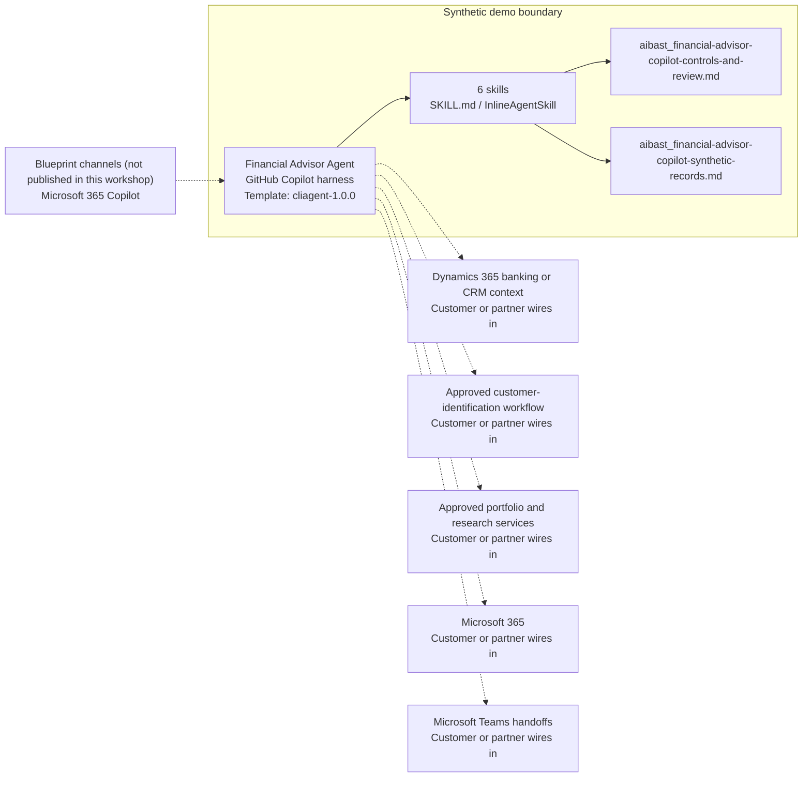

<!-- Generated by tools/build_solution_runbooks.py. Do not edit; change the sources and regenerate. -->

# Financial Advisor Agent — Architecture

## Solution Architecture

### Logical architecture and trust boundary

Solid: synthetic design. Dashed: unwired customer systems; channels unpublished.

## Component Responsibilities

| Operation | Capability | Purpose | Owner |
| --- | --- | --- | --- |
| service_intake | Service intake and routing | Prepares check-in, identity-control status, request, and proposed routing without verification or assignment. | Template |
| client_review | Client review | Summarizes the fictional book of business, advisor, risk profile, assets, and review timing. | Template |
| portfolio_summary | Portfolio context | Shows current and target allocations and drift for a selected synthetic client. | Template |
| recommendation_engine | Advisor-review considerations | Prepares nonbinding discussion candidates and allocation differences without giving advice or placing an order. | Template |
| compliance_check | Compliance checkpoints | Surfaces rule context, senior-investor controls, concentration, and drift flags for compliance review. | Template |
| advisor_handoff | Banker-to-advisor handoff | Drafts a structured transfer of request, identity status, portfolio context, and flags without moving a case. | Template |

| Runtime reference | Recorded value |
| --- | --- |
| Portable implementation | [financial_advisor_copilot_agent.py](../../agents/@aibast-agents-library/financial_services_stacks/financial_advisor_copilot_stack/financial_advisor_copilot_agent.py) |
| Expected tool | FinancialAdvisorCopilotAgent |
| Source SHA-256 (short) | b69a30049be7 |

## Data Contract

Approve field meaning, usage and retention before replacing synthetic examples.

| Entity | Fields the template uses | Used by | Customer system of record | Sensitivity |
| --- | --- | --- | --- | --- |
| CLIENT_PORTFOLIOS | name; age; risk_profile; total_assets; annual_income; annual_contributions; retirement_target; advisor; last_review; holdings | service_intake; client_review; portfolio_summary; recommendation_engine; compliance_check; advisor_handoff | Dynamics 365 banking or CRM context | Customer financial and personal data; restrict to authorized banking staff. |
| CLIENT_PORTFOLIOS.holdings | allocation; target; value | portfolio_summary; recommendation_engine; compliance_check; advisor_handoff | Approved portfolio and research services | Customer holdings; restrict to the licensed advisor and compliance. |
| INVESTMENT_RECOMMENDATIONS | action; rationale | recommendation_engine | Approved portfolio and research services | Illustrative discussion content keyed by risk profile; licensed approval precedes any use. |
| COMPLIANCE_RULES | name; description; applies_to | compliance_check | Customer or partner maps | Compliance policy reference; the compliance owner replaces the fictional rules. |
| SERVICE_REQUESTS | request; route; verification | service_intake; advisor_handoff | Dynamics 365 banking or CRM context | Customer service and identity-status data; restrict to branch staff. |

## Integration Points

**State: Not connected in the template.**

| System | Purpose | Skills that need it | Access | Template provides | Customer or partner wires in |
| --- | --- | --- | --- | --- | --- |
| Dynamics 365 banking or CRM context | Client profile, service request and advisor-book context. | service-intake; client-review; advisor-handoff | read | Client and service-request contracts backed by fictional records; no account, case or record change. | [Wiring procedure](3.Runbook.md#step-3-1-integrate-dynamics-365-banking-or-crm-context) |
| Approved customer-identification workflow | Identity verification that authorized operators complete before routing. | service-intake; advisor-handoff | read | A fixed pending authorized check; the agent never verifies identity. | [Wiring procedure](3.Runbook.md#step-3-2-integrate-approved-customer-identification-workflow) |
| Approved portfolio and research services | Holdings, targets and approved research for advisor review. | portfolio-summary; recommendation-engine; compliance-check; client-review | read | Fictional holdings and targets plus a fixed candidate list per risk profile; no research delivery or orders. | [Wiring procedure](3.Runbook.md#step-3-3-integrate-approved-portfolio-and-research-services) |
| Microsoft 365 | Controlled preparation of review material. | client-review; advisor-handoff | read-write | Draft handoff and review text only; no document, email or outreach. | [Wiring procedure](3.Runbook.md#step-3-4-integrate-microsoft-365) |
| Microsoft Teams handoffs | Banker-to-advisor handoff and review coordination. | advisor-handoff; service-intake | write | Draft handoff with request, identity status, risk context and flags; no case transfer or message. | [Wiring procedure](3.Runbook.md#step-3-5-integrate-microsoft-teams-handoffs) |

## Identity and Permissions

| Template default | Customer or partner decision |
| --- | --- |
| Authentication: Microsoft Entra ID authentication; the customer selects the supported mode for the intended branch channel. | Confirm tenant, permitted identities and authentication enforcement. |
| Audience: Branch Banker; Advisory Director; Financial Advisor; Compliance Officer | Define authorized users, groups and least-privilege connection identities. |

- Require sign-in before any client financial information is shown.
- Request only the scopes that approved customer, portfolio and identification sources need.
- Restrict the audience and verify access with authorized and denied identities.

## Copilot Studio Components

Copilot Studio uses the GitHub Copilot harness; skills hold reviewed behavior.

Agent metadata from [settings.mcs.yml](../../solutions/financial-advisor-copilot/copilot-studio/settings.mcs.yml):

| Setting | Recorded value |
| --- | --- |
| Template | cliagent-1.0.0 |
| Recognizer | CLICopilotRecognizer |
| Authoring model | CliCopilot |
| Model | Sonnet46 |

### Skill inventory

One skill per row: manual upload and source-controlled form.

| Skill | Manual upload | Source component |
| --- | --- | --- |
| advisor-handoff | [SKILL.md](../../solutions/financial-advisor-copilot/manual/skills/aibast_advisor-handoff_06/SKILL.md) | [InlineAgentSkill](../../solutions/financial-advisor-copilot/copilot-studio/behaviors/aibast_advisor-handoff.mcs.yml) |
| client-review | [SKILL.md](../../solutions/financial-advisor-copilot/manual/skills/aibast_client-review_02/SKILL.md) | [InlineAgentSkill](../../solutions/financial-advisor-copilot/copilot-studio/behaviors/aibast_client-review.mcs.yml) |
| compliance-check | [SKILL.md](../../solutions/financial-advisor-copilot/manual/skills/aibast_compliance-check_05/SKILL.md) | [InlineAgentSkill](../../solutions/financial-advisor-copilot/copilot-studio/behaviors/aibast_compliance-check.mcs.yml) |
| portfolio-summary | [SKILL.md](../../solutions/financial-advisor-copilot/manual/skills/aibast_portfolio-summary_03/SKILL.md) | [InlineAgentSkill](../../solutions/financial-advisor-copilot/copilot-studio/behaviors/aibast_portfolio-summary.mcs.yml) |
| recommendation-engine | [SKILL.md](../../solutions/financial-advisor-copilot/manual/skills/aibast_recommendation-engine_04/SKILL.md) | [InlineAgentSkill](../../solutions/financial-advisor-copilot/copilot-studio/behaviors/aibast_recommendation-engine.mcs.yml) |
| service-intake | [SKILL.md](../../solutions/financial-advisor-copilot/manual/skills/aibast_service-intake_01/SKILL.md) | [InlineAgentSkill](../../solutions/financial-advisor-copilot/copilot-studio/behaviors/aibast_service-intake.mcs.yml) |

### Knowledge inventory

| Knowledge file | Upload | Source / metadata |
| --- | --- | --- |
| aibast_financial-advisor-copilot-controls-and-review.md | [Content](../../solutions/financial-advisor-copilot/manual/knowledge/aibast_financial-advisor-copilot-controls-and-review.md) | [Source copy](../../solutions/financial-advisor-copilot/copilot-studio/capabilities/knowledge/files/aibast_financial-advisor-copilot-controls-and-review.md) · [Metadata](../../solutions/financial-advisor-copilot/copilot-studio/capabilities/knowledge/files/aibast_financial-advisor-copilot-controls-and-review.md.mcs.yml) |
| aibast_financial-advisor-copilot-synthetic-records.md | [Content](../../solutions/financial-advisor-copilot/manual/knowledge/aibast_financial-advisor-copilot-synthetic-records.md) | [Source copy](../../solutions/financial-advisor-copilot/copilot-studio/capabilities/knowledge/files/aibast_financial-advisor-copilot-synthetic-records.md) · [Metadata](../../solutions/financial-advisor-copilot/copilot-studio/capabilities/knowledge/files/aibast_financial-advisor-copilot-synthetic-records.md.mcs.yml) |

## State and Recovery

| Recovery ID | Condition | Required behavior | Owner |
| --- | --- | --- | --- |
| evidence-no-mockups | A required evidence file is missing | Stop. Capture or restore the real file; never substitute a mockup. | Template |
| failed-case-no-cherry-picking | A recorded identifier is absent | Mark the case failed and investigate; do not retry until it happens to pass. | Template |
| draft-publication-stop | Publish is offered | Stop at Draft unless a separate approver explicitly authorizes publication. | Template |
| banking-source-unavailable | A wired banking or portfolio system returns no verified result | Report unavailable evidence; never claim that a lookup, verification or handoff succeeded. | Customer or partner |
| client-record-unclear | The client is unknown or outside the caller's approved access | Reject the identifier or clarify it; never disclose or substitute another client's record. | Customer or partner |
| advisory-grounding-unavailable | The routed skill or its knowledge cannot load | Retry once in the same turn, then report the failure and stop without an uncited answer. | Template |

Promotion requires separate approval. [Package recovery guide](../../solutions/financial-advisor-copilot/FIELD-GUIDE.md#failure-recovery).

## Design Decisions

| Decision | Reason |
| --- | --- |
| Separate recorded context, calculated drift or flags, discussion candidates and handoff steps. | Reviewers must see which parts are evidence and which need a licensed decision. |
| Reject unknown client IDs without substitution. | A substituted client would expose the wrong financial record. |
| End substantive answers with the fixed no-action footer. | It states that no verification, advice, account action, transfer, order or transaction occurred. |
| Treat every production connection as a future governed seam. | The package has no live read or write permission and no external side effect. |
| Keep exact assertions instead of a quality score. | General quality in Evaluate does not compare responses with expected answers. |

## Non-Functional Considerations

| Area | Customer or partner confirms |
| --- | --- |
| Licensing and Copilot Credits | Confirm tenant licensing and budget credits for building, Preview, evaluation and production advisory use. |
| Capacity | Allocate approved capacity to the advisory environment and monitor consumption before widening the audience. |
| Data residency | Approve the environment geography and any cross-region processing of client financial data before connecting sources. |
| Retention | Decide with the records owner whether transcripts are saved, who may view or download them, and the Dataverse retention policy. |
| Cost drivers | Measure model, knowledge, tool and harness usage by advisory workload; synthetic runs do not estimate production cost. |

## Next

→ [Delivery runbook](3.Runbook.md) | [Solution index](../README.md)

[Sources for this page](0.Resources/README.md#sources-2architecturemd).
