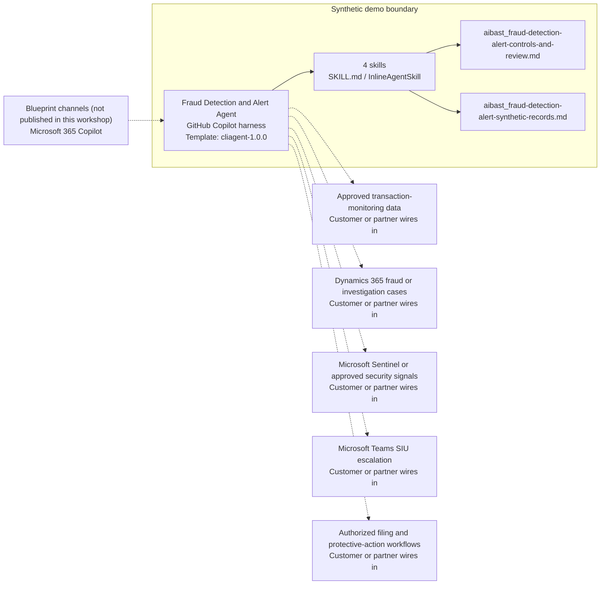

<!-- Generated by tools/build_solution_runbooks.py. Do not edit; change the sources and regenerate. -->

# Fraud Detection and Alert Agent — Architecture

## Solution Architecture

### Logical architecture and trust boundary

Solid: synthetic design. Dashed: unwired customer systems; channels unpublished.

## Component Responsibilities

| Operation | Capability | Purpose | Owner |
| --- | --- | --- | --- |
| alert_triage | Alert triage | Prioritizes fictional alerts by transparent risk evidence and rule severity. | Template |
| transaction_analysis | Transaction evidence review | Summarizes monitored transactions and account-level activity for investigation. | Template |
| pattern_detection | Fraud-pattern hypotheses | Compares active cases with known indicators without declaring fraud. | Template |
| investigation_summary | Case preparation and routing | Builds a review-ready case summary and proposed queue without taking a protective or filing action. | Template |

| Runtime reference | Recorded value |
| --- | --- |
| Portable implementation | [fraud_detection_alert_agent.py](../../agents/@aibast-agents-library/financial_services_stacks/fraud_detection_alert_stack/fraud_detection_alert_agent.py) |
| Expected tool | FraudDetectionAlertAgent |
| Source SHA-256 (short) | da09e0e8d345 |

## Data Contract

Approve field meaning, usage and retention before replacing synthetic examples.

| Entity | Fields the template uses | Used by | Customer system of record | Sensitivity |
| --- | --- | --- | --- | --- |
| TRANSACTIONS | account; cardholder; amount; merchant; category; country; timestamp; channel; risk_score | alert_triage; transaction_analysis; investigation_summary | Approved transaction-monitoring data | Cardholder financial data with masked account numbers; restrict to fraud investigators. |
| ALERT_RULES | name; description; threshold; severity | alert_triage; investigation_summary | Customer or partner maps | Detection policy; restrict to fraud operations staff. |
| FRAUD_PATTERNS | description; indicators; frequency | pattern_detection | Customer or partner maps | Investigative reference; indicators are hypotheses, not findings. |
| INVESTIGATION_CASES | alert_txns; rules_triggered; pattern; status; analyst; opened; priority; notes | pattern_detection; investigation_summary | Dynamics 365 fraud or investigation cases | Confidential investigation records naming staff and customers; need-to-know access. |

## Integration Points

**State: Not connected in the template.**

| System | Purpose | Skills that need it | Access | Template provides | Customer or partner wires in |
| --- | --- | --- | --- | --- | --- |
| Approved transaction-monitoring data | Monitored transactions, risk scores and rule hits in place of the synthetic snapshot. | alert-triage; transaction-analysis; investigation-summary | read | Transaction and rule contracts backed by fictional records; no live monitoring feed. | [Wiring procedure](3.Runbook.md#step-3-1-integrate-approved-transaction-monitoring-data) |
| Dynamics 365 fraud or investigation cases | Case status, notes and routing for investigator review. | investigation-summary; pattern-detection | read-write | Case contracts and a proposed queue backed by fictional cases; no case creation or routing. | [Wiring procedure](3.Runbook.md#step-3-2-integrate-dynamics-365-fraud-or-investigation-cases) |
| Microsoft Sentinel or approved security signals | Security signals, such as credential or sign-in events, that corroborate an alert. | pattern-detection; investigation-summary | read | Pattern indicators and fixed case notes; no security-signal feed. | [Wiring procedure](3.Runbook.md#step-3-3-integrate-microsoft-sentinel-or-approved-security-signals) |
| Microsoft Teams SIU escalation | SIU and operations escalation after investigator review. | investigation-summary; alert-triage | write | A proposed SIU or Fraud Operations queue in the case summary; no message or routing tool. | [Wiring procedure](3.Runbook.md#step-3-4-integrate-microsoft-teams-siu-escalation) |
| Authorized filing and protective-action workflows | Filings and card, account or payment actions that authorized owners perform. | investigation-summary | write | Proposed actions recorded as pending authorization; no block, release, payment or filing tool. | [Wiring procedure](3.Runbook.md#step-3-5-integrate-authorized-filing-and-protective-action-workflows) |

## Identity and Permissions

| Template default | Customer or partner decision |
| --- | --- |
| Authentication: Microsoft Entra ID authentication; the customer selects the supported mode for the intended investigator channel. | Confirm tenant, permitted identities and authentication enforcement. |
| Audience: Fraud Operations Manager; Fraud Analyst; SIU Investigator; Risk Leader | Define authorized users, groups and least-privilege connection identities. |

- Require sign-in before any cardholder or case information is shown.
- Request only the scopes that approved monitoring, case and signal sources need.
- Restrict the audience and verify access with authorized and denied identities.

## Copilot Studio Components

Copilot Studio uses the GitHub Copilot harness; skills hold reviewed behavior.

Agent metadata from [settings.mcs.yml](../../solutions/fraud-detection-alert/copilot-studio/settings.mcs.yml):

| Setting | Recorded value |
| --- | --- |
| Template | cliagent-1.0.0 |
| Recognizer | CLICopilotRecognizer |
| Authoring model | CliCopilot |
| Model | Sonnet46 |

### Skill inventory

One skill per row: manual upload and source-controlled form.

| Skill | Manual upload | Source component |
| --- | --- | --- |
| alert-triage | [SKILL.md](../../solutions/fraud-detection-alert/manual/skills/aibast_alert-triage_01/SKILL.md) | [InlineAgentSkill](../../solutions/fraud-detection-alert/copilot-studio/behaviors/aibast_alert-triage.mcs.yml) |
| investigation-summary | [SKILL.md](../../solutions/fraud-detection-alert/manual/skills/aibast_investigation-summary_04/SKILL.md) | [InlineAgentSkill](../../solutions/fraud-detection-alert/copilot-studio/behaviors/aibast_investigation-summary.mcs.yml) |
| pattern-detection | [SKILL.md](../../solutions/fraud-detection-alert/manual/skills/aibast_pattern-detection_03/SKILL.md) | [InlineAgentSkill](../../solutions/fraud-detection-alert/copilot-studio/behaviors/aibast_pattern-detection.mcs.yml) |
| transaction-analysis | [SKILL.md](../../solutions/fraud-detection-alert/manual/skills/aibast_transaction-analysis_02/SKILL.md) | [InlineAgentSkill](../../solutions/fraud-detection-alert/copilot-studio/behaviors/aibast_transaction-analysis.mcs.yml) |

### Knowledge inventory

| Knowledge file | Upload | Source / metadata |
| --- | --- | --- |
| aibast_fraud-detection-alert-controls-and-review.md | [Content](../../solutions/fraud-detection-alert/manual/knowledge/aibast_fraud-detection-alert-controls-and-review.md) | [Source copy](../../solutions/fraud-detection-alert/copilot-studio/capabilities/knowledge/files/aibast_fraud-detection-alert-controls-and-review.md) · [Metadata](../../solutions/fraud-detection-alert/copilot-studio/capabilities/knowledge/files/aibast_fraud-detection-alert-controls-and-review.md.mcs.yml) |
| aibast_fraud-detection-alert-synthetic-records.md | [Content](../../solutions/fraud-detection-alert/manual/knowledge/aibast_fraud-detection-alert-synthetic-records.md) | [Source copy](../../solutions/fraud-detection-alert/copilot-studio/capabilities/knowledge/files/aibast_fraud-detection-alert-synthetic-records.md) · [Metadata](../../solutions/fraud-detection-alert/copilot-studio/capabilities/knowledge/files/aibast_fraud-detection-alert-synthetic-records.md.mcs.yml) |

## State and Recovery

| Recovery ID | Condition | Required behavior | Owner |
| --- | --- | --- | --- |
| evidence-no-mockups | A required evidence file is missing | Stop. Capture or restore the real file; never substitute a mockup. | Template |
| failed-case-no-cherry-picking | A recorded identifier is absent | Mark the case failed and investigate; do not retry until it happens to pass. | Template |
| draft-publication-stop | Publish is offered | Stop at Draft unless a separate approver explicitly authorizes publication. | Template |
| fraud-source-unavailable | A wired monitoring, case or signal system returns no verified result | Report unavailable evidence; never claim that a lookup, block or filing succeeded. | Customer or partner |
| fraud-record-unknown | A requested case or account is not in the records | Say that no synthetic record exists and use no substitute. | Template |
| fraud-grounding-unavailable | The routed skill or its knowledge cannot load | Retry once in the same turn, then report the failure and stop without an uncited answer. | Template |

Promotion requires separate approval. [Package recovery guide](../../solutions/fraud-detection-alert/FIELD-GUIDE.md#failure-recovery).

## Design Decisions

| Decision | Reason |
| --- | --- |
| Treat scores, rules and patterns as signals, never proof. | Only authorized investigators determine fraud. |
| Separate observed transactions, triggered rules, pattern hypotheses and proposed review actions. | Investigators must see which parts are evidence and which still need authority. |
| Reject unknown case and account identifiers. | A substituted record would put another customer's activity into a case. |
| Treat every production connection as a future governed seam. | The package has no live read or write permission and no external side effect. |
| Keep exact assertions instead of a quality score. | General quality in Evaluate does not compare responses with expected answers. |

## Non-Functional Considerations

| Area | Customer or partner confirms |
| --- | --- |
| Licensing and Copilot Credits | Confirm tenant licensing and budget credits for building, Preview, evaluation and production investigation use. |
| Capacity | Allocate approved capacity to the fraud environment and monitor consumption before widening the audience. |
| Data residency | Approve the environment geography and any cross-region processing of cardholder and case data before connecting sources. |
| Retention | Decide with the records owner whether transcripts are saved, who may view or download them, and the Dataverse retention policy. |
| Cost drivers | Measure model, knowledge, tool and harness usage by investigation workload; synthetic runs do not estimate production cost. |

## Next

→ [Delivery runbook](3.Runbook.md) | [Solution index](../README.md)

[Sources for this page](0.Resources/README.md#sources-2architecturemd).
