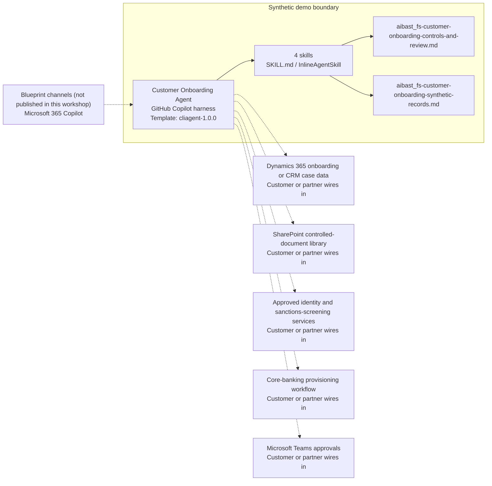

<!-- Generated by tools/build_solution_runbooks.py. Do not edit; change the sources and regenerate. -->

# Customer Onboarding Agent — Architecture

## Solution Architecture

### Logical architecture and trust boundary

Solid: synthetic design. Dashed: unwired customer systems; channels unpublished.

## Component Responsibilities

| Operation | Capability | Purpose | Owner |
| --- | --- | --- | --- |
| kyc_verification | KYC evidence review | Summarizes identity, sanctions, PEP, adverse-media, and enhanced-due-diligence evidence without verifying a real person. | Template |
| account_setup | Account setup preparation | Builds a review-ready service configuration reference without opening or provisioning an account. | Template |
| document_checklist | Document readiness | Creates an applicant-specific KYC document checklist for authorized review. | Template |
| onboarding_status | Onboarding pipeline | Surfaces application status, risk tier, owner, and next-review context across the synthetic pipeline. | Template |

| Runtime reference | Recorded value |
| --- | --- |
| Portable implementation | [customer_onboarding_fs_agent.py](../../agents/@aibast-agents-library/financial_services_stacks/customer_onboarding_fs_stack/customer_onboarding_fs_agent.py) |
| Expected tool | FSCustomerOnboardingAgent |
| Source SHA-256 (short) | d2cd60c21ae2 |

## Data Contract

Approve field meaning, usage and retention before replacing synthetic examples.

| Entity | Fields the template uses | Used by | Customer system of record | Sensitivity |
| --- | --- | --- | --- | --- |
| CUSTOMER_APPLICATIONS | applicant; application_type; account_requested; submitted; status; risk_rating; relationship_manager; estimated_assets | kyc_verification; account_setup; document_checklist; onboarding_status | Dynamics 365 onboarding or CRM case data | Applicant personal and financial data; restrict to onboarding staff. |
| VERIFICATION_STATUS | id_verification; ssn_verification; address_verification; ein_verification; beneficial_ownership; ofac_screening; pep_screening; adverse_media; source_of_wealth | kyc_verification; document_checklist; onboarding_status | Approved identity and sanctions-screening services | Identity and screening results, including PEP status; strict need-to-know access. |
| KYC_DOCUMENTS | document; required | document_checklist | Customer or partner maps | Document-requirement policy; packaged rules are not current legal advice. |
| ACCOUNT_TYPES | min_deposit; monthly_fee; apy; features | account_setup | Customer or partner maps | Product terms; the product owner replaces the fictional values. |

## Integration Points

**State: Not connected in the template.**

| System | Purpose | Skills that need it | Access | Template provides | Customer or partner wires in |
| --- | --- | --- | --- | --- | --- |
| Dynamics 365 onboarding or CRM case data | Onboarding cases, status, risk tier and owners. | kyc-verification; account-setup; document-checklist; onboarding-status | read | Application contracts backed by fictional records; no status change or record update. | [Wiring procedure](3.Runbook.md#step-3-1-integrate-dynamics-365-onboarding-or-crm-case-data) |
| SharePoint controlled-document library | Controlled onboarding documents and document-requirement policy. | document-checklist | read | Document-type lists and packaged rules; no document content or receipt status. | [Wiring procedure](3.Runbook.md#step-3-2-integrate-sharepoint-controlled-document-library) |
| Approved identity and sanctions-screening services | Identity, OFAC, PEP and adverse-media check results. | kyc-verification; onboarding-status | read | Fixed check statuses; the agent never verifies identity or clears screening. | [Wiring procedure](3.Runbook.md#step-3-3-integrate-approved-identity-and-sanctions-screening-services) |
| Core-banking provisioning workflow | Account opening and service provisioning after authorized approval. | account-setup | write | A review-ready configuration reference; no opening or provisioning tool. | [Wiring procedure](3.Runbook.md#step-3-4-integrate-core-banking-provisioning-workflow) |
| Microsoft Teams approvals | Reviewer escalation and approval routing. | kyc-verification; account-setup; onboarding-status | write | Named owners and required human gates in each answer; no message or approval tool. | [Wiring procedure](3.Runbook.md#step-3-5-integrate-microsoft-teams-approvals) |

## Identity and Permissions

| Template default | Customer or partner decision |
| --- | --- |
| Authentication: Microsoft Entra ID authentication; the customer selects the supported mode for the intended onboarding channel. | Confirm tenant, permitted identities and authentication enforcement. |
| Audience: Onboarding Specialist; Relationship Manager; Compliance Officer; Head of Onboarding | Define authorized users, groups and least-privilege connection identities. |

- Require sign-in before any applicant identity or screening information is shown.
- Request only the scopes that approved case, document and screening sources need.
- Restrict the audience and verify access with authorized and denied identities.

## Copilot Studio Components

Copilot Studio uses the GitHub Copilot harness; skills hold reviewed behavior.

Agent metadata from [settings.mcs.yml](../../solutions/fs-customer-onboarding/copilot-studio/settings.mcs.yml):

| Setting | Recorded value |
| --- | --- |
| Template | cliagent-1.0.0 |
| Recognizer | CLICopilotRecognizer |
| Authoring model | CliCopilot |
| Model | Sonnet46 |

### Skill inventory

One skill per row: manual upload and source-controlled form.

| Skill | Manual upload | Source component |
| --- | --- | --- |
| account-setup | [SKILL.md](../../solutions/fs-customer-onboarding/manual/skills/aibast_account-setup_02/SKILL.md) | [InlineAgentSkill](../../solutions/fs-customer-onboarding/copilot-studio/behaviors/aibast_account-setup.mcs.yml) |
| document-checklist | [SKILL.md](../../solutions/fs-customer-onboarding/manual/skills/aibast_document-checklist_03/SKILL.md) | [InlineAgentSkill](../../solutions/fs-customer-onboarding/copilot-studio/behaviors/aibast_document-checklist.mcs.yml) |
| kyc-verification | [SKILL.md](../../solutions/fs-customer-onboarding/manual/skills/aibast_kyc-verification_01/SKILL.md) | [InlineAgentSkill](../../solutions/fs-customer-onboarding/copilot-studio/behaviors/aibast_kyc-verification.mcs.yml) |
| onboarding-status | [SKILL.md](../../solutions/fs-customer-onboarding/manual/skills/aibast_onboarding-status_04/SKILL.md) | [InlineAgentSkill](../../solutions/fs-customer-onboarding/copilot-studio/behaviors/aibast_onboarding-status.mcs.yml) |

### Knowledge inventory

| Knowledge file | Upload | Source / metadata |
| --- | --- | --- |
| aibast_fs-customer-onboarding-controls-and-review.md | [Content](../../solutions/fs-customer-onboarding/manual/knowledge/aibast_fs-customer-onboarding-controls-and-review.md) | [Source copy](../../solutions/fs-customer-onboarding/copilot-studio/capabilities/knowledge/files/aibast_fs-customer-onboarding-controls-and-review.md) · [Metadata](../../solutions/fs-customer-onboarding/copilot-studio/capabilities/knowledge/files/aibast_fs-customer-onboarding-controls-and-review.md.mcs.yml) |
| aibast_fs-customer-onboarding-synthetic-records.md | [Content](../../solutions/fs-customer-onboarding/manual/knowledge/aibast_fs-customer-onboarding-synthetic-records.md) | [Source copy](../../solutions/fs-customer-onboarding/copilot-studio/capabilities/knowledge/files/aibast_fs-customer-onboarding-synthetic-records.md) · [Metadata](../../solutions/fs-customer-onboarding/copilot-studio/capabilities/knowledge/files/aibast_fs-customer-onboarding-synthetic-records.md.mcs.yml) |

## State and Recovery

| Recovery ID | Condition | Required behavior | Owner |
| --- | --- | --- | --- |
| evidence-no-mockups | A required evidence file is missing | Stop. Capture or restore the real file; never substitute a mockup. | Template |
| failed-case-no-cherry-picking | A recorded identifier is absent | Mark the case failed and investigate; do not retry until it happens to pass. | Template |
| draft-publication-stop | Publish is offered | Stop at Draft unless a separate approver explicitly authorizes publication. | Template |
| onboarding-source-unavailable | A wired case, document or screening system returns no verified result | Report unavailable evidence; never claim that a lookup, verification or provisioning succeeded. | Customer or partner |
| onboarding-evidence-absent | Requested evidence is not in the packaged snapshot | Say that it is not present; never infer it or substitute another application. | Template |
| pending-evidence | Manual Preview evidence is recorded as pending or reshoot-required | Treat it as not proof and never describe it as captured. | Template |

Promotion requires separate approval. [Package recovery guide](../../solutions/fs-customer-onboarding/FIELD-GUIDE.md#failure-recovery).

## Design Decisions

| Decision | Reason |
| --- | --- |
| Use minimal locked skills for the KYC and document cases. | Generic routing invented checks, evidence receipt and outreach until minimal skills replaced it. |
| Separate observed checks, missing evidence, prepared configuration and proposed review. | Reviewers must see what the snapshot establishes and which human gate applies. |
| Treat account and service output as preparation only. | Authorized reviewers own verification, eligibility, consent, approval and provisioning. |
| Treat production connectors as future governed seams. | The package has no live read or write permission and no external side effect. |
| Keep exact assertions instead of a quality score. | General quality in Evaluate does not compare responses with expected answers. |

## Non-Functional Considerations

| Area | Customer or partner confirms |
| --- | --- |
| Licensing and Copilot Credits | Confirm tenant licensing and budget credits for building, Preview, evaluation and production onboarding use. |
| Capacity | Allocate approved capacity to the onboarding environment and monitor consumption before widening the audience. |
| Data residency | Approve the environment geography and any cross-region processing of applicant identity data before connecting sources. |
| Retention | Decide with the records owner whether transcripts are saved, who may view or download them, and the Dataverse retention policy. |
| Cost drivers | Measure model, knowledge, tool and harness usage by onboarding workload; synthetic runs do not estimate production cost. |

## Next

→ [Delivery runbook](3.Runbook.md) | [Solution index](../README.md)

[Sources for this page](0.Resources/README.md#sources-2architecturemd).
