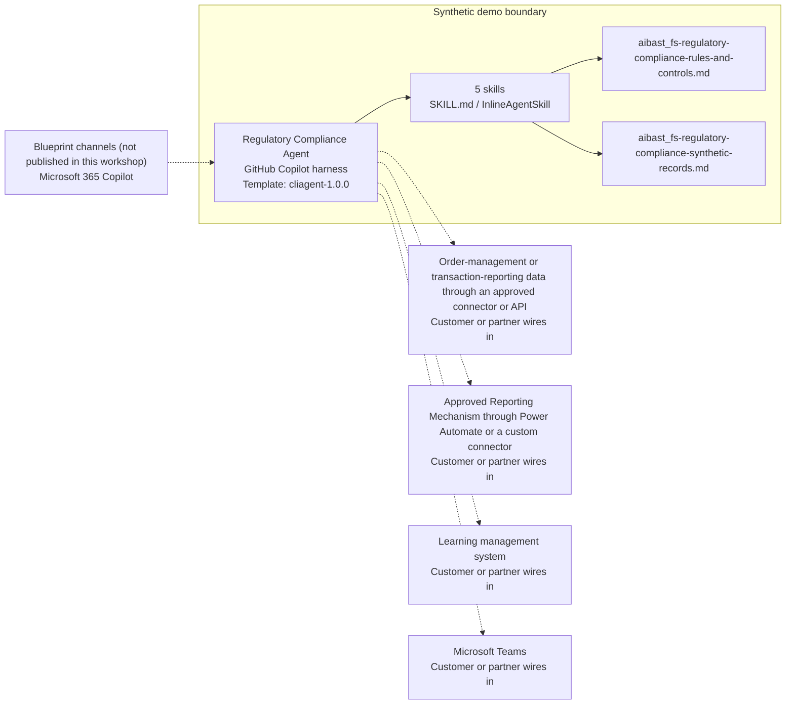

<!-- Generated by tools/build_solution_runbooks.py. Do not edit; change the sources and regenerate. -->

# Regulatory Compliance Agent — Architecture

## Solution Architecture

### Logical architecture and trust boundary

Solid: synthetic design. Dashed: unwired customer systems; channels unpublished.

## Component Responsibilities

| Operation | Capability | Purpose | Owner |
| --- | --- | --- | --- |
| compliance_dashboard | Desk-wide compliance readiness | Summarizes reporting, submission, execution-quality, algorithm-documentation, and certification risks for executive action. | Template |
| trade_surveillance | Transaction-reporting and execution surveillance | Checks required reporting fields, venue evidence, submission state, and execution-quality signals at trade level. | Template |
| documentation_review | Algorithm documentation and go-live control | Identifies incomplete, never-validated, or expired strategy documentation before or after an algorithm enters production. | Template |
| remediation_submission | Correction and submission preparation | Stages source-backed corrections and prepares new or correction-report payloads behind an explicit reviewer approval gate. | Template |
| certification_tracker | Trader certification readiness | Finds lapsed and upcoming credentials, identifies desk coverage risk, and proposes training-session and supervisor actions. | Template |

| Runtime reference | Recorded value |
| --- | --- |
| Portable implementation | [regulatory_compliance_fs_agent.py](../../agents/@aibast-agents-library/financial_services_stacks/regulatory_compliance_fs_stack/regulatory_compliance_fs_agent.py) |
| Expected tool | FSRegulatoryCompliance |
| Source SHA-256 (short) | 04ceab4ff648 |

## Data Contract

Approve field meaning, usage and retention before replacing synthetic examples.

| Entity | Fields the template uses | Used by | Customer system of record | Sensitivity |
| --- | --- | --- | --- | --- |
| Executed-trade exception snapshot | Trade; Instrument; Reported venue; Trader; Reporting evidence; Other evidence | compliance_dashboard; trade_surveillance; remediation_submission | Order-management or transaction-reporting data through an approved connector or API | Trade and trader identifiers; restrict to compliance staff and desk supervisors. |
| Algorithm documentation | Algorithm; Status on snapshot; Go-live state; Documentation evidence | compliance_dashboard; documentation_review | Customer or partner maps | Model-risk documentation; restrict to quant, risk and compliance reviewers. |
| Trader certification snapshot | Trader; Desk; Certification; Status; Next synthetic session | compliance_dashboard; certification_tracker | Learning management system | Employee credential records; restrict to supervisors and compliance. |
| Source-backed corrections | Trade; Field; Staged value; Evidence | remediation_submission | Customer or partner maps | Draft regulatory payload; transmission needs authorized approval. |

## Integration Points

**State: Not connected in the template.**

| System | Purpose | Skills that need it | Access | Template provides | Customer or partner wires in |
| --- | --- | --- | --- | --- | --- |
| Order-management or transaction-reporting data through an approved connector or API | Executed trades, reporting fields, venue evidence and execution quality. | compliance-dashboard-and-audit-readiness; trade-reporting-and-execution-surveillance; regulatory-correction-and-submission-preparation | read | Trade exception records backed by fictional data; no live trade query. | [Wiring procedure](3.Runbook.md#step-3-1-integrate-order-management-or-transaction-reporting-data-through-an-approved-connector-or-api) |
| Approved Reporting Mechanism through Power Automate or a custom connector | Transmission of approved new and correction reports. | regulatory-correction-and-submission-preparation; trade-reporting-and-execution-surveillance | read-write | Staged dry-run payloads with evidence sources; no transmission tool. | [Wiring procedure](3.Runbook.md#step-3-2-integrate-approved-reporting-mechanism-through-power-automate-or-a-custom-connector) |
| Learning management system | Trader credentials, expiries and training sessions. | trader-certification-readiness; compliance-dashboard-and-audit-readiness | read | Fixed credential and session records; no enrollment tool. | [Wiring procedure](3.Runbook.md#step-3-3-integrate-learning-management-system) |
| Microsoft Teams | Supervisor escalation and remediation approvals. | trader-certification-readiness; regulatory-correction-and-submission-preparation; algorithm-documentation-and-go-live-review | write | Named supervisors and required reviews; no notification or approval tool. | [Wiring procedure](3.Runbook.md#step-3-4-integrate-microsoft-teams) |

## Identity and Permissions

| Template default | Customer or partner decision |
| --- | --- |
| Authentication: Microsoft Entra ID authentication; the customer selects the supported mode for the intended compliance channel. | Confirm tenant, permitted identities and authentication enforcement. |
| Audience: Chief Compliance Officer; Compliance Manager; Trading Desk Supervisor; Head of Quant Execution; Chief Risk Officer | Define authorized users, groups and least-privilege connection identities. |

- Require sign-in before any trade, trader or algorithm record is shown.
- Request only the scopes that approved trade, reporting and learning sources need.
- Restrict the audience and verify access with authorized and denied identities.

## Copilot Studio Components

Copilot Studio uses the GitHub Copilot harness; skills hold reviewed behavior.

Agent metadata from [settings.mcs.yml](../../solutions/fs-regulatory-compliance/copilot-studio/settings.mcs.yml):

| Setting | Recorded value |
| --- | --- |
| Template | cliagent-1.0.0 |
| Recognizer | CLICopilotRecognizer |
| Authoring model | CliCopilot |
| Model | Sonnet46 |

### Skill inventory

One skill per row: manual upload and source-controlled form.

| Skill | Manual upload | Source component |
| --- | --- | --- |
| algorithm-documentation-and-go-live-review | [SKILL.md](../../solutions/fs-regulatory-compliance/manual/skills/aibast_documentation-review_rc03/SKILL.md) | [InlineAgentSkill](../../solutions/fs-regulatory-compliance/copilot-studio/behaviors/aibast_algorithm-documentation-and-go-live-review.mcs.yml) |
| compliance-dashboard-and-audit-readiness | [SKILL.md](../../solutions/fs-regulatory-compliance/manual/skills/aibast_compliance-dashboard_rc01/SKILL.md) | [InlineAgentSkill](../../solutions/fs-regulatory-compliance/copilot-studio/behaviors/aibast_compliance-dashboard-and-audit-readiness.mcs.yml) |
| regulatory-correction-and-submission-preparation | [SKILL.md](../../solutions/fs-regulatory-compliance/manual/skills/aibast_remediation-submission_rc04/SKILL.md) | [InlineAgentSkill](../../solutions/fs-regulatory-compliance/copilot-studio/behaviors/aibast_regulatory-correction-and-submission-preparation.mcs.yml) |
| trade-reporting-and-execution-surveillance | [SKILL.md](../../solutions/fs-regulatory-compliance/manual/skills/aibast_trade-surveillance_rc02/SKILL.md) | [InlineAgentSkill](../../solutions/fs-regulatory-compliance/copilot-studio/behaviors/aibast_trade-reporting-and-execution-surveillance.mcs.yml) |
| trader-certification-readiness | [SKILL.md](../../solutions/fs-regulatory-compliance/manual/skills/aibast_certification-tracker_rc05/SKILL.md) | [InlineAgentSkill](../../solutions/fs-regulatory-compliance/copilot-studio/behaviors/aibast_trader-certification-readiness.mcs.yml) |

### Knowledge inventory

| Knowledge file | Upload | Source / metadata |
| --- | --- | --- |
| aibast_fs-regulatory-compliance-rules-and-controls.md | [Content](../../solutions/fs-regulatory-compliance/manual/knowledge/aibast_fs-regulatory-compliance-rules-and-controls.md) | [Source copy](../../solutions/fs-regulatory-compliance/copilot-studio/capabilities/knowledge/files/aibast_fs-regulatory-compliance-rules-and-controls.md) · [Metadata](../../solutions/fs-regulatory-compliance/copilot-studio/capabilities/knowledge/files/aibast_fs-regulatory-compliance-rules-and-controls.md.mcs.yml) |
| aibast_fs-regulatory-compliance-synthetic-records.md | [Content](../../solutions/fs-regulatory-compliance/manual/knowledge/aibast_fs-regulatory-compliance-synthetic-records.md) | [Source copy](../../solutions/fs-regulatory-compliance/copilot-studio/capabilities/knowledge/files/aibast_fs-regulatory-compliance-synthetic-records.md) · [Metadata](../../solutions/fs-regulatory-compliance/copilot-studio/capabilities/knowledge/files/aibast_fs-regulatory-compliance-synthetic-records.md.mcs.yml) |

## State and Recovery

| Recovery ID | Condition | Required behavior | Owner |
| --- | --- | --- | --- |
| evidence-no-mockups | A required evidence file is missing | Stop. Capture or restore the real file; never substitute a mockup. | Template |
| failed-case-no-cherry-picking | A recorded identifier is absent | Mark the case failed and investigate; do not retry until it happens to pass. | Template |
| draft-publication-stop | Publish is offered | Stop at Draft unless a separate approver explicitly authorizes publication. | Template |
| compliance-source-unavailable | A wired trade, reporting or learning system returns no verified result | Report unavailable evidence; never claim that a lookup, transmission or enrollment succeeded. | Customer or partner |
| correction-value-absent | A correction has no source-backed value | Do not stage it; report that the source value is missing. | Template |
| knowledge-claimed-absent | The agent reports that attached knowledge is missing | Load the matching skill and retrieve the attached knowledge; do not switch to search or upload requests. | Template |

Promotion requires separate approval. [Package recovery guide](../../solutions/fs-regulatory-compliance/FIELD-GUIDE.md#failure-recovery).

## Design Decisions

| Decision | Reason |
| --- | --- |
| Keep reporting, execution, documentation, certification and submission controls separate. | Each has its own evidence, owner and approval path. |
| Stage corrections only from source-backed values. | A correction without a source value, or with an arbitrary venue, would be invented evidence. |
| Fix the snapshot date. | Recalculating lapse or expiry from today would change the recorded evidence. |
| Load the matching skill before any generic helper. | Search-before-answer once led the agent to claim the attached knowledge was absent. |
| Keep exact assertions instead of a quality score. | General quality in Evaluate does not compare responses with expected answers. |

## Non-Functional Considerations

| Area | Customer or partner confirms |
| --- | --- |
| Licensing and Copilot Credits | Confirm tenant licensing and budget credits for building, Preview, evaluation and production compliance use. |
| Capacity | Allocate approved capacity to the compliance environment and monitor consumption before widening the audience. |
| Data residency | Approve the environment geography and any cross-region processing of trade and trader data before connecting sources. |
| Retention | Decide with the records owner whether transcripts are saved, who may view or download them, and the Dataverse retention policy. |
| Cost drivers | Measure model, knowledge, tool and harness usage by compliance workload; synthetic runs do not estimate production cost. |

## Next

→ [Delivery runbook](3.Runbook.md) | [Solution index](../README.md)

[Sources for this page](0.Resources/README.md#sources-2architecturemd).
