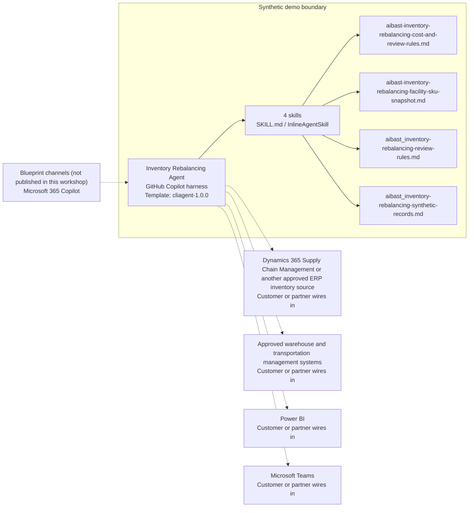

<!-- Generated by tools/build_solution_runbooks.py. Do not edit; change the sources and regenerate. -->

# Inventory Rebalancing Agent — Architecture

## Solution Architecture

### Logical architecture and trust boundary

Solid: synthetic design. Dashed: unwired customer systems; channels unpublished.

## Component Responsibilities

| Operation | Capability | Purpose | Owner |
| --- | --- | --- | --- |
| inventory_snapshot | Inventory and capacity overview | Summarizes facility utilization, SKU levels, reorder exposure, and inventory value from approved records. | Template |
| rebalance_recommendation | Portfolio classification and imbalance review | Explains forecast-relative shortages and excess alongside synthetic velocity, strategic-value, and lifecycle signals. | Template |
| transfer_plan | Proposed transfer planning | Prepares review-ready inter-warehouse movement options without reserving, picking, shipping, or moving inventory. | Template |
| cost_analysis | Inventory planning trade-off analysis | Compares synthetic holding, shortage, and transfer estimates while avoiding customer-outcome commitments. | Template |

| Runtime reference | Recorded value |
| --- | --- |
| Portable implementation | [inventory_rebalancing_agent.py](../../agents/@aibast-agents-library/manufacturing_stacks/inventory_rebalancing_stack/inventory_rebalancing_agent.py) |
| Expected tool | InventoryRebalancingAgent |
| Source SHA-256 (short) | 4fea9d381925 |

## Data Contract

Approve field meaning, usage and retention before replacing synthetic examples.

| Entity | Fields the template uses | Used by | Customer system of record | Sensitivity |
| --- | --- | --- | --- | --- |
| Facility snapshot | Facility ID; Facility name; Region; Capacity (pallets); Used (pallets); Utilization | inventory_snapshot; transfer_plan; cost_analysis | Approved warehouse and transportation management systems | Operational capacity data; restrict to planning staff. |
| SKU on-hand levels by facility | SKU; Description; WH-ATL; WH-ORD; WH-DFW; WH-SEA; Reorder point | inventory_snapshot; rebalance_recommendation; transfer_plan; cost_analysis | Dynamics 365 Supply Chain Management or another approved ERP inventory source | Inventory and policy data; facility columns follow the customer's sites. |
| Demand forecast by facility | SKU; WH-ATL; WH-ORD; WH-DFW; WH-SEA | rebalance_recommendation; transfer_plan; cost_analysis | Dynamics 365 Supply Chain Management or another approved ERP inventory source | Planning data; the synthetic forecast has no stated period. |
| Synthetic portfolio classification | SKU; Velocity; Strategic value; Lifecycle risk | rebalance_recommendation | Customer or partner maps | Portfolio signals; review flags, not lifecycle decisions. |
| Annual holding cost rate per pallet | Facility ID; Facility name; Annual holding cost / pallet | cost_analysis | Customer or partner maps | Finance planning rates; restrict to finance and planning reviewers. |
| SKU unit cost and weight | SKU; Unit cost; Weight (kg) | transfer_plan; cost_analysis | Customer or partner maps | Item cost data; restrict to finance and procurement. |
| Inter-facility transfer cost per kilogram | From \ To; WH-ATL; WH-ORD; WH-DFW; WH-SEA | transfer_plan; cost_analysis | Approved warehouse and transportation management systems | Freight planning rates; restrict to transportation and finance. |

## Integration Points

**State: Not connected in the template.**

| System | Purpose | Skills that need it | Access | Template provides | Customer or partner wires in |
| --- | --- | --- | --- | --- | --- |
| Dynamics 365 Supply Chain Management or another approved ERP inventory source | Inventory levels, demand forecasts and reorder policy context. | aibast-inventory-snapshot; aibast-rebalance-recommendation; aibast-transfer-plan; aibast-cost-analysis | read | SKU, forecast and reorder-point contracts backed by fictional records; no reorder or policy tool. | [Wiring procedure](3.Runbook.md#step-3-1-integrate-dynamics-365-supply-chain-management-or-another-approved-erp-inventory-source) |
| Approved warehouse and transportation management systems | Facility capacity, lanes and rates, and separately authorized execution. | aibast-inventory-snapshot; aibast-transfer-plan; aibast-cost-analysis | read-write | Facility pallet data and a fixed freight-rate matrix; no reservation, pick or shipment tool. | [Wiring procedure](3.Runbook.md#step-3-2-integrate-approved-warehouse-and-transportation-management-systems) |
| Power BI | Portfolio, facility-capacity and exposure views for planning review. | aibast-inventory-snapshot; aibast-cost-analysis | read | Tabular synthetic summaries; no report or dataset. | [Wiring procedure](3.Runbook.md#step-3-3-integrate-power-bi) |
| Microsoft Teams | Inventory, warehouse, transportation, procurement and finance review and approval. | aibast-transfer-plan; aibast-rebalance-recommendation; aibast-cost-analysis | write | Named authorization gates in each answer; no message or approval tool. | [Wiring procedure](3.Runbook.md#step-3-4-integrate-microsoft-teams) |

## Identity and Permissions

| Template default | Customer or partner decision |
| --- | --- |
| Authentication: Microsoft Entra ID authentication; the customer selects the supported mode for the intended planning channel. | Confirm tenant, permitted identities and authentication enforcement. |
| Audience: Supply Chain Manager; Inventory Manager; Procurement Manager | Define authorized users, groups and least-privilege connection identities. |

- Require sign-in before inventory, cost or forecast data is shown.
- Request only the scopes that approved ERP, warehouse and reporting sources need.
- Restrict the audience and verify access with authorized and denied identities.

## Copilot Studio Components

Copilot Studio uses the GitHub Copilot harness; skills hold reviewed behavior.

Agent metadata from [settings.mcs.yml](../../solutions/inventory-rebalancing/copilot-studio/settings.mcs.yml):

| Setting | Recorded value |
| --- | --- |
| Template | cliagent-1.0.0 |
| Recognizer | CLICopilotRecognizer |
| Authoring model | CliCopilot |
| Model | Sonnet46 |

### Skill inventory

One skill per row: manual upload and source-controlled form.

| Skill | Manual upload | Source component |
| --- | --- | --- |
| aibast-cost-analysis | [SKILL.md](../../solutions/inventory-rebalancing/manual/skills/aibast_cost_analysis/SKILL.md) | [InlineAgentSkill](../../solutions/inventory-rebalancing/copilot-studio/behaviors/aibast-cost-analysis_pv7k2q.mcs.yml) |
| aibast-inventory-snapshot | [SKILL.md](../../solutions/inventory-rebalancing/manual/skills/aibast_inventory_snapshot/SKILL.md) | [InlineAgentSkill](../../solutions/inventory-rebalancing/copilot-studio/behaviors/aibast-inventory-snapshot_pv7k2q.mcs.yml) |
| aibast-rebalance-recommendation | [SKILL.md](../../solutions/inventory-rebalancing/manual/skills/aibast_rebalance_recommendation/SKILL.md) | [InlineAgentSkill](../../solutions/inventory-rebalancing/copilot-studio/behaviors/aibast-rebalance-recommendation_pv7k2q.mcs.yml) |
| aibast-transfer-plan | [SKILL.md](../../solutions/inventory-rebalancing/manual/skills/aibast_transfer_plan/SKILL.md) | [InlineAgentSkill](../../solutions/inventory-rebalancing/copilot-studio/behaviors/aibast-transfer-plan_pv7k2q.mcs.yml) |

### Knowledge inventory

| Knowledge file | Upload | Source / metadata |
| --- | --- | --- |
| aibast-inventory-rebalancing-cost-and-review-rules.md | [Content](../../solutions/inventory-rebalancing/copilot-studio/capabilities/knowledge/files/aibast-inventory-rebalancing-cost-and-review-rules.md) | [Metadata](../../solutions/inventory-rebalancing/copilot-studio/capabilities/knowledge/files/aibast-inventory-rebalancing-cost-and-review-rules.md.mcs.yml) |
| aibast-inventory-rebalancing-facility-sku-snapshot.md | [Content](../../solutions/inventory-rebalancing/copilot-studio/capabilities/knowledge/files/aibast-inventory-rebalancing-facility-sku-snapshot.md) | [Metadata](../../solutions/inventory-rebalancing/copilot-studio/capabilities/knowledge/files/aibast-inventory-rebalancing-facility-sku-snapshot.md.mcs.yml) |
| aibast_inventory-rebalancing-review-rules.md | [Content](../../solutions/inventory-rebalancing/manual/knowledge/aibast_inventory-rebalancing-review-rules.md) | Upload is the source file |
| aibast_inventory-rebalancing-synthetic-records.md | [Content](../../solutions/inventory-rebalancing/manual/knowledge/aibast_inventory-rebalancing-synthetic-records.md) | Upload is the source file |

## State and Recovery

| Recovery ID | Condition | Required behavior | Owner |
| --- | --- | --- | --- |
| evidence-no-mockups | A required evidence file is missing | Stop. Capture or restore the real file; never substitute a mockup. | Template |
| failed-case-no-cherry-picking | A recorded identifier is absent | Mark the case failed and investigate; do not retry until it happens to pass. | Template |
| draft-publication-stop | Publish is offered | Stop at Draft unless a separate approver explicitly authorizes publication. | Template |
| planning-source-unavailable | A wired ERP, warehouse or reporting system returns no verified result | Report unavailable evidence; never claim that a lookup, reservation or movement succeeded. | Customer or partner |
| record-not-in-snapshot | A requested facility or SKU is not in the snapshot | Say so instead of guessing; never substitute another record. | Template |
| inventory-action-requested | A request would reserve, move, reorder, return or change policy | Return a proposal and name the ERP/WMS owner gate; no side effect occurs. | Template |

Promotion requires separate approval. [Package recovery guide](../../solutions/inventory-rebalancing/FIELD-GUIDE.md#failure-recovery).

## Design Decisions

| Decision | Reason |
| --- | --- |
| Recommend options only. | Inventory movement and policy changes require approved tools and authorized owners. |
| Pair the largest surplus with the largest deficit. | It keeps proposals explainable as a planning illustration, not an optimized logistics solve. |
| Keep action tools unavailable in the recommendation-only build. | Any future reservation, movement, reorder, return, disposition or policy tool needs explicit approval. |
| Keep manual uploads byte-identical to the reviewed source knowledge. | Incomplete uploads caused failures until the full reviewed files replaced them. |
| Keep exact assertions instead of a quality score. | General quality in Evaluate does not compare responses with expected answers. |

## Non-Functional Considerations

| Area | Customer or partner confirms |
| --- | --- |
| Licensing and Copilot Credits | Confirm tenant licensing and budget credits for building, Preview, evaluation and production planning use. |
| Capacity | Allocate approved capacity to the planning environment and monitor consumption before widening the audience. |
| Data residency | Approve the environment geography and any cross-region processing of inventory and cost data before connecting sources. |
| Retention | Decide with the data owner whether transcripts are saved, who may view or download them, and the Dataverse retention policy. |
| Cost drivers | Measure model, knowledge, tool and harness usage by planning workload; synthetic runs do not estimate production cost. |

## Next

→ [Delivery runbook](3.Runbook.md) | [Solution index](../README.md)

[Sources for this page](0.Resources/README.md#sources-2architecturemd).
