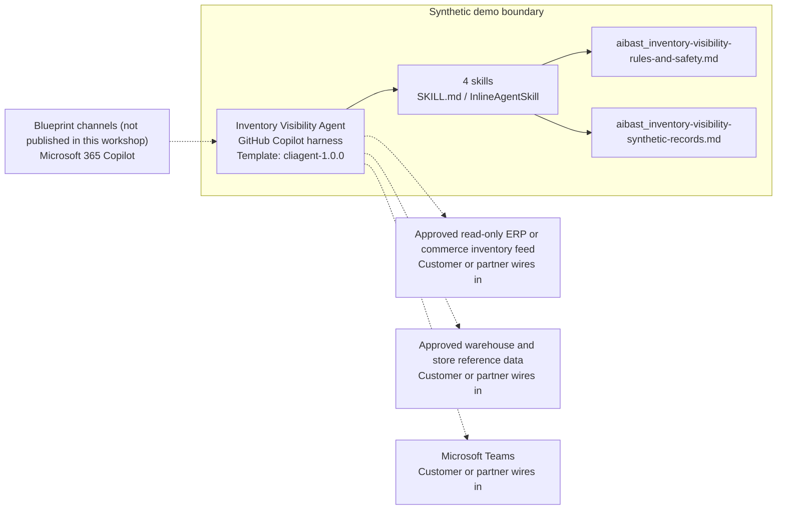

<!-- Generated by tools/build_solution_runbooks.py. Do not edit; change the sources and regenerate. -->

# Inventory Visibility Agent — Architecture

## Solution Architecture

### Logical architecture and trust boundary

Solid: synthetic design. Dashed: unwired customer systems; channels unpublished.

## Component Responsibilities

| Operation | Capability | Purpose | Owner |
| --- | --- | --- | --- |
| inventory_dashboard | Read-only inventory visibility | Shows location and SKU evidence with system-of-record verification. | Template |
| stock_alerts | Stock review candidates | Identifies exceptions without issuing transfer or replenishment commands. | Template |
| replenishment_plan | Draft replenishment scenario | Models quantities, sources, lead times, and cost without creating orders. | Template |
| channel_allocation | Channel allocation scenario | Compares planning weights without reserving or allocating stock. | Template |

| Runtime reference | Recorded value |
| --- | --- |
| Portable implementation | [inventory_visibility_agent.py](../../agents/@aibast-agents-library/retail_cpg_stacks/inventory_visibility_stack/inventory_visibility_agent.py) |
| Expected tool | InventoryVisibilityAgent |
| Source SHA-256 (short) | 1a304f4a9ca1 |

## Data Contract

Approve field meaning, usage and retention before replacing synthetic examples.

| Entity | Fields the template uses | Used by | Customer system of record | Sensitivity |
| --- | --- | --- | --- | --- |
| STORES | name; city; state; type; capacity_sqft | inventory_dashboard; stock_alerts; replenishment_plan | Approved warehouse and store reference data | Internal store reference data; the template stores are fictional. |
| WAREHOUSES | name; city; state; capacity_pallets | inventory_dashboard; replenishment_plan | Approved warehouse and store reference data | Internal network reference data. |
| SKUS | name; category; unit_cost; retail_price | inventory_dashboard; stock_alerts; replenishment_plan; channel_allocation | Approved read-only ERP or commerce inventory feed | Commercial cost and price data; restrict to approved planning roles. |
| INVENTORY | location_id; sku_id | inventory_dashboard; stock_alerts; replenishment_plan; channel_allocation | Approved read-only ERP or commerce inventory feed | Operational stock positions; verify in the system of record before action. |
| SAFETY_STOCK | location_id; sku_id | inventory_dashboard; stock_alerts | Approved read-only ERP or commerce inventory feed | Planning parameters; the customer approves real levels. |
| DAILY_SELL_THROUGH | sku_id | inventory_dashboard; stock_alerts; replenishment_plan | Customer or partner maps | Sales-rate planning input; fictional rates drive days of supply. |
| LEAD_TIMES_DAYS | location_id | replenishment_plan | Approved warehouse and store reference data | Network planning input keyed by source and destination location. |
| CHANNEL_DEMAND | weight; daily_units_avg | channel_allocation | Customer or partner maps | Commercial planning assumptions; weights are fictional. |
| Operation request | operation; sku_id; location_id; persona; data_source | inventory_dashboard; stock_alerts; replenishment_plan; channel_allocation | Customer or partner maps | Request parameters; the template accepts only the synthetic data source. |

## Integration Points

**State: Not connected in the template.**

| System | Purpose | Skills that need it | Access | Template provides | Customer or partner wires in |
| --- | --- | --- | --- | --- | --- |
| Approved read-only ERP or commerce inventory feed | On-hand, safety-stock, sell-through and product data for every view. | read-only-inventory-visibility; store-stock-review-candidates; draft-replenishment-scenario; category-channel-allocation-scenario | read | Four operation contracts backed by fixed synthetic SKU and stock records; no live feed. | [Wiring procedure](3.Runbook.md#step-3-1-integrate-approved-read-only-erp-or-commerce-inventory-feed) |
| Approved warehouse and store reference data | Store and warehouse identity, capacity and lead-time reference data. | read-only-inventory-visibility; store-stock-review-candidates; draft-replenishment-scenario | read | Fictional store, warehouse and lead-time records behind the location views and replenishment scenario. | [Wiring procedure](3.Runbook.md#step-3-2-integrate-approved-warehouse-and-store-reference-data) |
| Microsoft Teams | Governed planning review with operators. | store-stock-review-candidates; draft-replenishment-scenario; category-channel-allocation-scenario | write | Review candidates and scenarios for operators; no message, workflow or inventory decision. | [Wiring procedure](3.Runbook.md#step-3-3-integrate-microsoft-teams) |

## Identity and Permissions

| Template default | Customer or partner decision |
| --- | --- |
| Authentication: Microsoft Entra ID authentication; the customer selects the supported mode for the intended planning channel. | Confirm tenant, permitted identities and authentication enforcement. |
| Audience: Inventory Planners; Store Managers; Category Managers | Define authorized users, groups and least-privilege connection identities. |

- Require sign-in before showing inventory, cost or price information.
- Request only the read scopes needed for approved inventory and reference data.
- Restrict the audience and verify access with authorized and denied identities.

## Copilot Studio Components

Copilot Studio uses the GitHub Copilot harness; skills hold reviewed behavior.

Agent metadata from [settings.mcs.yml](../../solutions/inventory-visibility/copilot-studio/settings.mcs.yml):

| Setting | Recorded value |
| --- | --- |
| Template | cliagent-1.0.0 |
| Recognizer | CLICopilotRecognizer |
| Authoring model | CliCopilot |
| Model | Sonnet46 |

### Skill inventory

One skill per row: manual upload and source-controlled form.

| Skill | Manual upload | Source component |
| --- | --- | --- |
| category-channel-allocation-scenario | [SKILL.md](../../solutions/inventory-visibility/manual/skills/channel-allocation/SKILL.md) | [InlineAgentSkill](../../solutions/inventory-visibility/copilot-studio/behaviors/aibast_category-channel-allocation-scenario.mcs.yml) |
| draft-replenishment-scenario | [SKILL.md](../../solutions/inventory-visibility/manual/skills/replenishment-plan/SKILL.md) | [InlineAgentSkill](../../solutions/inventory-visibility/copilot-studio/behaviors/aibast_draft-replenishment-scenario.mcs.yml) |
| read-only-inventory-visibility | [SKILL.md](../../solutions/inventory-visibility/manual/skills/inventory-dashboard/SKILL.md) | [InlineAgentSkill](../../solutions/inventory-visibility/copilot-studio/behaviors/aibast_read-only-inventory-visibility.mcs.yml) |
| store-stock-review-candidates | [SKILL.md](../../solutions/inventory-visibility/manual/skills/stock-alerts/SKILL.md) | [InlineAgentSkill](../../solutions/inventory-visibility/copilot-studio/behaviors/aibast_store-stock-review-candidates.mcs.yml) |

### Knowledge inventory

| Knowledge file | Upload | Source / metadata |
| --- | --- | --- |
| aibast_inventory-visibility-rules-and-safety.md | [Content](../../solutions/inventory-visibility/manual/knowledge/aibast_inventory-visibility-rules-and-safety.md) | [Source copy](../../solutions/inventory-visibility/copilot-studio/capabilities/knowledge/files/aibast_inventory-visibility-rules-and-safety.md) · [Metadata](../../solutions/inventory-visibility/copilot-studio/capabilities/knowledge/files/aibast_inventory-visibility-rules-and-safety.md.mcs.yml) |
| aibast_inventory-visibility-synthetic-records.md | [Content](../../solutions/inventory-visibility/manual/knowledge/aibast_inventory-visibility-synthetic-records.md) | [Source copy](../../solutions/inventory-visibility/copilot-studio/capabilities/knowledge/files/aibast_inventory-visibility-synthetic-records.md) · [Metadata](../../solutions/inventory-visibility/copilot-studio/capabilities/knowledge/files/aibast_inventory-visibility-synthetic-records.md.mcs.yml) |

## State and Recovery

| Recovery ID | Condition | Required behavior | Owner |
| --- | --- | --- | --- |
| evidence-no-mockups | A required evidence file is missing | Stop. Capture or restore the real file; never substitute a mockup. | Template |
| failed-case-no-cherry-picking | A recorded identifier is absent | Mark the case failed and investigate; do not retry until it happens to pass. | Template |
| draft-publication-stop | Publish is offered | Stop at Draft unless a separate approver explicitly authorizes publication. | Template |
| inventory-feed-unavailable | A wired inventory system returns no verified result | Report unavailable evidence; never claim a live lookup, reservation or transfer succeeded. | Customer or partner |
| inventory-identifier-unknown | A SKU or location identifier is unknown | Stop and request a valid identifier; never approximate or substitute another record. | Template |
| inventory-action-requested | A request would reserve, transfer, replenish, allocate, promise or purchase stock | Return a scenario or review candidate; any write needs authenticated tools, authorization, audit and explicit approval. | Template |

Promotion requires separate approval. [Package recovery guide](../../solutions/inventory-visibility/FIELD-GUIDE.md#failure-recovery).

## Design Decisions

| Decision | Reason |
| --- | --- |
| Narrow actions to review candidates and scenarios. | Transfer, replenishment and allocation outputs must not read as executable commands. |
| Ground every view in one fixed synthetic network. | Quantities are fictional and require system-of-record verification before action. |
| Reject unknown identifiers instead of approximating. | The blueprint rejects unknown SKU and location identifiers rather than inventing evidence. |
| Route through the four reviewed skill names. | Guessed skills and uncited answers after retrieval failure break the locked routing contract. |
| Use exact assertions, not a quality-score substitute. | Evaluate (preview) General quality does not compare responses to expected answers. |

## Non-Functional Considerations

| Area | Customer or partner confirms |
| --- | --- |
| Licensing and Copilot Credits | Confirm tenant licensing and budget credits for building, Preview, evaluation and production inventory use. |
| Capacity | Allocate approved capacity to the inventory environment and monitor consumption before widening the audience. |
| Data residency | Confirm the permitted geography for inventory, cost and price data, including movement from external ERP or commerce systems. |
| Retention | Decide whether planning transcripts are saved, who may view or download them, and the Dataverse retention policy. |
| Cost drivers | Measure model-token, knowledge/tool and harness usage by planning workload; synthetic runs are not a production-cost estimate. |

## Next

→ [Delivery runbook](3.Runbook.md) | [Solution index](../README.md)

[Sources for this page](0.Resources/README.md#sources-2architecturemd).
