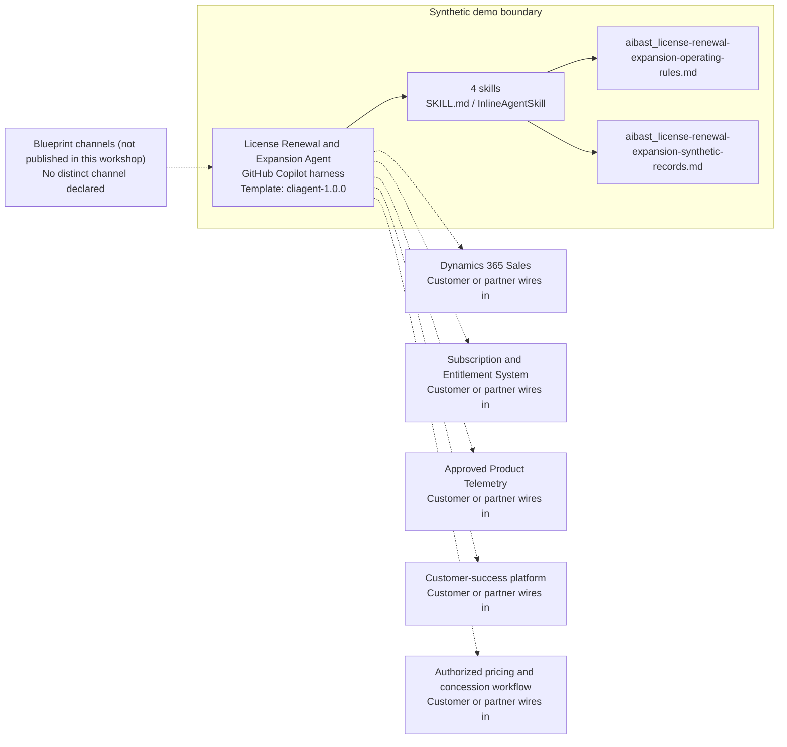

<!-- Generated by tools/build_solution_runbooks.py. Do not edit; change the sources and regenerate. -->

# License Renewal and Expansion Agent — Architecture

## Solution Architecture

### Logical architecture and trust boundary

Solid: synthetic design. Dashed: unwired customer systems; channels unpublished.

## Component Responsibilities

| Operation | Capability | Purpose | Owner |
| --- | --- | --- | --- |
| renewal_pipeline | Renewal Pipeline | Organizes renewal timing, health, ownership, and risk evidence. | Template |
| expansion_opportunities | Expansion Opportunities | Surfaces demand signals and draft expansion options. | Template |
| churn_risk | Churn Risk | Explains usage, support, stakeholder, and competition risk signals. | Template |
| revenue_impact | Revenue Impact | Compares labeled renewal, expansion, and churn scenarios. | Template |

| Runtime reference | Recorded value |
| --- | --- |
| Portable implementation | [license_renewal_expansion_agent.py](../../agents/@aibast-agents-library/software_dp_stacks/license_renewal_expansion_stack/license_renewal_expansion_agent.py) |
| Expected tool | LicenseRenewalExpansionAgent |
| Source SHA-256 (short) | 4a773b36206a |

## Data Contract

Approve field meaning, usage and retention before replacing synthetic examples.

| Entity | Fields the template uses | Used by | Customer system of record | Sensitivity |
| --- | --- | --- | --- | --- |
| LICENSE_AGREEMENTS: account and renewal | customer; arr; renewal_date; csm | renewal_pipeline; expansion_opportunities; churn_risk; revenue_impact | Dynamics 365 Sales | Commercial account data; the owner field names a staff member. |
| LICENSE_AGREEMENTS: subscription | plan; seats; contract_start | expansion_opportunities; churn_risk | Subscription and Entitlement System | Contract and entitlement data; confidential commercial terms. |
| LICENSE_AGREEMENTS: usage | seats_used; usage_trend | expansion_opportunities; churn_risk | Approved Product Telemetry | Customer usage data; read-only and minimized. |
| LICENSE_AGREEMENTS: health and signals | health_score; nps_score; support_tickets_90d; expansion_signals; churn_signals | renewal_pipeline; expansion_opportunities; churn_risk; revenue_impact | Customer-success platform | Customer relationship data; signals may mention named people or stakeholder changes. |
| EXPANSION_PRICING | unit_price; min_qty; price; description | expansion_opportunities; revenue_impact | Customer or partner maps | Confidential pricing assumptions; not a quote. |
| SWITCHING_COST_ASSUMPTIONS | data_migration; reimplementation; user_retraining; parallel_run | churn_risk | Customer or partner maps | Commercial planning assumptions; validate with the customer before use. |
| Operation request | operation; license_id; data_source | renewal_pipeline; expansion_opportunities; churn_risk; revenue_impact | Customer or partner maps | Request parameters; the template accepts only the synthetic data source. |

## Integration Points

**State: Not connected in the template.**

| System | Purpose | Skills that need it | Access | Template provides | Customer or partner wires in |
| --- | --- | --- | --- | --- | --- |
| Dynamics 365 Sales | Read-only account, ARR, renewal-date and owner context. | license-renewal-expansion-renewal-pipeline; license-renewal-expansion-expansion-opportunities; license-renewal-expansion-churn-risk; license-renewal-expansion-revenue-impact | read | Renewal contracts over fictional agreements; no CRM creation, update or forecast change. | [Wiring procedure](3.Runbook.md#step-3-1-integrate-dynamics-365-sales) |
| Subscription and Entitlement System | Contract, plan, seat and entitlement facts. | license-renewal-expansion-expansion-opportunities; license-renewal-expansion-churn-risk | read | Fixed synthetic plans, seats and contract dates; no entitlement lookup or change. | [Wiring procedure](3.Runbook.md#step-3-2-integrate-subscription-and-entitlement-system) |
| Approved Product Telemetry | Governed adoption and usage signals. | license-renewal-expansion-expansion-opportunities; license-renewal-expansion-churn-risk | read | Fictional seat utilization and usage trends; no monitoring activation. | [Wiring procedure](3.Runbook.md#step-3-3-integrate-approved-product-telemetry) |
| Customer-success platform | Health, NPS, support and demand or churn signal evidence. | license-renewal-expansion-renewal-pipeline; license-renewal-expansion-expansion-opportunities; license-renewal-expansion-churn-risk | read | Fictional health scores, NPS, ticket counts and signals; no owner assignment or outreach. | [Wiring procedure](3.Runbook.md#step-3-4-integrate-customer-success-platform) |
| Authorized pricing and concession workflow | Human approval of pricing, packaging and concessions. | license-renewal-expansion-expansion-opportunities; license-renewal-expansion-revenue-impact | write | Draft packaging options and labeled scenarios; no pricing, quote or concession tool. | [Wiring procedure](3.Runbook.md#step-3-5-integrate-authorized-pricing-and-concession-workflow) |

## Identity and Permissions

| Template default | Customer or partner decision |
| --- | --- |
| Authentication: Microsoft Entra ID authentication; the customer selects the supported mode for the internal sales channel. | Confirm tenant, permitted identities and authentication enforcement. |
| Audience: Account Executives; Customer Success Managers; Sales Leadership | Define authorized users, groups and least-privilege connection identities. |

- Require sign-in before showing account, ARR or pricing information.
- Request only read scopes for the approved sales, subscription, telemetry and customer-success data.
- Restrict the audience and verify access with authorized and denied identities.

## Copilot Studio Components

Copilot Studio uses the GitHub Copilot harness; skills hold reviewed behavior.

Agent metadata from [settings.mcs.yml](../../solutions/license-renewal-expansion/copilot-studio/settings.mcs.yml):

| Setting | Recorded value |
| --- | --- |
| Template | cliagent-1.0.0 |
| Recognizer | CLICopilotRecognizer |
| Authoring model | CliCopilot |
| Model | Sonnet46 |

### Skill inventory

One skill per row: manual upload and source-controlled form.

| Skill | Manual upload | Source component |
| --- | --- | --- |
| license-renewal-expansion-churn-risk | [SKILL.md](../../solutions/license-renewal-expansion/manual/skills/churn-risk/SKILL.md) | [InlineAgentSkill](../../solutions/license-renewal-expansion/copilot-studio/behaviors/aibast_license-renewal-expansion-churn-risk.mcs.yml) |
| license-renewal-expansion-expansion-opportunities | [SKILL.md](../../solutions/license-renewal-expansion/manual/skills/expansion-opportunities/SKILL.md) | [InlineAgentSkill](../../solutions/license-renewal-expansion/copilot-studio/behaviors/aibast_license-renewal-expansion-expansion-opportunities.mcs.yml) |
| license-renewal-expansion-renewal-pipeline | [SKILL.md](../../solutions/license-renewal-expansion/manual/skills/renewal-pipeline/SKILL.md) | [InlineAgentSkill](../../solutions/license-renewal-expansion/copilot-studio/behaviors/aibast_license-renewal-expansion-renewal-pipeline.mcs.yml) |
| license-renewal-expansion-revenue-impact | [SKILL.md](../../solutions/license-renewal-expansion/manual/skills/revenue-impact/SKILL.md) | [InlineAgentSkill](../../solutions/license-renewal-expansion/copilot-studio/behaviors/aibast_license-renewal-expansion-revenue-impact.mcs.yml) |

### Knowledge inventory

| Knowledge file | Upload | Source / metadata |
| --- | --- | --- |
| aibast_license-renewal-expansion-operating-rules.md | [Content](../../solutions/license-renewal-expansion/manual/knowledge/aibast_license-renewal-expansion-operating-rules.md) | [Source copy](../../solutions/license-renewal-expansion/copilot-studio/capabilities/knowledge/files/aibast_license-renewal-expansion-operating-rules.md) · [Metadata](../../solutions/license-renewal-expansion/copilot-studio/capabilities/knowledge/files/aibast_license-renewal-expansion-operating-rules.md.mcs.yml) |
| aibast_license-renewal-expansion-synthetic-records.md | [Content](../../solutions/license-renewal-expansion/manual/knowledge/aibast_license-renewal-expansion-synthetic-records.md) | [Source copy](../../solutions/license-renewal-expansion/copilot-studio/capabilities/knowledge/files/aibast_license-renewal-expansion-synthetic-records.md) · [Metadata](../../solutions/license-renewal-expansion/copilot-studio/capabilities/knowledge/files/aibast_license-renewal-expansion-synthetic-records.md.mcs.yml) |

## State and Recovery

| Recovery ID | Condition | Required behavior | Owner |
| --- | --- | --- | --- |
| evidence-no-mockups | A required evidence file is missing | Stop. Capture or restore the real file; never substitute a mockup. | Template |
| failed-case-no-cherry-picking | A recorded identifier is absent | Mark the case failed and investigate; do not retry until it happens to pass. | Template |
| draft-publication-stop | Publish is offered | Stop at Draft unless a separate approver explicitly authorizes publication. | Template |
| renewal-source-unavailable | A wired sales, subscription or telemetry system returns no verified result | Report unavailable evidence; never claim a lookup, CRM update or outreach succeeded. | Customer or partner |
| renewal-fact-absent | A license, signal or date is not in the snapshot | Say it is not present; fail closed on unknown identifiers without substituting another record. | Template |
| commercial-action-requested | A request would change pricing, CRM or forecasts, or contact a customer | Return draft options and name the approvers; execute nothing. | Template |

Promotion requires separate approval. [Package recovery guide](../../solutions/license-renewal-expansion/FIELD-GUIDE.md#failure-recovery).

## Design Decisions

| Decision | Reason |
| --- | --- |
| Label every commercial value as synthetic planning evidence. | ARR, prices, risk bands, switching costs and scenarios are not measured outcomes or commitments. |
| Separate scenario comparison from forecasting. | Revenue impact compares labeled cases; forecasts remain with authorized sales leadership. |
| Offer packaging ideas, not prices or concessions. | Commercial terms need finance, pricing, legal and sales approval. |
| Fail closed on unknown sources, operations and identifiers. | Absent facts are reported rather than invented or substituted. |
| Use exact assertions, not a quality-score substitute. | Evaluate (preview) General quality does not compare responses to expected answers. |

## Non-Functional Considerations

| Area | Customer or partner confirms |
| --- | --- |
| Licensing and Copilot Credits | Confirm tenant licensing and budget credits for building, Preview, evaluation and production renewal use. |
| Capacity | Allocate approved capacity to the renewal environment and monitor consumption before widening the audience. |
| Data residency | Confirm the permitted geography for account, usage and pricing data, including movement from external systems. |
| Retention | Decide whether commercial transcripts are saved, who may view or download them, and the Dataverse retention policy. |
| Cost drivers | Measure model-token, knowledge/tool and harness usage by renewal workload; synthetic runs are not a production-cost estimate. |

## Next

→ [Delivery runbook](3.Runbook.md) | [Solution index](../README.md)

[Sources for this page](0.Resources/README.md#sources-2architecturemd).
