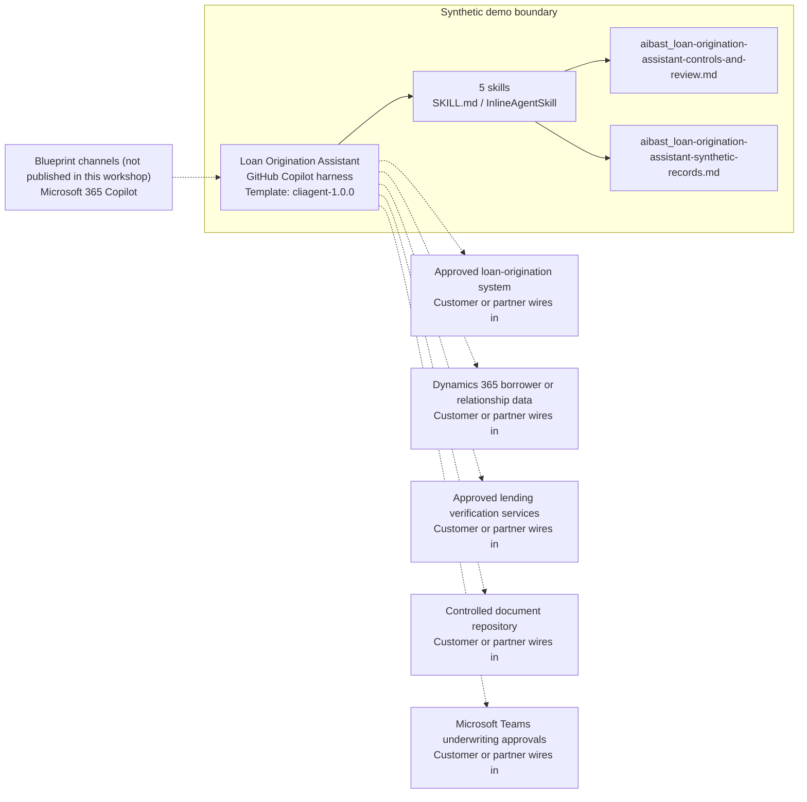

<!-- Generated by tools/build_solution_runbooks.py. Do not edit; change the sources and regenerate. -->

# Loan Origination Assistant — Architecture

## Solution Architecture

### Logical architecture and trust boundary

Solid: synthetic design. Dashed: unwired customer systems; channels unpublished.

## Component Responsibilities

| Operation | Capability | Purpose | Owner |
| --- | --- | --- | --- |
| application_review | Application intake | Summarizes the synthetic loan pipeline, product, amount, LTV, owner, and status. | Template |
| credit_analysis | Eligibility and ratio analysis | Calculates transparent DTI, LTV, credit, and DSCR comparisons for human underwriting. | Template |
| document_verification | Document readiness | Builds product-specific borrower, asset, property, identity, and program checklists. | Template |
| decision_recommendation | Nonbinding underwriting findings | Surfaces criteria matches and exceptions without approving or denying a loan. | Template |
| condition_tracking | Condition and timeline review | Lists outstanding conditions without clearing them or promising a closing date. | Template |

| Runtime reference | Recorded value |
| --- | --- |
| Portable implementation | [loan_origination_assistant_agent.py](../../agents/@aibast-agents-library/financial_services_stacks/loan_origination_assistant_stack/loan_origination_assistant_agent.py) |
| Expected tool | LoanOriginationAssistantAgent |
| Source SHA-256 (short) | c85fb1844a55 |

## Data Contract

Approve field meaning, usage and retention before replacing synthetic examples.

| Entity | Fields the template uses | Used by | Customer system of record | Sensitivity |
| --- | --- | --- | --- | --- |
| LOAN_APPLICATIONS: application | loan_type; purpose; loan_amount; down_payment_pct; status; loan_officer | application_review; credit_analysis; document_verification; decision_recommendation | Approved loan-origination system | Regulated lending data; restrict to authorized loan staff. |
| LOAN_APPLICATIONS: borrower | applicant | application_review; credit_analysis; document_verification; decision_recommendation; condition_tracking | Dynamics 365 borrower or relationship data | Borrower personal data; minimum disclosure. |
| LOAN_APPLICATIONS: verification evidence | credit_score; annual_income; monthly_debt; employment_years; dscr; property_address; property_value | application_review; credit_analysis; decision_recommendation | Approved lending verification services | Consumer credit, income and property data; subject to fair-lending controls. |
| APPROVAL_CRITERIA | min_credit; max_dti; min_down_pct; max_ltv; min_dscr | credit_analysis; decision_recommendation | Customer or partner maps | Credit policy; authorized owners approve real program rules. |
| RATE_SHEET | rate; apr; points; mip_upfront; mip_annual; funding_fee | application_review; credit_analysis; decision_recommendation | Customer or partner maps | Pricing data; fictional and never a quote or lock. |
| DOCUMENT_REQUIREMENTS | income; assets; property; identity; fha_specific; va_specific; commercial_specific | document_verification | Controlled document repository | Checklist policy; the documents themselves hold borrower personal data. |
| CONDITIONS | application_id | condition_tracking | Approved loan-origination system | Loan conditions; clearance stays with authorized staff. |
| Operation request | operation; application_id | application_review; credit_analysis; document_verification; decision_recommendation; condition_tracking | Customer or partner maps | Request parameters; unknown application IDs are rejected. |

## Integration Points

**State: Not connected in the template.**

| System | Purpose | Skills that need it | Access | Template provides | Customer or partner wires in |
| --- | --- | --- | --- | --- | --- |
| Approved loan-origination system | Application, condition, owner and due-date context. | application-review; decision-recommendation; condition-tracking | read | Fictional applications and open conditions; owners and due dates stay with the system. | [Wiring procedure](3.Runbook.md#step-3-1-integrate-approved-loan-origination-system) |
| Dynamics 365 borrower or relationship data | Governed borrower and relationship context. | application-review; credit-analysis | read | Fictional applicant names only; no CRM lookup or change. | [Wiring procedure](3.Runbook.md#step-3-2-integrate-dynamics-365-borrower-or-relationship-data) |
| Approved lending verification services | Credit, income, asset and property evidence. | credit-analysis; document-verification; decision-recommendation | read | Fixed synthetic scores, income, debt and property values; no live verification. | [Wiring procedure](3.Runbook.md#step-3-3-integrate-approved-lending-verification-services) |
| Controlled document repository | Governed lending documents. | document-verification; condition-tracking | read | Product-specific checklists instead of documents; nothing is retrieved or stored. | [Wiring procedure](3.Runbook.md#step-3-4-integrate-controlled-document-repository) |
| Microsoft Teams underwriting approvals | Human underwriting review and escalation. | decision-recommendation; condition-tracking | write | Nonbinding findings and open conditions for reviewers; no approval request or message. | [Wiring procedure](3.Runbook.md#step-3-5-integrate-microsoft-teams-underwriting-approvals) |

## Identity and Permissions

| Template default | Customer or partner decision |
| --- | --- |
| Authentication: Microsoft Entra ID authentication; the customer selects the supported mode for the internal lending channel. | Confirm tenant, permitted identities and authentication enforcement. |
| Audience: Loan Officers; Processors; Underwriters; Closing Coordinators | Define authorized users, groups and least-privilege connection identities. |

- Require sign-in before showing borrower or application data.
- Request only read scopes for approved lending systems and documents.
- Restrict the audience and verify access with authorized and denied identities.

## Copilot Studio Components

Copilot Studio uses the GitHub Copilot harness; skills hold reviewed behavior.

Agent metadata from [settings.mcs.yml](../../solutions/loan-origination-assistant/copilot-studio/settings.mcs.yml):

| Setting | Recorded value |
| --- | --- |
| Template | cliagent-1.0.0 |
| Recognizer | CLICopilotRecognizer |
| Authoring model | CliCopilot |
| Model | Sonnet46 |

### Skill inventory

One skill per row: manual upload and source-controlled form.

| Skill | Manual upload | Source component |
| --- | --- | --- |
| application-review | [SKILL.md](../../solutions/loan-origination-assistant/manual/skills/aibast_application-review_01/SKILL.md) | [InlineAgentSkill](../../solutions/loan-origination-assistant/copilot-studio/behaviors/aibast_application-review.mcs.yml) |
| condition-tracking | [SKILL.md](../../solutions/loan-origination-assistant/manual/skills/aibast_condition-tracking_05/SKILL.md) | [InlineAgentSkill](../../solutions/loan-origination-assistant/copilot-studio/behaviors/aibast_condition-tracking.mcs.yml) |
| credit-analysis | [SKILL.md](../../solutions/loan-origination-assistant/manual/skills/aibast_credit-analysis_02/SKILL.md) | [InlineAgentSkill](../../solutions/loan-origination-assistant/copilot-studio/behaviors/aibast_credit-analysis.mcs.yml) |
| decision-recommendation | [SKILL.md](../../solutions/loan-origination-assistant/manual/skills/aibast_decision-recommendation_04/SKILL.md) | [InlineAgentSkill](../../solutions/loan-origination-assistant/copilot-studio/behaviors/aibast_decision-recommendation.mcs.yml) |
| document-verification | [SKILL.md](../../solutions/loan-origination-assistant/manual/skills/aibast_document-verification_03/SKILL.md) | [InlineAgentSkill](../../solutions/loan-origination-assistant/copilot-studio/behaviors/aibast_document-verification.mcs.yml) |

### Knowledge inventory

| Knowledge file | Upload | Source / metadata |
| --- | --- | --- |
| aibast_loan-origination-assistant-controls-and-review.md | [Content](../../solutions/loan-origination-assistant/manual/knowledge/aibast_loan-origination-assistant-controls-and-review.md) | [Source copy](../../solutions/loan-origination-assistant/copilot-studio/capabilities/knowledge/files/aibast_loan-origination-assistant-controls-and-review.md) · [Metadata](../../solutions/loan-origination-assistant/copilot-studio/capabilities/knowledge/files/aibast_loan-origination-assistant-controls-and-review.md.mcs.yml) |
| aibast_loan-origination-assistant-synthetic-records.md | [Content](../../solutions/loan-origination-assistant/manual/knowledge/aibast_loan-origination-assistant-synthetic-records.md) | [Source copy](../../solutions/loan-origination-assistant/copilot-studio/capabilities/knowledge/files/aibast_loan-origination-assistant-synthetic-records.md) · [Metadata](../../solutions/loan-origination-assistant/copilot-studio/capabilities/knowledge/files/aibast_loan-origination-assistant-synthetic-records.md.mcs.yml) |

## State and Recovery

| Recovery ID | Condition | Required behavior | Owner |
| --- | --- | --- | --- |
| evidence-no-mockups | A required evidence file is missing | Stop. Capture or restore the real file; never substitute a mockup. | Template |
| failed-case-no-cherry-picking | A recorded identifier is absent | Mark the case failed and investigate; do not retry until it happens to pass. | Template |
| draft-publication-stop | Publish is offered | Stop at Draft unless a separate approver explicitly authorizes publication. | Template |
| lending-system-unavailable | A wired lending system returns no verified result | Report unavailable evidence; never claim a lookup, verification or lending action succeeded. | Customer or partner |
| application-not-found | An application ID is unknown | Report that no record exists; never substitute another application. | Template |
| lending-decision-requested | A request would approve, deny, price, lock, clear, close or fund | Return findings or conditions and name the authorized reviewer; execute nothing. | Template |

Promotion requires separate approval. [Package recovery guide](../../solutions/loan-origination-assistant/FIELD-GUIDE.md#failure-recovery).

## Design Decisions

| Decision | Reason |
| --- | --- |
| Organize lending evidence; never decide. | Eligibility, approval, pricing, clearance, closing and funding stay with authorized reviewers. |
| End substantive answers with a fixed boundary sentence. | Every answer states that no decision, pricing, clearance, closing, funding, communication or record change occurred. |
| Reject unknown application identifiers. | The audit replaced silent substitution of another fictional record with an explicit rejection. |
| Map borrower names to synthetic application IDs in tool routing. | Persona-language prompts name borrowers and files, not operation or record identifiers. |
| Use exact assertions, not a quality-score substitute. | Evaluate (preview) General quality does not compare responses to expected answers. |

## Non-Functional Considerations

| Area | Customer or partner confirms |
| --- | --- |
| Licensing and Copilot Credits | Confirm tenant licensing and budget credits for building, Preview, evaluation and production lending use. |
| Capacity | Allocate approved capacity to the lending environment and monitor consumption before widening the audience. |
| Data residency | Confirm the permitted geography for borrower, credit and document data, including movement from external lending systems. |
| Retention | Decide with compliance whether lending transcripts are saved, who may view or download them, and the Dataverse retention policy. |
| Cost drivers | Measure model-token, knowledge/tool and harness usage by lending workload; synthetic runs are not a production-cost estimate. |

## Next

→ [Delivery runbook](3.Runbook.md) | [Solution index](../README.md)

[Sources for this page](0.Resources/README.md#sources-2architecturemd).
