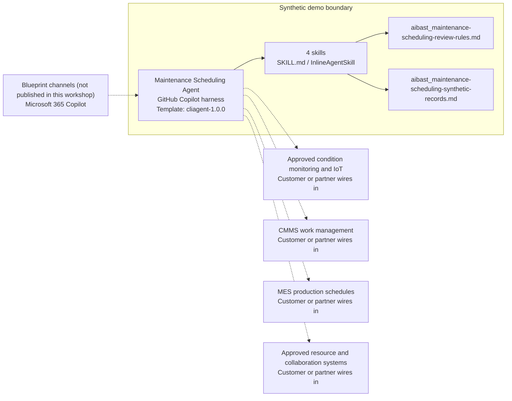

<!-- Generated by tools/build_solution_runbooks.py. Do not edit; change the sources and regenerate. -->

# Maintenance Scheduling Agent — Architecture

## Solution Architecture

### Logical architecture and trust boundary

Solid: synthetic design. Dashed: unwired customer systems; channels unpublished.

## Component Responsibilities

| Operation | Capability | Purpose | Owner |
| --- | --- | --- | --- |
| schedule_overview | Maintenance and resource overview | Summarizes equipment status, risk, maintenance history, and technician capacity for planning review. | Template |
| predictive_alerts | Predictive condition alerts | Ranks synthetic sensor and failure-risk evidence while requiring validation in approved condition-monitoring systems. | Template |
| work_order_plan | Proposed maintenance work planning | Frames maintenance candidates, technician candidates, parts checks, and backup checks without creating, assigning, scheduling, or dispatching work. | Template |
| downtime_analysis | Downtime and preventive trade-off analysis | Compares synthetic exposure and preventive estimates without promising avoided downtime, savings, or production outcomes. | Template |

| Runtime reference | Recorded value |
| --- | --- |
| Portable implementation | [maintenance_scheduling_agent.py](../../agents/@aibast-agents-library/manufacturing_stacks/maintenance_scheduling_stack/maintenance_scheduling_agent.py) |
| Expected tool | MaintenanceSchedulingAgent |
| Source SHA-256 (short) | 0ff3fefecf6a |

## Data Contract

Approve field meaning, usage and retention before replacing synthetic examples.

| Entity | Fields the template uses | Used by | Customer system of record | Sensitivity |
| --- | --- | --- | --- | --- |
| EQUIPMENT | name; type; install_date; last_service; runtime_hours; mtbf_hours; status | schedule_overview; predictive_alerts; work_order_plan; downtime_analysis | CMMS work management | Operational asset data; restrict to approved plant roles. |
| SENSOR_READINGS | vibration_mm_s; temp_c; oil_pressure_bar; spindle_load_pct; hydraulic_level_pct; arc_stability_pct; wire_feed_mpm; barrel_pressure_bar; cycle_time_s; belt_tension_n; motor_current_a | schedule_overview; predictive_alerts; work_order_plan | Approved condition monitoring and IoT | Operational telemetry; verify current state before action. |
| FAILURE_PROBABILITIES | 30_day; 60_day; 90_day; failure_mode | schedule_overview; predictive_alerts; work_order_plan; downtime_analysis | Customer or partner maps | Modeled risk, not measured condition; the template values are fictional. |
| TECHNICIANS | name; certifications; shift; available_hours_week; committed_hours | schedule_overview; work_order_plan | Approved resource and collaboration systems | Staff personal and availability data; candidates only, never assignments. |
| MAINTENANCE_HISTORY | eq_id; date; type; hours; cost; notes | schedule_overview; downtime_analysis | CMMS work management | Maintenance records with cost data; restrict to approved roles. |
| DOWNTIME_COST_PER_HOUR | CNC Mill; Press; Welder; Injection Molder; Conveyor | downtime_analysis | Customer or partner maps | Financial planning assumptions by equipment type; fictional rates. |
| PARTS_READINESS | eq_id | work_order_plan | Approved resource and collaboration systems | Parts planning notes keyed by equipment; nothing is reserved. |
| BACKUP_READINESS | eq_id | work_order_plan | MES production schedules | Backup-capacity planning notes keyed by equipment; no equipment is switched. |

## Integration Points

**State: Not connected in the template.**

| System | Purpose | Skills that need it | Access | Template provides | Customer or partner wires in |
| --- | --- | --- | --- | --- | --- |
| Approved condition monitoring and IoT | Verified telemetry and condition signals. | schedule-overview; predictive-alerts; work-order-plan | read | Fixed synthetic sensor readings and failure probabilities; no live equipment access. | [Wiring procedure](3.Runbook.md#step-3-1-integrate-approved-condition-monitoring-and-iot) |
| CMMS work management | Asset, maintenance-record and approved work-order context. | schedule-overview; work-order-plan; downtime-analysis | read-write | Fictional equipment and history records; the agent cannot create or change work orders. | [Wiring procedure](3.Runbook.md#step-3-2-integrate-cmms-work-management) |
| MES production schedules | Production-impact and backup-capacity review. | work-order-plan; downtime-analysis | read | Backup-readiness notes only; no schedule change or equipment control. | [Wiring procedure](3.Runbook.md#step-3-3-integrate-mes-production-schedules) |
| Approved resource and collaboration systems | Parts inventory, technician rosters and Teams review. | schedule-overview; work-order-plan | read-write | Fictional rosters and parts states; no reservation, assignment, approval or message. | [Wiring procedure](3.Runbook.md#step-3-4-integrate-approved-resource-and-collaboration-systems) |

## Identity and Permissions

| Template default | Customer or partner decision |
| --- | --- |
| Authentication: Microsoft Entra ID authentication; the customer selects the supported mode for the plant channel. | Confirm tenant, permitted identities and authentication enforcement. |
| Audience: Maintenance Managers; Production Supervisors; Operations Leaders | Define authorized users, groups and least-privilege connection identities. |

- Require sign-in before showing plant, staff or cost information.
- Request only read scopes for approved condition, work, production and resource data.
- Restrict the audience and verify access with authorized and denied identities.

## Copilot Studio Components

Copilot Studio uses the GitHub Copilot harness; skills hold reviewed behavior.

Agent metadata from [settings.mcs.yml](../../solutions/maintenance-scheduling/copilot-studio/settings.mcs.yml):

| Setting | Recorded value |
| --- | --- |
| Template | cliagent-1.0.0 |
| Recognizer | CLICopilotRecognizer |
| Authoring model | CliCopilot |
| Model | Sonnet46 |

### Skill inventory

One skill per row: manual upload and source-controlled form.

| Skill | Manual upload | Source component |
| --- | --- | --- |
| downtime-analysis | [SKILL.md](../../solutions/maintenance-scheduling/manual/skills/aibast_downtime_analysis/SKILL.md) | [InlineAgentSkill](../../solutions/maintenance-scheduling/copilot-studio/behaviors/aibast_downtime-analysis.mcs.yml) |
| predictive-alerts | [SKILL.md](../../solutions/maintenance-scheduling/manual/skills/aibast_predictive_alerts/SKILL.md) | [InlineAgentSkill](../../solutions/maintenance-scheduling/copilot-studio/behaviors/aibast_predictive-alerts.mcs.yml) |
| schedule-overview | [SKILL.md](../../solutions/maintenance-scheduling/manual/skills/aibast_schedule_overview/SKILL.md) | [InlineAgentSkill](../../solutions/maintenance-scheduling/copilot-studio/behaviors/aibast_schedule-overview.mcs.yml) |
| work-order-plan | [SKILL.md](../../solutions/maintenance-scheduling/manual/skills/aibast_work_order_plan/SKILL.md) | [InlineAgentSkill](../../solutions/maintenance-scheduling/copilot-studio/behaviors/aibast_work-order-plan.mcs.yml) |

### Knowledge inventory

| Knowledge file | Upload | Source / metadata |
| --- | --- | --- |
| aibast_maintenance-scheduling-review-rules.md | [Content](../../solutions/maintenance-scheduling/manual/knowledge/aibast_maintenance-scheduling-review-rules.md) | [Source copy](../../solutions/maintenance-scheduling/copilot-studio/capabilities/knowledge/files/aibast_maintenance-scheduling-review-rules.md) · [Metadata](../../solutions/maintenance-scheduling/copilot-studio/capabilities/knowledge/files/aibast_maintenance-scheduling-review-rules.md.mcs.yml) |
| aibast_maintenance-scheduling-synthetic-records.md | [Content](../../solutions/maintenance-scheduling/manual/knowledge/aibast_maintenance-scheduling-synthetic-records.md) | [Source copy](../../solutions/maintenance-scheduling/copilot-studio/capabilities/knowledge/files/aibast_maintenance-scheduling-synthetic-records.md) · [Metadata](../../solutions/maintenance-scheduling/copilot-studio/capabilities/knowledge/files/aibast_maintenance-scheduling-synthetic-records.md.mcs.yml) |

## State and Recovery

| Recovery ID | Condition | Required behavior | Owner |
| --- | --- | --- | --- |
| evidence-no-mockups | A required evidence file is missing | Stop. Capture or restore the real file; never substitute a mockup. | Template |
| failed-case-no-cherry-picking | A recorded identifier is absent | Mark the case failed and investigate; do not retry until it happens to pass. | Template |
| draft-publication-stop | Publish is offered | Stop at Draft unless a separate approver explicitly authorizes publication. | Template |
| plant-system-unavailable | A wired plant system returns no verified result | Report unavailable evidence; never claim live telemetry, a work order or a dispatch. | Customer or partner |
| telemetry-unverified | Current equipment condition may differ from the snapshot | Verify telemetry in approved systems before anyone acts on a recommendation. | Customer or partner |
| maintenance-action-requested | A request would control equipment, create or dispatch work, assign a technician or reserve a part | Return a proposal and name the authorization gate; execute nothing. | Template |

Promotion requires separate approval. [Package recovery guide](../../solutions/maintenance-scheduling/FIELD-GUIDE.md#failure-recovery).

## Design Decisions

| Decision | Reason |
| --- | --- |
| Present technicians as candidates and windows as proposals. | Assignment, scheduling and dispatch stay with authorized maintenance owners. |
| Separate parts readiness, backup capacity and production-impact review. | Each check has a different owner and approval path. |
| Label downtime values as planning estimates. | Exposure and avoided cost are modeled, not measured outcomes or commitments. |
| Keep future action tools out of the pilot. | Equipment commands, work creation and dispatch need explicit authorization, safety and action tooling first. |
| Use exact assertions, not a quality-score substitute. | Evaluate (preview) General quality does not compare responses to expected answers. |

## Non-Functional Considerations

| Area | Customer or partner confirms |
| --- | --- |
| Licensing and Copilot Credits | Confirm tenant licensing and budget credits for building, Preview, evaluation and production maintenance use. |
| Capacity | Allocate approved capacity to the maintenance environment and monitor consumption before widening the audience. |
| Data residency | Confirm the permitted geography for telemetry, maintenance and staff data, including movement from plant systems. |
| Retention | Decide whether maintenance transcripts are saved, who may view or download them, and the Dataverse retention policy. |
| Cost drivers | Measure model-token, knowledge/tool and harness usage by maintenance workload; synthetic runs are not a production-cost estimate. |

## Next

→ [Delivery runbook](3.Runbook.md) | [Solution index](../README.md)

[Sources for this page](0.Resources/README.md#sources-2architecturemd).
