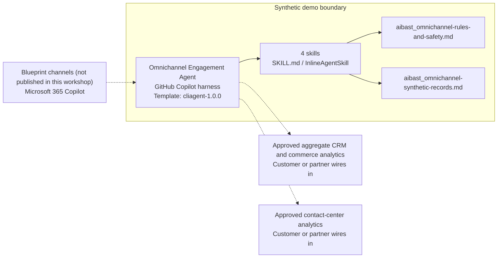

<!-- Generated by tools/build_solution_runbooks.py. Do not edit; change the sources and regenerate. -->

# Omnichannel Engagement Agent — Architecture

## Solution Architecture

### Logical architecture and trust boundary

Solid: synthetic design. Dashed: unwired customer systems; channels unpublished.

## Component Responsibilities

| Operation | Capability | Purpose | Owner |
| --- | --- | --- | --- |
| channel_performance | Aggregate channel performance | Compares channel measures without identity stitching. | Template |
| journey_analysis | Privacy-safe journey analysis | Uses aggregate archetypes to identify handoff friction. | Template |
| engagement_optimization | Consent-aware optimization | Drafts controlled experiments with consent and frequency caps. | Template |
| campaign_attribution | Synthetic attribution review | Explains fixed attribution evidence without claiming causality. | Template |

| Runtime reference | Recorded value |
| --- | --- |
| Portable implementation | [omnichannel_engagement_agent.py](../../agents/@aibast-agents-library/b2c_sales_stacks/omnichannel_engagement_stack/omnichannel_engagement_agent.py) |
| Expected tool | OmnichannelEngagementAgent |
| Source SHA-256 (short) | 0073c05ce1e0 |

## Data Contract

Approve field meaning, usage and retention before replacing synthetic examples.

| Entity | Fields the template uses | Used by | Customer system of record | Sensitivity |
| --- | --- | --- | --- | --- |
| CHANNELS | sessions_30d; conversions_30d; revenue_30d; cost_30d; avg_order_value; bounce_rate | channel_performance; engagement_optimization | Approved aggregate CRM and commerce analytics | Aggregate commercial metrics; no person-level data. |
| CUSTOMER_JOURNEYS | name; touchpoints; avg_days; conversion_rate; avg_touchpoints | journey_analysis | Approved contact-center analytics | Aggregate journey archetypes; never reconstruct an individual journey. |
| CAMPAIGN_RESULTS | name; channel; sent; opens; clicks; conversions; revenue; cost | campaign_attribution | Approved aggregate CRM and commerce analytics | Aggregate campaign metrics; attribution, not causality. |
| Approved personas and language focus | Persona; Required focus | channel_performance; journey_analysis; engagement_optimization; campaign_attribution | Customer or partner maps | Template configuration; no personal data. |
| Operation request | operation; channel; campaign_id; persona; data_source | channel_performance; journey_analysis; engagement_optimization; campaign_attribution | Customer or partner maps | Request parameters; the template accepts only the synthetic data source. |

## Integration Points

**State: Not connected in the template.**

| System | Purpose | Skills that need it | Access | Template provides | Customer or partner wires in |
| --- | --- | --- | --- | --- | --- |
| Approved aggregate CRM and commerce analytics | Aggregate channel and campaign metrics. | aggregate-channel-performance-review; consent-aware-engagement-options; synthetic-campaign-attribution-review | read | Fixed synthetic channel and campaign aggregates; no person-level data or live KPIs. | [Wiring procedure](3.Runbook.md#step-3-1-integrate-approved-aggregate-crm-and-commerce-analytics) |
| Approved contact-center analytics | Aggregate handoff and journey-friction evidence. | privacy-safe-journey-friction-analysis | read | Four fixed journey archetypes; no individual interaction records. | [Wiring procedure](3.Runbook.md#step-3-2-integrate-approved-contact-center-analytics) |

## Identity and Permissions

| Template default | Customer or partner decision |
| --- | --- |
| Authentication: Microsoft Entra ID authentication; the customer selects the supported mode for the internal analytics channel. | Confirm tenant, permitted identities and authentication enforcement. |
| Audience: Customer Experience Leaders; Digital Engagement Managers; Contact Center Supervisors | Define authorized users, groups and least-privilege connection identities. |

- Require sign-in before showing channel, campaign or journey analytics.
- Request only read scopes for approved aggregate feeds; exclude person-level data.
- Restrict the audience and verify access with authorized and denied identities.

## Copilot Studio Components

Copilot Studio uses the GitHub Copilot harness; skills hold reviewed behavior.

Agent metadata from [settings.mcs.yml](../../solutions/omnichannel-engagement/copilot-studio/settings.mcs.yml):

| Setting | Recorded value |
| --- | --- |
| Template | cliagent-1.0.0 |
| Recognizer | CLICopilotRecognizer |
| Authoring model | CliCopilot |
| Model | Sonnet46 |

### Skill inventory

One skill per row: manual upload and source-controlled form.

| Skill | Manual upload | Source component |
| --- | --- | --- |
| aggregate-channel-performance-review | [SKILL.md](../../solutions/omnichannel-engagement/manual/skills/channel-performance/SKILL.md) | [InlineAgentSkill](../../solutions/omnichannel-engagement/copilot-studio/behaviors/aibast_aggregate-channel-performance-review.mcs.yml) |
| consent-aware-engagement-options | [SKILL.md](../../solutions/omnichannel-engagement/manual/skills/engagement-optimization/SKILL.md) | [InlineAgentSkill](../../solutions/omnichannel-engagement/copilot-studio/behaviors/aibast_consent-aware-engagement-options.mcs.yml) |
| privacy-safe-journey-friction-analysis | [SKILL.md](../../solutions/omnichannel-engagement/manual/skills/journey-analysis/SKILL.md) | [InlineAgentSkill](../../solutions/omnichannel-engagement/copilot-studio/behaviors/aibast_privacy-safe-journey-friction-analysis.mcs.yml) |
| synthetic-campaign-attribution-review | [SKILL.md](../../solutions/omnichannel-engagement/manual/skills/campaign-attribution/SKILL.md) | [InlineAgentSkill](../../solutions/omnichannel-engagement/copilot-studio/behaviors/aibast_synthetic-campaign-attribution-review.mcs.yml) |

### Knowledge inventory

| Knowledge file | Upload | Source / metadata |
| --- | --- | --- |
| aibast_omnichannel-rules-and-safety.md | [Content](../../solutions/omnichannel-engagement/manual/knowledge/aibast_omnichannel-rules-and-safety.md) | [Source copy](../../solutions/omnichannel-engagement/copilot-studio/capabilities/knowledge/files/aibast_omnichannel-rules-and-safety.md) · [Metadata](../../solutions/omnichannel-engagement/copilot-studio/capabilities/knowledge/files/aibast_omnichannel-rules-and-safety.md.mcs.yml) |
| aibast_omnichannel-synthetic-records.md | [Content](../../solutions/omnichannel-engagement/manual/knowledge/aibast_omnichannel-synthetic-records.md) | [Source copy](../../solutions/omnichannel-engagement/copilot-studio/capabilities/knowledge/files/aibast_omnichannel-synthetic-records.md) · [Metadata](../../solutions/omnichannel-engagement/copilot-studio/capabilities/knowledge/files/aibast_omnichannel-synthetic-records.md.mcs.yml) |

## State and Recovery

| Recovery ID | Condition | Required behavior | Owner |
| --- | --- | --- | --- |
| evidence-no-mockups | A required evidence file is missing | Stop. Capture or restore the real file; never substitute a mockup. | Template |
| failed-case-no-cherry-picking | A recorded identifier is absent | Mark the case failed and investigate; do not retry until it happens to pass. | Template |
| draft-publication-stop | Publish is offered | Stop at Draft unless a separate approver explicitly authorizes publication. | Template |
| analytics-feed-unavailable | A wired analytics feed returns no verified result | Report unavailable evidence; never claim live metrics or completed outreach. | Customer or partner |
| person-level-request | A request needs individual or sensitive customer data | Decline and return aggregate evidence; never stitch identities or infer traits. | Template |
| engagement-identifier-unknown | A channel or campaign identifier is unknown | Stop and request a valid identifier; never approximate. | Template |

Promotion requires separate approval. [Package recovery guide](../../solutions/omnichannel-engagement/FIELD-GUIDE.md#failure-recovery).

## Design Decisions

| Decision | Reason |
| --- | --- |
| Analyze aggregates only. | Person-level journeys would need identity stitching, which the package prohibits. |
| Separate attribution from causality. | Fixed campaign results cannot show causal impact or live performance. |
| Gate engagement options with consent and frequency caps. | Options are controlled experiments for review, not outreach. |
| Validate persona and filter inputs. | Explicit personas and validated channel and campaign filters prevent approximated evidence. |
| Use exact assertions, not a quality-score substitute. | Evaluate (preview) General quality does not compare responses to expected answers. |

## Non-Functional Considerations

| Area | Customer or partner confirms |
| --- | --- |
| Licensing and Copilot Credits | Confirm tenant licensing and budget credits for building, Preview, evaluation and production analytics use. |
| Capacity | Allocate approved capacity to the engagement environment and monitor consumption before widening the audience. |
| Data residency | Confirm the permitted geography for aggregate customer analytics, including movement from external CRM and commerce systems. |
| Retention | Decide with privacy owners whether transcripts are saved, who may view or download them, and the Dataverse retention policy. |
| Cost drivers | Measure model-token, knowledge/tool and harness usage by analytics workload; synthetic runs are not a production-cost estimate. |

## Next

→ [Delivery runbook](3.Runbook.md) | [Solution index](../README.md)

[Sources for this page](0.Resources/README.md#sources-2architecturemd).
