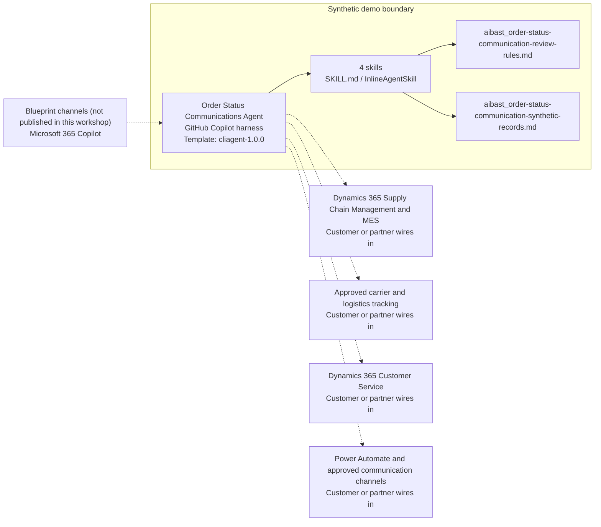

<!-- Generated by tools/build_solution_runbooks.py. Do not edit; change the sources and regenerate. -->

# Order Status Communications Agent — Architecture

## Solution Architecture

### Logical architecture and trust boundary

Solid: synthetic design. Dashed: unwired customer systems; channels unpublished.

## Component Responsibilities

| Operation | Capability | Purpose | Owner |
| --- | --- | --- | --- |
| order_lookup | Order status and risk overview | Summarizes fixed order progress, promise, value, and delay evidence for internal review. | Template |
| shipment_tracking | Shipment evidence review | Reports the recorded carrier and route evidence while requiring validation in the approved tracking system. | Template |
| delay_notification | Internal delay and recovery review | Brings delay reason, recovery options, account ownership, response expectations, and preferred channel together without changing an order or schedule. | Template |
| customer_update | Customer communication drafting | Prepares customer-specific message drafts for approval without sending email, EDI, portal, Teams, or other updates. | Template |

| Runtime reference | Recorded value |
| --- | --- |
| Portable implementation | [order_status_communication_agent.py](../../agents/@aibast-agents-library/manufacturing_stacks/order_status_communication_stack/order_status_communication_agent.py) |
| Expected tool | OrderStatusCommunicationAgent |
| Source SHA-256 (short) | aa71f08fbe00 |

## Data Contract

Approve field meaning, usage and retention before replacing synthetic examples.

| Entity | Fields the template uses | Used by | Customer system of record | Sensitivity |
| --- | --- | --- | --- | --- |
| ORDERS: order and production | product; quantity; unit_price; order_date; promised_date; status; pct_complete | order_lookup; shipment_tracking; delay_notification; customer_update | Dynamics 365 Supply Chain Management and MES | Commercial order data; verify before customer use. |
| ORDERS: customer contact | customer; contact_name; contact_email | order_lookup; shipment_tracking; delay_notification; customer_update | Dynamics 365 Customer Service | Customer contact personal data; minimize in drafts and transcripts. |
| SHIPMENTS | carrier; tracking_number; ship_date; est_delivery; origin; destination; weight_kg; status | shipment_tracking; customer_update | Approved carrier and logistics tracking | Logistics data; validate milestones with the carrier. |
| DELAY_REASONS | reason; original_date; revised_date; days_delayed; recovery_actions; cost_impact | order_lookup; delay_notification; customer_update | Dynamics 365 Supply Chain Management and MES | Internal production and cost data; recovery options need operations confirmation. |
| CUSTOMER_CONTACTS | account_manager; escalation_contact; preferred_channel; customer_tier; sla_response_hours | delay_notification; customer_update | Dynamics 365 Customer Service | Account ownership and staff names; restrict to service and account roles. |

## Integration Points

**State: Not connected in the template.**

| System | Purpose | Skills that need it | Access | Template provides | Customer or partner wires in |
| --- | --- | --- | --- | --- | --- |
| Dynamics 365 Supply Chain Management and MES | Order, production-progress and delay evidence. | order-lookup; delay-notification; customer-update | read | Fixed synthetic orders and delay records; no order or schedule change. | [Wiring procedure](3.Runbook.md#step-3-1-integrate-dynamics-365-supply-chain-management-and-mes) |
| Approved carrier and logistics tracking | Shipment milestones and proof. | shipment-tracking; customer-update | read | One fixed synthetic shipment record; no live tracking. | [Wiring procedure](3.Runbook.md#step-3-2-integrate-approved-carrier-and-logistics-tracking) |
| Dynamics 365 Customer Service | Account, owner, preference and contact context. | delay-notification; customer-update | read | Fictional contacts, tiers, channels and owners; no CRM connection. | [Wiring procedure](3.Runbook.md#step-3-3-integrate-dynamics-365-customer-service) |
| Power Automate and approved communication channels | Approved sending by email, EDI, portal or Teams. | customer-update | write | Unsent drafts with tier, channel and owner; no message or notification. | [Wiring procedure](3.Runbook.md#step-3-4-integrate-power-automate-and-approved-communication-channels) |

## Identity and Permissions

| Template default | Customer or partner decision |
| --- | --- |
| Authentication: Microsoft Entra ID authentication; the customer selects the supported mode for the internal service channel. | Confirm tenant, permitted identities and authentication enforcement. |
| Audience: Customer Service Representatives; Account Managers; Operations Leaders | Define authorized users, groups and least-privilege connection identities. |

- Require sign-in before showing order values or customer contact details.
- Request only read scopes for approved order, carrier and CRM data.
- Restrict the audience and verify access with authorized and denied identities.

## Copilot Studio Components

Copilot Studio uses the GitHub Copilot harness; skills hold reviewed behavior.

Agent metadata from [settings.mcs.yml](../../solutions/order-status-communication/copilot-studio/settings.mcs.yml):

| Setting | Recorded value |
| --- | --- |
| Template | cliagent-1.0.0 |
| Recognizer | CLICopilotRecognizer |
| Authoring model | CliCopilot |
| Model | Sonnet46 |

### Skill inventory

One skill per row: manual upload and source-controlled form.

| Skill | Manual upload | Source component |
| --- | --- | --- |
| customer-update | [SKILL.md](../../solutions/order-status-communication/manual/skills/aibast_customer_update/SKILL.md) | [InlineAgentSkill](../../solutions/order-status-communication/copilot-studio/behaviors/aibast_customer-update.mcs.yml) |
| delay-notification | [SKILL.md](../../solutions/order-status-communication/manual/skills/aibast_delay_notification/SKILL.md) | [InlineAgentSkill](../../solutions/order-status-communication/copilot-studio/behaviors/aibast_delay-notification.mcs.yml) |
| order-lookup | [SKILL.md](../../solutions/order-status-communication/manual/skills/aibast_order_lookup/SKILL.md) | [InlineAgentSkill](../../solutions/order-status-communication/copilot-studio/behaviors/aibast_order-lookup.mcs.yml) |
| shipment-tracking | [SKILL.md](../../solutions/order-status-communication/manual/skills/aibast_shipment_tracking/SKILL.md) | [InlineAgentSkill](../../solutions/order-status-communication/copilot-studio/behaviors/aibast_shipment-tracking.mcs.yml) |

### Knowledge inventory

| Knowledge file | Upload | Source / metadata |
| --- | --- | --- |
| aibast_order-status-communication-review-rules.md | [Content](../../solutions/order-status-communication/manual/knowledge/aibast_order-status-communication-review-rules.md) | [Source copy](../../solutions/order-status-communication/copilot-studio/capabilities/knowledge/files/aibast_order-status-communication-review-rules.md) · [Metadata](../../solutions/order-status-communication/copilot-studio/capabilities/knowledge/files/aibast_order-status-communication-review-rules.md.mcs.yml) |
| aibast_order-status-communication-synthetic-records.md | [Content](../../solutions/order-status-communication/manual/knowledge/aibast_order-status-communication-synthetic-records.md) | [Source copy](../../solutions/order-status-communication/copilot-studio/capabilities/knowledge/files/aibast_order-status-communication-synthetic-records.md) · [Metadata](../../solutions/order-status-communication/copilot-studio/capabilities/knowledge/files/aibast_order-status-communication-synthetic-records.md.mcs.yml) |

## State and Recovery

| Recovery ID | Condition | Required behavior | Owner |
| --- | --- | --- | --- |
| evidence-no-mockups | A required evidence file is missing | Stop. Capture or restore the real file; never substitute a mockup. | Template |
| failed-case-no-cherry-picking | A recorded identifier is absent | Mark the case failed and investigate; do not retry until it happens to pass. | Template |
| draft-publication-stop | Publish is offered | Stop at Draft unless a separate approver explicitly authorizes publication. | Template |
| order-system-unavailable | A wired order, carrier or CRM system returns no verified result | Report unavailable evidence; never claim a live status, record change or sent update. | Customer or partner |
| facts-unvalidated | Carrier or production facts are not yet validated | Hold the draft until approved ERP, MES, carrier and CRM checks confirm them. | Customer or partner |
| send-or-change-requested | A request would send an update or change an order, schedule or shipment | Return a draft or review and name the approval needed; execute nothing. | Template |

Promotion requires separate approval. [Package recovery guide](../../solutions/order-status-communication/FIELD-GUIDE.md#failure-recovery).

## Design Decisions

| Decision | Reason |
| --- | --- |
| Draft customer updates; never send them. | Sending needs an approved communication tool and an authorized sender. |
| Separate evidence, recovery context, drafting, approval and sending. | Each step has its own owner and gate before anything reaches a customer. |
| Carry tier, channel and owner into every draft. | Reviewers see the preferred channel and authorized owner beside the source evidence. |
| Validate carrier and production facts before customer use. | Snapshot dates and statuses are fixed, not live. |
| Use exact assertions, not a quality-score substitute. | Evaluate (preview) General quality does not compare responses to expected answers. |

## Non-Functional Considerations

| Area | Customer or partner confirms |
| --- | --- |
| Licensing and Copilot Credits | Confirm tenant licensing and budget credits for building, Preview, evaluation and production service use. |
| Capacity | Allocate approved capacity to the order-communication environment and monitor consumption before widening the audience. |
| Data residency | Confirm the permitted geography for order, logistics and customer contact data, including movement from external systems. |
| Retention | Decide whether transcripts containing customer contacts are saved, who may view or download them, and the Dataverse retention policy. |
| Cost drivers | Measure model-token, knowledge/tool and harness usage by service workload; synthetic runs are not a production-cost estimate. |

## Next

→ [Delivery runbook](3.Runbook.md) | [Solution index](../README.md)

[Sources for this page](0.Resources/README.md#sources-2architecturemd).
