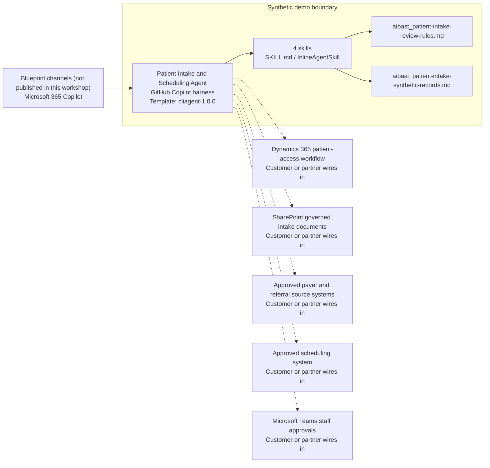

<!-- Generated by tools/build_solution_runbooks.py. Do not edit; change the sources and regenerate. -->

# Patient Intake and Scheduling Agent — Architecture

## Solution Architecture

### Logical architecture and trust boundary

Solid: synthetic design. Dashed: unwired customer systems; channels unpublished.

## Component Responsibilities

| Operation | Capability | Purpose | Owner |
| --- | --- | --- | --- |
| intake_readiness | Intake readiness review | Summarizes present and missing synthetic intake evidence for staff confirmation. | Template |
| coverage_evidence | Coverage evidence review | Transcribes source-recorded synthetic coverage evidence without determining eligibility. | Template |
| appointment_availability | Appointment availability review | Shows candidate synthetic source slots without holding, booking, or changing an appointment. | Template |
| pre_visit_summary | Pre-visit readiness summary | Drafts a minimum-necessary readiness handoff for authorized review. | Template |

| Runtime reference | Recorded value |
| --- | --- |
| Portable implementation | [patient_intake_agent.py](../../agents/@aibast-agents-library/healthcare_stacks/patient_intake_stack/patient_intake_agent.py) |
| Expected tool | PatientIntakeAgent |
| Source SHA-256 (short) | 4769d22a81cc |

## Data Contract

Approve field meaning, usage and retention before replacing synthetic examples.

| Entity | Fields the template uses | Used by | Customer system of record | Sensitivity |
| --- | --- | --- | --- | --- |
| PATIENTS | label; language; forms; missing | intake_readiness; coverage_evidence; pre_visit_summary | Dynamics 365 patient-access workflow | Patient data in production; minimum-necessary access only. |
| PATIENTS.coverage | payer; recorded_status; evidence_date; follow_up | coverage_evidence; pre_visit_summary | Approved payer and referral source systems | Patient coverage data; recorded evidence, never an eligibility result. |
| PATIENTS.visit | service; provider; date | pre_visit_summary | Approved scheduling system | Patient appointment data; source-recorded, not a booking. |
| Candidate source availability | Provider; Date; Time; Service | appointment_availability | Approved scheduling system | Clinician schedule data; candidates only, nothing held or booked. |
| Operation request | operation; patient_id; provider | intake_readiness; coverage_evidence; appointment_availability; pre_visit_summary | Customer or partner maps | Request parameters; unknown patient or provider identifiers are rejected. |

## Integration Points

**State: Not connected in the template.**

| System | Purpose | Skills that need it | Access | Template provides | Customer or partner wires in |
| --- | --- | --- | --- | --- | --- |
| Dynamics 365 patient-access workflow | Governed intake and readiness context. | patient-intake-intake-readiness; patient-intake-coverage-evidence; patient-intake-pre-visit-summary | read | Two fictional patient records and read-only skill contracts; no write permission. | [Wiring procedure](3.Runbook.md#step-3-1-integrate-dynamics-365-patient-access-workflow) |
| SharePoint governed intake documents | Controlled intake forms and documents. | patient-intake-intake-readiness; patient-intake-pre-visit-summary | read | Bundled fictional knowledge instead of documents; nothing is retrieved or stored. | [Wiring procedure](3.Runbook.md#step-3-2-integrate-sharepoint-governed-intake-documents) |
| Approved payer and referral source systems | Coverage and referral evidence for staff verification. | patient-intake-coverage-evidence; patient-intake-pre-visit-summary | read | Recorded coverage evidence and follow-ups; no eligibility, referral or network verification. | [Wiring procedure](3.Runbook.md#step-3-3-integrate-approved-payer-and-referral-source-systems) |
| Approved scheduling system | Clinician availability and recorded visits. | patient-intake-appointment-availability; patient-intake-pre-visit-summary | read-write | Fixed candidate slots and recorded visits; nothing is held or booked. | [Wiring procedure](3.Runbook.md#step-3-4-integrate-approved-scheduling-system) |
| Microsoft Teams staff approvals | Human approval of any downstream patient-access action. | patient-intake-pre-visit-summary | write | Readiness handoffs naming the reviewer; no message or approval request. | [Wiring procedure](3.Runbook.md#step-3-5-integrate-microsoft-teams-staff-approvals) |

## Identity and Permissions

| Template default | Customer or partner decision |
| --- | --- |
| Authentication: Microsoft Entra ID authentication; the customer selects the supported mode for the internal staff channel. | Confirm tenant, permitted identities and authentication enforcement. |
| Audience: Front Desk Staff; Scheduling Coordinators; Patient Access Representatives | Define authorized users, groups and least-privilege connection identities. |

- Require sign-in before showing any patient information.
- Request only read scopes for minimum-necessary intake, coverage and scheduling fields.
- Restrict the audience and verify access with authorized and denied identities.

## Copilot Studio Components

Copilot Studio uses the GitHub Copilot harness; skills hold reviewed behavior.

Agent metadata from [settings.mcs.yml](../../solutions/patient-intake/copilot-studio/settings.mcs.yml):

| Setting | Recorded value |
| --- | --- |
| Template | cliagent-1.0.0 |
| Recognizer | CLICopilotRecognizer |
| Authoring model | CliCopilot |
| Model | Sonnet46 |

### Skill inventory

One skill per row: manual upload and source-controlled form.

| Skill | Manual upload | Source component |
| --- | --- | --- |
| patient-intake-appointment-availability | [SKILL.md](../../solutions/patient-intake/manual/skills/appointment-availability/SKILL.md) | [InlineAgentSkill](../../solutions/patient-intake/copilot-studio/behaviors/aibast_patient-intake-appointment-availability.mcs.yml) |
| patient-intake-coverage-evidence | [SKILL.md](../../solutions/patient-intake/manual/skills/coverage-evidence/SKILL.md) | [InlineAgentSkill](../../solutions/patient-intake/copilot-studio/behaviors/aibast_patient-intake-coverage-evidence.mcs.yml) |
| patient-intake-intake-readiness | [SKILL.md](../../solutions/patient-intake/manual/skills/intake-readiness/SKILL.md) | [InlineAgentSkill](../../solutions/patient-intake/copilot-studio/behaviors/aibast_patient-intake-intake-readiness.mcs.yml) |
| patient-intake-pre-visit-summary | [SKILL.md](../../solutions/patient-intake/manual/skills/pre-visit-summary/SKILL.md) | [InlineAgentSkill](../../solutions/patient-intake/copilot-studio/behaviors/aibast_patient-intake-pre-visit-summary.mcs.yml) |

### Knowledge inventory

| Knowledge file | Upload | Source / metadata |
| --- | --- | --- |
| aibast_patient-intake-review-rules.md | [Content](../../solutions/patient-intake/manual/knowledge/aibast_patient-intake-review-rules.md) | [Source copy](../../solutions/patient-intake/copilot-studio/capabilities/knowledge/files/aibast_patient-intake-review-rules.md) · [Metadata](../../solutions/patient-intake/copilot-studio/capabilities/knowledge/files/aibast_patient-intake-review-rules.md.mcs.yml) |
| aibast_patient-intake-synthetic-records.md | [Content](../../solutions/patient-intake/manual/knowledge/aibast_patient-intake-synthetic-records.md) | [Source copy](../../solutions/patient-intake/copilot-studio/capabilities/knowledge/files/aibast_patient-intake-synthetic-records.md) · [Metadata](../../solutions/patient-intake/copilot-studio/capabilities/knowledge/files/aibast_patient-intake-synthetic-records.md.mcs.yml) |

## State and Recovery

| Recovery ID | Condition | Required behavior | Owner |
| --- | --- | --- | --- |
| evidence-no-mockups | A required evidence file is missing | Stop. Capture or restore the real file; never substitute a mockup. | Template |
| failed-case-no-cherry-picking | A recorded identifier is absent | Mark the case failed and investigate; do not retry until it happens to pass. | Template |
| draft-publication-stop | Publish is offered | Stop at Draft unless a separate approver explicitly authorizes publication. | Template |
| patient-system-unavailable | A wired patient-access, payer or scheduling system returns no verified result | Report unavailable evidence; never claim verified coverage, a booking or a record change. | Customer or partner |
| patient-not-matched | A patient or provider identifier is unknown | State that no synthetic record matched; never substitute another record. | Template |
| consequential-request | A request needs live data, eligibility, clinical advice, scheduling, messaging, submission or a record change | Stop and route the request to an authorized human. | Template |

Promotion requires separate approval. [Package recovery guide](../../solutions/patient-intake/FIELD-GUIDE.md#failure-recovery).

## Design Decisions

| Decision | Reason |
| --- | --- |
| Transcribe coverage evidence; never verify eligibility. | Eligibility, referral and network determinations remain in approved source systems. |
| Show candidate slots without booking or freshness claims. | Candidate synthetic slots carry no booking or freshness claim; booking stays with the approved scheduling system. |
| End every answer with a fixed healthcare boundary line. | Each response states that no diagnosis, eligibility, scheduling, outreach or record change occurred. |
| Use minimum-necessary synthetic fields only. | Live patient data is never requested or exposed. |
| Use exact assertions, not a quality-score substitute. | Evaluate (preview) General quality does not compare responses to expected answers. |

## Non-Functional Considerations

| Area | Customer or partner confirms |
| --- | --- |
| Licensing and Copilot Credits | Confirm tenant licensing and budget credits for building, Preview, evaluation and production patient-access use. |
| Capacity | Allocate approved capacity to the patient-access environment and monitor consumption before widening the audience. |
| Data residency | Confirm the permitted geography for patient, coverage and scheduling data, including movement from external systems. |
| Retention | Decide with privacy owners whether transcripts with patient information are saved, who may view or download them, and the Dataverse retention policy. |
| Cost drivers | Measure model-token, knowledge/tool and harness usage by intake workload; synthetic runs are not a production-cost estimate. |

## Next

→ [Delivery runbook](3.Runbook.md) | [Solution index](../README.md)

[Sources for this page](0.Resources/README.md#sources-2architecturemd).
