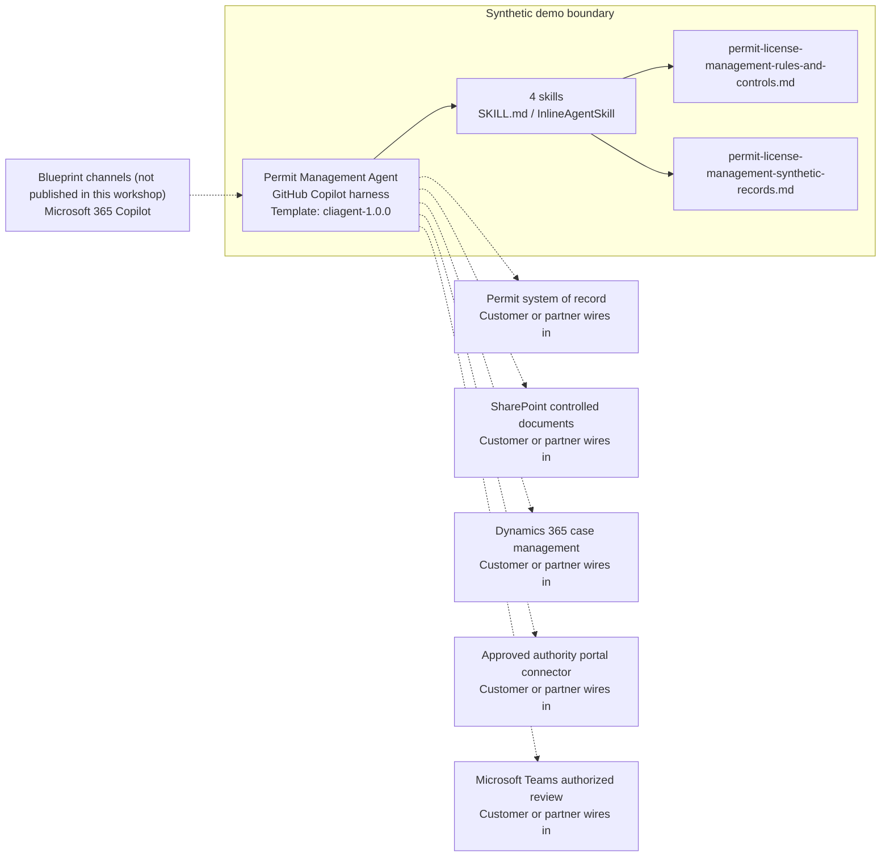

<!-- Generated by tools/build_solution_runbooks.py. Do not edit; change the sources and regenerate. -->

# Permit Management Agent — Architecture

## Solution Architecture

### Logical architecture and trust boundary

Solid: synthetic design. Dashed: unwired customer systems; channels unpublished.

## Component Responsibilities

| Operation | Capability | Purpose | Owner |
| --- | --- | --- | --- |
| permit_inventory | Permit register review | Summarizes synthetic permit status, facility, authority, expiration, and conditions. | Template |
| renewal_calendar | Renewal planning calendar | Orders synthetic permit deadlines and lead times without initiating a renewal. | Template |
| compliance_gaps | Permit evidence gap triage | Surfaces expired-permit and requirement-at-risk evidence without making a legal conclusion. | Template |
| application_status | Submitted-application tracking | Reports recorded application state without submitting, amending, withdrawing, or approving an application. | Template |

| Runtime reference | Recorded value |
| --- | --- |
| Portable implementation | [permit_license_management_agent.py](../../agents/@aibast-agents-library/energy_stacks/permit_license_management_stack/permit_license_management_agent.py) |
| Expected tool | PermitLicenseManagementAgent |
| Source SHA-256 (short) | 6d42f1ce8682 |

## Data Contract

Approve field meaning, usage and retention before replacing synthetic examples.

| Entity | Fields the template uses | Used by | Customer system of record | Sensitivity |
| --- | --- | --- | --- | --- |
| PERMITS | name; facility; issuing_authority; permit_number; issued_date; expiration_date; status; type; renewal_lead_days; conditions; last_inspection | permit_inventory; renewal_calendar; compliance_gaps | Permit system of record | Regulated permit records; restrict to authorized permit and compliance staff. |
| APPLICATIONS | permit_name; facility; submitted_date; authority; status; expected_decision; comments_received | application_status | Customer or partner maps | Regulatory filing status; legal review applies before any external use. |
| REGULATORY_REQUIREMENTS | air_quality; water_discharge; waste_management; pipeline_operation; spill_prevention | compliance_gaps | Customer or partner maps | Obligation mapping for screening only; legal owners validate applicability. |
| _compliance_gaps output | id; name; facility; gap_type; severity; detail | compliance_gaps | Customer or partner maps | Derived triage evidence; not a legal finding or persisted record. |

## Integration Points

**State: Not connected in the template.**

| System | Purpose | Skills that need it | Access | Template provides | Customer or partner wires in |
| --- | --- | --- | --- | --- | --- |
| Permit system of record | Current permit and application records for facility-scoped review. | permit-license-management-permit-inventory; permit-license-management-renewal-calendar; permit-license-management-compliance-gaps; permit-license-management-application-status | read | Register, calendar, gap and application contracts backed by fixed synthetic permits; no live lookup. | [Wiring procedure](3.Runbook.md#step-3-1-integrate-permit-system-of-record) |
| SharePoint controlled documents | Governed permit evidence and supporting documents. | permit-license-management-permit-inventory; permit-license-management-compliance-gaps | read | Two uploaded synthetic knowledge files stand in for controlled permit evidence. | [Wiring procedure](3.Runbook.md#step-3-2-integrate-sharepoint-controlled-documents) |
| Dynamics 365 case management | Review cases and handoffs for permit staff. | permit-license-management-compliance-gaps; permit-license-management-renewal-calendar | read-write | Named reviewers and no-write boundaries; no case is created, updated or closed. | [Wiring procedure](3.Runbook.md#step-3-3-integrate-dynamics-365-case-management) |
| Approved authority portal connector | Authenticated filing with the issuing authority, isolated from analysis. | permit-license-management-renewal-calendar; permit-license-management-application-status | write | Planning reminders and recorded application status only; no filing tool. | [Wiring procedure](3.Runbook.md#step-3-4-integrate-approved-authority-portal-connector) |
| Microsoft Teams authorized review | Reviewer handoffs and approvals. | permit-license-management-compliance-gaps; permit-license-management-application-status | read-write | Named reviewer handoffs in responses; no message or approval request is sent. | [Wiring procedure](3.Runbook.md#step-3-5-integrate-microsoft-teams-authorized-review) |

## Identity and Permissions

| Template default | Customer or partner decision |
| --- | --- |
| Authentication: Microsoft Entra ID authentication; the customer selects the supported mode for the intended channel. | Confirm tenant, permitted identities and authentication enforcement. |
| Audience: Facility Managers; Permit Coordinators; Compliance Managers; Environmental Counsel | Define authorized users, groups and least-privilege connection identities. |

- Require sign-in before exposing permit records, documents or application status.
- Request only the scopes needed for approved permit sources and actions.
- Restrict the allowed audience and verify access with authorized and denied identities.

## Copilot Studio Components

Copilot Studio uses the GitHub Copilot harness; skills hold reviewed behavior.

Agent metadata from [settings.mcs.yml](../../solutions/permit-license-management/copilot-studio/settings.mcs.yml):

| Setting | Recorded value |
| --- | --- |
| Template | cliagent-1.0.0 |
| Recognizer | CLICopilotRecognizer |
| Authoring model | CliCopilot |
| Model | Sonnet46 |

### Skill inventory

One skill per row: manual upload and source-controlled form.

| Skill | Manual upload | Source component |
| --- | --- | --- |
| permit-license-management-application-status | [SKILL.md](../../solutions/permit-license-management/manual/skills/aibast_application-status/SKILL.md) | [InlineAgentSkill](../../solutions/permit-license-management/copilot-studio/behaviors/aibast_permit-license-management-application-status.mcs.yml) |
| permit-license-management-compliance-gaps | [SKILL.md](../../solutions/permit-license-management/manual/skills/aibast_compliance-gaps/SKILL.md) | [InlineAgentSkill](../../solutions/permit-license-management/copilot-studio/behaviors/aibast_permit-license-management-compliance-gaps.mcs.yml) |
| permit-license-management-permit-inventory | [SKILL.md](../../solutions/permit-license-management/manual/skills/aibast_permit-inventory/SKILL.md) | [InlineAgentSkill](../../solutions/permit-license-management/copilot-studio/behaviors/aibast_permit-license-management-permit-inventory.mcs.yml) |
| permit-license-management-renewal-calendar | [SKILL.md](../../solutions/permit-license-management/manual/skills/aibast_renewal-calendar/SKILL.md) | [InlineAgentSkill](../../solutions/permit-license-management/copilot-studio/behaviors/aibast_permit-license-management-renewal-calendar.mcs.yml) |

### Knowledge inventory

| Knowledge file | Upload | Source / metadata |
| --- | --- | --- |
| permit-license-management-rules-and-controls.md | [Content](../../solutions/permit-license-management/manual/knowledge/permit-license-management-rules-and-controls.md) | [Source copy](../../solutions/permit-license-management/copilot-studio/capabilities/knowledge/files/permit-license-management-rules-and-controls.md) · [Metadata](../../solutions/permit-license-management/copilot-studio/capabilities/knowledge/files/permit-license-management-rules-and-controls.md.mcs.yml) |
| permit-license-management-synthetic-records.md | [Content](../../solutions/permit-license-management/manual/knowledge/permit-license-management-synthetic-records.md) | [Source copy](../../solutions/permit-license-management/copilot-studio/capabilities/knowledge/files/permit-license-management-synthetic-records.md) · [Metadata](../../solutions/permit-license-management/copilot-studio/capabilities/knowledge/files/permit-license-management-synthetic-records.md.mcs.yml) |

## State and Recovery

| Recovery ID | Condition | Required behavior | Owner |
| --- | --- | --- | --- |
| evidence-no-mockups | A required evidence file is missing | Stop. Capture or restore the real file; never substitute a mockup. | Template |
| failed-case-no-cherry-picking | A recorded identifier is absent | Mark the case failed and investigate; do not retry until it happens to pass. | Template |
| draft-publication-stop | Publish is offered | Stop at Draft unless a separate approver explicitly authorizes publication. | Template |
| permit-system-unavailable | A wired permit, document, case or portal system returns no verified result | Report unavailable evidence; never claim a lookup, renewal, filing or case update succeeded. | Customer or partner |
| permit-identifier-absent | A requested permit, application or facility is absent from the records | State that it is absent; never substitute another record or browse for replacement facts. | Template |
| permit-action-requested | A request would submit, renew, amend, withdraw or approve a permit | Return review evidence and name the authorized reviewer; a future write needs authorization, current-state validation, confirmation and immutable audit logging. | Template |

Promotion requires separate approval. [Package recovery guide](../../solutions/permit-license-management/FIELD-GUIDE.md#failure-recovery).

## Design Decisions

| Decision | Reason |
| --- | --- |
| Keep four independently routable operations. | Register, calendar, gap and application questions map to distinct personas and locked cases. |
| Treat compliance gaps as triage evidence. | Legal and permit owners validate obligations and approve remediation; the agent gives no legal advice. |
| Isolate any future filing tool from analysis. | A write needs explicit authorized confirmation, current-state validation and an immutable audit event. |
| Fail closed on absent identifiers. | Unknown identifiers produce no substitution, and missing permit evidence is never browsed for or invented. |
| Use exact assertions, not a quality-score substitute. | Evaluate (preview) General quality does not compare responses to expected answers. |

## Non-Functional Considerations

| Area | Customer or partner confirms |
| --- | --- |
| Licensing and Copilot Credits | Confirm tenant licensing and budget credits for building, Preview, evaluation and production permit use. |
| Capacity | Allocate approved capacity to the permit environment and monitor consumption before widening the audience. |
| Data residency | Approve the environment geography and any cross-region processing of permit records and controlled documents. |
| Retention | Decide transcript recording, viewing, download and Dataverse retention with the compliance and legal data owners. |
| Cost drivers | Measure model, knowledge and tool usage per permit workload; synthetic runs are not a production-cost estimate. |

## Next

→ [Delivery runbook](3.Runbook.md) | [Solution index](../README.md)

[Sources for this page](0.Resources/README.md#sources-2architecturemd).
