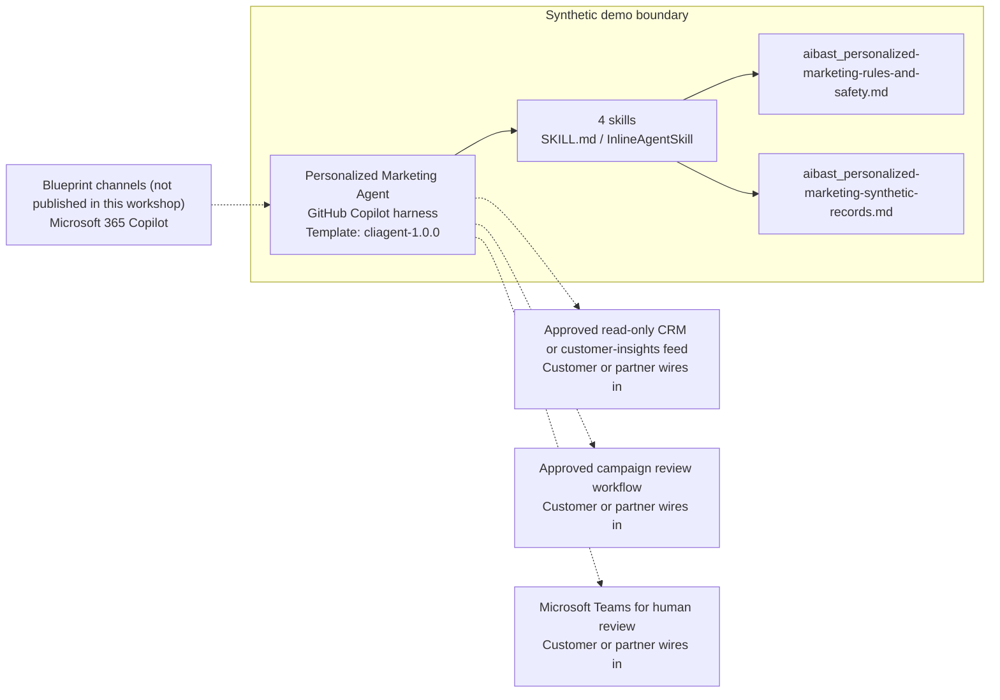

<!-- Generated by tools/build_solution_runbooks.py. Do not edit; change the sources and regenerate. -->

# Personalized Marketing Agent — Architecture

## Solution Architecture

### Logical architecture and trust boundary

Solid: synthetic design. Dashed: unwired customer systems; channels unpublished.

## Component Responsibilities

| Operation | Capability | Purpose | Owner |
| --- | --- | --- | --- |
| customer_segmentation | Aggregate customer segmentation | Compares non-sensitive commercial segment signals without identifying or profiling a person. | Template |
| campaign_design | Campaign concept design | Builds review-only multi-wave campaign concepts with approval gates. | Template |
| content_personalization | Draft content personalization | Produces segment-level draft copy and product ideas from non-sensitive aggregate signals. | Template |
| performance_analysis | Synthetic performance analysis | Compares fixed test and campaign scenarios without claiming live results. | Template |

| Runtime reference | Recorded value |
| --- | --- |
| Portable implementation | [personalized_marketing_agent.py](../../agents/@aibast-agents-library/retail_cpg_stacks/personalized_marketing_stack/personalized_marketing_agent.py) |
| Expected tool | PersonalizedMarketingAgent |
| Source SHA-256 (short) | 2e88be794991 |

## Data Contract

Approve field meaning, usage and retention before replacing synthetic examples.

| Entity | Fields the template uses | Used by | Customer system of record | Sensitivity |
| --- | --- | --- | --- | --- |
| CUSTOMER_SEGMENTS | name; size; avg_annual_spend; avg_orders_per_year; avg_basket_size; preferred_channels; top_categories; churn_risk; lifetime_value; engagement_score | customer_segmentation; campaign_design; content_personalization; performance_analysis | Approved read-only CRM or customer-insights feed | Aggregate commercial data; no demographic, sensitive or person-level attributes. |
| CAMPAIGN_TEMPLATES | name; type; target_segment; stages; duration_days; offer_concept; subject_lines; historical_open_rate; historical_click_rate; historical_conversion_rate | campaign_design; performance_analysis | Approved read-only CRM or customer-insights feed | Internal campaign plans; offer concepts need policy approval before use. |
| AB_TEST_RESULTS | campaign; variant_a; variant_b; subject; open_rate; click_rate; conversions; winner; confidence; sample_size | performance_analysis | Customer or partner maps | Aggregate experiment results; state confidence and sample size with any use. |
| CONTENT_BLOCKS | hero_banner; product_recs; headline; cta | content_personalization | Customer or partner maps | Draft marketing copy; brand and policy review before any use. |

## Integration Points

**State: Not connected in the template.**

| System | Purpose | Skills that need it | Access | Template provides | Customer or partner wires in |
| --- | --- | --- | --- | --- | --- |
| Approved read-only CRM or customer-insights feed | Aggregate segment, campaign and test data in place of the synthetic records. | privacy-safe-customer-segmentation; review-only-campaign-design; consent-aware-content-personalization; synthetic-marketing-performance-analysis | read | Segment, campaign, content and A/B contracts backed by fixed synthetic aggregates; no live lookup. | [Wiring procedure](3.Runbook.md#step-3-1-integrate-approved-read-only-crm-or-customer-insights-feed) |
| Approved campaign review workflow | Marketer approval of audience, copy, offer, timing and publication, separate from activation. | review-only-campaign-design; consent-aware-content-personalization | write | Draft sequences, offer concepts and named approval gates; no approval, send or launch tool. | [Wiring procedure](3.Runbook.md#step-3-2-integrate-approved-campaign-review-workflow) |
| Microsoft Teams for human review | Review of drafts and evidence with Marketing Director and Campaign Manager approvers. | review-only-campaign-design; consent-aware-content-personalization; synthetic-marketing-performance-analysis | read-write | Review-ready drafts and named approval gates; no Teams message is sent. | [Wiring procedure](3.Runbook.md#step-3-3-integrate-microsoft-teams-for-human-review) |

## Identity and Permissions

| Template default | Customer or partner decision |
| --- | --- |
| Authentication: Microsoft Entra ID authentication; the customer selects the supported mode for the intended channel. | Confirm tenant, permitted identities and authentication enforcement. |
| Audience: Marketing Directors; Campaign Managers | Define authorized users, groups and least-privilege connection identities. |

- Require sign-in before exposing segment, campaign or performance data.
- Request only the scopes needed for approved aggregate sources and review actions.
- Restrict the allowed audience and verify access with authorized and denied identities.

## Copilot Studio Components

Copilot Studio uses the GitHub Copilot harness; skills hold reviewed behavior.

Agent metadata from [settings.mcs.yml](../../solutions/personalized-marketing/copilot-studio/settings.mcs.yml):

| Setting | Recorded value |
| --- | --- |
| Template | cliagent-1.0.0 |
| Recognizer | CLICopilotRecognizer |
| Authoring model | CliCopilot |
| Model | Sonnet46 |

### Skill inventory

One skill per row: manual upload and source-controlled form.

| Skill | Manual upload | Source component |
| --- | --- | --- |
| consent-aware-content-personalization | [SKILL.md](../../solutions/personalized-marketing/manual/skills/content-personalization/SKILL.md) | [InlineAgentSkill](../../solutions/personalized-marketing/copilot-studio/behaviors/aibast_consent-aware-content-personalization.mcs.yml) |
| privacy-safe-customer-segmentation | [SKILL.md](../../solutions/personalized-marketing/manual/skills/customer-segmentation/SKILL.md) | [InlineAgentSkill](../../solutions/personalized-marketing/copilot-studio/behaviors/aibast_privacy-safe-customer-segmentation.mcs.yml) |
| review-only-campaign-design | [SKILL.md](../../solutions/personalized-marketing/manual/skills/campaign-design/SKILL.md) | [InlineAgentSkill](../../solutions/personalized-marketing/copilot-studio/behaviors/aibast_review-only-campaign-design.mcs.yml) |
| synthetic-marketing-performance-analysis | [SKILL.md](../../solutions/personalized-marketing/manual/skills/performance-analysis/SKILL.md) | [InlineAgentSkill](../../solutions/personalized-marketing/copilot-studio/behaviors/aibast_synthetic-marketing-performance-analysis.mcs.yml) |

### Knowledge inventory

| Knowledge file | Upload | Source / metadata |
| --- | --- | --- |
| aibast_personalized-marketing-rules-and-safety.md | [Content](../../solutions/personalized-marketing/manual/knowledge/aibast_personalized-marketing-rules-and-safety.md) | [Source copy](../../solutions/personalized-marketing/copilot-studio/capabilities/knowledge/files/aibast_personalized-marketing-rules-and-safety.md) · [Metadata](../../solutions/personalized-marketing/copilot-studio/capabilities/knowledge/files/aibast_personalized-marketing-rules-and-safety.md.mcs.yml) |
| aibast_personalized-marketing-synthetic-records.md | [Content](../../solutions/personalized-marketing/manual/knowledge/aibast_personalized-marketing-synthetic-records.md) | [Source copy](../../solutions/personalized-marketing/copilot-studio/capabilities/knowledge/files/aibast_personalized-marketing-synthetic-records.md) · [Metadata](../../solutions/personalized-marketing/copilot-studio/capabilities/knowledge/files/aibast_personalized-marketing-synthetic-records.md.mcs.yml) |

## State and Recovery

| Recovery ID | Condition | Required behavior | Owner |
| --- | --- | --- | --- |
| evidence-no-mockups | A required evidence file is missing | Stop. Capture or restore the real file; never substitute a mockup. | Template |
| failed-case-no-cherry-picking | A recorded identifier is absent | Mark the case failed and investigate; do not retry until it happens to pass. | Template |
| draft-publication-stop | Publish is offered | Stop at Draft unless a separate approver explicitly authorizes publication. | Template |
| marketing-source-unavailable | A wired CRM, insights or review system returns no verified result | Report unavailable evidence; never claim live segment data, a sent message or an approval. | Customer or partner |
| marketing-identifier-unknown | A segment or campaign identifier is unknown | Stop and request a valid synthetic identifier; do not approximate. | Template |
| marketing-action-requested | A request would contact customers, create an offer, launch a campaign, issue a reward or complete a purchase | Return drafts or recommendations, name the human approval gate and state that no side effect occurred. | Template |

Promotion requires separate approval. [Package recovery guide](../../solutions/personalized-marketing/FIELD-GUIDE.md#failure-recovery).

## Design Decisions

| Decision | Reason |
| --- | --- |
| Work only from aggregate, non-sensitive segment signals. | Demographic attributes and direct identifiers were removed; no person is profiled. |
| Label every campaign and content output as a draft. | Audience, copy, offer, timing and publication stay behind authorized marketer review. |
| Separate observed benchmarks from illustrative projections. | Synthetic lift, revenue and ROAS support a review decision, not a KPI promise. |
| Reject unknown identifiers instead of falling back. | Unknown segment or campaign IDs no longer fall back silently to other records. |
| Use exact assertions, not a quality-score substitute. | Evaluate (preview) General quality does not compare responses to expected answers. |

## Non-Functional Considerations

| Area | Customer or partner confirms |
| --- | --- |
| Licensing and Copilot Credits | Confirm tenant licensing and budget credits for building, Preview, evaluation and production marketing use. |
| Capacity | Allocate approved capacity to the marketing environment and monitor consumption before widening the audience. |
| Data residency | Approve the environment geography and any cross-region processing of CRM or customer-insights data. |
| Retention | Decide transcript recording, viewing, download and Dataverse retention with the marketing and privacy data owners. |
| Cost drivers | Measure model, knowledge and tool usage per marketing workload; synthetic runs are not a production-cost estimate. |

## Next

→ [Delivery runbook](3.Runbook.md) | [Solution index](../README.md)

[Sources for this page](0.Resources/README.md#sources-2architecturemd).
