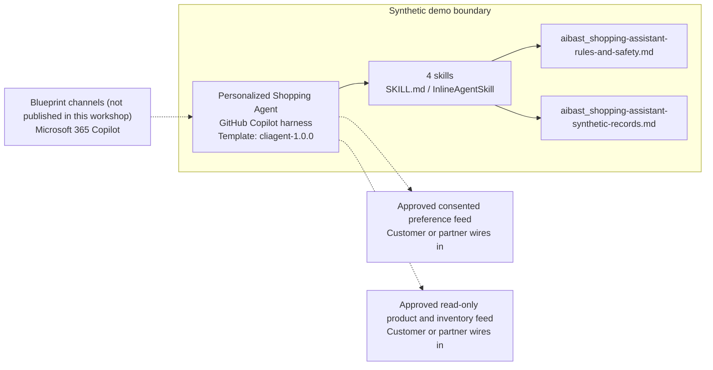

<!-- Generated by tools/build_solution_runbooks.py. Do not edit; change the sources and regenerate. -->

# Personalized Shopping Agent — Architecture

## Solution Architecture

### Logical architecture and trust boundary

Solid: synthetic design. Dashed: unwired customer systems; channels unpublished.

## Component Responsibilities

| Operation | Capability | Purpose | Owner |
| --- | --- | --- | --- |
| product_recommendations | Transparent product recommendations | Explains options from stated non-sensitive preferences. | Template |
| style_profile | Opt-in style profile | Summarizes only preferences the synthetic shopper explicitly provided. | Template |
| inventory_check | Read-only availability check | Shows synthetic size-level stock with a verification gate. | Template |
| outfit_builder | Review-only outfit builder | Drafts coordinated options and totals without ordering or reserving. | Template |

| Runtime reference | Recorded value |
| --- | --- |
| Portable implementation | [personalized_shopping_assistant_agent.py](../../agents/@aibast-agents-library/b2c_sales_stacks/personalized_shopping_assistant_stack/personalized_shopping_assistant_agent.py) |
| Expected tool | PersonalizedShoppingAssistantAgent |
| Source SHA-256 (short) | 81d81bea2371 |

## Data Contract

Approve field meaning, usage and retention before replacing synthetic examples.

| Entity | Fields the template uses | Used by | Customer system of record | Sensitivity |
| --- | --- | --- | --- | --- |
| PRODUCT_CATALOG | name; category; subcategory; price; brand; sizes; colors; style_tags; rating; stock | product_recommendations; style_profile; inventory_check; outfit_builder | Approved read-only product and inventory feed | Commercial catalog and stock data; snapshot values need live verification. |
| CUSTOMER_PREFERENCES | name; size_top; size_bottom; size_shoe; style_preference; brand_affinity; color_preference; budget_range; purchase_history | product_recommendations; style_profile; outfit_builder | Approved consented preference feed | Shopper personal data; use only opted-in, stated preferences and never infer sensitive traits. |
| OUTFIT_TEMPLATES | name; pieces | outfit_builder | Customer or partner maps | Merchandising reference data; no shopper data. |
| Approved personas and language focus | Persona; Required focus | product_recommendations; style_profile; inventory_check; outfit_builder | Customer or partner maps | Role configuration; the customer maps real associate roles. |

## Integration Points

**State: Not connected in the template.**

| System | Purpose | Skills that need it | Access | Template provides | Customer or partner wires in |
| --- | --- | --- | --- | --- | --- |
| Approved consented preference feed | Opt-in sizing, style, brand, color, budget and product-history preferences. | transparent-product-recommendations; opt-in-style-profile-summary; review-only-outfit-builder | read | Two synthetic opt-in profiles and stated-preference contracts; no live lookup or inference. | [Wiring procedure](3.Runbook.md#step-3-1-integrate-approved-consented-preference-feed) |
| Approved read-only product and inventory feed | Catalog, price, size and stock data for recommendations, outfits and availability. | transparent-product-recommendations; read-only-shopping-inventory-check; review-only-outfit-builder | read | Synthetic SKUs with size-level stock and a verification gate; no reservation or order tool. | [Wiring procedure](3.Runbook.md#step-3-2-integrate-approved-read-only-product-and-inventory-feed) |

## Identity and Permissions

| Template default | Customer or partner decision |
| --- | --- |
| Authentication: Microsoft Entra ID authentication; the customer selects the supported mode for the intended channel. | Confirm tenant, permitted identities and authentication enforcement. |
| Audience: Personal Shoppers; Clienteling Specialists; Retail Managers | Define authorized users, groups and least-privilege connection identities. |

- Require sign-in before exposing shopper preferences or inventory data.
- Request only the scopes needed for approved preference and catalog sources.
- Restrict the allowed audience and verify access with authorized and denied identities.

## Copilot Studio Components

Copilot Studio uses the GitHub Copilot harness; skills hold reviewed behavior.

Agent metadata from [settings.mcs.yml](../../solutions/personalized-shopping-assistant/copilot-studio/settings.mcs.yml):

| Setting | Recorded value |
| --- | --- |
| Template | cliagent-1.0.0 |
| Recognizer | CLICopilotRecognizer |
| Authoring model | CliCopilot |
| Model | Sonnet46 |

### Skill inventory

One skill per row: manual upload and source-controlled form.

| Skill | Manual upload | Source component |
| --- | --- | --- |
| opt-in-style-profile-summary | [SKILL.md](../../solutions/personalized-shopping-assistant/manual/skills/style-profile/SKILL.md) | [InlineAgentSkill](../../solutions/personalized-shopping-assistant/copilot-studio/behaviors/aibast_opt-in-style-profile-summary.mcs.yml) |
| read-only-shopping-inventory-check | [SKILL.md](../../solutions/personalized-shopping-assistant/manual/skills/inventory-check/SKILL.md) | [InlineAgentSkill](../../solutions/personalized-shopping-assistant/copilot-studio/behaviors/aibast_read-only-shopping-inventory-check.mcs.yml) |
| review-only-outfit-builder | [SKILL.md](../../solutions/personalized-shopping-assistant/manual/skills/outfit-builder/SKILL.md) | [InlineAgentSkill](../../solutions/personalized-shopping-assistant/copilot-studio/behaviors/aibast_review-only-outfit-builder.mcs.yml) |
| transparent-product-recommendations | [SKILL.md](../../solutions/personalized-shopping-assistant/manual/skills/product-recommendations/SKILL.md) | [InlineAgentSkill](../../solutions/personalized-shopping-assistant/copilot-studio/behaviors/aibast_transparent-product-recommendations.mcs.yml) |

### Knowledge inventory

| Knowledge file | Upload | Source / metadata |
| --- | --- | --- |
| aibast_shopping-assistant-rules-and-safety.md | [Content](../../solutions/personalized-shopping-assistant/manual/knowledge/aibast_shopping-assistant-rules-and-safety.md) | [Source copy](../../solutions/personalized-shopping-assistant/copilot-studio/capabilities/knowledge/files/aibast_shopping-assistant-rules-and-safety.md) · [Metadata](../../solutions/personalized-shopping-assistant/copilot-studio/capabilities/knowledge/files/aibast_shopping-assistant-rules-and-safety.md.mcs.yml) |
| aibast_shopping-assistant-synthetic-records.md | [Content](../../solutions/personalized-shopping-assistant/manual/knowledge/aibast_shopping-assistant-synthetic-records.md) | [Source copy](../../solutions/personalized-shopping-assistant/copilot-studio/capabilities/knowledge/files/aibast_shopping-assistant-synthetic-records.md) · [Metadata](../../solutions/personalized-shopping-assistant/copilot-studio/capabilities/knowledge/files/aibast_shopping-assistant-synthetic-records.md.mcs.yml) |

## State and Recovery

| Recovery ID | Condition | Required behavior | Owner |
| --- | --- | --- | --- |
| evidence-no-mockups | A required evidence file is missing | Stop. Capture or restore the real file; never substitute a mockup. | Template |
| failed-case-no-cherry-picking | A recorded identifier is absent | Mark the case failed and investigate; do not retry until it happens to pass. | Template |
| draft-publication-stop | Publish is offered | Stop at Draft unless a separate approver explicitly authorizes publication. | Template |
| shopping-feed-unavailable | A wired preference or inventory feed returns no verified result | Report unavailable evidence; never claim live availability, a reservation or an order. | Customer or partner |
| shopper-or-sku-unknown | A shopper or SKU identifier is unknown | Stop and request a valid synthetic identifier; do not approximate. | Template |
| shopping-action-requested | A request would reserve stock, apply a benefit, or create an order, return, refund or purchase | Return drafts for associate review and state that no external side effect occurred. | Template |

Promotion requires separate approval. [Package recovery guide](../../solutions/personalized-shopping-assistant/FIELD-GUIDE.md#failure-recovery).

## Design Decisions

| Decision | Reason |
| --- | --- |
| Use only explicitly stated, non-sensitive preferences. | Named shoppers were replaced with synthetic labels, and recommendations explain stated preference signals. |
| Show a transparent match score for each option. | Ranking reflects style, brand, color and budget overlap, so associates can see why an item appears. |
| Keep inventory read-only with a verification gate. | Snapshot stock must be verified before operational use and is never reserved. |
| Reject unknown identifiers instead of approximating. | Unknown shopper or SKU identifiers return the valid synthetic list rather than another record. |
| Use exact assertions, not a quality-score substitute. | Evaluate (preview) General quality does not compare responses to expected answers. |

## Non-Functional Considerations

| Area | Customer or partner confirms |
| --- | --- |
| Licensing and Copilot Credits | Confirm tenant licensing and budget credits for building, Preview, evaluation and production clienteling use. |
| Capacity | Allocate approved capacity to the retail environment and monitor consumption before widening the audience. |
| Data residency | Approve the environment geography and any cross-region processing of shopper preferences. |
| Retention | Decide transcript recording, viewing, download and Dataverse retention with the privacy and retail data owners. |
| Cost drivers | Measure model, knowledge and tool usage per associate workload; synthetic runs are not a production-cost estimate. |

## Next

→ [Delivery runbook](3.Runbook.md) | [Solution index](../README.md)

[Sources for this page](0.Resources/README.md#sources-2architecturemd).
