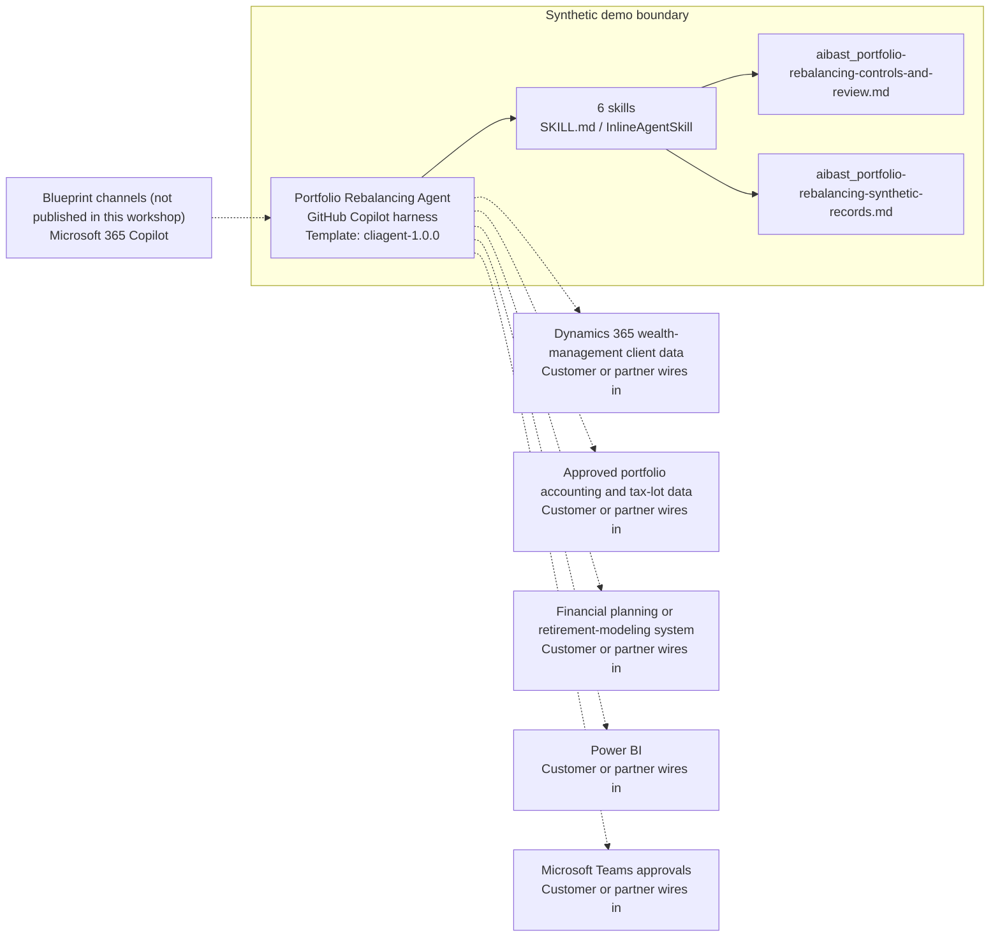

<!-- Generated by tools/build_solution_runbooks.py. Do not edit; change the sources and regenerate. -->

# Portfolio Rebalancing Agent — Architecture

## Solution Architecture

### Logical architecture and trust boundary

Solid: synthetic design. Dashed: unwired customer systems; channels unpublished.

## Component Responsibilities

| Operation | Capability | Purpose | Owner |
| --- | --- | --- | --- |
| portfolio_analysis | Portfolio drift analysis | Compares current and target allocations and identifies threshold breaches. | Template |
| rebalance_recommendation | Rebalancing candidates | Prepares nonbinding allocation-change candidates for licensed-advisor review. | Template |
| tax_impact | Illustrative tax impact | Shows assumptions and an illustrative gain-tax estimate for qualified professional review. | Template |
| tax_loss_harvest | Tax-loss-harvesting candidates | Surfaces loss positions while requiring tax-lot, wash-sale, account, and suitability review. | Template |
| retirement_scenario | Retirement scenario inputs | Frames assumptions for lower-return, base, and higher-volatility retirement modeling without asserting success. | Template |
| execution_plan | Human-controlled implementation checklist | Sequences review, approval, settlement, and verification steps without creating or routing an order. | Template |

| Runtime reference | Recorded value |
| --- | --- |
| Portable implementation | [portfolio_rebalancing_agent.py](../../agents/@aibast-agents-library/financial_services_stacks/portfolio_rebalancing_stack/portfolio_rebalancing_agent.py) |
| Expected tool | PortfolioRebalancingAgent |
| Source SHA-256 (short) | 76086d7010b6 |

## Data Contract

Approve field meaning, usage and retention before replacing synthetic examples.

| Entity | Fields the template uses | Used by | Customer system of record | Sensitivity |
| --- | --- | --- | --- | --- |
| PORTFOLIOS | name; manager; strategy; total_value; benchmark; rebalance_frequency; drift_threshold; holdings | portfolio_analysis; rebalance_recommendation; tax_impact; tax_loss_harvest; retirement_scenario; execution_plan | Customer or partner maps | Client portfolio and staff data; restrict to authorized advisors and reviewers. |
| PORTFOLIOS.holdings | ticker; value; current_pct; target_pct; cost_basis | portfolio_analysis; rebalance_recommendation; tax_impact; tax_loss_harvest; execution_plan | Approved portfolio accounting and tax-lot data | Client holdings and cost basis; confidential financial data. |
| TAX_RATES | short_term_capital_gains; long_term_capital_gains; qualified_dividends; ordinary_income; net_investment_income_tax | tax_impact | Customer or partner maps | Illustrative assumptions; a qualified tax professional decides applicability. |
| _calculate_drift candidate | asset; ticker; current_pct; target_pct; drift; action; trade_value | rebalance_recommendation; tax_impact; execution_plan | Customer or partner maps | Derived candidates; not advice, an approval or an order. |

## Integration Points

**State: Not connected in the template.**

| System | Purpose | Skills that need it | Access | Template provides | Customer or partner wires in |
| --- | --- | --- | --- | --- | --- |
| Dynamics 365 wealth-management client data | Client context linked to the approved portfolio record. | portfolio-analysis; rebalance-recommendation; retirement-scenario | read | Fixed synthetic portfolios and no client records; suitability stays with licensed advisors. | [Wiring procedure](3.Runbook.md#step-3-1-integrate-dynamics-365-wealth-management-client-data) |
| Approved portfolio accounting and tax-lot data | Holdings, targets, values and cost basis for drift and illustrative tax review. | portfolio-analysis; rebalance-recommendation; tax-impact; tax-loss-harvest; execution-plan | read | Holding, drift, rate and loss-candidate contracts over synthetic portfolios; no live lookup. | [Wiring procedure](3.Runbook.md#step-3-2-integrate-approved-portfolio-accounting-and-tax-lot-data) |
| Financial planning or retirement-modeling system | Scenario modeling from advisor-validated assumptions, outside the agent. | retirement-scenario | write | Supplied inputs, scenario labels and validation categories; no model or success probability. | [Wiring procedure](3.Runbook.md#step-3-3-integrate-financial-planning-or-retirement-modeling-system) |
| Power BI | Governed drift and review-status reporting. | portfolio-analysis | read | Drift tables and review status in answers; no report or dataset. | [Wiring procedure](3.Runbook.md#step-3-4-integrate-power-bi) |
| Microsoft Teams approvals | Advisor, compliance and authorized-trading approvals before external action. | rebalance-recommendation; tax-loss-harvest; execution-plan | read-write | Pending review lists and the no-order statement; no approval request is sent. | [Wiring procedure](3.Runbook.md#step-3-5-integrate-microsoft-teams-approvals) |

## Identity and Permissions

| Template default | Customer or partner decision |
| --- | --- |
| Authentication: Microsoft Entra ID authentication; the customer selects the supported mode for the intended channel. | Confirm tenant, permitted identities and authentication enforcement. |
| Audience: Financial Advisors; Portfolio Managers; Paraplanners; Trading Supervisors | Define authorized users, groups and least-privilege connection identities. |

- Require sign-in before exposing client, holding or tax-lot data.
- Request only the scopes needed for approved read sources and approval actions.
- Restrict the allowed audience and verify access with authorized and denied identities.

## Copilot Studio Components

Copilot Studio uses the GitHub Copilot harness; skills hold reviewed behavior.

Agent metadata from [settings.mcs.yml](../../solutions/portfolio-rebalancing/copilot-studio/settings.mcs.yml):

| Setting | Recorded value |
| --- | --- |
| Template | cliagent-1.0.0 |
| Recognizer | CLICopilotRecognizer |
| Authoring model | CliCopilot |
| Model | Sonnet46 |

### Skill inventory

One skill per row: manual upload and source-controlled form.

| Skill | Manual upload | Source component |
| --- | --- | --- |
| execution-plan | [SKILL.md](../../solutions/portfolio-rebalancing/manual/skills/aibast_execution-plan_06/SKILL.md) | [InlineAgentSkill](../../solutions/portfolio-rebalancing/copilot-studio/behaviors/aibast_execution-plan.mcs.yml) |
| portfolio-analysis | [SKILL.md](../../solutions/portfolio-rebalancing/manual/skills/aibast_portfolio-analysis_01/SKILL.md) | [InlineAgentSkill](../../solutions/portfolio-rebalancing/copilot-studio/behaviors/aibast_portfolio-analysis.mcs.yml) |
| rebalance-recommendation | [SKILL.md](../../solutions/portfolio-rebalancing/manual/skills/aibast_rebalance-recommendation_02/SKILL.md) | [InlineAgentSkill](../../solutions/portfolio-rebalancing/copilot-studio/behaviors/aibast_rebalance-recommendation.mcs.yml) |
| retirement-scenario | [SKILL.md](../../solutions/portfolio-rebalancing/manual/skills/aibast_retirement-scenario_05/SKILL.md) | [InlineAgentSkill](../../solutions/portfolio-rebalancing/copilot-studio/behaviors/aibast_retirement-scenario.mcs.yml) |
| tax-impact | [SKILL.md](../../solutions/portfolio-rebalancing/manual/skills/aibast_tax-impact_03/SKILL.md) | [InlineAgentSkill](../../solutions/portfolio-rebalancing/copilot-studio/behaviors/aibast_tax-impact.mcs.yml) |
| tax-loss-harvest | [SKILL.md](../../solutions/portfolio-rebalancing/manual/skills/aibast_tax-loss-harvest_04/SKILL.md) | [InlineAgentSkill](../../solutions/portfolio-rebalancing/copilot-studio/behaviors/aibast_tax-loss-harvest.mcs.yml) |

### Knowledge inventory

| Knowledge file | Upload | Source / metadata |
| --- | --- | --- |
| aibast_portfolio-rebalancing-controls-and-review.md | [Content](../../solutions/portfolio-rebalancing/manual/knowledge/aibast_portfolio-rebalancing-controls-and-review.md) | [Source copy](../../solutions/portfolio-rebalancing/copilot-studio/capabilities/knowledge/files/aibast_portfolio-rebalancing-controls-and-review.md) · [Metadata](../../solutions/portfolio-rebalancing/copilot-studio/capabilities/knowledge/files/aibast_portfolio-rebalancing-controls-and-review.md.mcs.yml) |
| aibast_portfolio-rebalancing-synthetic-records.md | [Content](../../solutions/portfolio-rebalancing/manual/knowledge/aibast_portfolio-rebalancing-synthetic-records.md) | [Source copy](../../solutions/portfolio-rebalancing/copilot-studio/capabilities/knowledge/files/aibast_portfolio-rebalancing-synthetic-records.md) · [Metadata](../../solutions/portfolio-rebalancing/copilot-studio/capabilities/knowledge/files/aibast_portfolio-rebalancing-synthetic-records.md.mcs.yml) |

## State and Recovery

| Recovery ID | Condition | Required behavior | Owner |
| --- | --- | --- | --- |
| evidence-no-mockups | A required evidence file is missing | Stop. Capture or restore the real file; never substitute a mockup. | Template |
| failed-case-no-cherry-picking | A recorded identifier is absent | Mark the case failed and investigate; do not retry until it happens to pass. | Template |
| draft-publication-stop | Publish is offered | Stop at Draft unless a separate approver explicitly authorizes publication. | Template |
| wealth-system-unavailable | A wired client, accounting, planning or approval system returns no verified result | Report unavailable evidence; never claim a lookup, approval, order or record change. | Customer or partner |
| portfolio-id-unknown | A requested portfolio ID is unknown | Report that no synthetic record exists; never substitute another portfolio. | Template |
| source-revision-regression | A skill, controls file or model changes | Re-run every locked case on the frozen build; carry no earlier pass across the revision. | Template |

Promotion requires separate approval. [Package recovery guide](../../solutions/portfolio-rebalancing/FIELD-GUIDE.md#failure-recovery).

## Design Decisions

| Decision | Reason |
| --- | --- |
| Treat the configured drift threshold as the only guardrail. | Detection thresholds are not post-trade tolerances, authorization bands or trading permissions. |
| Bind every quantity to its scope. | Whole-position value and basis differ from reduction proceeds and allocated basis. |
| Fix the review blocks and closing footer verbatim. | Rejected native runs added unprovided tax rationale and examples to otherwise correct answers. |
| Keep implementation a proposed checklist, never an order. | The pilot cannot call trading systems; every checklist item is a proposed human step. |
| Use exact assertions, not a quality-score substitute. | Evaluate (preview) General quality does not compare responses to expected answers. |

## Non-Functional Considerations

| Area | Customer or partner confirms |
| --- | --- |
| Licensing and Copilot Credits | Confirm tenant licensing and budget credits for building, Preview, evaluation and production advisor use. |
| Capacity | Allocate approved capacity to the wealth environment and monitor consumption before widening the audience. |
| Data residency | Approve the environment geography and any cross-region processing of client and portfolio data. |
| Retention | Decide transcript recording, viewing, download and Dataverse retention with compliance and the client-data owner. |
| Cost drivers | Measure model, knowledge and tool usage per advisor workload; synthetic runs are not a production-cost estimate. |

## Next

→ [Delivery runbook](3.Runbook.md) | [Solution index](../README.md)

[Sources for this page](0.Resources/README.md#sources-2architecturemd).
