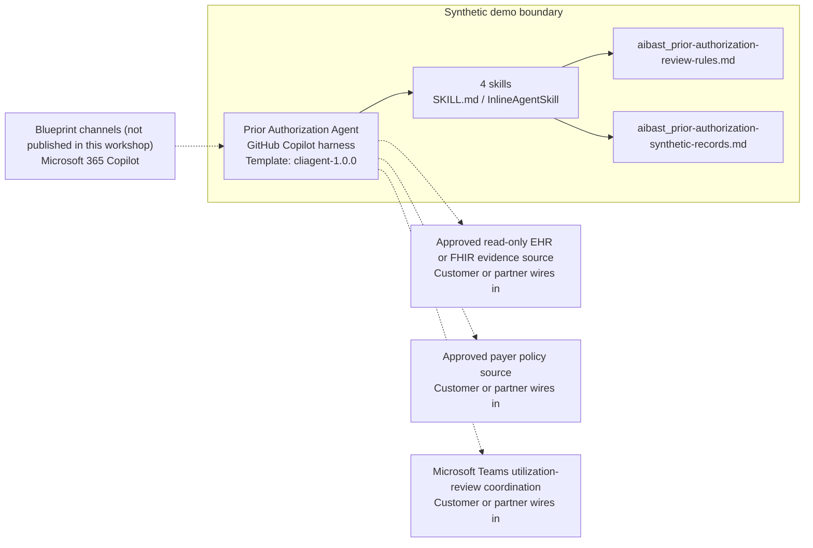

<!-- Generated by tools/build_solution_runbooks.py. Do not edit; change the sources and regenerate. -->

# Prior Authorization Agent — Architecture

## Solution Architecture

### Logical architecture and trust boundary

Solid: synthetic design. Dashed: unwired customer systems; channels unpublished.

## Component Responsibilities

| Operation | Capability | Purpose | Owner |
| --- | --- | --- | --- |
| request_evidence | Request evidence inventory | Inventories synthetic request evidence without submitting or deciding the request. | Template |
| criteria_evidence | Criteria-to-evidence crosswalk | Presents synthetic checklist items for qualified utilization review. | Template |
| status_summary | Source-recorded status summary | Transcribes a synthetic workflow state without making an authorization outcome. | Template |
| appeal_evidence_packet | Reconsideration evidence draft | Prepares a minimum-necessary outline without filing or recommending an appeal. | Template |

| Runtime reference | Recorded value |
| --- | --- |
| Portable implementation | [prior_authorization_agent.py](../../agents/@aibast-agents-library/healthcare_stacks/prior_authorization_stack/prior_authorization_agent.py) |
| Expected tool | PriorAuthorizationAgent |
| Source SHA-256 (short) | 4136fa7302c2 |

## Data Contract

Approve field meaning, usage and retention before replacing synthetic examples.

| Entity | Fields the template uses | Used by | Customer system of record | Sensitivity |
| --- | --- | --- | --- | --- |
| REQUESTS | service; payer; source_status; source_date; policy_id; evidence | request_evidence; criteria_evidence; status_summary; appeal_evidence_packet | Customer or partner maps | Protected health information; authorized, minimum-necessary access only. |
| REQUESTS.evidence (clinical items) | encounter note; prior imaging report; conservative-care duration; specialist note | request_evidence; appeal_evidence_packet | Approved read-only EHR or FHIR evidence source | Clinical documentation; minimum-necessary presence facts, never contents inferred. |
| POLICIES | title; requirements; effective_date | criteria_evidence; request_evidence; appeal_evidence_packet | Approved payer policy source | Payer policy reference; verify the current authoritative version. |

## Integration Points

**State: Not connected in the template.**

| System | Purpose | Skills that need it | Access | Template provides | Customer or partner wires in |
| --- | --- | --- | --- | --- | --- |
| Approved read-only EHR or FHIR evidence source | Minimum-necessary clinical evidence for request inventories and reconsideration outlines. | prior-authorization-request-evidence; prior-authorization-criteria-evidence; prior-authorization-appeal-evidence-packet | read | Evidence-item contracts over two synthetic requests; no live patient data. | [Wiring procedure](3.Runbook.md#step-3-1-integrate-approved-read-only-ehr-or-fhir-evidence-source) |
| Approved payer policy source | Current authoritative payer criteria for checklist review. | prior-authorization-criteria-evidence; prior-authorization-request-evidence; prior-authorization-appeal-evidence-packet | read | Two fictional checklists with effective dates; not current payer policy. | [Wiring procedure](3.Runbook.md#step-3-2-integrate-approved-payer-policy-source) |
| Microsoft Teams utilization-review coordination | Coordination of human utilization review. | prior-authorization-request-evidence; prior-authorization-status-summary; prior-authorization-appeal-evidence-packet | read-write | Named reviewer gates; no message, approval request, submission or notification. | [Wiring procedure](3.Runbook.md#step-3-3-integrate-microsoft-teams-utilization-review-coordination) |

## Identity and Permissions

| Template default | Customer or partner decision |
| --- | --- |
| Authentication: Microsoft Entra ID authentication; the customer selects the supported mode for the intended channel. | Confirm tenant, permitted identities and authentication enforcement. |
| Audience: Utilization Management Coordinators; Nurse Case Managers; Radiology Schedulers | Define authorized users, groups and least-privilege connection identities. |

- Require sign-in before exposing request evidence or workflow state.
- Request only minimum-necessary scopes for approved evidence and policy sources.
- Restrict the allowed audience and verify access with authorized and denied identities.

## Copilot Studio Components

Copilot Studio uses the GitHub Copilot harness; skills hold reviewed behavior.

Agent metadata from [settings.mcs.yml](../../solutions/prior-authorization/copilot-studio/settings.mcs.yml):

| Setting | Recorded value |
| --- | --- |
| Template | cliagent-1.0.0 |
| Recognizer | CLICopilotRecognizer |
| Authoring model | CliCopilot |
| Model | Sonnet46 |

### Skill inventory

One skill per row: manual upload and source-controlled form.

| Skill | Manual upload | Source component |
| --- | --- | --- |
| prior-authorization-appeal-evidence-packet | [SKILL.md](../../solutions/prior-authorization/manual/skills/appeal-evidence-packet/SKILL.md) | [InlineAgentSkill](../../solutions/prior-authorization/copilot-studio/behaviors/aibast_prior-authorization-appeal-evidence-packet.mcs.yml) |
| prior-authorization-criteria-evidence | [SKILL.md](../../solutions/prior-authorization/manual/skills/criteria-evidence/SKILL.md) | [InlineAgentSkill](../../solutions/prior-authorization/copilot-studio/behaviors/aibast_prior-authorization-criteria-evidence.mcs.yml) |
| prior-authorization-request-evidence | [SKILL.md](../../solutions/prior-authorization/manual/skills/request-evidence/SKILL.md) | [InlineAgentSkill](../../solutions/prior-authorization/copilot-studio/behaviors/aibast_prior-authorization-request-evidence.mcs.yml) |
| prior-authorization-status-summary | [SKILL.md](../../solutions/prior-authorization/manual/skills/status-summary/SKILL.md) | [InlineAgentSkill](../../solutions/prior-authorization/copilot-studio/behaviors/aibast_prior-authorization-status-summary.mcs.yml) |

### Knowledge inventory

| Knowledge file | Upload | Source / metadata |
| --- | --- | --- |
| aibast_prior-authorization-review-rules.md | [Content](../../solutions/prior-authorization/manual/knowledge/aibast_prior-authorization-review-rules.md) | [Source copy](../../solutions/prior-authorization/copilot-studio/capabilities/knowledge/files/aibast_prior-authorization-review-rules.md) · [Metadata](../../solutions/prior-authorization/copilot-studio/capabilities/knowledge/files/aibast_prior-authorization-review-rules.md.mcs.yml) |
| aibast_prior-authorization-synthetic-records.md | [Content](../../solutions/prior-authorization/manual/knowledge/aibast_prior-authorization-synthetic-records.md) | [Source copy](../../solutions/prior-authorization/copilot-studio/capabilities/knowledge/files/aibast_prior-authorization-synthetic-records.md) · [Metadata](../../solutions/prior-authorization/copilot-studio/capabilities/knowledge/files/aibast_prior-authorization-synthetic-records.md.mcs.yml) |

## State and Recovery

| Recovery ID | Condition | Required behavior | Owner |
| --- | --- | --- | --- |
| evidence-no-mockups | A required evidence file is missing | Stop. Capture or restore the real file; never substitute a mockup. | Template |
| failed-case-no-cherry-picking | A recorded identifier is absent | Mark the case failed and investigate; do not retry until it happens to pass. | Template |
| draft-publication-stop | Publish is offered | Stop at Draft unless a separate approver explicitly authorizes publication. | Template |
| clinical-source-unavailable | A wired EHR, FHIR, payer policy or Teams system returns no verified result | Report unavailable evidence; never claim a lookup, submission, notification or record change. | Customer or partner |
| request-id-unknown | A request identifier is unknown | Say what is missing and list the known synthetic identifiers; never substitute another record. | Template |
| reviewer-decision-needed | A request needs live data, policy interpretation, medical necessity, an outcome, payer contact, submission, scheduling or a record change | Stop and route to a qualified utilization reviewer. | Template |

Promotion requires separate approval. [Package recovery guide](../../solutions/prior-authorization/FIELD-GUIDE.md#failure-recovery).

## Design Decisions

| Decision | Reason |
| --- | --- |
| Treat workflow state and evidence presence as independent facts. | A rejected native run inferred a cause for a recorded state that the record never stated. |
| Emit exact line templates for each operation. | Table-column renderings dropped the prescribed reviewer-check and evidence lines in an earlier native run. |
| Run only the requested operations. | Combined requests keep each operation's complete contract; inventory-only requests stop after the inventory. |
| Transcribe status; never determine it. | A source status is never translated into approved, denied, eligible, authorized or likely. |
| Use exact assertions, not a quality-score substitute. | Evaluate (preview) General quality does not compare responses to expected answers. |

## Non-Functional Considerations

| Area | Customer or partner confirms |
| --- | --- |
| Licensing and Copilot Credits | Confirm tenant licensing and budget credits for building, Preview, evaluation and production utilization-review use. |
| Capacity | Allocate approved capacity to the healthcare environment and monitor consumption before widening the audience. |
| Data residency | Approve the environment geography and any cross-region processing of patient and payer data. |
| Retention | Decide transcript recording, viewing, download and Dataverse retention with the privacy and clinical data owners. |
| Cost drivers | Measure model, knowledge and tool usage per review workload; synthetic runs are not a production-cost estimate. |

## Next

→ [Delivery runbook](3.Runbook.md) | [Solution index](../README.md)

[Sources for this page](0.Resources/README.md#sources-2architecturemd).
