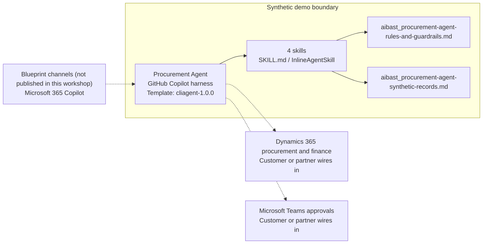

<!-- Generated by tools/build_solution_runbooks.py. Do not edit; change the sources and regenerate. -->

# Procurement Agent — Architecture

## Solution Architecture

### Logical architecture and trust boundary

Solid: synthetic design. Dashed: unwired customer systems; channels unpublished.

## Component Responsibilities

| Operation | Capability | Purpose | Owner |
| --- | --- | --- | --- |
| purchase_request | Purchase-request review | Use when a procurement manager asks for request context and the applicable approval level. | Template |
| vendor_comparison | Vendor evidence comparison | Use when a category buyer wants a neutral view of synthetic vendor ratings, terms, and tiers. | Template |
| approval_routing | Approval-path recommendation | Use when a department approver asks which authorization threshold applies to a request. | Template |
| spend_analysis | Spend and budget review | Use when a finance director asks which synthetic category is over budget or approaching a limit. | Template |

| Runtime reference | Recorded value |
| --- | --- |
| Portable implementation | [procurement_agent.py](../../agents/@aibast-agents-library/general_stacks/procurement_agent_stack/procurement_agent.py) |
| Expected tool | ProcurementAgent |
| Source SHA-256 (short) | eda05784ae53 |

## Data Contract

Approve field meaning, usage and retention before replacing synthetic examples.

| Entity | Fields the template uses | Used by | Customer system of record | Sensitivity |
| --- | --- | --- | --- | --- |
| Purchase requests | ID; Title; Requester; Department; Category; Amount; Priority; Status; Preferred vendor; Justification; Budget code | purchase_request; approval_routing | Dynamics 365 procurement and finance | Internal purchasing data with requester identities; restrict to procurement and finance. |
| Vendor catalog | ID; Vendor; Category; Contract status; Tier; Rating; Annual spend; Payment terms; Contact role | vendor_comparison; purchase_request | Dynamics 365 procurement and finance | Confidential supplier terms and spend; no award or qualification outcome. |
| Approval thresholds | Amount up to and including; Required approver; Approval SLA | approval_routing; purchase_request; spend_analysis | Customer or partner maps | Delegated-authority policy; the customer's approved thresholds replace the fictional tiers. |
| Spend categories | Category; Budget; Spent YTD; Committed; Available; Utilization; Status; Trend | spend_analysis; purchase_request | Dynamics 365 procurement and finance | Internal financial data; Finance validates and reconciles. |

## Integration Points

**State: Not connected in the template.**

| System | Purpose | Skills that need it | Access | Template provides | Customer or partner wires in |
| --- | --- | --- | --- | --- | --- |
| Dynamics 365 procurement and finance | Governed request, vendor, budget and spend data. | purchase-request; vendor-comparison; approval-routing; spend-analysis | read | Request, vendor, threshold and spend contracts over a frozen synthetic snapshot; no connection reference. | [Wiring procedure](3.Runbook.md#step-3-1-integrate-dynamics-365-procurement-and-finance) |
| Microsoft Teams approvals | Authenticated human review and approval collaboration. | purchase-request; approval-routing; spend-analysis | read-write | Recommended approvers and unresolved review lists; no approval, message or routing. | [Wiring procedure](3.Runbook.md#step-3-2-integrate-microsoft-teams-approvals) |

## Identity and Permissions

| Template default | Customer or partner decision |
| --- | --- |
| Authentication: Microsoft Entra ID authentication; the customer selects the supported mode for the intended channel. | Confirm tenant, permitted identities and authentication enforcement. |
| Audience: Procurement Managers; Category Buyers; Department Approvers; Finance Directors | Define authorized users, groups and least-privilege connection identities. |

- Require sign-in before exposing request, vendor or budget data.
- Request only the scopes needed for approved read sources and approval workflows.
- Restrict the allowed audience and verify access with authorized and denied identities.

## Copilot Studio Components

Copilot Studio uses the GitHub Copilot harness; skills hold reviewed behavior.

Agent metadata from [settings.mcs.yml](../../solutions/procurement-agent/copilot-studio/settings.mcs.yml):

| Setting | Recorded value |
| --- | --- |
| Template | cliagent-1.0.0 |
| Recognizer | CLICopilotRecognizer |
| Authoring model | CliCopilot |
| Model | Sonnet46 |

### Skill inventory

One skill per row: manual upload and source-controlled form.

| Skill | Manual upload | Source component |
| --- | --- | --- |
| approval-routing | [SKILL.md](../../solutions/procurement-agent/manual/skills/aibast_approval-routing_03/SKILL.md) | [InlineAgentSkill](../../solutions/procurement-agent/copilot-studio/behaviors/aibast_approval-routing.mcs.yml) |
| purchase-request | [SKILL.md](../../solutions/procurement-agent/manual/skills/aibast_purchase-request_01/SKILL.md) | [InlineAgentSkill](../../solutions/procurement-agent/copilot-studio/behaviors/aibast_purchase-request.mcs.yml) |
| spend-analysis | [SKILL.md](../../solutions/procurement-agent/manual/skills/aibast_spend-analysis_04/SKILL.md) | [InlineAgentSkill](../../solutions/procurement-agent/copilot-studio/behaviors/aibast_spend-analysis.mcs.yml) |
| vendor-comparison | [SKILL.md](../../solutions/procurement-agent/manual/skills/aibast_vendor-comparison_02/SKILL.md) | [InlineAgentSkill](../../solutions/procurement-agent/copilot-studio/behaviors/aibast_vendor-comparison.mcs.yml) |

### Knowledge inventory

| Knowledge file | Upload | Source / metadata |
| --- | --- | --- |
| aibast_procurement-agent-rules-and-guardrails.md | [Content](../../solutions/procurement-agent/manual/knowledge/aibast_procurement-agent-rules-and-guardrails.md) | [Source copy](../../solutions/procurement-agent/copilot-studio/capabilities/knowledge/files/aibast_procurement-agent-rules-and-guardrails.md) · [Metadata](../../solutions/procurement-agent/copilot-studio/capabilities/knowledge/files/aibast_procurement-agent-rules-and-guardrails.md.mcs.yml) |
| aibast_procurement-agent-synthetic-records.md | [Content](../../solutions/procurement-agent/manual/knowledge/aibast_procurement-agent-synthetic-records.md) | [Source copy](../../solutions/procurement-agent/copilot-studio/capabilities/knowledge/files/aibast_procurement-agent-synthetic-records.md) · [Metadata](../../solutions/procurement-agent/copilot-studio/capabilities/knowledge/files/aibast_procurement-agent-synthetic-records.md.mcs.yml) |

## State and Recovery

| Recovery ID | Condition | Required behavior | Owner |
| --- | --- | --- | --- |
| evidence-no-mockups | A required evidence file is missing | Stop. Capture or restore the real file; never substitute a mockup. | Template |
| failed-case-no-cherry-picking | A recorded identifier is absent | Mark the case failed and investigate; do not retry until it happens to pass. | Template |
| draft-publication-stop | Publish is offered | Stop at Draft unless a separate approver explicitly authorizes publication. | Template |
| procurement-system-unavailable | A wired procurement, finance or approval system returns no verified result | Report unavailable evidence; never claim an approval, purchase order, supplier action or commitment. | Customer or partner |
| native-authoring-blocked | Skill saving or Preview is unresponsive | Record the blocked state; accept nothing until installation, persistence and all four fresh cases are verified. | Template |
| requested-record-missing | An explicitly requested record is missing | State that it is absent; never substitute the default record. | Template |

Promotion requires separate approval. [Package recovery guide](../../solutions/procurement-agent/FIELD-GUIDE.md#failure-recovery).

## Design Decisions

| Decision | Reason |
| --- | --- |
| Select the first threshold whose inclusive cap covers the amount. | It keeps the source cap and top tier and avoids invented lower bounds or serial approval chains. |
| Fix budget arithmetic to the stated formula. | Category balances are summed once, a deficit is never subtracted twice, and balances are not transferable. |
| Withhold request-to-commitment inferences. | The snapshot has no mapping; Finance reconciliation must establish inclusion. |
| End every answer with the fixed review paragraph and footer. | Finance, procurement, legal, security and other owner reviews stay visibly unresolved. |
| Use exact assertions, not a quality-score substitute. | Evaluate (preview) General quality does not compare responses to expected answers. |

## Non-Functional Considerations

| Area | Customer or partner confirms |
| --- | --- |
| Licensing and Copilot Credits | Confirm tenant licensing and budget credits for building, Preview, evaluation and production procurement use. |
| Capacity | Allocate approved capacity to the procurement environment and monitor consumption before widening the audience. |
| Data residency | Approve the environment geography and any cross-region processing of procurement and finance data. |
| Retention | Decide transcript recording, viewing, download and Dataverse retention with the procurement and finance data owners. |
| Cost drivers | Measure model, knowledge and tool usage per procurement workload; synthetic runs are not a production-cost estimate. |

## Next

→ [Delivery runbook](3.Runbook.md) | [Solution index](../README.md)

[Sources for this page](0.Resources/README.md#sources-2architecturemd).
