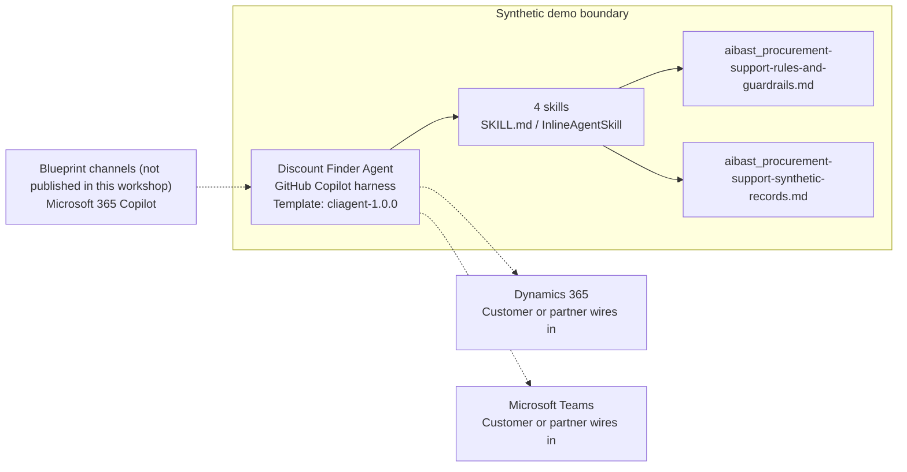

<!-- Generated by tools/build_solution_runbooks.py. Do not edit; change the sources and regenerate. -->

# Discount Finder Agent — Architecture

## Solution Architecture

### Logical architecture and trust boundary

Solid: synthetic design. Dashed: unwired customer systems; channels unpublished.

## Component Responsibilities

| Operation | Capability | Purpose | Owner |
| --- | --- | --- | --- |
| savings_scan | Savings-opportunity scan | Use when a procurement manager asks which synthetic contracts or forecasts contain reviewable savings signals. | Template |
| time_sensitive_deals | Dated pricing review | Use when a category buyer asks which offers or price notices need review first. | Template |
| consolidation_analysis | Demand-consolidation analysis | Use when a finance director asks whether fragmented facility demand may qualify for structured sourcing review. | Template |
| purchase_timing | Purchase-timing brief | Use when a category buyer asks how to sequence review of renewals, volume tiers, and announced price changes. | Template |

| Runtime reference | Recorded value |
| --- | --- |
| Portable implementation | [procurement_support_agent.py](../../agents/@aibast-agents-library/general_stacks/procurement_support_stack/procurement_support_agent.py) |
| Expected tool | ProcurementSupportAgent |
| Source SHA-256 (short) | 4ff370a8ec1c |

## Data Contract

Approve field meaning, usage and retention before replacing synthetic examples.

| Entity | Fields the template uses | Used by | Customer system of record | Sensitivity |
| --- | --- | --- | --- | --- |
| Discount and pricing opportunities | ID; Supplier; Category; Exact signal; Current spend; Threshold; Gap; Review by / expires; Evidence source | savings_scan; time_sensitive_deals; purchase_timing | Dynamics 365 | Confidential commercial terms and spend; signals are review candidates, not savings. |
| Demand-consolidation candidates | Category; Facilities; Current suppliers; Combined spend; Review candidate | consolidation_analysis | Dynamics 365 | Internal demand and spend by facility; no award recommendation. |

## Integration Points

**State: Not connected in the template.**

| System | Purpose | Skills that need it | Access | Template provides | Customer or partner wires in |
| --- | --- | --- | --- | --- | --- |
| Dynamics 365 | Approved contract, forecast and vendor-notice evidence. | savings-scan; time-sensitive-deals; consolidation-analysis; purchase-timing | read | Pricing-signal and demand contracts over a fixed synthetic snapshot; no live pricing or write action. | [Wiring procedure](3.Runbook.md#step-3-1-integrate-dynamics-365) |
| Microsoft Teams | Sourcing-review collaboration for an authorized category manager. | consolidation-analysis; purchase-timing | read-write | Sourcing-review briefs with validation checks; no supplier contact or notification. | [Wiring procedure](3.Runbook.md#step-3-2-integrate-microsoft-teams) |

## Identity and Permissions

| Template default | Customer or partner decision |
| --- | --- |
| Authentication: Microsoft Entra ID authentication; the customer selects the supported mode for the intended channel. | Confirm tenant, permitted identities and authentication enforcement. |
| Audience: Procurement Managers; Category Buyers; Finance Directors | Define authorized users, groups and least-privilege connection identities. |

- Require sign-in before exposing contract, pricing or demand data.
- Request only the scopes needed for approved read sources and review workflows.
- Restrict the allowed audience and verify access with authorized and denied identities.

## Copilot Studio Components

Copilot Studio uses the GitHub Copilot harness; skills hold reviewed behavior.

Agent metadata from [settings.mcs.yml](../../solutions/procurement-support/copilot-studio/settings.mcs.yml):

| Setting | Recorded value |
| --- | --- |
| Template | cliagent-1.0.0 |
| Recognizer | CLICopilotRecognizer |
| Authoring model | CliCopilot |
| Model | Sonnet46 |

### Skill inventory

One skill per row: manual upload and source-controlled form.

| Skill | Manual upload | Source component |
| --- | --- | --- |
| consolidation-analysis | [SKILL.md](../../solutions/procurement-support/manual/skills/aibast_consolidation-analysis_03/SKILL.md) | [InlineAgentSkill](../../solutions/procurement-support/copilot-studio/behaviors/aibast_consolidation-analysis.mcs.yml) |
| purchase-timing | [SKILL.md](../../solutions/procurement-support/manual/skills/aibast_purchase-timing_04/SKILL.md) | [InlineAgentSkill](../../solutions/procurement-support/copilot-studio/behaviors/aibast_purchase-timing.mcs.yml) |
| savings-scan | [SKILL.md](../../solutions/procurement-support/manual/skills/aibast_savings-scan_01/SKILL.md) | [InlineAgentSkill](../../solutions/procurement-support/copilot-studio/behaviors/aibast_savings-scan.mcs.yml) |
| time-sensitive-deals | [SKILL.md](../../solutions/procurement-support/manual/skills/aibast_time-sensitive-deals_02/SKILL.md) | [InlineAgentSkill](../../solutions/procurement-support/copilot-studio/behaviors/aibast_time-sensitive-deals.mcs.yml) |

### Knowledge inventory

| Knowledge file | Upload | Source / metadata |
| --- | --- | --- |
| aibast_procurement-support-rules-and-guardrails.md | [Content](../../solutions/procurement-support/manual/knowledge/aibast_procurement-support-rules-and-guardrails.md) | [Source copy](../../solutions/procurement-support/copilot-studio/capabilities/knowledge/files/aibast_procurement-support-rules-and-guardrails.md) · [Metadata](../../solutions/procurement-support/copilot-studio/capabilities/knowledge/files/aibast_procurement-support-rules-and-guardrails.md.mcs.yml) |
| aibast_procurement-support-synthetic-records.md | [Content](../../solutions/procurement-support/manual/knowledge/aibast_procurement-support-synthetic-records.md) | [Source copy](../../solutions/procurement-support/copilot-studio/capabilities/knowledge/files/aibast_procurement-support-synthetic-records.md) · [Metadata](../../solutions/procurement-support/copilot-studio/capabilities/knowledge/files/aibast_procurement-support-synthetic-records.md.mcs.yml) |

## State and Recovery

| Recovery ID | Condition | Required behavior | Owner |
| --- | --- | --- | --- |
| evidence-no-mockups | A required evidence file is missing | Stop. Capture or restore the real file; never substitute a mockup. | Template |
| failed-case-no-cherry-picking | A recorded identifier is absent | Mark the case failed and investigate; do not retry until it happens to pass. | Template |
| draft-publication-stop | Publish is offered | Stop at Draft unless a separate approver explicitly authorizes publication. | Template |
| sourcing-system-unavailable | A wired contract, forecast or review system returns no verified result | Report unavailable evidence; never claim a supplier contact, quote, order, renewal or commitment. | Customer or partner |
| signal-not-in-snapshot | A supplier, offer or category outside the snapshot is requested | Say it is not in the snapshot; never invent a discount, deadline, supplier or term. | Template |
| commercial-action-requested | A request would select or contact a supplier, request a quote, renew, order or commit spend | Return a sourcing-review brief for the authorized category manager and state that no commitment occurred. | Template |

Promotion requires separate approval. [Package recovery guide](../../solutions/procurement-support/FIELD-GUIDE.md#failure-recovery).

## Design Decisions

| Decision | Reason |
| --- | --- |
| Label every opportunity a review candidate. | A surfaced opportunity is never realized savings; validation checks and tradeoffs come first. |
| Compute gaps with one fixed rule. | The gap is the threshold minus current spend, never below zero; dated conditions carry no spend gap. |
| Expose only the four Discount Finder operations. | Legacy helper views in the portable source do not implement the approved one-pager. |
| Keep every commercial decision with an authorized category manager. | The approved procurement process verifies terms, demand, quality, competition, continuity and authority. |
| Use exact assertions, not a quality-score substitute. | Evaluate (preview) General quality does not compare responses to expected answers. |

## Non-Functional Considerations

| Area | Customer or partner confirms |
| --- | --- |
| Licensing and Copilot Credits | Confirm tenant licensing and budget credits for building, Preview, evaluation and production sourcing use. |
| Capacity | Allocate approved capacity to the procurement environment and monitor consumption before widening the audience. |
| Data residency | Approve the environment geography and any cross-region processing of contract and spend data. |
| Retention | Decide transcript recording, viewing, download and Dataverse retention with the procurement data owner. |
| Cost drivers | Measure model, knowledge and tool usage per sourcing workload; synthetic runs are not a production-cost estimate. |

## Next

→ [Delivery runbook](3.Runbook.md) | [Solution index](../README.md)

[Sources for this page](0.Resources/README.md#sources-2architecturemd).
