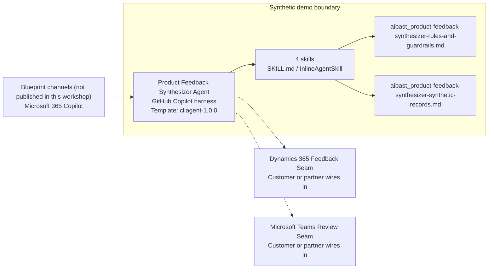

<!-- Generated by tools/build_solution_runbooks.py. Do not edit; change the sources and regenerate. -->

# Product Feedback Synthesizer Agent — Architecture

## Solution Architecture

### Logical architecture and trust boundary

Solid: synthetic design. Dashed: unwired customer systems; channels unpublished.

## Component Responsibilities

| Operation | Capability | Purpose | Owner |
| --- | --- | --- | --- |
| feedback_summary | Cross-channel feedback summary | Use when a product manager asks for a compact view of volume, channels, categories, and synthetic commercial context. | Template |
| feature_requests | Feature-request evidence ranking | Use when an engineering lead wants review candidates sorted by the supplied synthetic ARR weight. | Template |
| sentiment_analysis | Sentiment and NPS evidence | Use when a director of product asks for the fictional sentiment split and recent excerpts. | Template |
| roadmap_impact | Roadmap review candidates | Use when a product trio wants a non-binding impact view with explicit validation gates. | Template |

| Runtime reference | Recorded value |
| --- | --- |
| Portable implementation | [product_feedback_synthesizer_agent.py](../../agents/@aibast-agents-library/software_dp_stacks/product_feedback_synthesizer_stack/product_feedback_synthesizer_agent.py) |
| Expected tool | ProductFeedbackSynthesizerAgent |
| Source SHA-256 (short) | 5d3849a8f2ef |

## Data Contract

Approve field meaning, usage and retention before replacing synthetic examples.

| Entity | Fields the template uses | Used by | Customer system of record | Sensitivity |
| --- | --- | --- | --- | --- |
| Feedback entries | ID; Fictional customer; Channel; Date; Category; Sentiment; Score; Exact feedback text; ARR impact | feedback_summary; sentiment_analysis | Dynamics 365 Feedback Seam | Customer account, revenue and verbatim feedback; minimize exposure and never infer churn or traits. |
| Feature requests | ID; Title; Votes; ARR weight; Status; Effort; Category; Linked feedback | feature_requests; roadmap_impact | Customer or partner maps | Commercial weighting and review status; not a delivery commitment. |
| NPS snapshot | Quarter; Promoters; Passives; Detractors; NPS | sentiment_analysis | Customer or partner maps | Aggregate survey results; confirm permitted use with the survey owner. |
| Roadmap-impact review ranking | Rank; ID; Feature; Priority score; ARR weight; Effort; Status | roadmap_impact | Customer or partner maps | Derived review scores; not a prioritization or sequencing decision. |

## Integration Points

**State: Not connected in the template.**

| System | Purpose | Skills that need it | Access | Template provides | Customer or partner wires in |
| --- | --- | --- | --- | --- | --- |
| Dynamics 365 Feedback Seam | Approved customer feedback and account context for synthesis. | feedback-summary; sentiment-analysis | read | Feedback-entry fields and skill contracts backed by six fictional entries; no live customer-system connection. | [Wiring procedure](3.Runbook.md#step-3-1-integrate-dynamics-365-feedback-seam) |
| Microsoft Teams Review Seam | Human product-trio review of evidence and candidates. | feature-requests; roadmap-impact | write | Review-candidate briefs with named validation owners; no notification, task or ticket tool. | [Wiring procedure](3.Runbook.md#step-3-2-integrate-microsoft-teams-review-seam) |

## Identity and Permissions

| Template default | Customer or partner decision |
| --- | --- |
| Authentication: Microsoft Entra ID authentication; the customer configures the supported mode for the intended channel. | Confirm tenant, permitted identities and authentication enforcement. |
| Audience: Product Manager; Engineering Lead; Director of Product | Define authorized users, groups and least-privilege connection identities. |

- Require sign-in before exposing customer feedback or account context.
- Request only the scopes needed for approved feedback and review systems.
- Restrict the audience and test authorized and denied identities.

## Copilot Studio Components

Copilot Studio uses the GitHub Copilot harness; skills hold reviewed behavior.

Agent metadata from [settings.mcs.yml](../../solutions/product-feedback-synthesizer/copilot-studio/settings.mcs.yml):

| Setting | Recorded value |
| --- | --- |
| Template | cliagent-1.0.0 |
| Recognizer | CLICopilotRecognizer |
| Authoring model | CliCopilot |
| Model | Sonnet46 |

### Skill inventory

One skill per row: manual upload and source-controlled form.

| Skill | Manual upload | Source component |
| --- | --- | --- |
| feature-requests | [SKILL.md](../../solutions/product-feedback-synthesizer/manual/skills/aibast_feature-requests_02/SKILL.md) | [InlineAgentSkill](../../solutions/product-feedback-synthesizer/copilot-studio/behaviors/aibast_feature-requests.mcs.yml) |
| feedback-summary | [SKILL.md](../../solutions/product-feedback-synthesizer/manual/skills/aibast_feedback-summary_01/SKILL.md) | [InlineAgentSkill](../../solutions/product-feedback-synthesizer/copilot-studio/behaviors/aibast_feedback-summary.mcs.yml) |
| roadmap-impact | [SKILL.md](../../solutions/product-feedback-synthesizer/manual/skills/aibast_roadmap-impact_04/SKILL.md) | [InlineAgentSkill](../../solutions/product-feedback-synthesizer/copilot-studio/behaviors/aibast_roadmap-impact.mcs.yml) |
| sentiment-analysis | [SKILL.md](../../solutions/product-feedback-synthesizer/manual/skills/aibast_sentiment-analysis_03/SKILL.md) | [InlineAgentSkill](../../solutions/product-feedback-synthesizer/copilot-studio/behaviors/aibast_sentiment-analysis.mcs.yml) |

### Knowledge inventory

| Knowledge file | Upload | Source / metadata |
| --- | --- | --- |
| aibast_product-feedback-synthesizer-rules-and-guardrails.md | [Content](../../solutions/product-feedback-synthesizer/manual/knowledge/aibast_product-feedback-synthesizer-rules-and-guardrails.md) | [Source copy](../../solutions/product-feedback-synthesizer/copilot-studio/capabilities/knowledge/files/aibast_product-feedback-synthesizer-rules-and-guardrails.md) · [Metadata](../../solutions/product-feedback-synthesizer/copilot-studio/capabilities/knowledge/files/aibast_product-feedback-synthesizer-rules-and-guardrails.md.mcs.yml) |
| aibast_product-feedback-synthesizer-synthetic-records.md | [Content](../../solutions/product-feedback-synthesizer/manual/knowledge/aibast_product-feedback-synthesizer-synthetic-records.md) | [Source copy](../../solutions/product-feedback-synthesizer/copilot-studio/capabilities/knowledge/files/aibast_product-feedback-synthesizer-synthetic-records.md) · [Metadata](../../solutions/product-feedback-synthesizer/copilot-studio/capabilities/knowledge/files/aibast_product-feedback-synthesizer-synthetic-records.md.mcs.yml) |

## State and Recovery

| Recovery ID | Condition | Required behavior | Owner |
| --- | --- | --- | --- |
| evidence-no-mockups | A required evidence file is missing | Stop. Capture or restore the real file; never substitute a mockup. | Template |
| failed-case-no-cherry-picking | A recorded identifier is absent | Mark the case failed and investigate; do not retry until it happens to pass. | Template |
| draft-publication-stop | Publish is offered | Stop at Draft unless a separate approver explicitly authorizes publication. | Template |
| feedback-source-unavailable | A wired feedback or review system returns no verified result | Report unavailable evidence; never claim a lookup, ticket, notification or roadmap change succeeded. | Customer or partner |
| feedback-record-absent | A question names feedback or a request that is not in the snapshot | Say it is not in the supplied evidence; never invent an entry, request, metric or status. | Template |
| feedback-grounding-unavailable | The required skill or its knowledge cannot load | Retry once in the same turn, then report failure and stop without an uncited answer. | Template |

Promotion requires separate approval. [Package recovery guide](../../solutions/product-feedback-synthesizer/FIELD-GUIDE.md#failure-recovery).

## Design Decisions

| Decision | Reason |
| --- | --- |
| Use review labels instead of commitment-like statuses. | The source audit found statuses such as `planned_q2` and `in_progress` read as roadmap commitments. |
| Show the priority-score calculation, not a verdict. | ARR weight divided by an effort factor is a transparent review input, not prioritization authority. |
| Close substantive answers with the synthetic-evidence footer. | Readers must see that no ticket, customer action, account change or roadmap commitment occurred. |
| Route only through the four reviewed skill names. | Guessed skills and uncited answers after a retrieval failure break the locked routing contract. |
| Keep exact assertions separate from quality scoring. | General quality in Evaluate (preview) does not compare responses with expected answers. |

## Non-Functional Considerations

| Area | Customer or partner confirms |
| --- | --- |
| Licensing and Copilot Credits | Confirm tenant licensing and budget credits for building, Preview, evaluation and production feedback use. |
| Capacity | Allocate approved capacity to the product environment and monitor consumption before widening the audience. |
| Data residency | Approve the environment geography and any cross-region processing of customer feedback before connecting sources. |
| Retention | Decide with the data owner whether transcripts containing customer feedback are saved, who may view them and the Dataverse retention policy. |
| Cost drivers | Measure model, knowledge, tool and harness usage by workload; the synthetic demo is not a production-cost estimate. |

## Next

→ [Delivery runbook](3.Runbook.md) | [Solution index](../README.md)

[Sources for this page](0.Resources/README.md#sources-2architecturemd).
