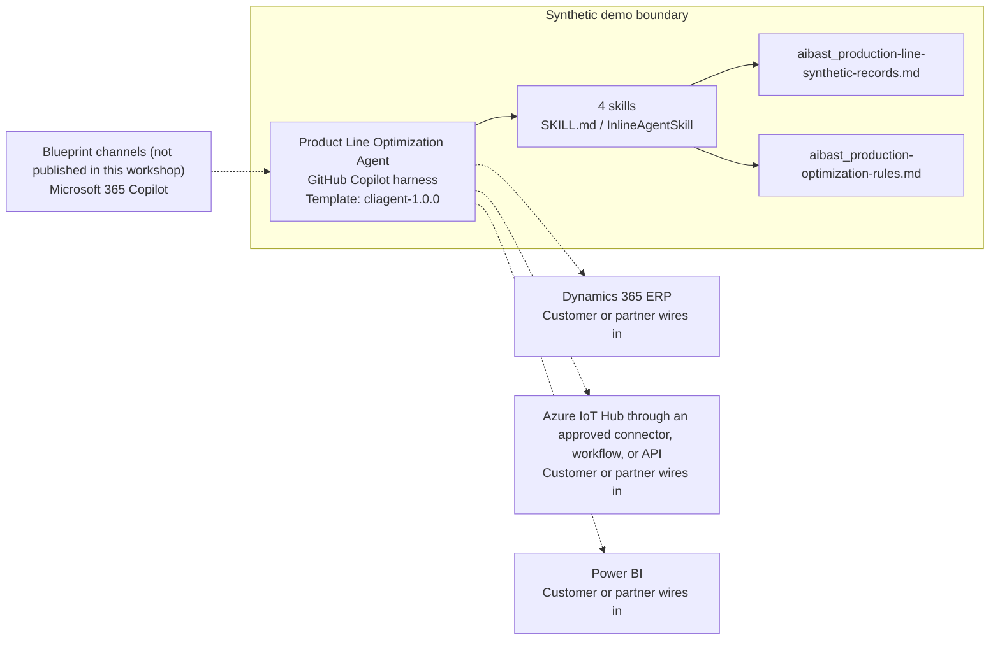

<!-- Generated by tools/build_solution_runbooks.py. Do not edit; change the sources and regenerate. -->

# Product Line Optimization Agent — Architecture

## Solution Architecture

### Logical architecture and trust boundary

Solid: synthetic design. Dashed: unwired customer systems; channels unpublished.

## Component Responsibilities

| Operation | Capability | Purpose | Owner |
| --- | --- | --- | --- |
| line_efficiency | Line health overview | Combines availability, performance, quality, and output context to show where operating attention is needed. | Template |
| bottleneck_analysis | Station-level constraint analysis | Compares cycle time with takt time and quality signals to identify the station constraining each line. | Template |
| throughput_optimization | Improvement option planning | Frames process, equipment, and quality interventions so plant leaders can compare practical response paths. | Template |
| shift_planning | Shift production planning | Translates line performance and staffing context into a shift-level operating plan. | Template |

| Runtime reference | Recorded value |
| --- | --- |
| Portable implementation | [production_line_optimization_agent.py](../../agents/@aibast-agents-library/manufacturing_stacks/production_line_optimization_stack/production_line_optimization_agent.py) |
| Expected tool | ProductionLineOptimizationAgent |
| Source SHA-256 (short) | 1b777377bf35 |

## Data Contract

Approve field meaning, usage and retention before replacing synthetic examples.

| Entity | Fields the template uses | Used by | Customer system of record | Sensitivity |
| --- | --- | --- | --- | --- |
| Line operating summary | Line ID; Line; Product; Design (uph); Actual (uph); Availability; Performance; Quality; Operating score (OEE); Flag | line_efficiency; throughput_optimization; shift_planning | Customer or partner maps | Plant performance data; confidential operational information. |
| Daily output and loss summary | Line; Output/Day; Gap vs Design (units lost/day); Annual Quality Cost | line_efficiency | Customer or partner maps | Derived output and cost figures; confidential, not a measured result. |
| Station cycle-time and defect records | Station; ID; Cycle (s); Takt (s); Delta; Defect % | bottleneck_analysis; throughput_optimization | Azure IoT Hub | Equipment telemetry; read-only, with no path to control equipment. |
| Defect category mix | Line; Defect categories | bottleneck_analysis | Customer or partner maps | Quality data; confidential operational information. |
| Shift schedule | Shift; Hours; Operators; Premium; Start; End | shift_planning | Dynamics 365 ERP | Workforce staffing and labor-cost data; not a staffing order. |
| Planned output by line and shift | Line; Day Shift; Swing Shift; Night Shift; Daily Total | shift_planning | Customer or partner maps | Derived projection to evaluate; not a committed schedule. |

## Integration Points

**State: Not connected in the template.**

| System | Purpose | Skills that need it | Access | Template provides | Customer or partner wires in |
| --- | --- | --- | --- | --- | --- |
| Dynamics 365 ERP | Production and resource context: products, design capacity, output and shift staffing. | plant-wide-operating-health-review; improvement-option-comparison; day-swing-night-production-plan | read | Line and shift record contracts backed by three fictional lines; no live read or write connection. | [Wiring procedure](3.Runbook.md#step-3-1-integrate-dynamics-365-erp) |
| Azure IoT Hub through an approved connector, workflow, or API | Verified equipment telemetry for station cycle times, availability and defects. | plant-wide-operating-health-review; constraining-station-identification | read | Station cycle, takt and defect contracts backed by fictional stations; the package cannot read or control equipment. | [Wiring procedure](3.Runbook.md#step-3-2-integrate-azure-iot-hub-through-an-approved-connector-workflow-or-api) |
| Power BI | Governed reporting surface for line health and improvement scenarios. | plant-wide-operating-health-review; improvement-option-comparison | read-write | Line-health and option outputs from synthetic records; the pilot neither reads dashboards nor publishes results. | [Wiring procedure](3.Runbook.md#step-3-3-integrate-power-bi) |

## Identity and Permissions

| Template default | Customer or partner decision |
| --- | --- |
| Authentication: Microsoft Entra ID authentication; the customer configures the supported mode for the intended channel. | Confirm tenant, permitted identities and authentication enforcement. |
| Audience: Plant Manager; Production Engineer; Operations Director | Define authorized users, groups and least-privilege connection identities. |

- Require sign-in before exposing plant production, quality or staffing data.
- Request only the read scopes needed for approved ERP, telemetry and reporting sources.
- Restrict the audience and test authorized and denied identities.

## Copilot Studio Components

Copilot Studio uses the GitHub Copilot harness; skills hold reviewed behavior.

Agent metadata from [settings.mcs.yml](../../solutions/product-line-optimization/copilot-studio/settings.mcs.yml):

| Setting | Recorded value |
| --- | --- |
| Template | cliagent-1.0.0 |
| Recognizer | CLICopilotRecognizer |
| Authoring model | CliCopilot |
| Model | Sonnet46 |

### Skill inventory

One skill per row: manual upload and source-controlled form.

| Skill | Manual upload | Source component |
| --- | --- | --- |
| constraining-station-identification | [SKILL.md](../../solutions/product-line-optimization/manual/skills/aibast_bottleneck_plo02/SKILL.md) | [InlineAgentSkill](../../solutions/product-line-optimization/copilot-studio/behaviors/aibast_bottleneck_plo02.mcs.yml) |
| day-swing-night-production-plan | [SKILL.md](../../solutions/product-line-optimization/manual/skills/aibast_shift-plan_plo04/SKILL.md) | [InlineAgentSkill](../../solutions/product-line-optimization/copilot-studio/behaviors/aibast_shift-plan_plo04.mcs.yml) |
| improvement-option-comparison | [SKILL.md](../../solutions/product-line-optimization/manual/skills/aibast_throughput-options_plo03/SKILL.md) | [InlineAgentSkill](../../solutions/product-line-optimization/copilot-studio/behaviors/aibast_throughput-options_plo03.mcs.yml) |
| plant-wide-operating-health-review | [SKILL.md](../../solutions/product-line-optimization/manual/skills/aibast_line-health_plo01/SKILL.md) | [InlineAgentSkill](../../solutions/product-line-optimization/copilot-studio/behaviors/aibast_line-health_plo01.mcs.yml) |

### Knowledge inventory

| Knowledge file | Upload | Source / metadata |
| --- | --- | --- |
| aibast_production-line-synthetic-records.md | [Content](../../solutions/product-line-optimization/copilot-studio/capabilities/knowledge/files/aibast_production-line-synthetic-records.md) | [Metadata](../../solutions/product-line-optimization/copilot-studio/capabilities/knowledge/files/aibast_production-line-synthetic-records.md.mcs.yml) |
| aibast_production-optimization-rules.md | [Content](../../solutions/product-line-optimization/copilot-studio/capabilities/knowledge/files/aibast_production-optimization-rules.md) | [Metadata](../../solutions/product-line-optimization/copilot-studio/capabilities/knowledge/files/aibast_production-optimization-rules.md.mcs.yml) |

## State and Recovery

| Recovery ID | Condition | Required behavior | Owner |
| --- | --- | --- | --- |
| evidence-no-mockups | A required evidence file is missing | Stop. Capture or restore the real file; never substitute a mockup. | Template |
| failed-case-no-cherry-picking | A recorded identifier is absent | Mark the case failed and investigate; do not retry until it happens to pass. | Template |
| draft-publication-stop | Publish is offered | Stop at Draft unless a separate approver explicitly authorizes publication. | Template |
| plant-system-unavailable | A wired ERP, telemetry or reporting system returns no verified result | Report unavailable evidence; never claim a live reading, system update or equipment action succeeded. | Customer or partner |
| plant-record-unknown | A request names a line, station, shift or scenario that is not in the records | Say what is missing and list the known records; never substitute or calculate a new scenario. | Template |
| plant-action-requested | A request would change a line, shift, staffing or maintenance, or commit spend | Return analysis and a suggested next step; operational decisions stay with plant leaders. | Template |

Promotion requires separate approval. [Package recovery guide](../../solutions/product-line-optimization/FIELD-GUIDE.md#failure-recovery).

## Design Decisions

| Decision | Reason |
| --- | --- |
| Evaluate all three lines by default. | Asking the user to pick or provide a line, or claiming no access, breaks the plant-floor routing contract. |
| Always keep a quality-improvement option. | It keeps the quality tradeoff visible beside every throughput gain. |
| Use packaged formulas and precomputed figures. | Fixed records keep every case reproducible; recalculation from other sources is prohibited. |
| Recommend only; never control equipment or schedules. | Plant leaders review recommendations before any operational decision, and the agent performs no external write. |
| Keep exact assertions separate from quality scoring. | General quality in Evaluate (preview) does not compare responses with expected answers. |

## Non-Functional Considerations

| Area | Customer or partner confirms |
| --- | --- |
| Licensing and Copilot Credits | Confirm tenant licensing and budget credits for building, Preview, evaluation and production plant use. |
| Capacity | Allocate approved capacity to the plant environment and monitor consumption before widening the audience. |
| Data residency | Approve the environment geography and any cross-region movement of ERP, telemetry or reporting data before connecting sources. |
| Retention | Decide with the data owner whether transcripts are saved, who may view or download them and the Dataverse retention policy. |
| Cost drivers | Measure model, knowledge, tool and harness usage by workload; the synthetic demo is not a production-cost estimate. |

## Next

→ [Delivery runbook](3.Runbook.md) | [Solution index](../README.md)

[Sources for this page](0.Resources/README.md#sources-2architecturemd).
