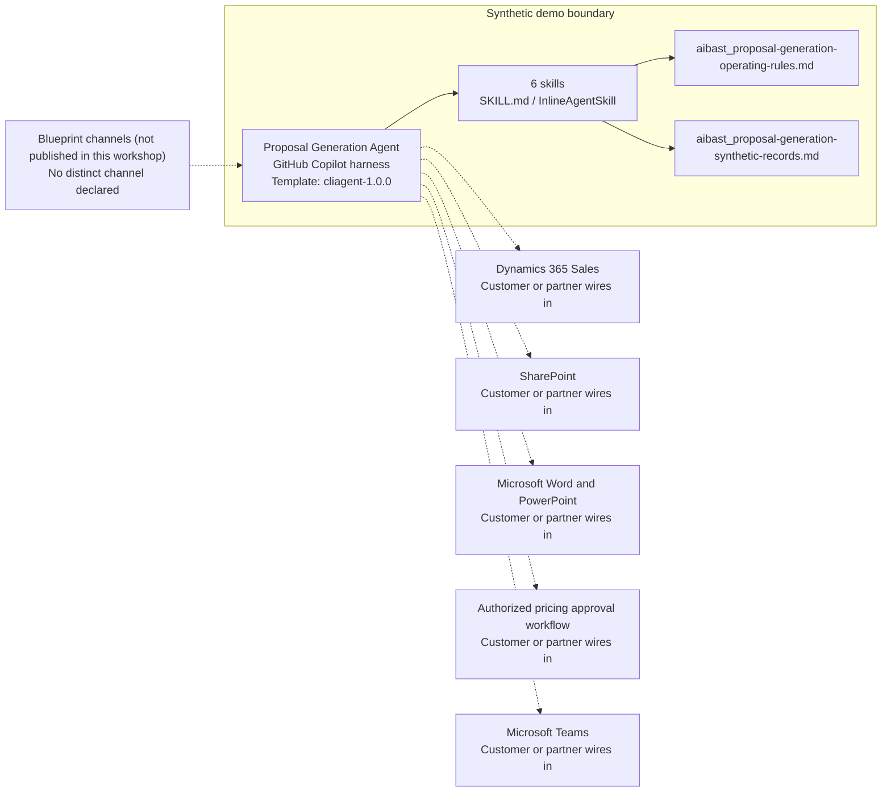

<!-- Generated by tools/build_solution_runbooks.py. Do not edit; change the sources and regenerate. -->

# Proposal Generation Agent — Architecture

## Solution Architecture

### Logical architecture and trust boundary

Solid: synthetic design. Dashed: unwired customer systems; channels unpublished.

## Component Responsibilities

| Operation | Capability | Purpose | Owner |
| --- | --- | --- | --- |
| analyze_rfp | Analyze Rfp | Extracts and maps requirements to synthetic capability evidence. | Template |
| executive_summary | Executive Summary | Drafts buyer-aligned executive positioning for review. | Template |
| solution_pricing | Solution Pricing | Compares solution, budget, discount, and margin assumptions without approval. | Template |
| references_positioning | References Positioning | Drafts reference and competitor positioning while requiring availability validation. | Template |
| compile_proposal | Compile Proposal | Builds a package outline and required human-review checklist. | Template |
| delivery_summary | Delivery Summary | Summarizes draft readiness and human-governed next-step options. | Template |

| Runtime reference | Recorded value |
| --- | --- |
| Portable implementation | [proposal_generation_agent.py](../../agents/@aibast-agents-library/b2b_sales_stacks/proposal_generation_stack/proposal_generation_agent.py) |
| Expected tool | ProposalGenerationAgent |
| Source SHA-256 (short) | 9483c83dce99 |

## Data Contract

Approve field meaning, usage and retention before replacing synthetic examples.

| Entity | Fields the template uses | Used by | Customer system of record | Sensitivity |
| --- | --- | --- | --- | --- |
| _RFPS | id; account; industry; project; key_stakeholder; budget_ceiling; deal_value; decision_timeline_days; competitors_shortlisted; existing_assets; requirements | analyze_rfp; executive_summary; solution_pricing; references_positioning; compile_proposal; delivery_summary | Dynamics 365 Sales | Customer opportunity and stakeholder data; commercially confidential. |
| _RFPS.requirements | id; category; text; weight | analyze_rfp; executive_summary; compile_proposal; delivery_summary | Customer or partner maps | Buyer RFP content; confidential bid material. |
| _PRODUCT_CATALOG | name; category; list_price; margin_floor | executive_summary; solution_pricing; compile_proposal; delivery_summary | Customer or partner maps | Price and margin floors; restricted commercial data. |
| _DISCOUNT_RULES | base; max; volume_bonus; volume_threshold | solution_pricing | Customer or partner maps | Discount policy; restricted to authorized pricing approvers. |
| _REFERENCES | customer; industry; size; results; impl_weeks; contact_ready | executive_summary; references_positioning; compile_proposal; delivery_summary | Customer or partner maps | Third-party customer references; permission and availability checks before use. |
| _COMPETITOR_CAPABILITIES | ehr_integration; hipaa_certified; impl_weeks; pricing_position; strengths; support_sla_min; weaknesses | references_positioning; delivery_summary | Customer or partner maps | Competitive claims; verify and review before external use. |
| _OUR_CAPABILITIES | certifications; differentiators; ehr_integration; hipaa_certified; impl_weeks; pricing_position; support_sla_min | analyze_rfp; executive_summary; solution_pricing; references_positioning; compile_proposal; delivery_summary | SharePoint | Approved response claims; legal and brand review before external use. |
| _IMPL_PHASES | phase; name; duration_weeks; activities | solution_pricing | Customer or partner maps | Delivery-plan assumptions; not a committed timeline. |

## Integration Points

**State: Not connected in the template.**

| System | Purpose | Skills that need it | Access | Template provides | Customer or partner wires in |
| --- | --- | --- | --- | --- | --- |
| Dynamics 365 Sales | Opportunity context: account, budget, timeline, stakeholders and shortlisted competitors. | proposal-generation-analyze-rfp; proposal-generation-executive-summary; proposal-generation-solution-pricing; proposal-generation-delivery-summary | read | Opportunity and RFP contracts backed by allow-listed synthetic RFPs; no CRM read or write. | [Wiring procedure](3.Runbook.md#step-3-1-integrate-dynamics-365-sales) |
| SharePoint | Approved response content: capability evidence, references and reusable proposal assets. | proposal-generation-analyze-rfp; proposal-generation-executive-summary; proposal-generation-references-positioning; proposal-generation-compile-proposal | read | Capability, reference and competitor records in the uploaded synthetic knowledge. | [Wiring procedure](3.Runbook.md#step-3-2-integrate-sharepoint) |
| Microsoft Word and PowerPoint | Reviewed document surfaces for the proposal structure. | proposal-generation-compile-proposal | write | A package outline and review checklist; no final Word, PowerPoint or PDF is created. | [Wiring procedure](3.Runbook.md#step-3-3-integrate-microsoft-word-and-powerpoint) |
| Authorized pricing approval workflow | Human decisions on price, discount and concession proposals. | proposal-generation-solution-pricing; proposal-generation-delivery-summary | write | Price, discount and margin assumptions labeled for approvers; no approval tool. | [Wiring procedure](3.Runbook.md#step-3-4-integrate-authorized-pricing-approval-workflow) |
| Microsoft Teams | Bid-team review and coordination before any external use. | proposal-generation-compile-proposal; proposal-generation-delivery-summary | write | Review checklists and next-step options; no message or customer-communication tool. | [Wiring procedure](3.Runbook.md#step-3-5-integrate-microsoft-teams) |

## Identity and Permissions

| Template default | Customer or partner decision |
| --- | --- |
| Authentication: Microsoft Entra ID authentication; the customer configures the supported mode for the intended channel. | Confirm tenant, permitted identities and authentication enforcement. |
| Audience: Account Executive; Sales Leader; Bid Manager | Define authorized users, groups and least-privilege connection identities. |

- Require sign-in before exposing opportunity, pricing or reference data.
- Request only the scopes needed for approved sales, content and document systems.
- Restrict the audience and test authorized and denied identities.

## Copilot Studio Components

Copilot Studio uses the GitHub Copilot harness; skills hold reviewed behavior.

Agent metadata from [settings.mcs.yml](../../solutions/proposal-generation/copilot-studio/settings.mcs.yml):

| Setting | Recorded value |
| --- | --- |
| Template | cliagent-1.0.0 |
| Recognizer | CLICopilotRecognizer |
| Authoring model | CliCopilot |
| Model | Sonnet46 |

### Skill inventory

One skill per row: manual upload and source-controlled form.

| Skill | Manual upload | Source component |
| --- | --- | --- |
| proposal-generation-analyze-rfp | [SKILL.md](../../solutions/proposal-generation/manual/skills/analyze-rfp/SKILL.md) | [InlineAgentSkill](../../solutions/proposal-generation/copilot-studio/behaviors/aibast_proposal-generation-analyze-rfp.mcs.yml) |
| proposal-generation-compile-proposal | [SKILL.md](../../solutions/proposal-generation/manual/skills/compile-proposal/SKILL.md) | [InlineAgentSkill](../../solutions/proposal-generation/copilot-studio/behaviors/aibast_proposal-generation-compile-proposal.mcs.yml) |
| proposal-generation-delivery-summary | [SKILL.md](../../solutions/proposal-generation/manual/skills/delivery-summary/SKILL.md) | [InlineAgentSkill](../../solutions/proposal-generation/copilot-studio/behaviors/aibast_proposal-generation-delivery-summary.mcs.yml) |
| proposal-generation-executive-summary | [SKILL.md](../../solutions/proposal-generation/manual/skills/executive-summary/SKILL.md) | [InlineAgentSkill](../../solutions/proposal-generation/copilot-studio/behaviors/aibast_proposal-generation-executive-summary.mcs.yml) |
| proposal-generation-references-positioning | [SKILL.md](../../solutions/proposal-generation/manual/skills/references-positioning/SKILL.md) | [InlineAgentSkill](../../solutions/proposal-generation/copilot-studio/behaviors/aibast_proposal-generation-references-positioning.mcs.yml) |
| proposal-generation-solution-pricing | [SKILL.md](../../solutions/proposal-generation/manual/skills/solution-pricing/SKILL.md) | [InlineAgentSkill](../../solutions/proposal-generation/copilot-studio/behaviors/aibast_proposal-generation-solution-pricing.mcs.yml) |

### Knowledge inventory

| Knowledge file | Upload | Source / metadata |
| --- | --- | --- |
| aibast_proposal-generation-operating-rules.md | [Content](../../solutions/proposal-generation/manual/knowledge/aibast_proposal-generation-operating-rules.md) | [Source copy](../../solutions/proposal-generation/copilot-studio/capabilities/knowledge/files/aibast_proposal-generation-operating-rules.md) · [Metadata](../../solutions/proposal-generation/copilot-studio/capabilities/knowledge/files/aibast_proposal-generation-operating-rules.md.mcs.yml) |
| aibast_proposal-generation-synthetic-records.md | [Content](../../solutions/proposal-generation/manual/knowledge/aibast_proposal-generation-synthetic-records.md) | [Source copy](../../solutions/proposal-generation/copilot-studio/capabilities/knowledge/files/aibast_proposal-generation-synthetic-records.md) · [Metadata](../../solutions/proposal-generation/copilot-studio/capabilities/knowledge/files/aibast_proposal-generation-synthetic-records.md.mcs.yml) |

## State and Recovery

| Recovery ID | Condition | Required behavior | Owner |
| --- | --- | --- | --- |
| evidence-no-mockups | A required evidence file is missing | Stop. Capture or restore the real file; never substitute a mockup. | Template |
| failed-case-no-cherry-picking | A recorded identifier is absent | Mark the case failed and investigate; do not retry until it happens to pass. | Template |
| draft-publication-stop | Publish is offered | Stop at Draft unless a separate approver explicitly authorizes publication. | Template |
| proposal-system-unavailable | A wired sales, content or document system returns no verified result | Report unavailable evidence; never claim a lookup, document, approval or message succeeded. | Customer or partner |
| proposal-evidence-missing | Required RFP, capability, pricing or reference evidence is missing | Identify the gap and stop rather than filling it. | Template |
| proposal-grounding-unavailable | The required skill or its knowledge cannot load | Retry once in the same turn, then report failure and stop without an uncited answer. | Template |

Promotion requires separate approval. [Package recovery guide](../../solutions/proposal-generation/FIELD-GUIDE.md#failure-recovery).

## Design Decisions

| Decision | Reason |
| --- | --- |
| Outline the package; never generate the final proposal. | Customer delivery is always a separate, explicit human action. |
| Fail closed on unknown RFPs, sources and operations. | Only allow-listed synthetic identifiers resolve, so no other record can be substituted. |
| Label every value as synthetic or illustrative. | Prices, margins, fit scores and timelines are planning evidence, not measured outcomes or commitments. |
| Route only through the six reviewed skill names. | Guessed skills and uncited answers after a retrieval failure break the locked routing contract. |
| Keep exact assertions separate from quality scoring. | General quality in Evaluate (preview) does not compare responses with expected answers. |

## Non-Functional Considerations

| Area | Customer or partner confirms |
| --- | --- |
| Licensing and Copilot Credits | Confirm tenant licensing and budget credits for building, Preview, evaluation and production proposal use. |
| Capacity | Allocate approved capacity to the sales environment and monitor consumption before widening the audience. |
| Data residency | Approve the environment geography and any cross-region movement of opportunity, pricing or RFP content before connecting sources. |
| Retention | Decide with the data owner whether transcripts with bid content are saved, who may view them and the Dataverse retention policy. |
| Cost drivers | Measure model, knowledge, tool and harness usage by workload; the synthetic demo is not a production-cost estimate. |

## Next

→ [Delivery runbook](3.Runbook.md) | [Solution index](../README.md)

[Sources for this page](0.Resources/README.md#sources-2architecturemd).
