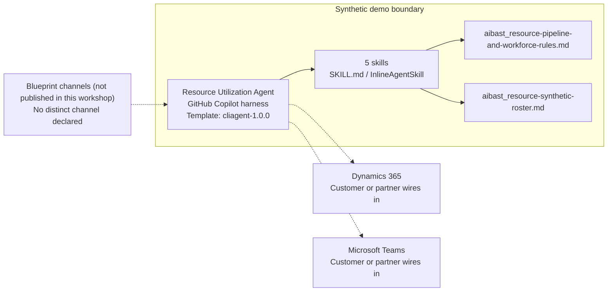

<!-- Generated by tools/build_solution_runbooks.py. Do not edit; change the sources and regenerate. -->

# Resource Utilization Agent — Architecture

## Solution Architecture

### Logical architecture and trust boundary

Solid: synthetic design. Dashed: unwired customer systems; channels unpublished.

## Component Responsibilities

| Operation | Capability | Purpose | Owner |
| --- | --- | --- | --- |
| utilization_dashboard | Utilization and availability view | Shows current portfolio and level performance against planning targets. | Template |
| capacity_forecast | Capacity and demand forecast | Compares upcoming availability with weighted opportunity needs. | Template |
| bench_analysis | Bench skill and cost analysis | Surfaces available talent, skills, and planning cost. | Template |
| staffing_recommendation | Pipeline staffing matches | Matches only qualified available people and keeps unmatched resources visible. | Template |
| workforce_plan | Upskilling and innovation planning | Models capability-building options without approving assignments or benefits. | Template |

| Runtime reference | Recorded value |
| --- | --- |
| Portable implementation | [resource_utilization_agent.py](../../agents/@aibast-agents-library/professional_services_stacks/resource_utilization_stack/resource_utilization_agent.py) |
| Expected tool | ResourceUtilizationAgent |
| Source SHA-256 (short) | 10bf9262731a |

## Data Contract

Approve field meaning, usage and retention before replacing synthetic examples.

| Entity | Fields the template uses | Used by | Customer system of record | Sensitivity |
| --- | --- | --- | --- | --- |
| Complete consultant roster | ID; Consultant; Level; Complete skills; Rate/hr; Utilization; Status; Current project; Project end | utilization_dashboard; capacity_forecast; bench_analysis; staffing_recommendation; workforce_plan | Dynamics 365 | Employee identity, rate, utilization and assignment data; restrict to authorized planners. |
| Utilization targets | Level; Target | utilization_dashboard; staffing_recommendation | Customer or partner maps | Internal planning targets. |
| Bench carrying-cost rules and exact records | ID; Consultant; Level; Monthly cost; Days on bench | bench_analysis; staffing_recommendation | Customer or partner maps | Cost assumptions linked to named people; finance-restricted. |
| Complete Pipeline Demand | Opportunity; Start; Duration; Probability; Exact role needs | capacity_forecast; staffing_recommendation | Customer or partner maps | Uncommitted pipeline; commercially confidential. |
| Bench-to-Pipeline Matches | Consultant; Consultant ID; Project; Skill Match; Level; Probability; Start | staffing_recommendation | Customer or partner maps | Derived candidates for named people; not assignments. |
| Upskilling Pathways | Consultant; ID; Path; Duration; Training cost; Target demand; Monthly scenario value | workforce_plan | Customer or partner maps | Development options for named people; not approved training or benefit. |

## Integration Points

**State: Not connected in the template.**

| System | Purpose | Skills that need it | Access | Template provides | Customer or partner wires in |
| --- | --- | --- | --- | --- | --- |
| Dynamics 365 | Project and resource context: roster, skills, levels, utilization and project end dates. | workforce-utilization-dashboard; workforce-capacity-forecast; professional-services-bench-analysis; pipeline-staffing-recommendation | read | Roster, pipeline and rule contracts backed by fictional consultants; no HR or PSA connection. | [Wiring procedure](3.Runbook.md#step-3-1-integrate-dynamics-365) |
| Microsoft Teams | Governed staffing and development review by authorized people. | pipeline-staffing-recommendation; strategic-workforce-plan | write | Recommendations that name the confirmation still required; no assignment, message or approval tool. | [Wiring procedure](3.Runbook.md#step-3-2-integrate-microsoft-teams) |

## Identity and Permissions

| Template default | Customer or partner decision |
| --- | --- |
| Authentication: Microsoft Entra ID authentication; the customer configures the supported mode for the intended channel. | Confirm tenant, permitted identities and authentication enforcement. |
| Audience: Operations Leader; Resource Manager; Finance Director | Define authorized users, groups and least-privilege connection identities. |

- Require sign-in before exposing employee, rate or utilization data.
- Request only the scopes needed for approved resource and review systems.
- Restrict the audience and test authorized and denied identities.

## Copilot Studio Components

Copilot Studio uses the GitHub Copilot harness; skills hold reviewed behavior.

Agent metadata from [settings.mcs.yml](../../solutions/resource-utilization/copilot-studio/settings.mcs.yml):

| Setting | Recorded value |
| --- | --- |
| Template | cliagent-1.0.0 |
| Recognizer | CLICopilotRecognizer |
| Authoring model | CliCopilot |
| Model | Sonnet46 |

### Skill inventory

One skill per row: manual upload and source-controlled form.

| Skill | Manual upload | Source component |
| --- | --- | --- |
| pipeline-staffing-recommendation | [SKILL.md](../../solutions/resource-utilization/manual/skills/staffing-recommendation/SKILL.md) | [InlineAgentSkill](../../solutions/resource-utilization/copilot-studio/behaviors/aibast_pipeline-staffing-recommendation.mcs.yml) |
| professional-services-bench-analysis | [SKILL.md](../../solutions/resource-utilization/manual/skills/bench-analysis/SKILL.md) | [InlineAgentSkill](../../solutions/resource-utilization/copilot-studio/behaviors/aibast_professional-services-bench-analysis.mcs.yml) |
| strategic-workforce-plan | [SKILL.md](../../solutions/resource-utilization/manual/skills/workforce-plan/SKILL.md) | [InlineAgentSkill](../../solutions/resource-utilization/copilot-studio/behaviors/aibast_strategic-workforce-plan.mcs.yml) |
| workforce-capacity-forecast | [SKILL.md](../../solutions/resource-utilization/manual/skills/capacity-forecast/SKILL.md) | [InlineAgentSkill](../../solutions/resource-utilization/copilot-studio/behaviors/aibast_workforce-capacity-forecast.mcs.yml) |
| workforce-utilization-dashboard | [SKILL.md](../../solutions/resource-utilization/manual/skills/utilization-dashboard/SKILL.md) | [InlineAgentSkill](../../solutions/resource-utilization/copilot-studio/behaviors/aibast_workforce-utilization-dashboard.mcs.yml) |

### Knowledge inventory

| Knowledge file | Upload | Source / metadata |
| --- | --- | --- |
| aibast_resource-pipeline-and-workforce-rules.md | [Content](../../solutions/resource-utilization/manual/knowledge/aibast_resource-pipeline-and-workforce-rules.md) | [Source copy](../../solutions/resource-utilization/copilot-studio/capabilities/knowledge/files/aibast_resource-pipeline-and-workforce-rules.md) · [Metadata](../../solutions/resource-utilization/copilot-studio/capabilities/knowledge/files/aibast_resource-pipeline-and-workforce-rules.md.mcs.yml) |
| aibast_resource-synthetic-roster.md | [Content](../../solutions/resource-utilization/manual/knowledge/aibast_resource-synthetic-roster.md) | [Source copy](../../solutions/resource-utilization/copilot-studio/capabilities/knowledge/files/aibast_resource-synthetic-roster.md) · [Metadata](../../solutions/resource-utilization/copilot-studio/capabilities/knowledge/files/aibast_resource-synthetic-roster.md.mcs.yml) |

## State and Recovery

| Recovery ID | Condition | Required behavior | Owner |
| --- | --- | --- | --- |
| evidence-no-mockups | A required evidence file is missing | Stop. Capture or restore the real file; never substitute a mockup. | Template |
| failed-case-no-cherry-picking | A recorded identifier is absent | Mark the case failed and investigate; do not retry until it happens to pass. | Template |
| draft-publication-stop | Publish is offered | Stop at Draft unless a separate approver explicitly authorizes publication. | Template |
| resource-system-unavailable | A wired Dynamics 365 or Microsoft Teams connection returns no verified result | Report unavailable evidence; never claim a lookup, assignment or message succeeded. | Customer or partner |
| resource-action-requested | A request would assign, contact or evaluate a person, or approve training or revenue | Return a recommendation and name the approver; preserve every human staffing and investment decision. | Template |
| resource-grounding-unavailable | The required skill or its knowledge cannot load | Retry once in the same turn, then report failure and stop without an uncited answer. | Template |

Promotion requires separate approval. [Package recovery guide](../../solutions/resource-utilization/FIELD-GUIDE.md#failure-recovery).

## Design Decisions

| Decision | Reason |
| --- | --- |
| Require exact level and skill for every match. | The deterministic rules consider only bench consultants, cap each need at its requested count and forbid double-counting. |
| Keep unmatched people visible with development paths. | Unplaced consultants receive upskilling or internal-innovation options rather than invented assignments. |
| Label pipeline, cost and payback values as scenarios. | Probabilities and business cases must not read as forecasts or commitments. |
| Route only through the five reviewed skill names. | Guessed skills and uncited answers after a retrieval failure break the locked routing contract. |
| Keep exact assertions separate from quality scoring. | General quality in Evaluate (preview) does not compare responses with expected answers. |

## Non-Functional Considerations

| Area | Customer or partner confirms |
| --- | --- |
| Licensing and Copilot Credits | Confirm tenant licensing and budget credits for building, Preview, evaluation and production planning use. |
| Capacity | Allocate approved capacity to the planning environment and monitor consumption before widening the audience. |
| Data residency | Approve the environment geography and any cross-region movement of employee and project data before connecting sources. |
| Retention | Decide with the data owner whether transcripts naming employees are saved, who may view them and the Dataverse retention policy. |
| Cost drivers | Measure model, knowledge, tool and harness usage by workload; the synthetic demo is not a production-cost estimate. |

## Next

→ [Delivery runbook](3.Runbook.md) | [Solution index](../README.md)

[Sources for this page](0.Resources/README.md#sources-2architecturemd).
