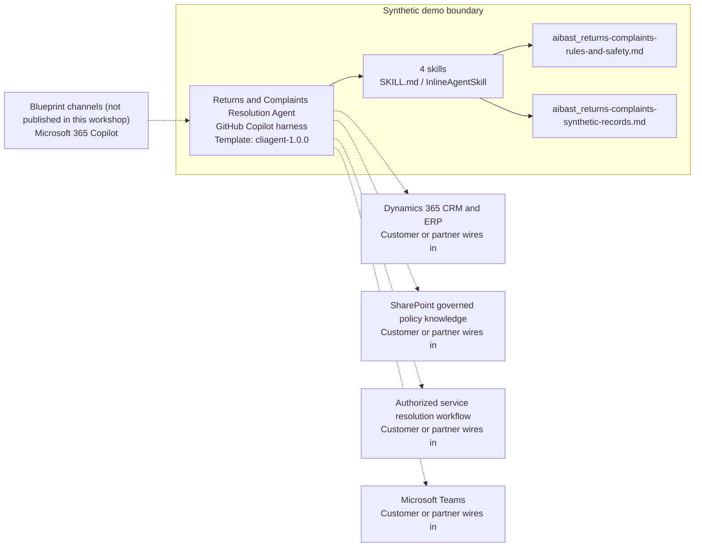

<!-- Generated by tools/build_solution_runbooks.py. Do not edit; change the sources and regenerate. -->

# Returns and Complaints Resolution Agent — Architecture

## Solution Architecture

### Logical architecture and trust boundary

Solid: synthetic design. Dashed: unwired customer systems; channels unpublished.

## Component Responsibilities

| Operation | Capability | Purpose | Owner |
| --- | --- | --- | --- |
| return_processing | Anonymous return review | Summarizes policy evidence without approving or processing a return. | Template |
| complaint_classification | Privacy-safe complaint classification | Classifies a concern without echoing personal or sensitive text. | Template |
| resolution_recommendation | Human-approved resolution options | Drafts policy-grounded options without refund, credit, replacement, shipment, or messaging actions. | Template |
| trend_analysis | Aggregate returns and quality trends | Surfaces product and service patterns without accusing an individual. | Template |

| Runtime reference | Recorded value |
| --- | --- |
| Portable implementation | [returns_complaints_resolution_agent.py](../../agents/@aibast-agents-library/retail_cpg_stacks/returns_complaints_resolution_stack/returns_complaints_resolution_agent.py) |
| Expected tool | ReturnsComplaintsResolutionAgent |
| Source SHA-256 (short) | 56f8dcbee3d8 |

## Data Contract

Approve field meaning, usage and retention before replacing synthetic examples.

| Entity | Fields the template uses | Used by | Customer system of record | Sensitivity |
| --- | --- | --- | --- | --- |
| RETURN_REQUESTS | order_id; case_label; product; sku; purchase_price; purchase_date; request_date; reason; condition; channel; status; notes | return_processing; resolution_recommendation | Dynamics 365 CRM and ERP | Customer order and case data; notes can hold personal text, so minimize it and never echo it. |
| COMPLAINT_CATEGORIES | label; severity_weight; avg_resolution_hours; escalation_rate; keywords; monthly_volume | complaint_classification | Customer or partner maps | Internal service benchmarks. |
| RESOLUTION_PLAYBOOKS | label; applicable_reasons; applicable_conditions; max_days_since_purchase; cost_impact; csat_impact; steps | resolution_recommendation | SharePoint governed policy knowledge | Return policy; the policy owner approves windows before they replace the synthetic playbooks. |
| TREND_DATA | months; total_returns; return_rate_pct; top_return_reasons; avg_resolution_hours; csat_score; refund_total_usd | trend_analysis | Customer or partner maps | Aggregate operational and refund data; confidential. |

## Integration Points

**State: Not connected in the template.**

| System | Purpose | Skills that need it | Access | Template provides | Customer or partner wires in |
| --- | --- | --- | --- | --- | --- |
| Dynamics 365 CRM and ERP | Read-only case, order and policy evidence for return and complaint review. | anonymous-return-review-queue; privacy-safe-complaint-classification; human-approved-resolution-options; aggregate-returns-quality-trends | read | Return, complaint and trend contracts backed by anonymous synthetic records; no live lookup. | [Wiring procedure](3.Runbook.md#step-3-1-integrate-dynamics-365-crm-and-erp) |
| SharePoint governed policy knowledge | Controlled return and resolution policy evidence. | anonymous-return-review-queue; human-approved-resolution-options | read | Synthetic playbooks, windows and safety rules in the uploaded knowledge. | [Wiring procedure](3.Runbook.md#step-3-2-integrate-sharepoint-governed-policy-knowledge) |
| Authorized service resolution workflow | Human-approved execution of returns, refunds, credits and exchanges. | human-approved-resolution-options | write | Draft options and review steps; no write, refund or message tool. | [Wiring procedure](3.Runbook.md#step-3-3-integrate-authorized-service-resolution-workflow) |
| Microsoft Teams | Review surface for service, quality and loss-prevention teams. | privacy-safe-complaint-classification; aggregate-returns-quality-trends | write | Review-ready drafts and aggregate trends; no message, approval, task or record action. | [Wiring procedure](3.Runbook.md#step-3-4-integrate-microsoft-teams) |

## Identity and Permissions

| Template default | Customer or partner decision |
| --- | --- |
| Authentication: Microsoft Entra ID authentication; the customer configures the supported mode for the intended channel. | Confirm tenant, permitted identities and authentication enforcement. |
| Audience: Customer Service Agents; Quality Teams; Loss Prevention Teams | Define authorized users, groups and least-privilege connection identities. |

- Require sign-in before exposing customer case or order data.
- Request only the read scopes needed for approved case, order and policy sources.
- Restrict the audience and test authorized and denied identities.

## Copilot Studio Components

Copilot Studio uses the GitHub Copilot harness; skills hold reviewed behavior.

Agent metadata from [settings.mcs.yml](../../solutions/returns-complaints-resolution/copilot-studio/settings.mcs.yml):

| Setting | Recorded value |
| --- | --- |
| Template | cliagent-1.0.0 |
| Recognizer | CLICopilotRecognizer |
| Authoring model | CliCopilot |
| Model | Sonnet46 |

### Skill inventory

One skill per row: manual upload and source-controlled form.

| Skill | Manual upload | Source component |
| --- | --- | --- |
| aggregate-returns-quality-trends | [SKILL.md](../../solutions/returns-complaints-resolution/manual/skills/trend-analysis/SKILL.md) | [InlineAgentSkill](../../solutions/returns-complaints-resolution/copilot-studio/behaviors/aibast_aggregate-returns-quality-trends.mcs.yml) |
| anonymous-return-review-queue | [SKILL.md](../../solutions/returns-complaints-resolution/manual/skills/return-processing/SKILL.md) | [InlineAgentSkill](../../solutions/returns-complaints-resolution/copilot-studio/behaviors/aibast_anonymous-return-review-queue.mcs.yml) |
| human-approved-resolution-options | [SKILL.md](../../solutions/returns-complaints-resolution/manual/skills/resolution-recommendation/SKILL.md) | [InlineAgentSkill](../../solutions/returns-complaints-resolution/copilot-studio/behaviors/aibast_human-approved-resolution-options.mcs.yml) |
| privacy-safe-complaint-classification | [SKILL.md](../../solutions/returns-complaints-resolution/manual/skills/complaint-classification/SKILL.md) | [InlineAgentSkill](../../solutions/returns-complaints-resolution/copilot-studio/behaviors/aibast_privacy-safe-complaint-classification.mcs.yml) |

### Knowledge inventory

| Knowledge file | Upload | Source / metadata |
| --- | --- | --- |
| aibast_returns-complaints-rules-and-safety.md | [Content](../../solutions/returns-complaints-resolution/manual/knowledge/aibast_returns-complaints-rules-and-safety.md) | [Source copy](../../solutions/returns-complaints-resolution/copilot-studio/capabilities/knowledge/files/aibast_returns-complaints-rules-and-safety.md) · [Metadata](../../solutions/returns-complaints-resolution/copilot-studio/capabilities/knowledge/files/aibast_returns-complaints-rules-and-safety.md.mcs.yml) |
| aibast_returns-complaints-synthetic-records.md | [Content](../../solutions/returns-complaints-resolution/manual/knowledge/aibast_returns-complaints-synthetic-records.md) | [Source copy](../../solutions/returns-complaints-resolution/copilot-studio/capabilities/knowledge/files/aibast_returns-complaints-synthetic-records.md) · [Metadata](../../solutions/returns-complaints-resolution/copilot-studio/capabilities/knowledge/files/aibast_returns-complaints-synthetic-records.md.mcs.yml) |

## State and Recovery

| Recovery ID | Condition | Required behavior | Owner |
| --- | --- | --- | --- |
| evidence-no-mockups | A required evidence file is missing | Stop. Capture or restore the real file; never substitute a mockup. | Template |
| failed-case-no-cherry-picking | A recorded identifier is absent | Mark the case failed and investigate; do not retry until it happens to pass. | Template |
| draft-publication-stop | Publish is offered | Stop at Draft unless a separate approver explicitly authorizes publication. | Template |
| returns-system-unavailable | A wired case, order or policy source returns no verified result | Report unavailable evidence; never claim a lookup, refund, return or message succeeded. | Customer or partner |
| returns-data-mismatch | Production data differs from the evidence in an answer | Stop and verify in the authorized system of record. | Customer or partner |
| returns-unknown-identifier | An unknown return identifier is supplied | Stop and request a valid synthetic identifier; never approximate. | Template |

Promotion requires separate approval. [Package recovery guide](../../solutions/returns-complaints-resolution/FIELD-GUIDE.md#failure-recovery).

## Design Decisions

| Decision | Reason |
| --- | --- |
| Use anonymous cases instead of named customers. | The source audit replaced named customers and rewrote execution steps as approval-gated review steps. |
| Draft options; never execute them. | Production writes need authenticated tools, authorization checks, human approval and audit logging. |
| Keep loss-prevention review aggregate. | Suspicious patterns are reviewed without accusing an individual. |
| Stop on unknown identifiers. | Only exact synthetic identifiers are valid; the rules forbid approximation. |
| Keep exact assertions separate from quality scoring. | General quality in Evaluate (preview) does not compare responses with expected answers. |

## Non-Functional Considerations

| Area | Customer or partner confirms |
| --- | --- |
| Licensing and Copilot Credits | Confirm tenant licensing and budget credits for building, Preview, evaluation and production service use. |
| Capacity | Allocate approved capacity to the service environment and monitor consumption before widening the audience. |
| Data residency | Approve the environment geography and any cross-region movement of customer case and order data before connecting sources. |
| Retention | Decide with the privacy owner whether transcripts with complaint text are saved, who may view them and the Dataverse retention policy. |
| Cost drivers | Measure model, knowledge, tool and harness usage by workload; the synthetic demo is not a production-cost estimate. |

## Next

→ [Delivery runbook](3.Runbook.md) | [Solution index](../README.md)

[Sources for this page](0.Resources/README.md#sources-2architecturemd).
