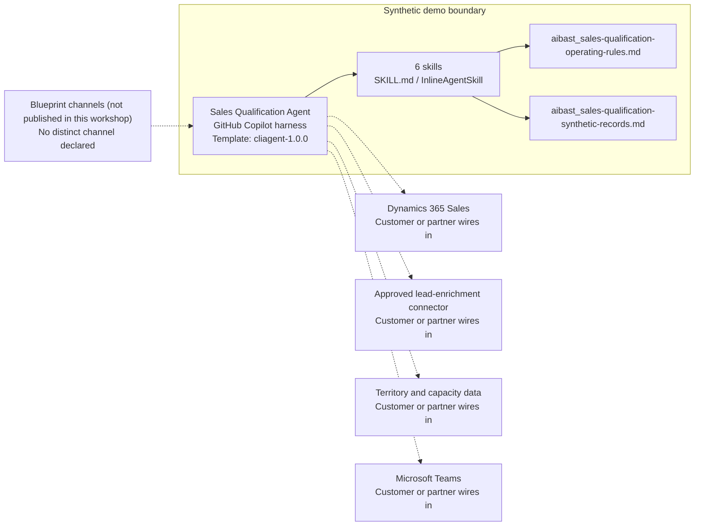

<!-- Generated by tools/build_solution_runbooks.py. Do not edit; change the sources and regenerate. -->

# Sales Qualification Agent — Architecture

## Solution Architecture

### Logical architecture and trust boundary

Solid: synthetic design. Dashed: unwired customer systems; channels unpublished.

## Component Responsibilities

| Operation | Capability | Purpose | Owner |
| --- | --- | --- | --- |
| score_leads | Score Leads | Applies the documented synthetic ICP and tiering model. | Template |
| bant_analysis | Bant Analysis | Breaks down budget, authority, need, and timeline evidence. | Template |
| create_outreach | Create Outreach | Drafts reviewable outreach ideas without sending or scheduling them. | Template |
| assign_leads | Assign Leads | Recommends routing from territory, specialty, and capacity assumptions. | Template |
| setup_tracking | Setup Tracking | Drafts SLA and escalation rules without activating alerts. | Template |
| qualification_report | Qualification Report | Summarizes qualification evidence and review actions without conversion commitments. | Template |

| Runtime reference | Recorded value |
| --- | --- |
| Portable implementation | [sales_qualification_agent.py](../../agents/@aibast-agents-library/b2b_sales_stacks/sales_qualification_stack/sales_qualification_agent.py) |
| Expected tool | SalesQualificationAgent |
| Source SHA-256 (short) | dc18edad7b17 |

## Data Contract

Approve field meaning, usage and retention before replacing synthetic examples.

| Entity | Fields the template uses | Used by | Customer system of record | Sensitivity |
| --- | --- | --- | --- | --- |
| _LEADS | id; company; contact_name; title; authority_level; industry; employees; revenue; tech_stack; budget; need; timeline; engagement_signals; source | score_leads; bant_analysis; create_outreach; assign_leads; setup_tracking; qualification_report | Dynamics 365 Sales | Lead contact details and intent signals; privacy review before use. |
| _ICP | authority_tiers; authority_weight; budget_tiers; budget_weight; ideal_employees_max; ideal_employees_min; ideal_industries; ideal_tech; industry_weight; size_weight; tech_fit_weight | score_leads; bant_analysis; qualification_report | Customer or partner maps | Internal qualification policy owned by sales operations. |
| _AE_TEAM | name; specialty; territory; max_leads; current_capacity_pct | assign_leads | Territory and capacity data | Seller names and workload; internal staff data. |
| _SLA_RULES | sequence; response_hours; escalation | setup_tracking | Customer or partner maps | Internal response policy; managers approve before activation. |

## Integration Points

**State: Not connected in the template.**

| System | Purpose | Skills that need it | Access | Template provides | Customer or partner wires in |
| --- | --- | --- | --- | --- | --- |
| Dynamics 365 Sales | Lead and ownership context for scoring, BANT review and routing. | sales-qualification-score-leads; sales-qualification-bant-analysis; sales-qualification-assign-leads; sales-qualification-qualification-report | read | Lead-record contracts backed by bundled synthetic leads; no CRM read or write. | [Wiring procedure](3.Runbook.md#step-3-1-integrate-dynamics-365-sales) |
| Approved lead-enrichment connector | Firmographic, technology and intent evidence. | sales-qualification-score-leads; sales-qualification-bant-analysis | read | Bundled firmographic, technology, intent and engagement fields; no enrichment call. | [Wiring procedure](3.Runbook.md#step-3-2-integrate-approved-lead-enrichment-connector) |
| Territory and capacity data | Seller territory, specialty and capacity for routing recommendations. | sales-qualification-assign-leads | read | Synthetic seller specialty, territory and capacity records; no owner assignment. | [Wiring procedure](3.Runbook.md#step-3-3-integrate-territory-and-capacity-data) |
| Microsoft Teams | Manager review of routing recommendations and SLA plans. | sales-qualification-assign-leads; sales-qualification-setup-tracking | write | Routing recommendations and draft SLA plans; no alert, sequence or message tool. | [Wiring procedure](3.Runbook.md#step-3-4-integrate-microsoft-teams) |

## Identity and Permissions

| Template default | Customer or partner decision |
| --- | --- |
| Authentication: Microsoft Entra ID authentication; the customer configures the supported mode for the intended channel. | Confirm tenant, permitted identities and authentication enforcement. |
| Audience: Sales Manager; Business Development Rep; Account Executive | Define authorized users, groups and least-privilege connection identities. |

- Require sign-in before exposing lead, contact or seller data.
- Request only the scopes needed for approved lead, enrichment and territory sources.
- Restrict the audience and test authorized and denied identities.

## Copilot Studio Components

Copilot Studio uses the GitHub Copilot harness; skills hold reviewed behavior.

Agent metadata from [settings.mcs.yml](../../solutions/sales-qualification/copilot-studio/settings.mcs.yml):

| Setting | Recorded value |
| --- | --- |
| Template | cliagent-1.0.0 |
| Recognizer | CLICopilotRecognizer |
| Authoring model | CliCopilot |
| Model | Sonnet46 |

### Skill inventory

One skill per row: manual upload and source-controlled form.

| Skill | Manual upload | Source component |
| --- | --- | --- |
| sales-qualification-assign-leads | [SKILL.md](../../solutions/sales-qualification/manual/skills/assign-leads/SKILL.md) | [InlineAgentSkill](../../solutions/sales-qualification/copilot-studio/behaviors/aibast_sales-qualification-assign-leads.mcs.yml) |
| sales-qualification-bant-analysis | [SKILL.md](../../solutions/sales-qualification/manual/skills/bant-analysis/SKILL.md) | [InlineAgentSkill](../../solutions/sales-qualification/copilot-studio/behaviors/aibast_sales-qualification-bant-analysis.mcs.yml) |
| sales-qualification-create-outreach | [SKILL.md](../../solutions/sales-qualification/manual/skills/create-outreach/SKILL.md) | [InlineAgentSkill](../../solutions/sales-qualification/copilot-studio/behaviors/aibast_sales-qualification-create-outreach.mcs.yml) |
| sales-qualification-qualification-report | [SKILL.md](../../solutions/sales-qualification/manual/skills/qualification-report/SKILL.md) | [InlineAgentSkill](../../solutions/sales-qualification/copilot-studio/behaviors/aibast_sales-qualification-qualification-report.mcs.yml) |
| sales-qualification-score-leads | [SKILL.md](../../solutions/sales-qualification/manual/skills/score-leads/SKILL.md) | [InlineAgentSkill](../../solutions/sales-qualification/copilot-studio/behaviors/aibast_sales-qualification-score-leads.mcs.yml) |
| sales-qualification-setup-tracking | [SKILL.md](../../solutions/sales-qualification/manual/skills/setup-tracking/SKILL.md) | [InlineAgentSkill](../../solutions/sales-qualification/copilot-studio/behaviors/aibast_sales-qualification-setup-tracking.mcs.yml) |

### Knowledge inventory

| Knowledge file | Upload | Source / metadata |
| --- | --- | --- |
| aibast_sales-qualification-operating-rules.md | [Content](../../solutions/sales-qualification/manual/knowledge/aibast_sales-qualification-operating-rules.md) | [Source copy](../../solutions/sales-qualification/copilot-studio/capabilities/knowledge/files/aibast_sales-qualification-operating-rules.md) · [Metadata](../../solutions/sales-qualification/copilot-studio/capabilities/knowledge/files/aibast_sales-qualification-operating-rules.md.mcs.yml) |
| aibast_sales-qualification-synthetic-records.md | [Content](../../solutions/sales-qualification/manual/knowledge/aibast_sales-qualification-synthetic-records.md) | [Source copy](../../solutions/sales-qualification/copilot-studio/capabilities/knowledge/files/aibast_sales-qualification-synthetic-records.md) · [Metadata](../../solutions/sales-qualification/copilot-studio/capabilities/knowledge/files/aibast_sales-qualification-synthetic-records.md.mcs.yml) |

## State and Recovery

| Recovery ID | Condition | Required behavior | Owner |
| --- | --- | --- | --- |
| evidence-no-mockups | A required evidence file is missing | Stop. Capture or restore the real file; never substitute a mockup. | Template |
| failed-case-no-cherry-picking | A recorded identifier is absent | Mark the case failed and investigate; do not retry until it happens to pass. | Template |
| draft-publication-stop | Publish is offered | Stop at Draft unless a separate approver explicitly authorizes publication. | Template |
| sales-system-unavailable | A wired CRM, enrichment or territory source returns no verified result | Report unavailable evidence; never claim a lookup, assignment, message or CRM update succeeded. | Customer or partner |
| sales-evidence-missing | A lead lacks a required qualification field | Name the missing field; never invent or substitute a value. | Template |
| sales-grounding-unavailable | The required skill or its knowledge cannot load | Retry once in the same turn, then report failure and stop without an uncited answer. | Template |

Promotion requires separate approval. [Package recovery guide](../../solutions/sales-qualification/FIELD-GUIDE.md#failure-recovery).

## Design Decisions

| Decision | Reason |
| --- | --- |
| Make every operation read-only and draft-only. | Managers keep control of qualification, routing, ownership, SLA rules, outreach content and customer contact. |
| Fail closed on unknown operations, sources, filters and identifiers. | Unknown inputs must be rejected rather than trigger browsing or live-system access. |
| Score with fixed, documented ICP and tier rules. | The rules file is the authoritative calculation; its thresholds, ordering, rounding and formulas are preserved exactly. |
| Route only through the six reviewed skill names. | Guessed skills and uncited answers after a retrieval failure break the locked routing contract. |
| Keep exact assertions separate from quality scoring. | General quality in Evaluate (preview) does not compare responses with expected answers. |

## Non-Functional Considerations

| Area | Customer or partner confirms |
| --- | --- |
| Licensing and Copilot Credits | Confirm tenant licensing and budget credits for building, Preview, evaluation and production qualification use. |
| Capacity | Allocate approved capacity to the sales environment and monitor consumption before widening the audience. |
| Data residency | Approve the environment geography and any cross-region movement of lead and contact data before connecting sources. |
| Retention | Decide with the privacy owner whether transcripts with contact details are saved, who may view them and the Dataverse retention policy. |
| Cost drivers | Measure model, knowledge, tool and harness usage by workload; the synthetic demo is not a production-cost estimate. |

## Next

→ [Delivery runbook](3.Runbook.md) | [Solution index](../README.md)

[Sources for this page](0.Resources/README.md#sources-2architecturemd).
