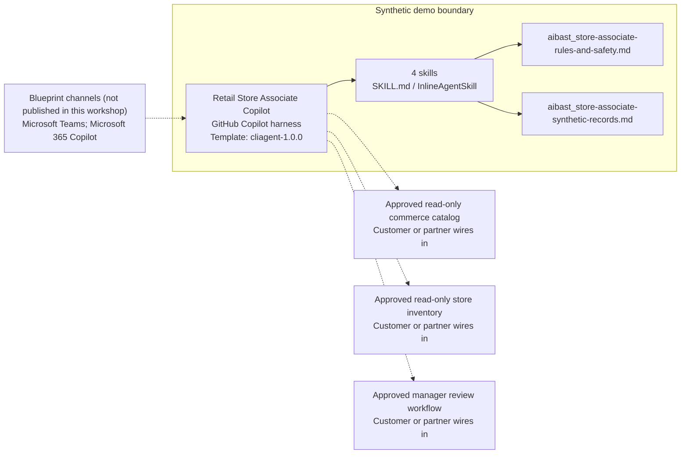

<!-- Generated by tools/build_solution_runbooks.py. Do not edit; change the sources and regenerate. -->

# Retail Store Associate Copilot — Architecture

## Solution Architecture

### Logical architecture and trust boundary

Solid: synthetic design. Dashed: unwired customer systems; channels unpublished.

## Component Responsibilities

| Operation | Capability | Purpose | Owner |
| --- | --- | --- | --- |
| product_lookup | Verified product lookup | Surfaces product facts, floor location, and a synthetic availability snapshot with a verification gate. | Template |
| customer_assist | Respectful assistance drafts | Drafts pressure-free customer language without messaging or transacting. | Template |
| task_checklist | Shift planning checklist | Organizes opening, midday, and closing work without claiming execution. | Template |
| performance_dashboard | Role-cohort coaching review | Summarizes aggregate workflow signals without profiling employees or making personnel decisions. | Template |

| Runtime reference | Recorded value |
| --- | --- |
| Portable implementation | [store_associate_copilot_agent.py](../../agents/@aibast-agents-library/retail_cpg_stacks/store_associate_copilot_stack/store_associate_copilot_agent.py) |
| Expected tool | StoreAssociateCopilotAgent |
| Source SHA-256 (short) | 06cecca2ff5f |

## Data Contract

Approve field meaning, usage and retention before replacing synthetic examples.

| Entity | Fields the template uses | Used by | Customer system of record | Sensitivity |
| --- | --- | --- | --- | --- |
| PRODUCT_CATALOG | name; category; brand; retail_price; sizes; colors; materials; care; location_aisle; location_shelf; on_hand; upc; features | product_lookup | Approved read-only commerce catalog | Product and price reference data; `on_hand` is an unverified snapshot to confirm in store inventory. |
| CUSTOMER_INTERACTION_SCRIPTS | scenario; script; follow_up; tips | customer_assist | Customer or partner maps | Approved service language; no sensitive-trait inference or pressure selling. |
| DAILY_TASK_LIST | task; priority; est_minutes | task_checklist | Customer or partner maps | Store operating and security procedures; restrict to store staff. |
| ASSOCIATE_PERFORMANCE | name; role; shift; units_sold_today; revenue_today; transactions_today; avg_basket; upsell_rate; csat_score; tasks_completed; tasks_total; hours_this_week | performance_dashboard | Customer or partner maps | Workforce performance data; aggregate role cohorts only, never individual employment decisions. |

## Integration Points

**State: Not connected in the template.**

| System | Purpose | Skills that need it | Access | Template provides | Customer or partner wires in |
| --- | --- | --- | --- | --- | --- |
| Approved read-only commerce catalog | Product facts, specifications, care, price and complements. | verified-product-lookup-draft | read | Product-record contract backed by synthetic SKUs; no price or promotion change. | [Wiring procedure](3.Runbook.md#step-3-1-integrate-approved-read-only-commerce-catalog) |
| Approved read-only store inventory | Stock and floor location to verify availability before advising. | verified-product-lookup-draft | read | An unverified synthetic stock snapshot with a verification gate; no reservation. | [Wiring procedure](3.Runbook.md#step-3-2-integrate-approved-read-only-store-inventory) |
| Approved manager review workflow | Human review of assistance drafts, store plans and coaching outputs before any authorized action. | respectful-customer-assistance-draft; store-shift-planning-checklist; aggregate-store-coaching-review | write | Drafts and plans labeled for review; no message, task or personnel action. | [Wiring procedure](3.Runbook.md#step-3-3-integrate-approved-manager-review-workflow) |

## Identity and Permissions

| Template default | Customer or partner decision |
| --- | --- |
| Authentication: Microsoft Entra ID authentication; the customer configures the supported mode for the intended channel. | Confirm tenant, permitted identities and authentication enforcement. |
| Audience: Store Associate; Sales Manager; Floor Specialist | Define authorized users, groups and least-privilege connection identities. |

- Require sign-in before exposing price, inventory or workforce data.
- Request only the read scopes needed for approved catalog and inventory sources.
- Restrict the audience and test authorized and denied identities.

## Copilot Studio Components

Copilot Studio uses the GitHub Copilot harness; skills hold reviewed behavior.

Agent metadata from [settings.mcs.yml](../../solutions/store-associate-copilot/copilot-studio/settings.mcs.yml):

| Setting | Recorded value |
| --- | --- |
| Template | cliagent-1.0.0 |
| Recognizer | CLICopilotRecognizer |
| Authoring model | CliCopilot |
| Model | Sonnet46 |

### Skill inventory

One skill per row: manual upload and source-controlled form.

| Skill | Manual upload | Source component |
| --- | --- | --- |
| aggregate-store-coaching-review | [SKILL.md](../../solutions/store-associate-copilot/manual/skills/performance-dashboard/SKILL.md) | [InlineAgentSkill](../../solutions/store-associate-copilot/copilot-studio/behaviors/aibast_aggregate-store-coaching-review.mcs.yml) |
| respectful-customer-assistance-draft | [SKILL.md](../../solutions/store-associate-copilot/manual/skills/customer-assist/SKILL.md) | [InlineAgentSkill](../../solutions/store-associate-copilot/copilot-studio/behaviors/aibast_respectful-customer-assistance-draft.mcs.yml) |
| store-shift-planning-checklist | [SKILL.md](../../solutions/store-associate-copilot/manual/skills/task-checklist/SKILL.md) | [InlineAgentSkill](../../solutions/store-associate-copilot/copilot-studio/behaviors/aibast_store-shift-planning-checklist.mcs.yml) |
| verified-product-lookup-draft | [SKILL.md](../../solutions/store-associate-copilot/manual/skills/product-lookup/SKILL.md) | [InlineAgentSkill](../../solutions/store-associate-copilot/copilot-studio/behaviors/aibast_verified-product-lookup-draft.mcs.yml) |

### Knowledge inventory

| Knowledge file | Upload | Source / metadata |
| --- | --- | --- |
| aibast_store-associate-rules-and-safety.md | [Content](../../solutions/store-associate-copilot/manual/knowledge/aibast_store-associate-rules-and-safety.md) | [Source copy](../../solutions/store-associate-copilot/copilot-studio/capabilities/knowledge/files/aibast_store-associate-rules-and-safety.md) · [Metadata](../../solutions/store-associate-copilot/copilot-studio/capabilities/knowledge/files/aibast_store-associate-rules-and-safety.md.mcs.yml) |
| aibast_store-associate-synthetic-records.md | [Content](../../solutions/store-associate-copilot/manual/knowledge/aibast_store-associate-synthetic-records.md) | [Source copy](../../solutions/store-associate-copilot/copilot-studio/capabilities/knowledge/files/aibast_store-associate-synthetic-records.md) · [Metadata](../../solutions/store-associate-copilot/copilot-studio/capabilities/knowledge/files/aibast_store-associate-synthetic-records.md.mcs.yml) |

## State and Recovery

| Recovery ID | Condition | Required behavior | Owner |
| --- | --- | --- | --- |
| evidence-no-mockups | A required evidence file is missing | Stop. Capture or restore the real file; never substitute a mockup. | Template |
| failed-case-no-cherry-picking | A recorded identifier is absent | Mark the case failed and investigate; do not retry until it happens to pass. | Template |
| draft-publication-stop | Publish is offered | Stop at Draft unless a separate approver explicitly authorizes publication. | Template |
| store-system-unavailable | A wired catalog, inventory or review source returns no verified result | Report unavailable evidence; never claim a lookup, reservation, message or transaction succeeded. | Customer or partner |
| store-unknown-identifier | An unknown SKU or other identifier is supplied | Stop and request a valid synthetic identifier; never approximate. | Template |
| store-action-requested | A request would reserve stock, apply an offer, message, refund, transact or judge an employee | Return a draft, plan or summary and name the authorized person or system. | Template |

Promotion requires separate approval. [Package recovery guide](../../solutions/store-associate-copilot/FIELD-GUIDE.md#failure-recovery).

## Design Decisions

| Decision | Reason |
| --- | --- |
| Caveat availability instead of promising stock. | The source audit made availability a caveated snapshot and scripts drafts, with no reservation write path. |
| Replace individual performance records with role cohorts. | Coaching signals must not profile workers or support employment decisions. |
| Keep every output a draft, plan or informational summary. | Transactions, returns, messages and personnel actions need separately authorized systems and people. |
| Stop on unknown identifiers. | Only exact synthetic identifiers are valid; the rules forbid approximation. |
| Keep exact assertions separate from quality scoring. | General quality in Evaluate (preview) does not compare responses with expected answers. |

## Non-Functional Considerations

| Area | Customer or partner confirms |
| --- | --- |
| Licensing and Copilot Credits | Confirm tenant licensing and budget credits for building, Preview, evaluation and production store use. |
| Capacity | Allocate approved capacity to the store environment and monitor consumption before widening the audience. |
| Data residency | Approve the environment geography and any cross-region movement of catalog, inventory or workforce data before connecting sources. |
| Retention | Decide with the data owner whether transcripts are saved, who may view them and the Dataverse retention policy. |
| Cost drivers | Measure model, knowledge, tool and harness usage by workload; the synthetic demo is not a production-cost estimate. |

## Next

→ [Delivery runbook](3.Runbook.md) | [Solution index](../README.md)

[Sources for this page](0.Resources/README.md#sources-2architecturemd).
