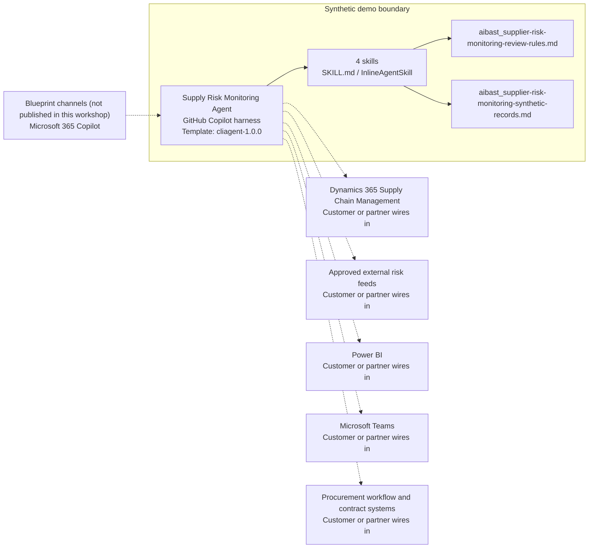

<!-- Generated by tools/build_solution_runbooks.py. Do not edit; change the sources and regenerate. -->

# Supply Risk Monitoring Agent — Architecture

## Solution Architecture

### Logical architecture and trust boundary

Solid: synthetic design. Dashed: unwired customer systems; channels unpublished.

## Component Responsibilities

| Operation | Capability | Purpose | Owner |
| --- | --- | --- | --- |
| risk_dashboard | Supplier risk portfolio overview | Ranks the fixed supplier snapshot and shows where commercial exposure and incidents deserve review. | Template |
| supplier_scorecard | Supplier evidence scorecards | Explains quality, delivery, financial, geopolitical, and incident evidence by supplier. | Template |
| disruption_alerts | Continuity disruption review | Summarizes recorded incidents and potential exposure while requiring validation against approved sources. | Template |
| alternative_sourcing | Alternative sourcing option review | Compares synthetic backup options without contacting, qualifying, selecting, allocating, or ordering from a supplier. | Template |

| Runtime reference | Recorded value |
| --- | --- |
| Portable implementation | [supplier_risk_monitoring_agent.py](../../agents/@aibast-agents-library/manufacturing_stacks/supplier_risk_monitoring_stack/supplier_risk_monitoring_agent.py) |
| Expected tool | SupplierRiskMonitoringAgent |
| Source SHA-256 (short) | 684f3b30b731 |

## Data Contract

Approve field meaning, usage and retention before replacing synthetic examples.

| Entity | Fields the template uses | Used by | Customer system of record | Sensitivity |
| --- | --- | --- | --- | --- |
| SUPPLIERS — master and spend | name; category; region; country; annual_spend; tier | risk_dashboard; supplier_scorecard; disruption_alerts; alternative_sourcing | Dynamics 365 Supply Chain Management | Commercial supplier and spend data; restrict to procurement roles. |
| SUPPLIERS — risk dimensions | quality_score; delivery_score; financial_score; geopolitical_score; overall_risk | risk_dashboard; supplier_scorecard; alternative_sourcing | Approved external risk feeds | Confidential supplier assessments; synthetic scores are not third-party ratings. |
| RECENT_INCIDENTS | supplier_id; date; severity; description | risk_dashboard; supplier_scorecard; disruption_alerts | Customer or partner maps | Supplier incident evidence; validate before any action. |
| BACKUP_SUPPLIERS | name; lead_time_weeks; qual_status; est_cost_premium_pct | disruption_alerts; alternative_sourcing | Customer or partner maps | Commercial sourcing data; qualification labels are not procurement decisions. |

## Integration Points

**State: Not connected in the template.**

| System | Purpose | Skills that need it | Access | Template provides | Customer or partner wires in |
| --- | --- | --- | --- | --- | --- |
| Dynamics 365 Supply Chain Management | Supplier, order, quality, inventory and commercial context. | risk-dashboard; supplier-scorecard; disruption-alerts; alternative-sourcing | read | Supplier and spend contracts backed by fictional records; no live connection. | [Wiring procedure](3.Runbook.md#step-3-1-integrate-dynamics-365-supply-chain-management) |
| Approved external risk feeds | Financial, quality, logistics and geopolitical evidence. | risk-dashboard; supplier-scorecard; disruption-alerts | read | Dimension scores and incident records that are fictional pilot evidence. | [Wiring procedure](3.Runbook.md#step-3-2-integrate-approved-external-risk-feeds) |
| Power BI | Curated reporting of production portfolio exposure. | risk-dashboard | read | A dashboard output contract from synthetic records; no live dashboard is published. | [Wiring procedure](3.Runbook.md#step-3-3-integrate-power-bi) |
| Microsoft Teams | Authorized procurement review and escalation. | disruption-alerts; alternative-sourcing | write | Review-ready evidence and no-action disclosures; no messaging tool. | [Wiring procedure](3.Runbook.md#step-3-4-integrate-microsoft-teams) |
| Procurement workflow and contract systems | Authorized outreach, qualification, selection, allocation, contracting and ordering. | alternative-sourcing | write | Review options and the authorization boundary; no action tool. | [Wiring procedure](3.Runbook.md#step-3-5-integrate-procurement-workflow-and-contract-systems) |

## Identity and Permissions

| Template default | Customer or partner decision |
| --- | --- |
| Authentication: Microsoft Entra ID authentication; the customer selects the supported mode for the intended procurement channel. | Confirm tenant, permitted identities and authentication enforcement. |
| Audience: Procurement Manager; Supply Chain Director | Define authorized users, groups and least-privilege connection identities. |

- Require sign-in before exposing supplier, spend or incident data.
- Request only the read scopes the approved supplier and risk sources need.
- Restrict the audience and test authorized and denied identities.

## Copilot Studio Components

Copilot Studio uses the GitHub Copilot harness; skills hold reviewed behavior.

Agent metadata from [settings.mcs.yml](../../solutions/supplier-risk-monitoring/copilot-studio/settings.mcs.yml):

| Setting | Recorded value |
| --- | --- |
| Template | cliagent-1.0.0 |
| Recognizer | CLICopilotRecognizer |
| Authoring model | CliCopilot |
| Model | Sonnet46 |

### Skill inventory

One skill per row: manual upload and source-controlled form.

| Skill | Manual upload | Source component |
| --- | --- | --- |
| alternative-sourcing | [SKILL.md](../../solutions/supplier-risk-monitoring/manual/skills/aibast_alternative_sourcing/SKILL.md) | [InlineAgentSkill](../../solutions/supplier-risk-monitoring/copilot-studio/behaviors/aibast_alternative-sourcing.mcs.yml) |
| disruption-alerts | [SKILL.md](../../solutions/supplier-risk-monitoring/manual/skills/aibast_disruption_alerts/SKILL.md) | [InlineAgentSkill](../../solutions/supplier-risk-monitoring/copilot-studio/behaviors/aibast_disruption-alerts.mcs.yml) |
| risk-dashboard | [SKILL.md](../../solutions/supplier-risk-monitoring/manual/skills/aibast_risk_dashboard/SKILL.md) | [InlineAgentSkill](../../solutions/supplier-risk-monitoring/copilot-studio/behaviors/aibast_risk-dashboard.mcs.yml) |
| supplier-scorecard | [SKILL.md](../../solutions/supplier-risk-monitoring/manual/skills/aibast_supplier_scorecard/SKILL.md) | [InlineAgentSkill](../../solutions/supplier-risk-monitoring/copilot-studio/behaviors/aibast_supplier-scorecard.mcs.yml) |

### Knowledge inventory

| Knowledge file | Upload | Source / metadata |
| --- | --- | --- |
| aibast_supplier-risk-monitoring-review-rules.md | [Content](../../solutions/supplier-risk-monitoring/manual/knowledge/aibast_supplier-risk-monitoring-review-rules.md) | [Source copy](../../solutions/supplier-risk-monitoring/copilot-studio/capabilities/knowledge/files/aibast_supplier-risk-monitoring-review-rules.md) · [Metadata](../../solutions/supplier-risk-monitoring/copilot-studio/capabilities/knowledge/files/aibast_supplier-risk-monitoring-review-rules.md.mcs.yml) |
| aibast_supplier-risk-monitoring-synthetic-records.md | [Content](../../solutions/supplier-risk-monitoring/manual/knowledge/aibast_supplier-risk-monitoring-synthetic-records.md) | [Source copy](../../solutions/supplier-risk-monitoring/copilot-studio/capabilities/knowledge/files/aibast_supplier-risk-monitoring-synthetic-records.md) · [Metadata](../../solutions/supplier-risk-monitoring/copilot-studio/capabilities/knowledge/files/aibast_supplier-risk-monitoring-synthetic-records.md.mcs.yml) |

## State and Recovery

| Recovery ID | Condition | Required behavior | Owner |
| --- | --- | --- | --- |
| evidence-no-mockups | A required evidence file is missing | Stop. Capture or restore the real file; never substitute a mockup. | Template |
| failed-case-no-cherry-picking | A recorded identifier is absent | Mark the case failed and investigate; do not retry until it happens to pass. | Template |
| draft-publication-stop | Publish is offered | Stop at Draft unless a separate approver explicitly authorizes publication. | Template |
| supplier-evidence-absent | A requested supplier, incident or backup option is not in the fixed records | Report the absent evidence; do not browse, invent or substitute another record. | Template |
| supplier-system-unavailable | A wired supplier, risk or reporting system returns no verified result | Report unavailable evidence; never claim a lookup, message or supplier action succeeded. | Customer or partner |
| supplier-action-requested | A request would contact, qualify, select, allocate, contract or order | Return review options and name the authorized procurement owner; perform no action. | Template |

Promotion requires separate approval. [Package recovery guide](../../solutions/supplier-risk-monitoring/FIELD-GUIDE.md#failure-recovery).

## Design Decisions

| Decision | Reason |
| --- | --- |
| Separate evidence, interpretation, recommendation, approval and external action. | Procurement authority stays with people, so the pilot claims no side effect. |
| Reproduce fixed source constants exactly. | Locked cases depend on exact values; recalculation, enrichment or browsing breaks the contract. |
| Keep action tools unavailable in the pilot. | Outreach, qualification, selection, allocation, contracting and ordering need explicit procurement approval tools first. |
| Route only through the four reviewed skill names. | Guessed skills and uncited answers after a failed retry violate the locked routing contract. |
| Use exact assertions, not a quality-score substitute. | General quality in Evaluate (preview) does not compare responses with expected answers. |

## Non-Functional Considerations

| Area | Customer or partner confirms |
| --- | --- |
| Licensing and Copilot Credits | Confirm tenant licensing and budget credits for building, Preview, evaluation and production use. |
| Capacity | Allocate approved capacity to the supplier-risk environment and monitor consumption before widening the audience. |
| Data residency | Approve the environment geography and any movement of supplier, spend or external-risk data across regions or systems. |
| Retention | Decide whether transcripts are saved, who can view or download them, and the Dataverse retention policy. |
| Cost drivers | Measure model, knowledge, tool and harness usage by workload; the synthetic demo is not a production-cost estimate. |

## Next

→ [Delivery runbook](3.Runbook.md) | [Solution index](../README.md)

[Sources for this page](0.Resources/README.md#sources-2architecturemd).
